# Components — Material Design 3

> 来源: https://m3.material.io/components

---

# Components

Components are interactive building blocks for creating a user interface. They can be organized into categories based on their purpose: Action, containment, communication, navigation, selection, and text input.

## Buttons

[Button groupsButton groups organize buttons and add interactions between them](</components/button-groups>)[ButtonsButtons prompt most actions in a UI.](</components/buttons>)[Extended FABsExtended floating action buttons (extended FABs) help people take primary actions](</components/extended-fab>)[FAB menuThe floating action button (FAB) menu opens from a FAB to display multiple related actions](</components/fab-menu>)[Floating action buttons (FABs)Floating action buttons (FABs) help people take primary actions](</components/floating-action-button>)[Icon buttonsIcon buttons help people take actions with a single tap](</components/icon-buttons>)[Segmented buttonsSegmented buttons help people select options, switch views, or sort elements](</components/segmented-buttons>)[Split buttonsSplit buttons open a menu to give people more options related to an action](</components/split-button>)

## Date & time pickers

[Date pickersDate pickers let people select a date, or a range of dates](</components/date-pickers>)[Time pickersTime pickers help people select and set a specific time](</components/time-pickers>)

## Loading & progress

[Loading indicatorLoading indicators show the progress of a process for a short wait time](</components/loading-indicator>)[Progress indicatorsProgress indicators show the status of a process in real time](</components/progress-indicators>)

## Navigation

[Navigation barNavigation bars let people switch between UI views on smaller devices](</components/navigation-bar>)[Navigation drawerNavigation drawers let people switch between UI views on larger devices](</components/navigation-drawer>)[Navigation railNavigation rails let people switch between UI views on mid-sized devices](</components/navigation-rail>)

## Sheets

[Bottom sheetsBottom sheets show secondary content anchored to the bottom of the screen](</components/bottom-sheets>)[Side sheetsSide sheets show secondary content anchored to the side of the screen](</components/side-sheets>)

## All other components

[App barsApp bars are placed at the top of the screen to help people navigate through a product.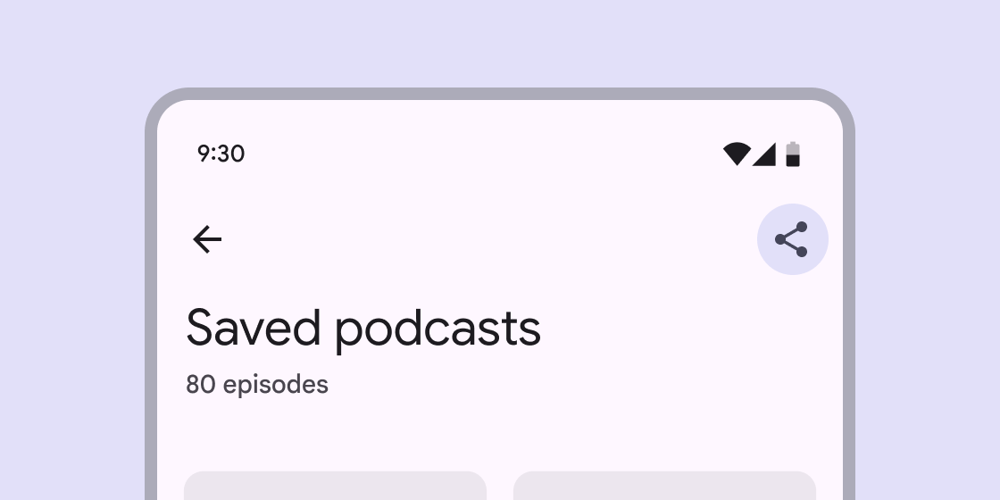](</components/app-bars>)[BadgesBadges show notifications, counts, or status information on navigation items and icons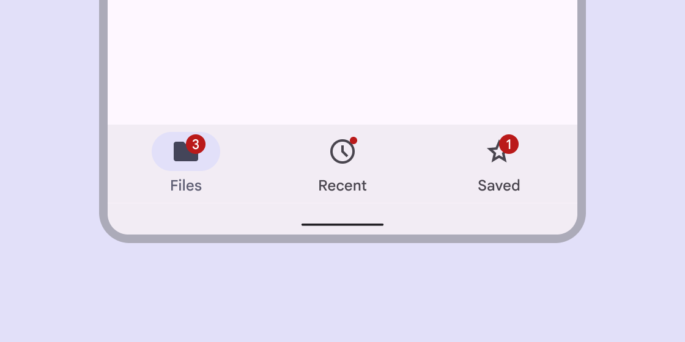](</components/badges>)[CardsCards display content and actions about a single subject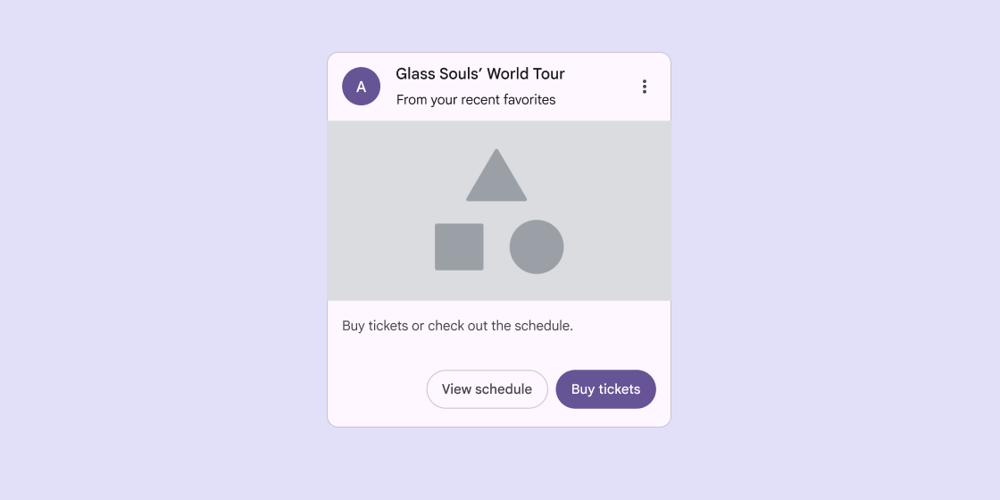](</components/cards>)[CarouselCarousels show a collection of items that can be scrolled on and off the screen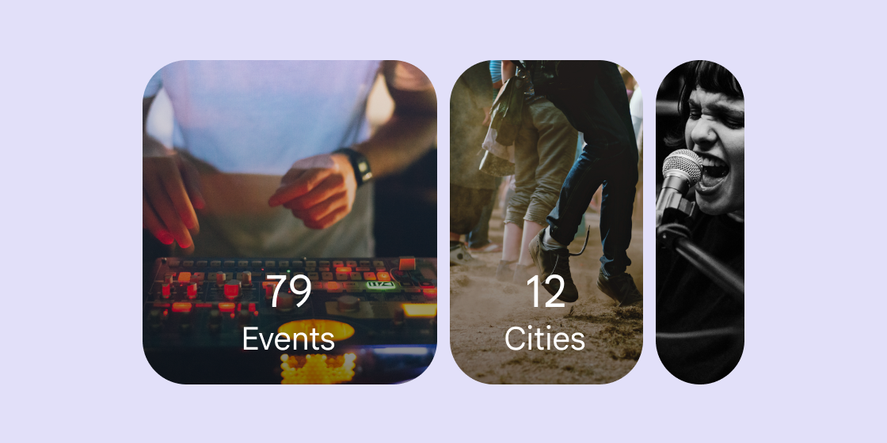](</components/carousel>)[CheckboxCheckboxes let users select one or more items from a list, or turn an item on or off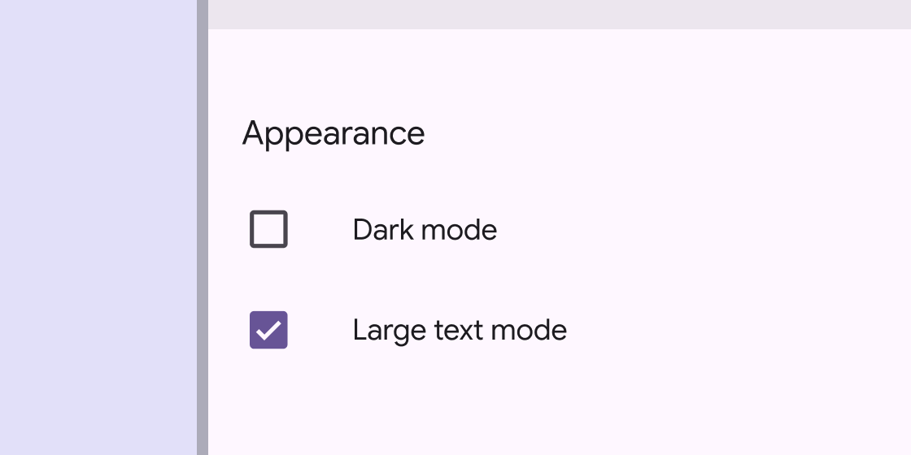](</components/checkbox>)[ChipsChips help people enter information, make selections, filter content, or trigger actions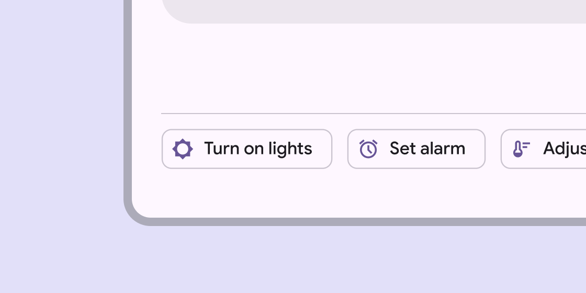](</components/chips>)[DialogsDialogs provide important prompts in a user flow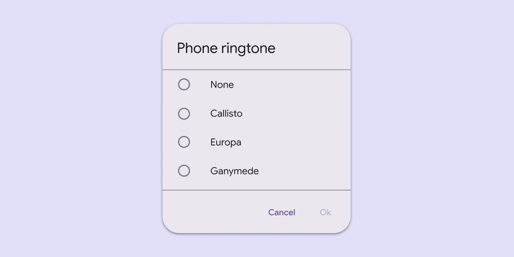](</components/dialogs>)[DividerDividers are thin lines that group content in lists or other containers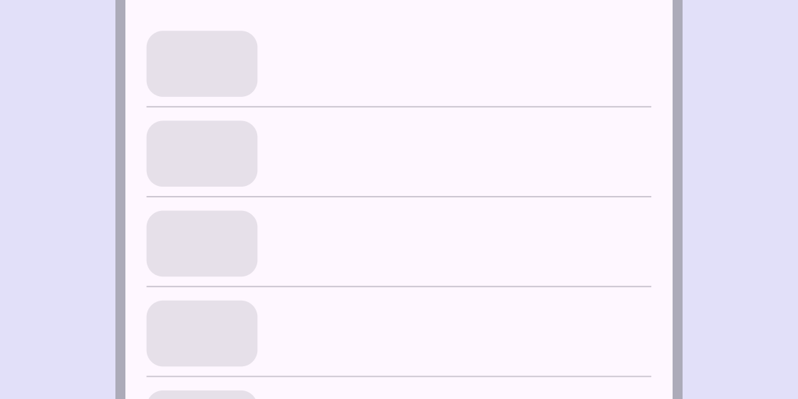](</components/divider>)[ListsLists are continuous, vertical indexes of text and images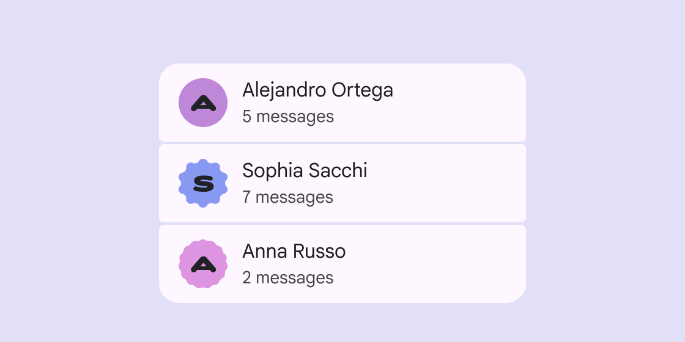](</components/lists>)[MenusMenus display a list of choices on a temporary surface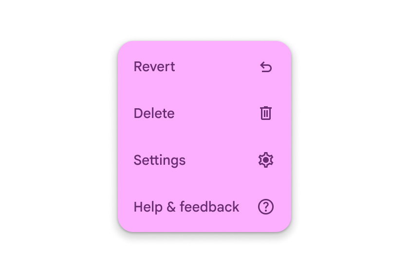](</components/menus>)[Radio buttonRadio buttons let people select one option from a set of options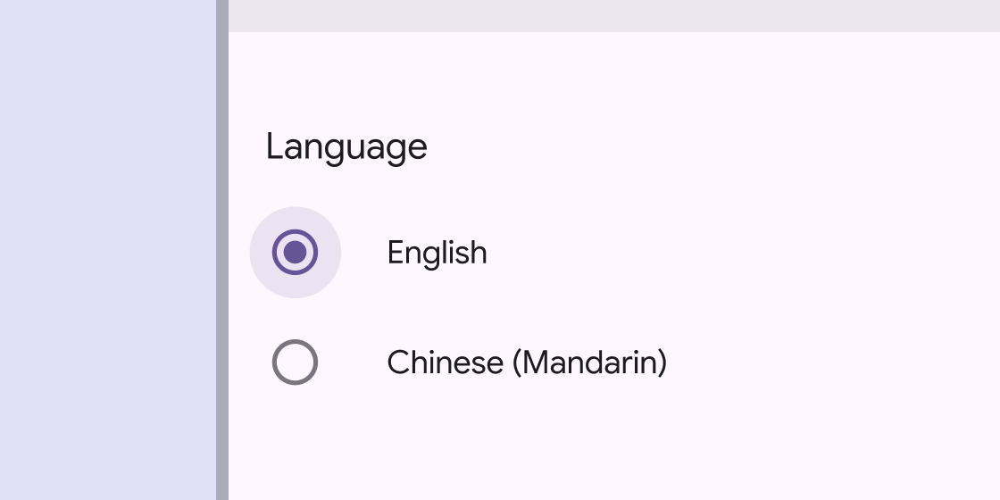](</components/radio-button>)[SearchSearch lets people enter a keyword or phrase to get relevant information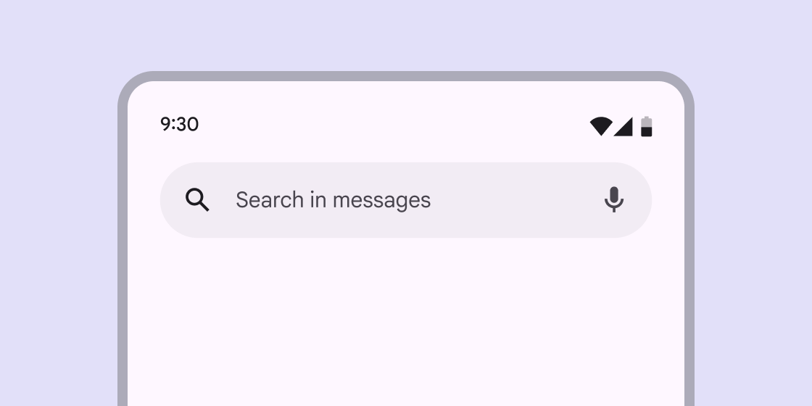](</components/search>)[SlidersSliders allow users to make selections from a range of values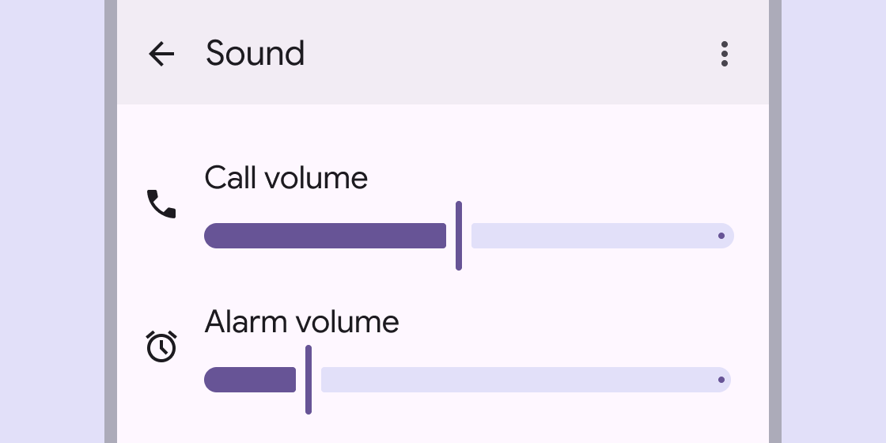](</components/sliders>)[SnackbarSnackbars show short updates about app processes at the bottom of the screen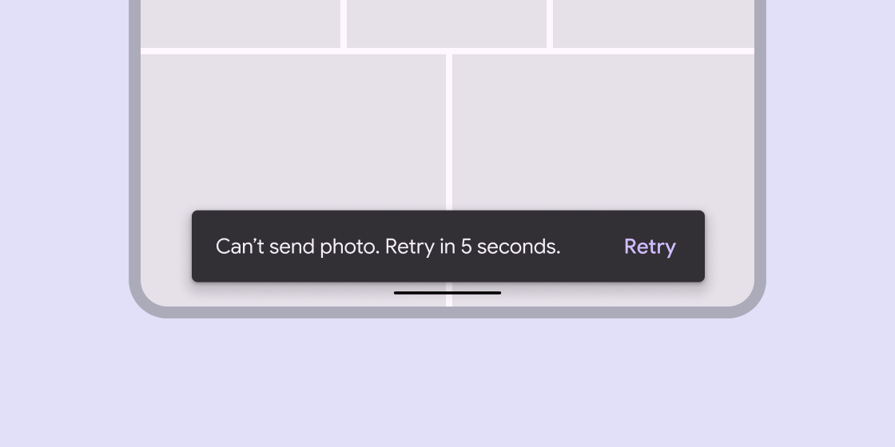](</components/snackbar>)[SwitchSwitches toggle the selection of an item on and off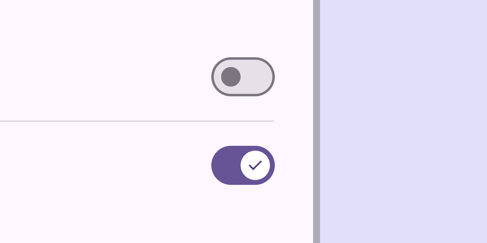](</components/switch>)[TabsTabs organize content across different screens and views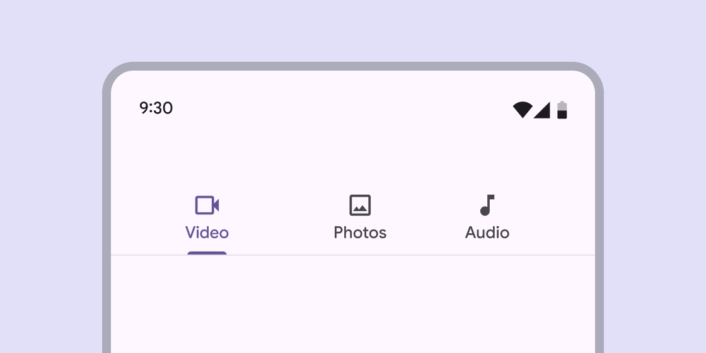](</components/tabs>)[Text fieldsText fields let users enter text into a UI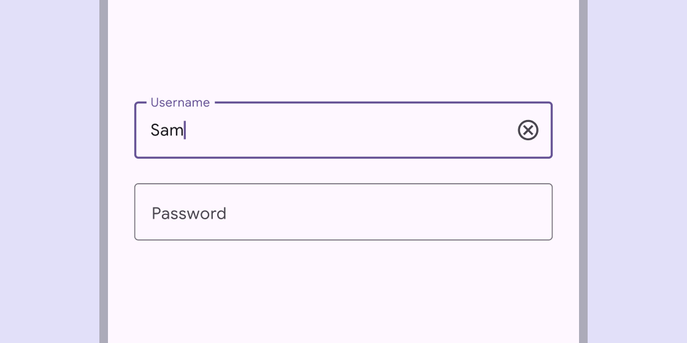](</components/text-fields>)[ToolbarsToolbars display frequently used actions relevant to the current page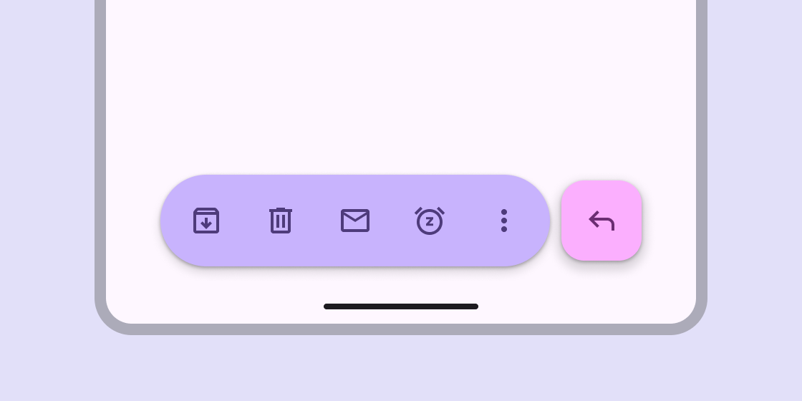](</components/toolbars>)[TooltipsTooltips display brief labels or messages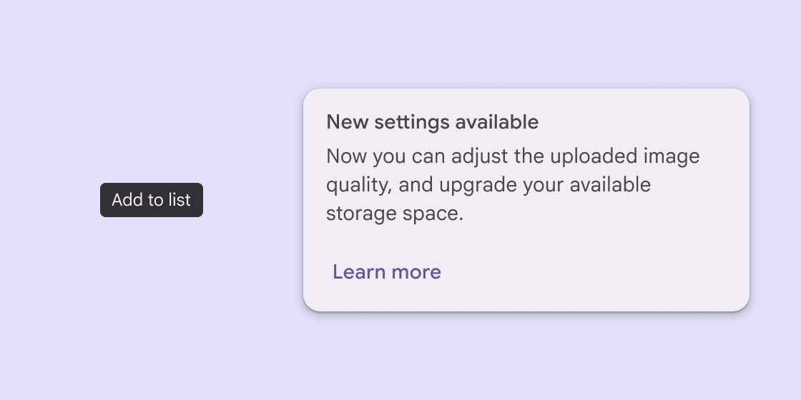](</components/tooltips>)
