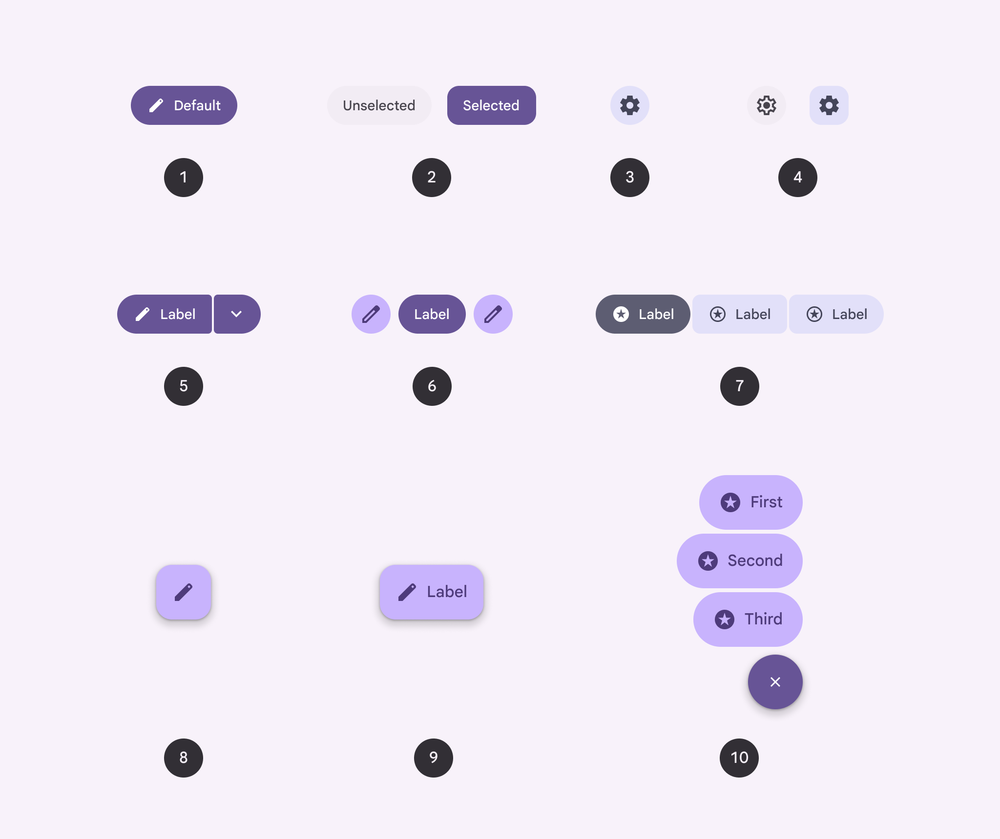
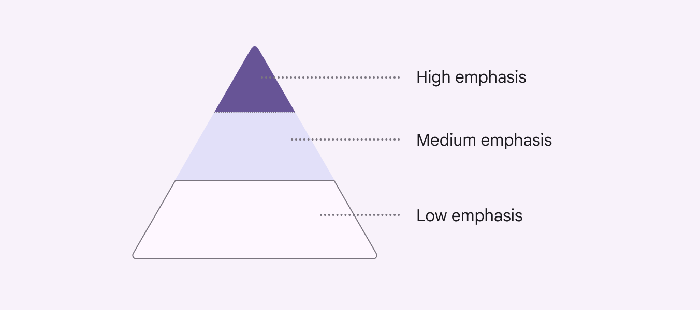
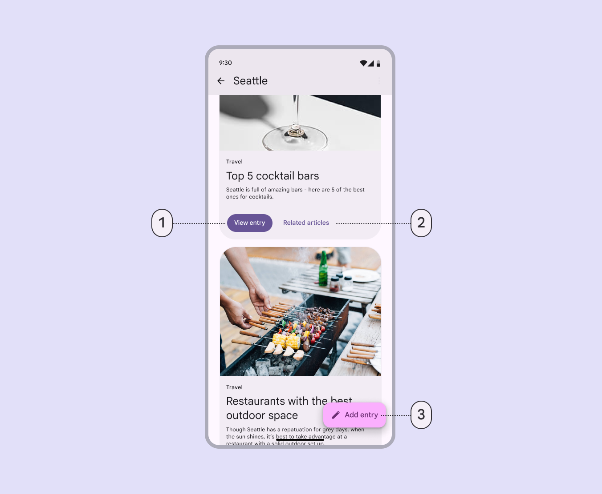
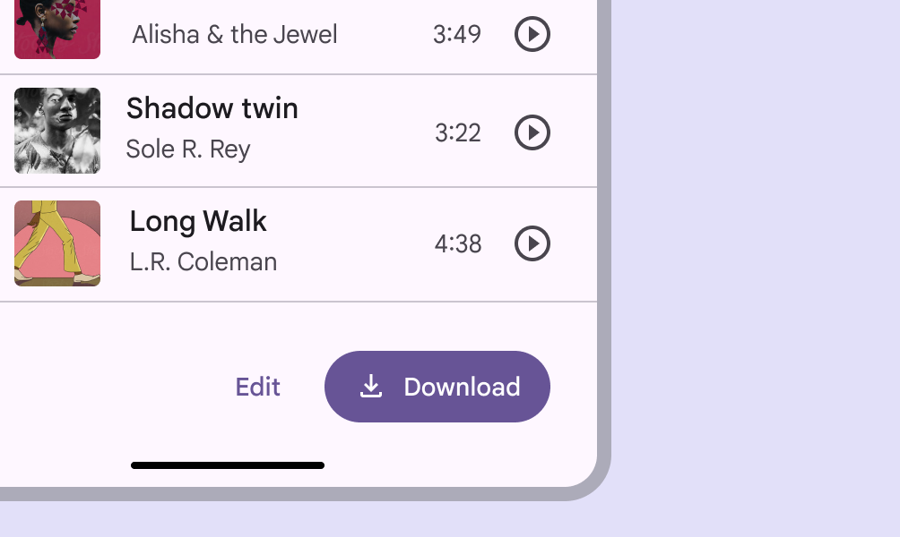
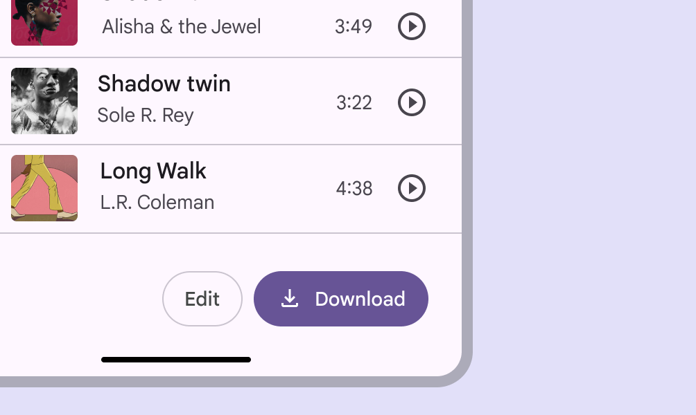
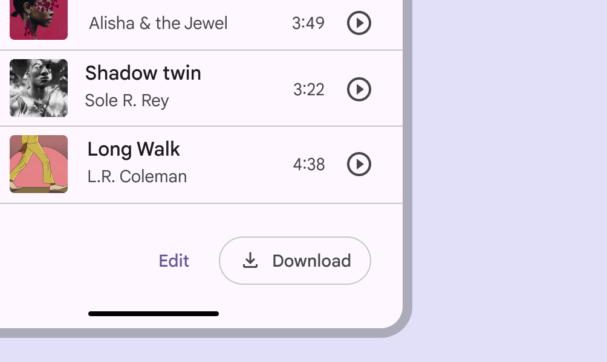
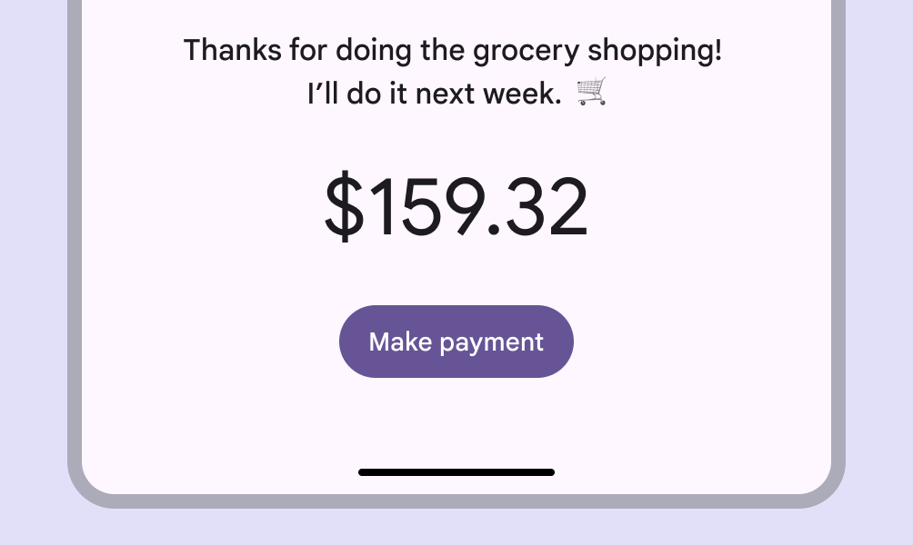
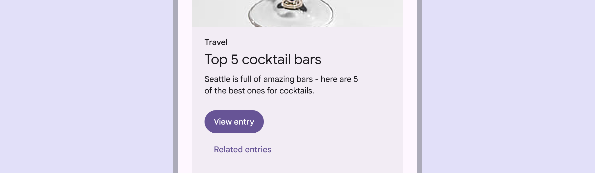

# All buttons

> When choosing the right button for an action, consider the level of emphasis each button type provides

##### There are 10 types of buttons in Material 3.

1.  Button

2.  Toggle button

3.  Icon button

4.  Toggle icon button

5.  Split button

6.  Standard button group

7.  Connected button group

8.  Floating action button (FAB) 
9.  Extended FAB

10.  FAB menu

## Choosing buttons

| Level of emphasis | Component | Rationale | Example actions |
| --- | --- | --- | --- |
| High emphasis: For the primary, most important, or most common action on a screen | [Extended FAB](/m3/pages/extended-fab/overview/), [FAB](/m3/pages/fab/overview/), and [FAB menu](/m3/pages/fab-menu/overview) | The FAB and extended FAB are the largest and most visually prominent buttons. They’re designed for a page’s primary action. The extended FAB is best on large screens. The FAB menu provides multiple options. | Create  Compose New thread New file |
| [Button (filled)](/m3/pages/common-buttons/guidelines#9ecffdb3-ef29-47e7-8d5d-f78b404fcafe) | The filled button’s primary color palette makes it the most prominent button after the FAB. It’s used for final or unblocking actions in a flow. | Save Confirm Done |
| [Split button](/m3/pages/split-button/overview) | The split button’s primary color palette and menu icon are best used for key actions with multiple options. | Send Add Create |
| [Button group](/m3/pages/button-groups/overview) | The standard button group uses color, motion, and shape to capture attention. Use it to show multiple key actions. | Back, Pause, Next |
| Medium emphasis: For important actions that don’t distract users from the main task | [Button (tonal)](/m3/pages/common-buttons/guidelines#07a1577b-aaf5-4824-a698-03526421058b) | The tonal button has a secondary color palette, making it less visually prominent than a regular, filled button. It can be used for final or unblocking actions, or for supporting actions. | Save Confirm Done |
| [Button (elevated)](/m3/pages/common-buttons/guidelines#4e89da4d-a8fa-4e20-bb8d-b8a93eff3e3e) | The elevated button has a secondary color palette and a shadow. Only use it when a button requires visual separation from a patterned background. | Reply View all Add to cart Take out of trash |
| [Button (outlined)](/m3/pages/common-buttons/guidelines#3742b09f-c224-43e0-a83e-541bd29d0f05) | Use an outlined button for actions that need attention but aren’t the primary action, such as “See all” or “Add to cart.” This is also the button to use for giving someone the opportunity to change their mind or escape a flow. | Reply View all Add to cart Take out of trash |
| Low emphasis: For optional or supplementary actions with the least amount of prominence |  | The connected button group shows multiple related options. Use it for changing the content visible on a page. | Walk, Bike, Drive |
| [Button  (text)](/m3/pages/common-buttons/guidelines#c9bcbc0b-ee05-45ad-8e80-e814ae919fbb) | The text button has no outline or fill. It should be used for actions not essential to the user journey. | Learn more View all Change account Turn on |
| [Icon button](/m3/pages/icon-buttons/overview) | The most compact and subtle type of button, icon buttons are used for optional supplementary actions such as “Bookmark” or “Star.” | Add to Favorites Print |

## Hierarchy

**One high emphasis button**

Each screen should contain a single prominent button for the primary action. This high-emphasis button commands the most attention. The arrangement of on-screen elements should clearly communicate that other buttons are less important.

**Other buttons**

A product can show more than one button at a time in a layout. Use different color styles to create visual hierarchy and indicate the importance of each button.

A button’s level of emphasis helps determine its appearance, typography, and placement

## Placement

Use a combination of button styles on the same screen to focus attention on a primary action, while offering alternatives.

1.  A filled button for a high-emphasis action

2.  A text button for a low-emphasis action

3.  An extended FAB for the highest emphasis action

check Do

For multiple actions, choose a higher-emphasis button for the more important action, such as a filled button next to a text button

check Do

When using multiple buttons, you can place an outlined button (medium emphasis) next to a filled button (high emphasis)

check Do

When using multiple buttons, you can place a text button (low emphasis) next to an outlined button (medium emphasis)

check Do

Use a filled button on its own for a single important action

close Don’t

Avoid placing a button below another button if there's space to place them side-by-side
