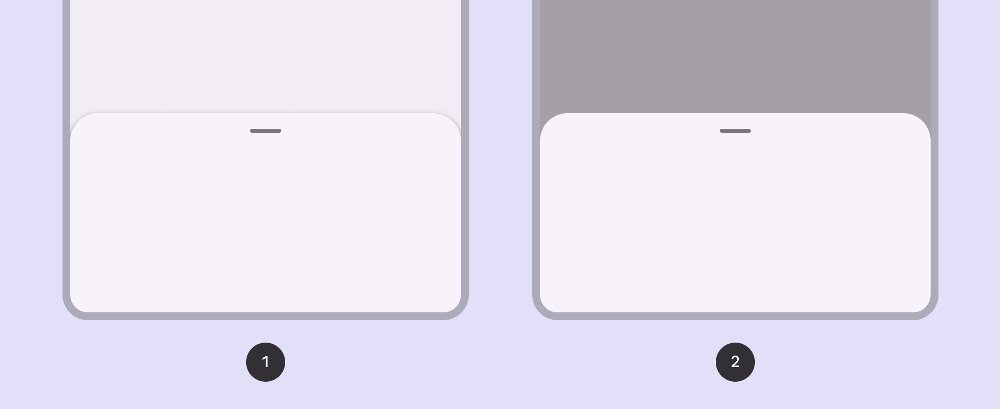
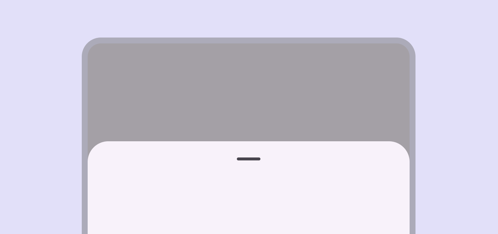

# Bottom sheets

> Bottom sheets show secondary content anchored to the bottom of the screen

-   Use bottom sheets in compact Window widths smaller than 600dp, such as a phone in portrait orientation. [More on compact breakpoints](/m3/pages/breakpoints/compact) and medium breakpoints Window widths from 600dp to 839dp, such as a tablet or foldable in portrait orientation. [More on medium breakpoints](/m3/pages/breakpoints/medium)

-   Two variants: standard Standard bottom sheets display supplementary content without blocking access to the screen’s primary content, such as an audio player at the bottom of a music app. and modal Modal bottom sheets appear in front of app content, disabling all other app functionality when they appear, and remaining on screen until confirmed, dismissed, or a required action has been taken.

-   Content should be additional or secondary (not the app’s main content)

-   Bottom sheets can be dismissed in order to interact with the main content

1.  Standard bottom sheet
2.  Modal bottom sheet

## Availability & resources

| Type | Resource | Status |
| --- | --- | --- |
| Design |
| [Design Kit (Figma)](https://www.figma.com/community/file/1035203688168086460) | Available |
| Implementation |
| [Flutter](https://api.flutter.dev/flutter/material/BottomSheet-class.html) | Available |
| [Android Views (MDC-Android)](https://github.com/material-components/material-components-android/blob/master/docs/components/BottomSheet.md) | Available |
| [Jetpack Compose](https://developer.android.com/develop/ui/compose/components/bottom-sheets) | Available |
|
Web

 | Unavailable |

Close

## Differences from M2

-   Color: New color mappings and compatibility with dynamic color Dynamic color takes a single color from a user's wallpaper or in-app content and creates an accessible color scheme assigned to elements in the UI. [More on dynamic color](/m3/pages/dynamic/choosing-a-source)
-   Shape: Bottom sheets have a 28dp top corner radius
-   Layout: New max-width of 640dp and an optional drag handle with an accessible 48dp hit target 

