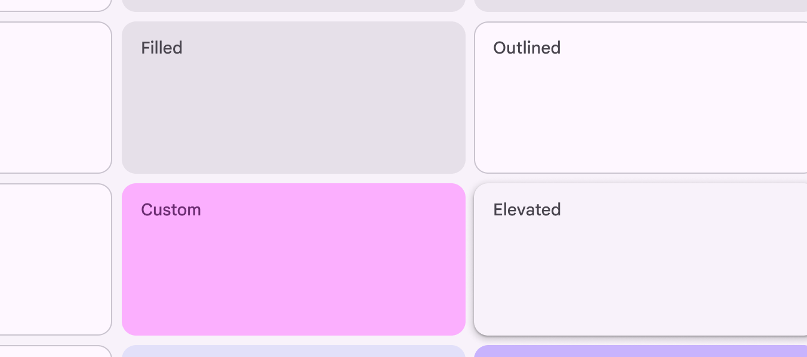

# Cards

> Cards display content and actions about a single subject

-   Use cards to contain related elements

-   Three variants: elevated Elevated cards have a drop shadow, providing more separation from the background than filled cards, but less than outlined cards , filled Filled cards provide subtle separation from the background. This has less emphasis than elevated or outlined cards. , outlined Outlined cards have a visual boundary around their container. This can provide greater emphasis than the other types.

-   Contents can include anything from images to headlines, supporting text, buttons Buttons let people take action and make choices with one tap. [More on buttons](/m3/pages/common-buttons/overview) , and lists Lists are continuous, vertical indexes of text and images. [More on lists](/m3/pages/lists/overview)

-   Can also contain other components

-   Cards have flexible layouts Layout is the visual arrangement of elements on the screen. [More on layout](/m3/pages/understanding-layout/overview) and dimensions based on their contents

1.  Elevated card
2.  Filled card
3.  Outlined card

## Availability & resources

Close

## Differences from M2

-   Color: New color mappings and compatibility with dynamic color Dynamic color takes a single color from a user's wallpaper or in-app content and creates an accessible color scheme assigned to elements in the UI. [More on dynamic color](/m3/pages/dynamic-color/overview)

-   Elevation: Lower elevation and no shadow by default

-   Variants: Three official card variants – elevated Elevated cards have a drop shadow, providing more separation from the background than filled cards, but less than outlined cards , filled Filled cards provide subtle separation from the background. This has less emphasis than elevated or outlined cards. , and outlined Outlined cards have a visual boundary around their container. This can provide greater emphasis than the other types.

Cards have updated colors, elevation, and variants
