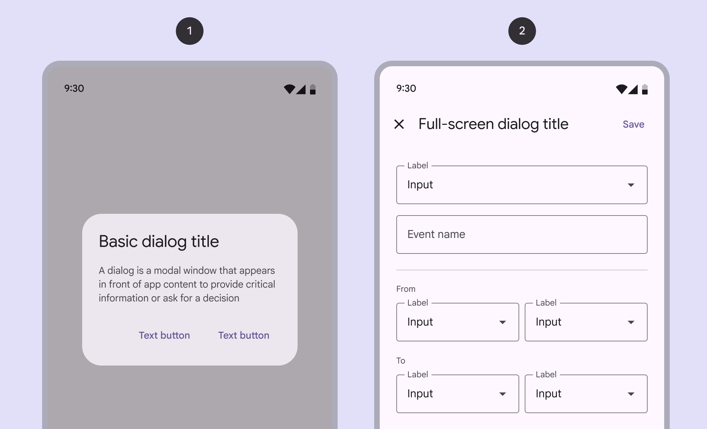
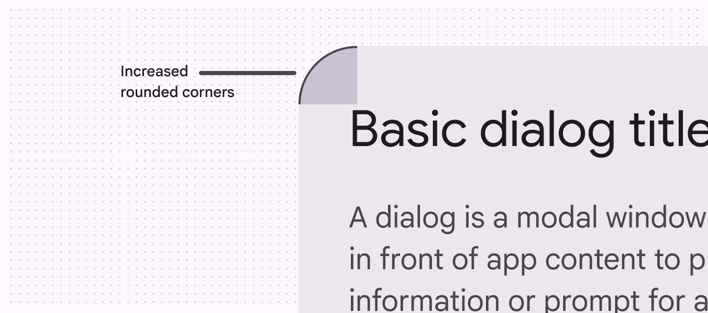

# Dialogs

> Dialogs provide important prompts in a user flow

-   Use dialogs to make sure users act on information

-   Two variants: basic Basic dialogs interrupt users with urgent information, details, or actions. They're often used for alerts, quick selection, or confirmation. [More on basic dialogs](/m3/pages/dialogs/guidelines#97ac3858-3932-4084-ae8e-73e42b7cb752) and full-screen Full-screen dialogs fill the entire screen, displaying actions that require a series of tasks to complete. They're often used for creating a calendar entry. [More on full-screen dialogs](/m3/pages/dialogs/guidelines#007536b9-76b1-474a-a152-2f340caaff6f)

-   Should be dedicated to completing a single task

-   Can also display information relevant to the task

-   Commonly used to confirm high-risk actions like deleting progress

1.  Basic dialog
2.  Full-screen dialog

## Availability & resources

| Type | Resource | Status |
| --- | --- | --- |
| Design |
| [Design Kit (Figma)](https://www.figma.com/community/file/1035203688168086460) | Available |
| Implementation |
| [Flutter](https://api.flutter.dev/flutter/material/ThemeData/useMaterial3.html) | Available |
| [Jetpack Compose](https://developer.android.com/develop/ui/compose/components/dialog) | Available |
| [Android Views (MDC-Android)](https://github.com/material-components/material-components-android/blob/master/docs/components/Dialog.md) | Available |
| [Web](https://github.com/material-components/material-web/blob/main/docs/components/dialog.md) | Available |

Close

## Differences from M2

-   Color: New color mappings and compatibility with dynamic color Dynamic color takes a single color from a user's wallpaper or in-app content and creates an accessible color scheme assigned to elements in the UI. [More on dynamic color](/m3/pages/dynamic/choosing-a-source)
-   Layout Layout is the visual arrangement of elements on the screen. [More on layout](/m3/pages/understanding-layout/overview) : Greater padding to account for the increased corner-radius and title size
-   Position: Option for custom basic dialog Basic dialogs interrupt users with urgent information, details, or actions. They're often used for alerts, quick selection, or confirmation. [More on basic dialogs](/m3/pages/dialogs/guidelines#97ac3858-3932-4084-ae8e-73e42b7cb752) positioning
-   Shape: Increased corner-radius
-   Typography: Larger and darker headline

New updates to color, layout, position, shape, and typography
