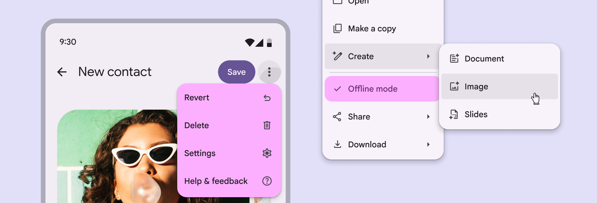
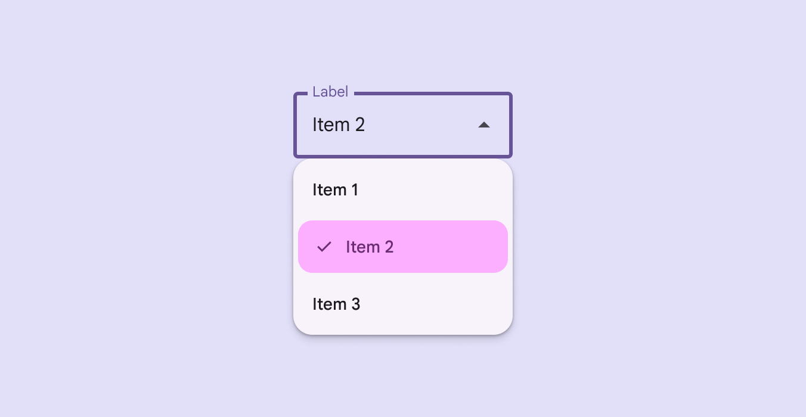
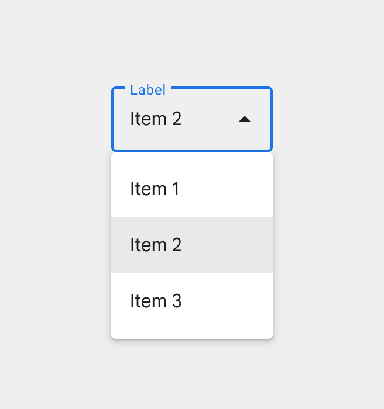
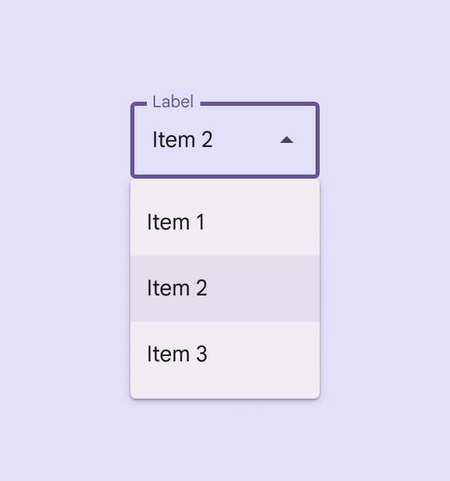

# Menus

> Menus display a list of choices on a temporary surface

-   Use a **menu** to show a temporary set of actions. To show actions on screen at all times, use a **toolbar Toolbars display frequently used actions relevant to the current page. [More on toolbars](/m3/pages/toolbars/overview)** instead
-   Menus can open from many components, including icon buttons Icon buttons help people take minor actions with one tap. [More on icon buttons](/m3/pages/icon-buttons/overview) , split buttons The split button opens a menu to give people more options related to an action. [More on split buttons](/m3/pages/split-buttons/overview) , and text fields Text fields let users enter text into a UI. [More on text fields](/m3/pages/text-fields/overview)
-   **Context menus** provide actions for a specific element, like an image or highlighted text, and usually open with a secondary click

Vertical menus can include vibrant colors, gaps, dividers, and submenus to organize a list of choices

## Availability & resources

Close

## M3 Expressive update

**November 2025**

**Vertical menus** were introduced with new shapes, color styles, selection states, and refined submenu motion. Gaps can be used for a more flexible layout on Android. [More on M3 Expressive](https://m3.material.io/blog/building-with-m3-expressive)

Variants:

-   Added **vertical menus**, recommended for new designs
-   Baseline Baseline variants are the M3 component designs. They may not have the latest features introduced in M3 Expressive, like updated motion, shapes, type, and styles. [More on M3 Expressive](https://m3.material.io/blog/building-with-m3-expressive) **menu** is still available 


Color styles: 

-   Standard
-   Vibrant

Vibrant colors help selected menu items stand out

## Differences from M2

-   **Color**: New color mappings and compatibility with dynamic color Dynamic color takes a single color from a user's wallpaper or in-app content and creates an accessible color scheme assigned to elements in the UI. [More on dynamic color](/m3/pages/dynamic/choosing-a-source)
-   **Variants**: Dropdown menu and exposed dropdown menu are now both referred to as menu, since they differ only in the element which opens the menu surface

M2: Former menu colors don’t contrast with the background 

M3: Menus feature new color mappings and dynamic color
