# Navigation drawer

> Navigation drawers let people switch between UI views on larger devices

star

Note:

The navigation drawer is no longer recommended in the Material 3 Expressive update. For those who have updated, use an [expanded navigation rail](/m3/pages/navigation-rail/overview/), which has mostly the same functionality of the navigation drawer and adapts better across breakpoints.

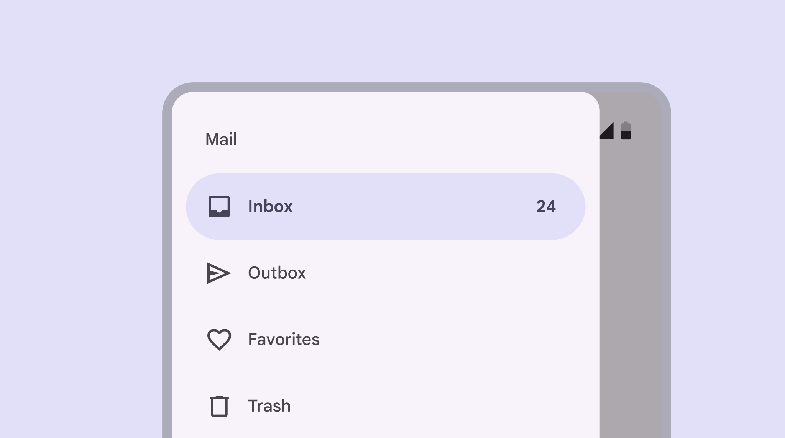

## Usage

Navigation drawers provide access to destinations and app functionality, such as switching accounts. They can either be permanently on-screen or opened and closed by a navigation menu Menus display a list of choices on a temporary surface. [More on menus](/m3/pages/menus/overview) icon. One navigation destination is always active.

Navigation drawers are recommended for:

-   Apps with 5 or more top-level destinations
-   Apps with 2 or more levels of navigation hierarchy
-   Quick navigation between unrelated destinations
-   Replacing the navigation rail Navigation rails let people switch between UI views on mid-sized devices. [More on navigation rails](/m3/pages/navigation-rail/overview) or navigation bar Navigation bars let people switch between UI views on smaller devices. [More on navigation bars](/m3/pages/navigation-bar/overview) on large screens

check Do Use a navigation drawer for 5 or more primary destinations, or more than 1 level of navigation hierarchy

Avoid using a navigation drawer with other primary navigation components, such as a navigation bar.

Instead, choose a single navigation component based on product requirements and breakpoints:

-   Navigation bars Navigation bars let people switch between UI views on smaller devices. [More on navigation bars](/m3/pages/navigation-bar/overview) for compact breakpoints Window widths smaller than 600dp, such as a phone in portrait orientation. [More on compact breakpoints](/m3/pages/breakpoints/compact)

-   Navigation rails Navigation rails let people switch between UI views on mid-sized devices. [More on navigation rails](/m3/pages/navigation-rail/overview) for medium Window widths from 600dp to 839dp, such as a tablet or foldable in portrait orientation. [More on medium breakpoints](/m3/pages/breakpoints/medium) and expanded breakpoints Window widths 840dp to 1199dp, such as a tablet or foldable in landscape orientation, or desktop. [More on expanded breakpoints](/m3/pages/breakpoints/expanded)  

-   Standard navigation drawers for expanded, large Window widths 1200dp to 1599dp, such as desktop. [More on large breakpoints](/m3/pages/breakpoints/large-extra-large) and extra-large Window widths 1600dp and larger, such as ultra-wide monitors. [More on extra-large breakpoints](/m3/pages/breakpoints/large-extra-large) breakpoints

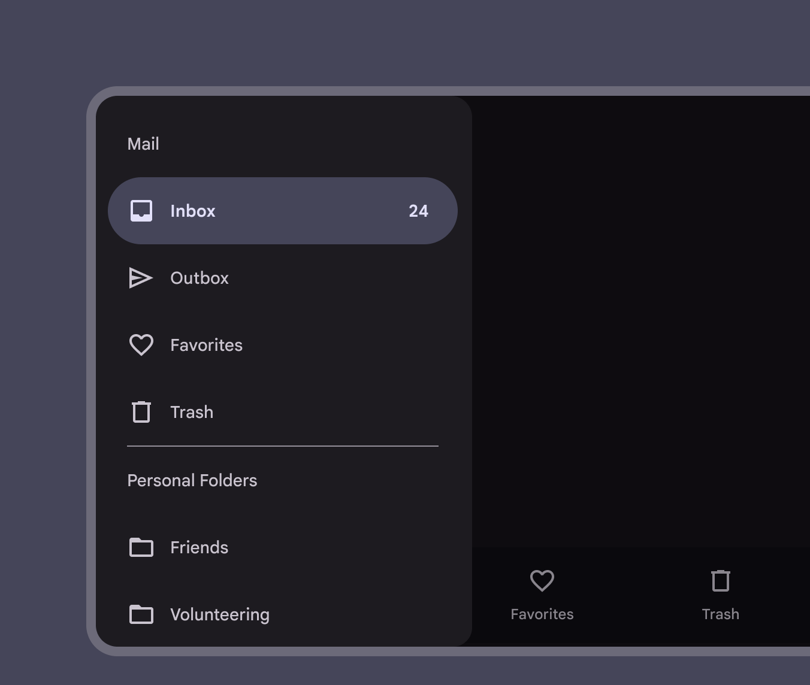

exclamation Caution

Avoid using two navigation components on the same screen

There are two variants of navigation drawers:

1.  Standard navigation drawer

2.  Modal navigation drawer

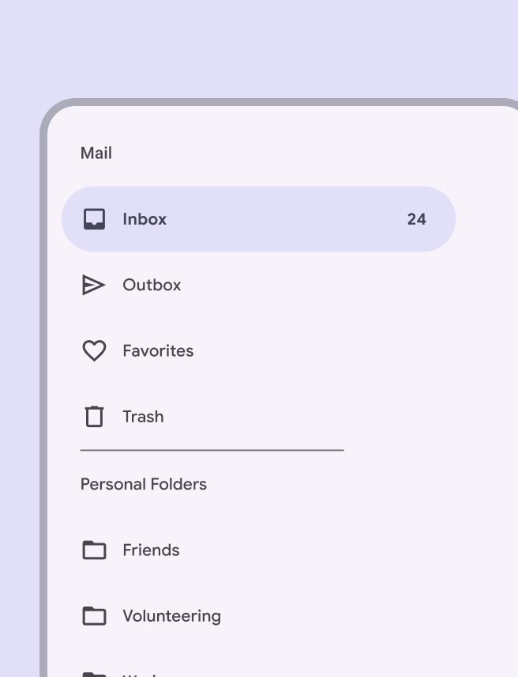

Standard navigation drawer

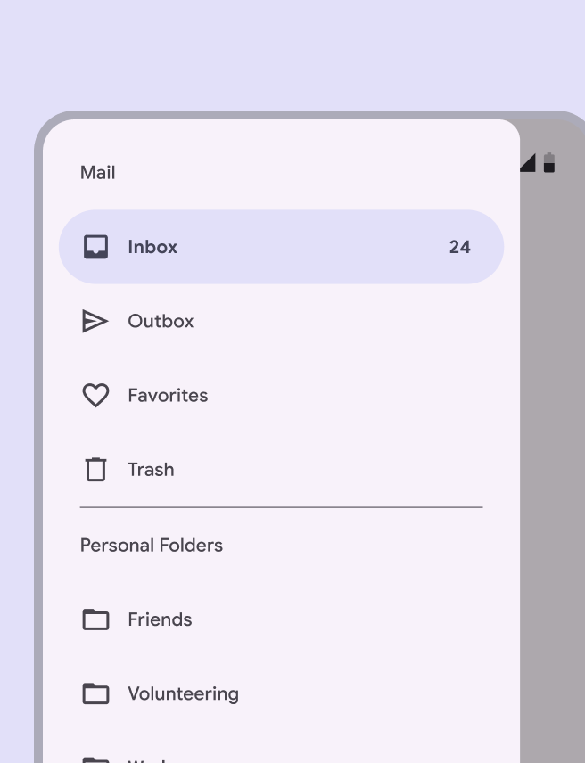

Modal navigation drawer

### Standard navigation drawer

Standard navigation drawers provide access to drawer destinations and app content for layouts Layout is the visual arrangement of elements on the screen. [More on layout](/m3/pages/layout-overview/overview) in expanded Window widths 840dp to 1199dp, such as a tablet or foldable in landscape orientation, or desktop. [More on expanded breakpoints](/m3/pages/breakpoints/expanded) , large Window widths 1200dp to 1599dp, such as desktop. [More on large breakpoints](/m3/pages/breakpoints/large-extra-large) , and extra-large Window widths 1600dp and larger, such as ultra-wide monitors. [More on extra-large breakpoints](/m3/pages/breakpoints/large-extra-large) breakpoints. 

Standard drawers can be permanently visible (best for frequently switching destinations) or opened and closed by tapping a menu Menus display a list of choices on a temporary surface. [More on menus](/m3/pages/menus/overview) icon (best for focusing more on screen content).

In medium Window widths from 600dp to 839dp, such as a tablet or foldable in portrait orientation. [More on medium breakpoints](/m3/pages/breakpoints/medium) and compact breakpoints Window widths smaller than 600dp, such as a phone in portrait orientation. [More on compact breakpoints](/m3/pages/breakpoints/compact) , use modal drawers instead.

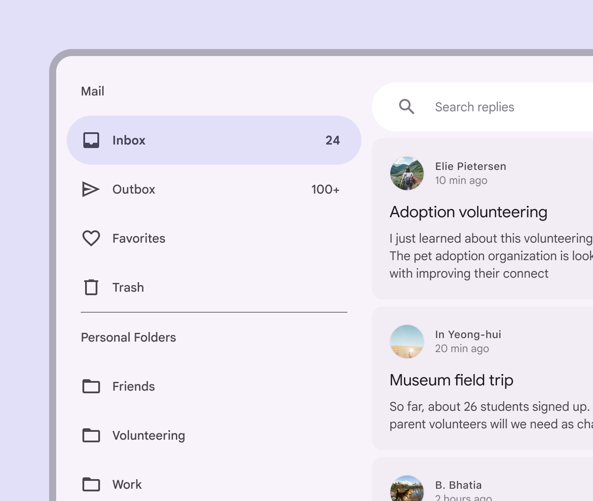

Standard navigation drawer providing access to drawer destinations next to app content

### Modal navigation drawer

Modal navigation drawers use a scrim to block interaction with the rest of an app’s content, and don’t affect the screen’s layout Layout is the visual arrangement of elements on the screen. [More on layout](/m3/pages/layout-overview/overview) grid.

Modal navigation drawers can be used in any breakpoint, but are primarily used in compact and medium sizes where space is limited or prioritized for app content.

They can be swapped with standard drawers on expanded, large Window widths 1200dp to 1599dp, such as desktop. [More on large breakpoints](/m3/pages/breakpoints/large-extra-large) , and extra-large Window widths 1600dp and larger, such as ultra-wide monitors. [More on extra-large breakpoints](/m3/pages/breakpoints/large-extra-large) breakpoints. 

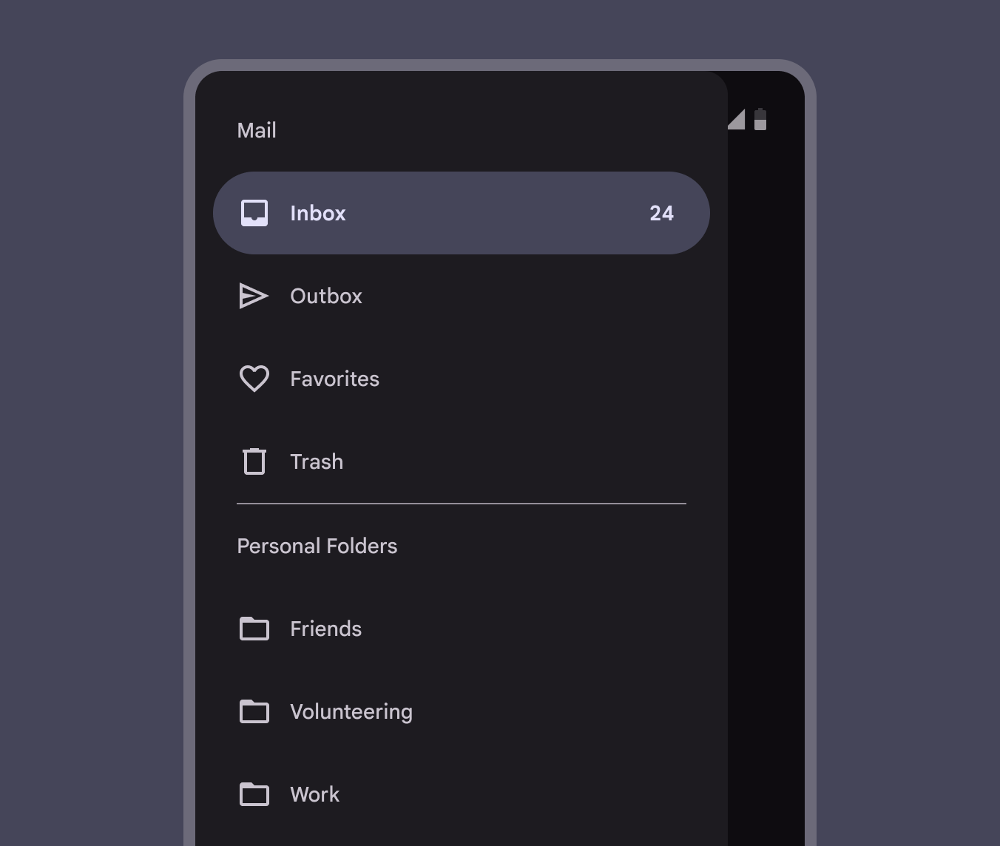

Modal navigation drawer using a scrim to block interaction with the rest of an app’s content

Modal navigation drawers are always opened by an action outside of the drawer, such as clicking a navigation menu Menus display a list of choices on a temporary surface. [More on menus](/m3/pages/menus/overview) icon in a navigation rail Navigation rails let people switch between UI views on mid-sized devices. [More on navigation rails](/m3/pages/navigation-rail/overview) .

Modal drawers can be dismissed by:

-   Selecting a drawer item
-   Tapping the scrim
-   Swiping toward the drawer’s anchoring edge (for example, swiping right-to-left for a left-aligned navigation drawer)

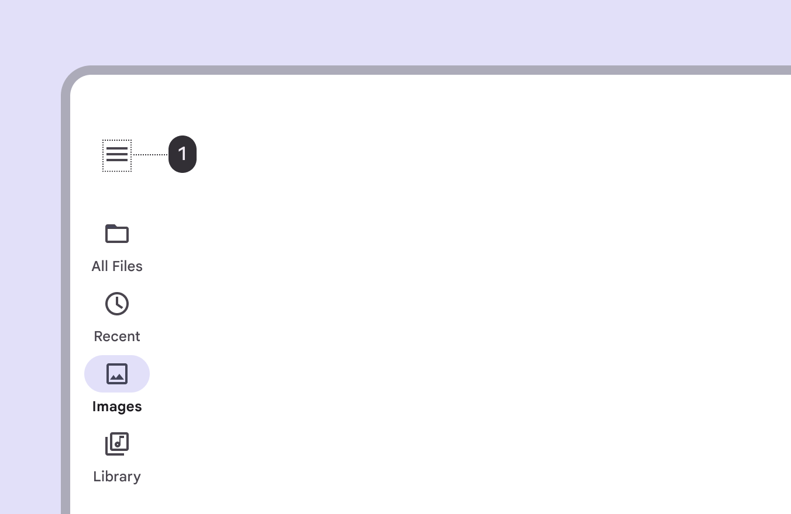

A modal drawer opened by an action such as clicking a navigation menu icon (1)

Modal drawers can be dismissed by tapping the scrim or swiping the drawer toward its anchoring screen edge.

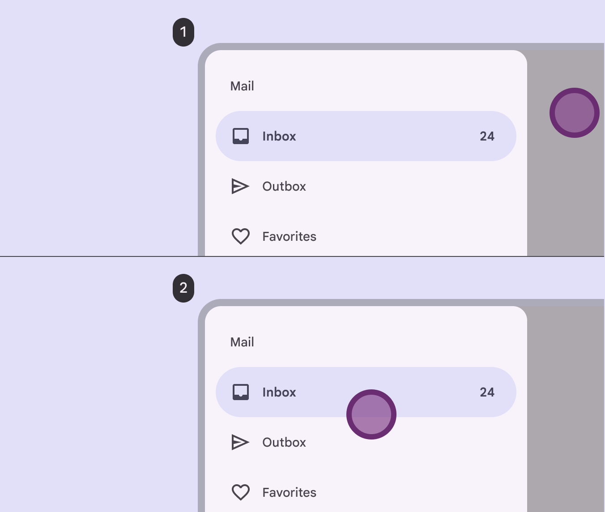

1\. Dismiss by tapping the scrim
2\. Dismiss by swiping the drawer

## Anatomy

Navigation drawers are essentially a list Lists are continuous, vertical indexes of text and images. [More on lists](/m3/pages/lists/overview) contained within a side sheet Side sheets show secondary content anchored to the side of the screen. [More on side sheets](/m3/pages/side-sheets/overview) . They can also include headers, subheads, and dividers Dividers are thin lines that group content in lists or other containers. [More on dividers](/m3/pages/divider/overview) to organize longer lists.

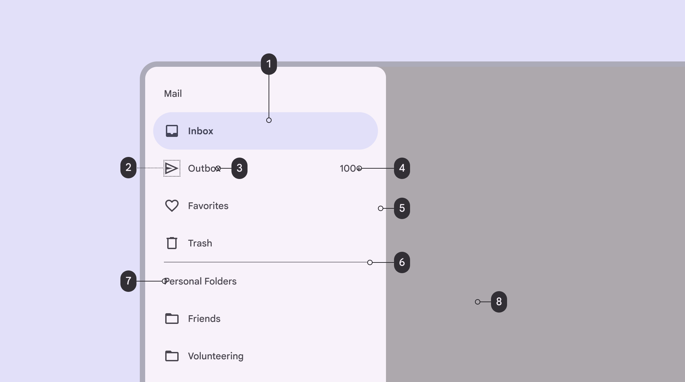

Navigation drawers can include headers, subheads, and dividers to organize longer lists

1.  Active Indicator
2.  Icon
3.  Label
4.  Badge label
5.  Sheet
6.  Divider
7.  Section label (optional)
8.  Scrim

### Sheet

A sheet holds all navigation drawer elements. Side sheets Side sheets show secondary content anchored to the side of the screen. [More on side sheets](/m3/pages/side-sheets/overview) are used as the container for standard and modal navigation drawers.

Navigation drawers that open from the side are always placed on the start edge of the screen, on the left for left-to-right (LTR) languages, and on the right for right-to-left (RTL) languages.

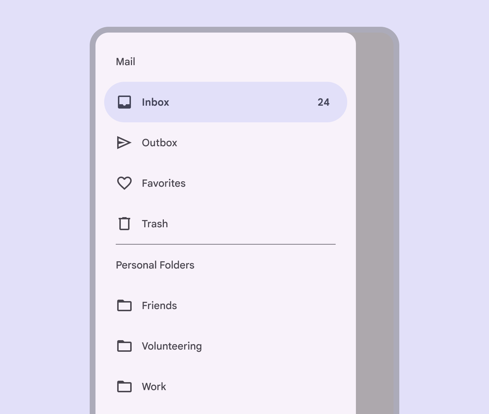

check Do

A navigation drawer opens from the left side of the screen for left-to-right languages

### Divider (optional)

Dividers Dividers are thin lines that group content in lists or other containers. [More on dividers](/m3/pages/divider/overview) can be used to separate groups of destinations within the navigation drawer.

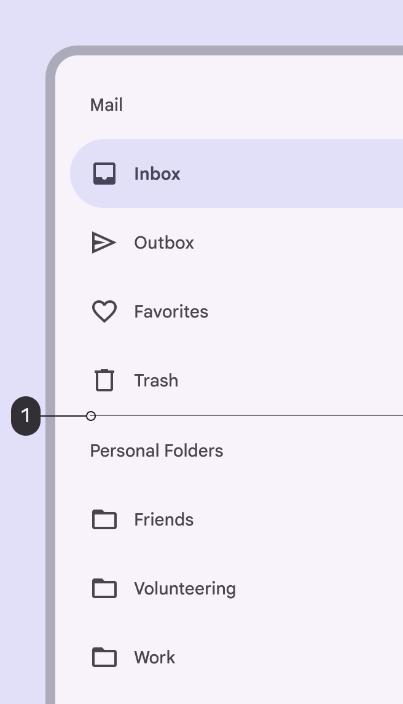

check Do

Use full-width dividers (1) to separate groups of destinations

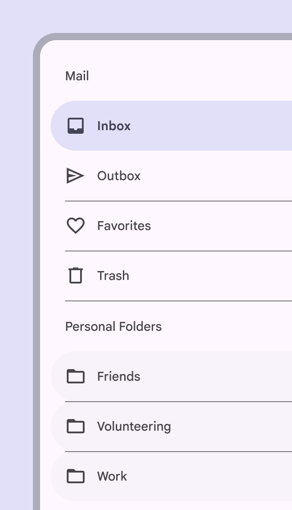

close Don’t

Don’t use dividers to separate individual destinations

### Active indicator

The active indicator is a background shape communicating which destination of the navigation drawer is currently being displayed.

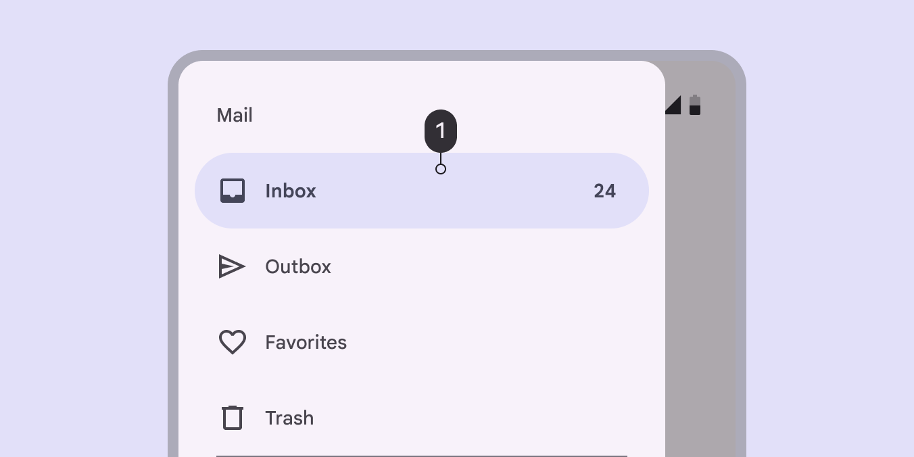

The active indicator (1) is a background shape communicating which destination of the navigation drawer is currently being displayed

### Label text and icons

Destinations in a navigation drawer take the form of actionable list Lists are continuous, vertical indexes of text and images. [More on lists](/m3/pages/lists/overview) items. Each item describes its destination using label text and an optional icon.

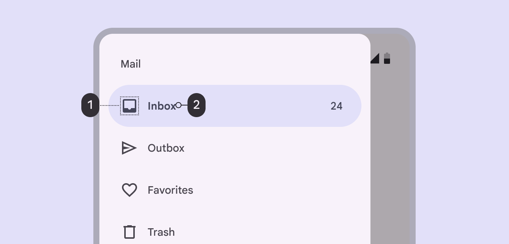

Actionable list items in a navigation drawer describe each destination using (1) an optional icon and (2) required label text

Label text should be clear and short enough that it isn’t cut off by the sheet.

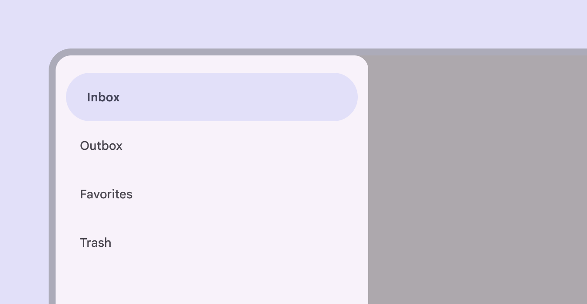

Navigation drawers can use text labels without icons

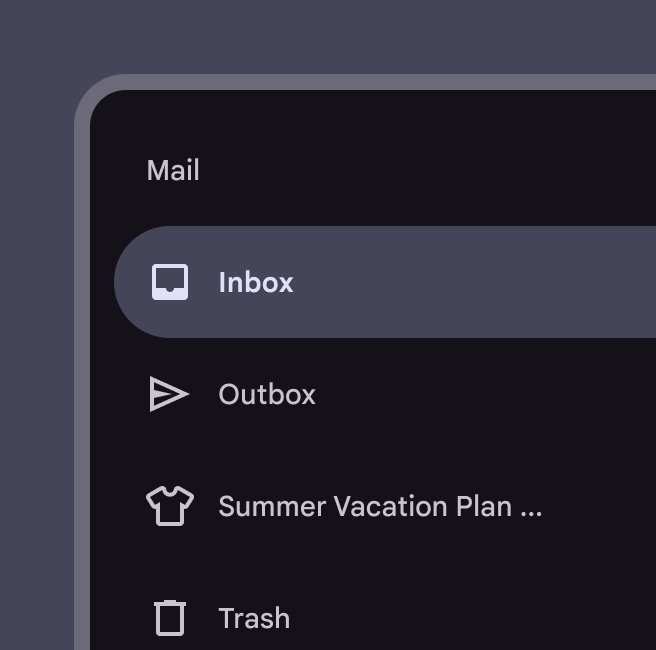

check Do

Keep text labels concise, but truncate them if they extend beyond the container width

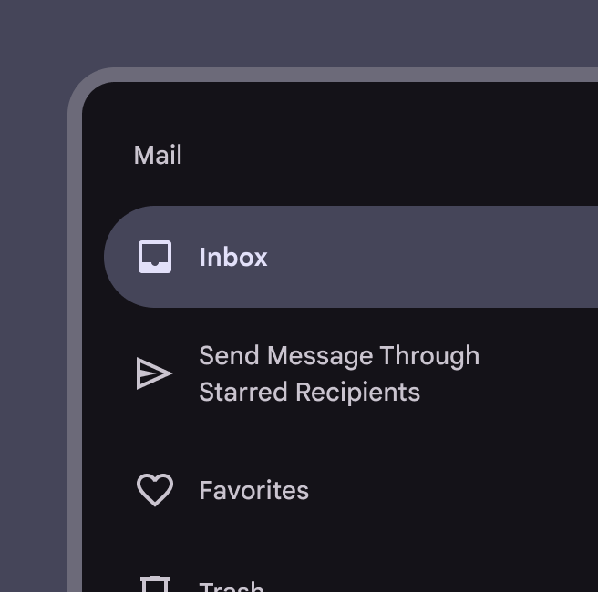

close Don’t

Don’t wrap label text

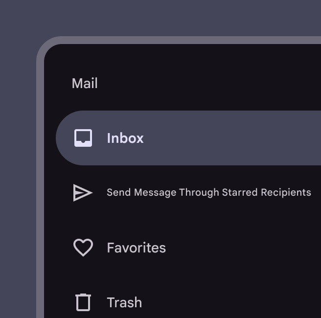

close Don’t

Don’t shrink text size in order to fit a text label on a single line

Icons can supplement labels as indicators of a destination. When used, they should always be placed before text. Other app components and content should reference these icons.

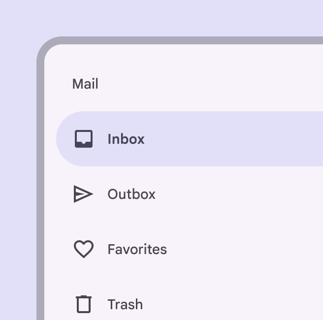

check Do

Use recognizable icons when conventions exist

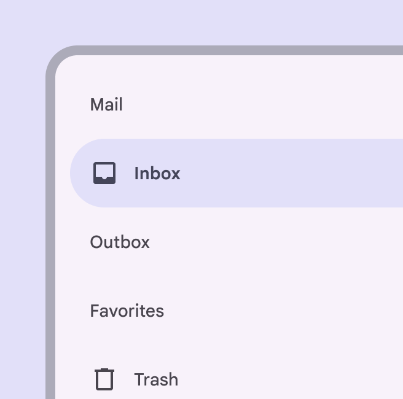

close Don’t

Don’t apply icons to some destinations and not others. Icons should be used for all destinations, or none.

### Section label (optional)

Short subhead section labels can help group related destinations in the navigation drawer.

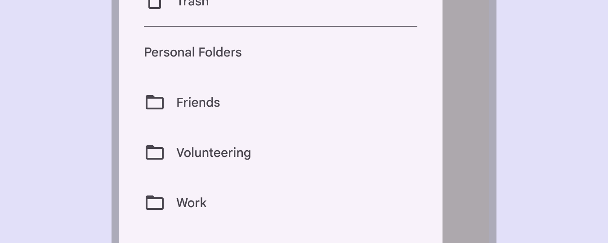

Related destinations can be grouped using short subhead section labels in the navigation drawer

### Scrim (modal only)

Modal navigation drawers use a scrim to block interaction with the rest of the app. The scrim is placed directly behind the drawer’s sheet and can be tapped or clicked to dismiss the drawer.

Scrim applied behind a modal navigation drawer

## Responsive layout

A product’s navigation component should change to suit the breakpoint Breakpoints are opinionated window sizes where a layout changes to match available space, device conventions, and ergonomics (previously window size classes). [More on breakpoints](/m3/pages/breakpoints) and form factor of the screen.

Modal navigation drawers can be used at any breakpoint but are most common in compact Window widths smaller than 600dp, such as a phone in portrait orientation. [More on compact breakpoints](/m3/pages/breakpoints/compact) and medium breakpoints Window widths from 600dp to 839dp, such as a tablet or foldable in portrait orientation. [More on medium breakpoints](/m3/pages/breakpoints/medium) .

Standard navigation drawers are best for expanded Window widths 840dp to 1199dp, such as a tablet or foldable in landscape orientation, or desktop. [More on expanded breakpoints](/m3/pages/breakpoints/expanded) , large Window widths 1200dp to 1599dp, such as desktop. [More on large breakpoints](/m3/pages/breakpoints/large-extra-large) , and extra-large Window widths 1600dp and larger, such as ultra-wide monitors. [More on extra-large breakpoints](/m3/pages/breakpoints/large-extra-large) breakpoints. 

Use a transition when swapping components. For example, when switching from a portrait to landscape layout Layout is the visual arrangement of elements on the screen. [More on layout](/m3/pages/layout-overview/overview) , the navigation rail Navigation rails let people switch between UI views on mid-sized devices. [More on navigation rails](/m3/pages/navigation-rail/overview) should transform into a navigation drawer.

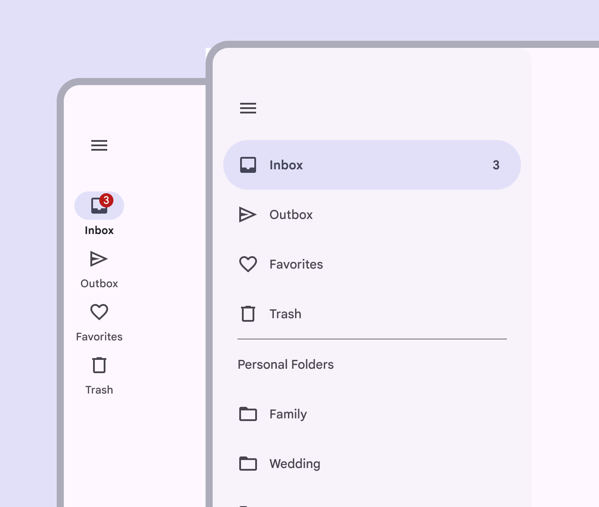

Standard navigation drawers change size to suit the device’s screen

### Compact breakpoint

Use modal navigation drawers in compact breakpoints Window widths smaller than 600dp, such as a phone in portrait orientation. [More on compact breakpoints](/m3/pages/breakpoints/compact) . Or swap the drawer for a navigation bar.

On web, when the screen size is smaller than 320 CSS pixels CSS pixels are the most common unit of measurement when developing for the web. [More on CSS pixels](https://www.w3.org/Style/Examples/007/units.en.html) , swap the navigation drawer for a navigation bar to ensure accessibility Accessible design makes products usable for people with all kinds of abilities. [More on accessibility](/m3/pages/overview/principles) .

Use a modal navigation drawer on mobile screens

### Medium & expanded breakpoints

Use a modal navigation drawer alone or with a navigation rail on medium Window widths from 600dp to 839dp, such as a tablet or foldable in portrait orientation. [More on medium breakpoints](/m3/pages/breakpoints/medium) and expanded Window widths 840dp to 1199dp, such as a tablet or foldable in landscape orientation, or desktop. [More on expanded breakpoints](/m3/pages/breakpoints/expanded) breakpoints.

When a navigation rail Navigation rails let people switch between UI views on mid-sized devices. [More on navigation rails](/m3/pages/navigation-rail/overview) and modal navigation drawer are used together, the drawer can repeat destinations in the navigation rail as long as the drawer offers enough visual separation between levels of the navigation hierarchy.

A standard navigation drawer can be used in [single pane layouts](/m3/pages/understanding-layout/parts-of-layout) in expanded breakpoints. 

Use a navigation rail on tablet screens, or also allow a drawer to open and close via a menu icon

### Large and extra-large breakpoints

For web experiences on laptop and desktop devices, use either a standard navigation drawer, or a navigation rail Navigation rails let people switch between UI views on mid-sized devices. [More on navigation rails](/m3/pages/navigation-rail/overview) that transitions into a modal navigation drawer.

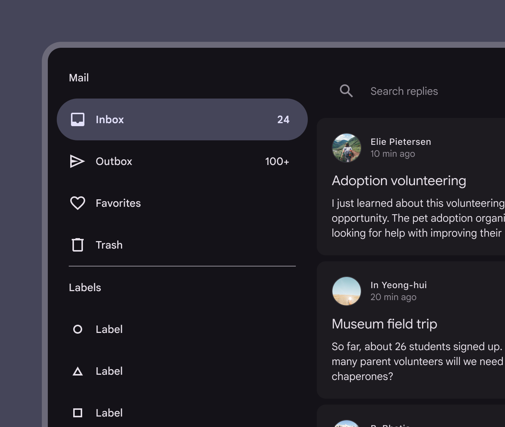

Use a standard navigation drawer on large and desktop screens

## Behavior

### Scrolling

Navigation drawers can be vertically scrolled, independent of the rest of the screen’s content and UI. If the list Lists are continuous, vertical indexes of text and images. [More on lists](/m3/pages/lists/overview) of navigation destinations is longer than the height of the drawer, the drawer’s contents can be scrolled within the drawer.

When a navigation drawer is scrolled, the body content should remain stationary

### Visibility

**Dismissible standard drawers** can be used for layouts Layout is the visual arrangement of elements on the screen. [More on layout](/m3/pages/layout-overview/overview) that prioritize content (such as a photo gallery) or for apps where users are unlikely to switch destinations often. They should use a visible navigation menu Menus display a list of choices on a temporary surface. [More on menus](/m3/pages/menus/overview) icon to open and close the drawer.

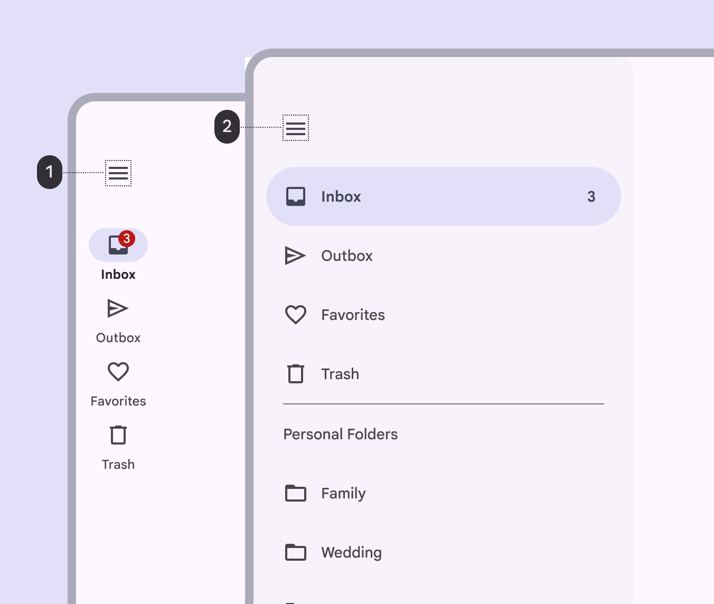

A standard dismissible navigation drawer is opened and closed by tapping the navigation menu icon in the app bar (1), and remains open until the menu icon is tapped again (2)

**Permanently visible standard drawers** allow quick navigation between unrelated destinations. They can’t be closed or dismissed by the user.

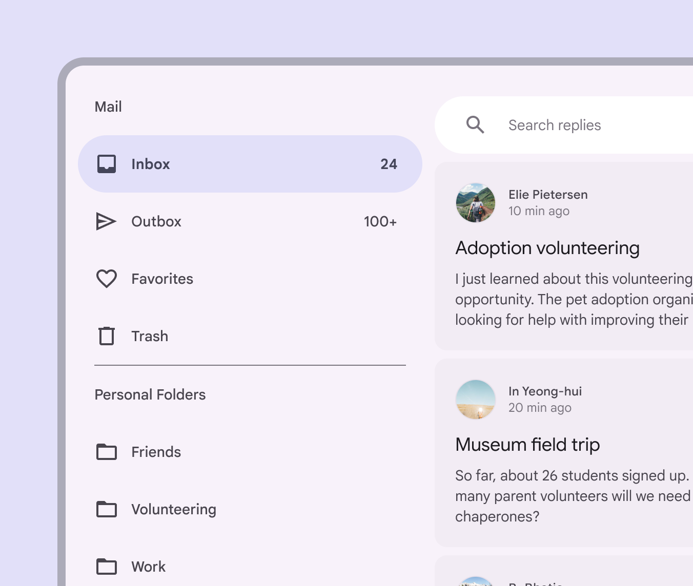

A permanently-visible standard navigation drawer on desktop

### Appearing

When a navigation drawer animates on screen, it uses an [enter and exit](/m3/pages/motion-transitions) transition pattern.

A navigation drawer animating on screen
