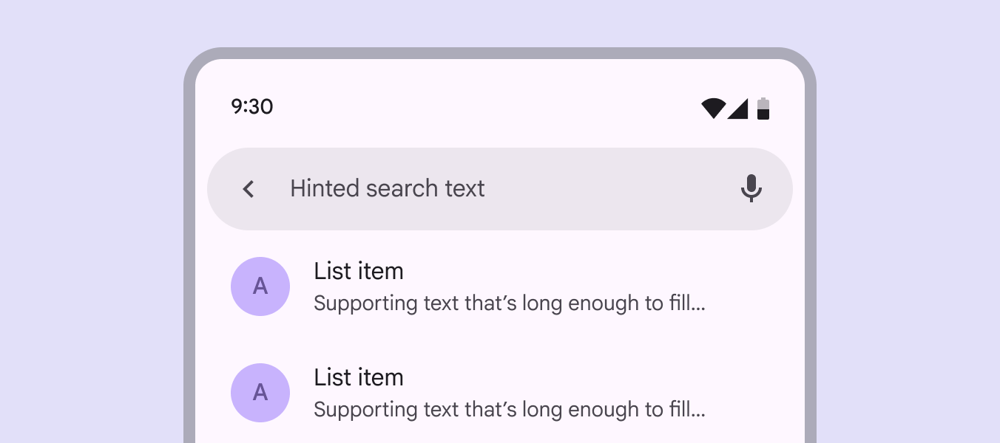
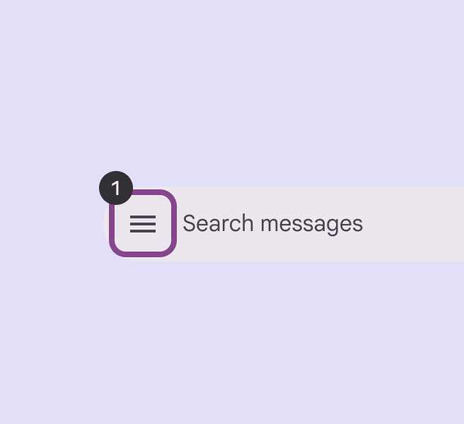
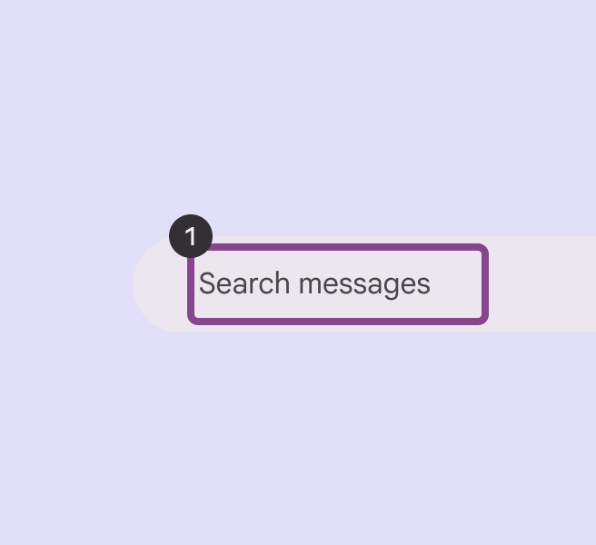
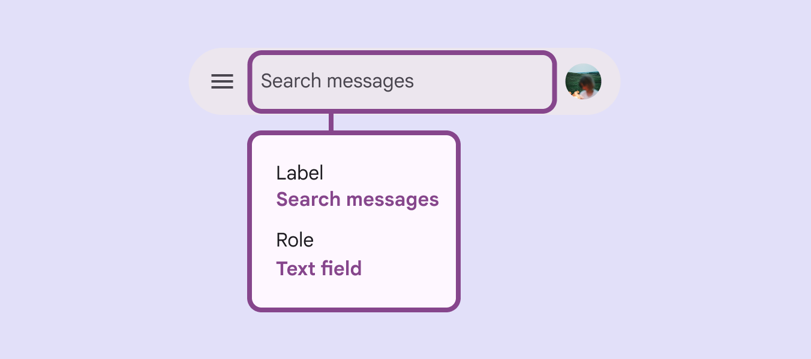
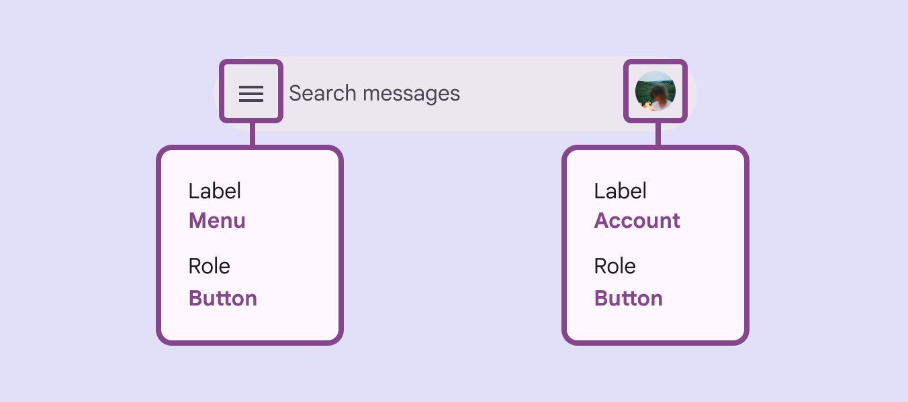
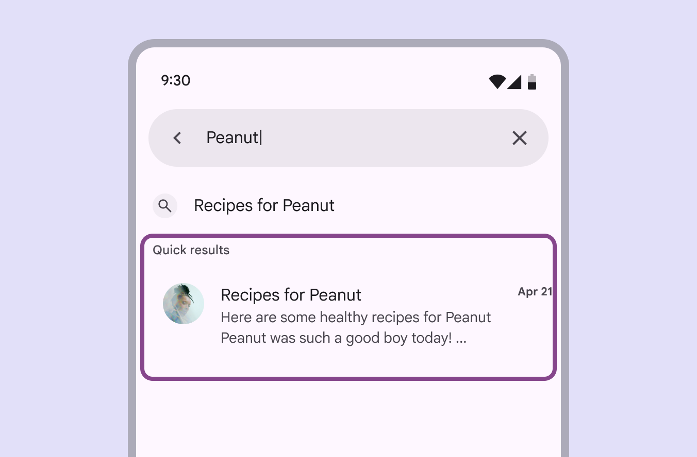

# Search

> Search lets people enter a keyword or phrase to get relevant information

## Use cases

People should be able to use assistive technology to:

-   Navigate to and focus on a search bar

-   View the hinted search text or persistent label

-   Input text and complete a search

-   Interact with a list of search suggestions and results

-   Clear the input text

## Interaction & style

### Autosuggest

When search suggestions and results appear, the screen reader must announce the change. This lets people know list items are available for selection.

Autocomplete results should be announced by the screen reader

## Initial focus

Initial focus A focused state communicates when a user has highlighted an element, using an input method such as a keyboard or voice. [More on focused state](/m3/pages/interaction-states/applying-states#bc6d6853-48ef-490e-8076-448e89e69f0f) lands on the first interactive element. This is often a leading icon button Icon buttons help people take minor actions with one tap. [More on icon buttons](/m3/pages/icon-buttons/overview) or text field Text fields let users enter text into a UI. [More on text fields](/m3/pages/text-fields/overview) . A leading icon button usually activates search directly or opens a navigation component.

Initial focus can land on a leading icon

If there’s no leading icon, focus lands on the text field

## Keyboard navigation

| **Keys** | **Actions** |
| --- | --- |
| **Tab** or **Shift** + **Tab** | Navigate between interactive elements |
| **Space** or **Enter** | Activate the search text field for input |
| **Arrows** | Navigate between search result items |

## Labeling elements

The hinted search text should be used as the accessibility label describing the search bar.



The role for the input field should be:

-   Android: **Text field**

-   iOS: **Search field**

The accessibility label should match the hinted search text

Leading and trailing icon buttons should be labeled according to their [accessibility guidance](/m3/pages/icon-buttons/accessibility).

Use icon labels for icon buttons

Search suggestions and results use the list component. Screen readers automatically announce the results as a list.

For accessibility labels, follow the [list accessibility guidelines](/m3/pages/lists/accessibility).

Search suggestions and results are created using lists
