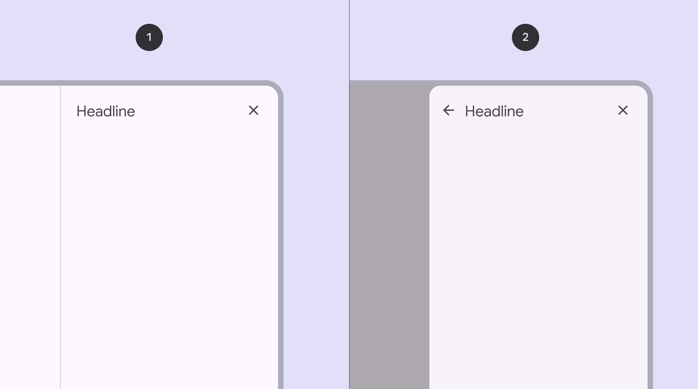
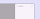

# Side sheets

> Side sheets show secondary content anchored to the side of the screen

-   Use side sheets to provide optional content and actions without interrupting the main content

-   Two variants: standard Standard side sheets display content without blocking access to the screen’s primary content, such as an audio player at the side of a music app. They're often used in medium and expanded window sizes like tablet or desktop. and modal Modal side sheets appear in front of app content, disabling all other app functionality when they appear, and remaining on screen until confirmed, dismissed, or a required action has been taken. They're often used in compact breakpoints, like mobile, due to limited screen size.

-   People can navigate to another region within the sheet

-   Side sheets can contain a back icon for navigation

1.  Standard side sheet
2.  Modal side sheet

## Availability & resources

| Type | Resource | Status |
| --- | --- | --- |
| Design |
| [Design Kit (Figma)](http://goo.gle/m3-design-kit) | Available |
| Implementation |
|
Flutter

 | Unavailable |
|

Jetpack Compose

 | Unavailable |
| [Android Views (MDC-Android)](https://github.com/material-components/material-components-android/blob/master/docs/components/SideSheet.md) | Available |
|

Web

 | Unavailable |

Close

## Differences from M2

-   Right-to-left (RTL) language support with left side sheet

-   Color: New color mappings and compatibility with dynamic color Dynamic color takes a single color from a user's wallpaper or in-app content and creates an accessible color scheme assigned to elements in the UI. [More on dynamic color](/m3/pages/dynamic/choosing-a-source)

-   Shape: Modal side sheets Modal side sheets appear in front of app content, disabling all other app functionality when they appear, and remaining on screen until confirmed, dismissed, or a required action has been taken. They're often used in compact breakpoints, like mobile, due to limited screen size. have a 16dp corner radius

Side sheets have new color mappings to support dynamic color
