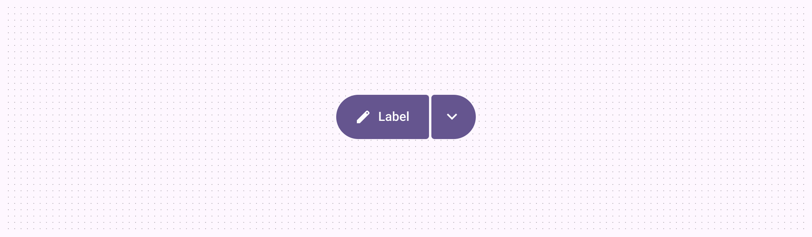
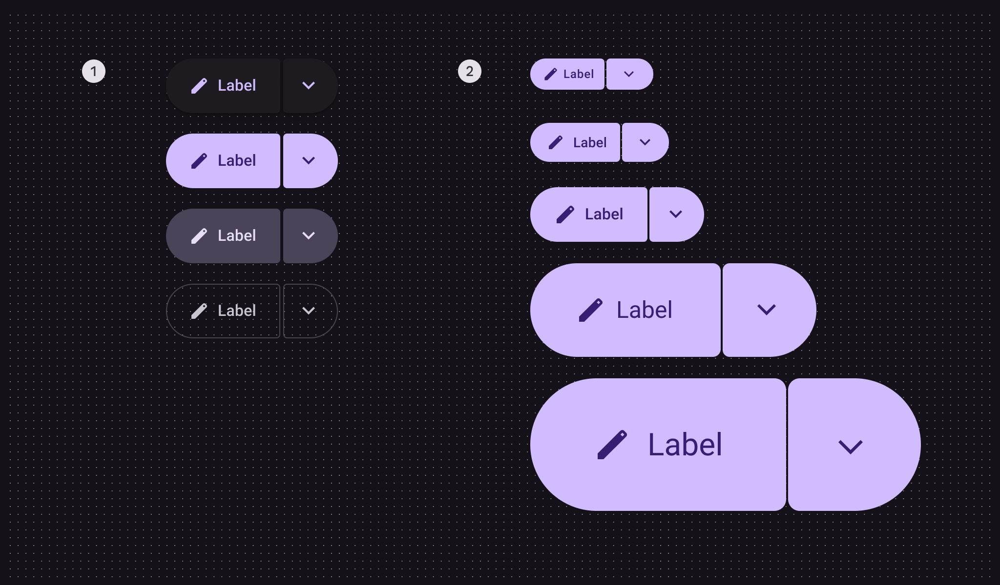
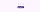
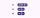
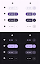
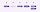
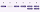
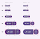
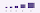

# Split buttons

> Split buttons open a menu to give people more options related to an action

## Variants

| Variant | M3 | M3 Expressive |
| --- | --- | --- |
| Split button | \-- | Available |

## Configurations

1.  Color configurations: Elevated, filled, tonal, outlined

2.  Size configurations: XS, S, M, L, XL

| Category | Configuration | M3 | M3 Expressive |
| --- | --- | --- | --- |
| Size | XS, S, M, L, XL | \-- | Available |
| Color | Elevated, filled, tonal, outlined | \-- | Available |

## Tokens & specs

Use the table's menu to select a token set. Split button token sets are organized by size. [Learn about design tokens](/m3/pages/design-tokens/overview/)

Close

## Anatomy

1.  Leading button

2.  Icon

3.  Label text

4.  Trailing button

The leading button in split buttons can have an icon, label text, or both. The trailing button should always have a menu icon.

1.  Label + icon

2.  Label

3.  Icon

## Color

Color values are implemented through design tokens Design tokens are the building blocks of all UI elements. The same tokens are used in designs, tools, and code. [More on tokens](/m3/pages/design-tokens/overview) . For designers, this means working with color values that correspond with tokens; in implementation, a color value will be a token that references a value.

Split buttons use the same color schemes as standard buttons Buttons let people take action and make choices with one tap. [More on buttons](/m3/pages/common-buttons/overview) . However, unlike toggle buttons, the split button color doesn’t change when selected—only a state layer is applied.

Split buttons use the same colors and state layers as buttons, shown in the following token module. [Go to buttons](/m3/pages/common-buttons/overview) for more details.

A: Unselected, B: Selected trailing icon

1.  Elevated

2.  Filled

3.  Tonal

4.  Outlined

Close

## States

States States show the interaction status of a component or UI element. [More on states](/m3/pages/interaction-states/overview) are visual representations used to communicate the status of a component or an interactive element. 

Split button states use the same colors and state layers as buttons Buttons let people take action and make choices with one tap. [More on buttons](/m3/pages/common-buttons/specs) and icon buttons Icon buttons help people take minor actions with one tap. [More on icon buttons](/m3/pages/icon-buttons/specs) . Go to those specs for details. 

### Leading button shape

The inner corners change shape for hovered, focused, and pressed states.

1.  Enabled

2.  Disabled

3.  Hovered

4.  Focused

5.  Pressed, pressed with focus

### Trailing button shape

The inner corners change shape for hovered, focused, and pressed states, and the icon becomes centered when selected.

1.  Enabled

2.  Disabled

3.  Hovered

4.  Focused

5.  Pressed, pressed with focus

6.  Selected, selected with focus

## Measurements

Text and icons are optically centered when the buttons are asymmetrical. They’re centered normally when symmetrical.

Menu icon offset when unselected:

1.  XS: -1dp from center
2.  S: -1dp from center
3.  M: -2dp from center
4.  L: -3dp from center
5.  XL: -6dp from center

The inner corner radius changes depending on button sizing. The space should always be 2dp.

1.  Extra small 4dp

2.  Small 4dp

3.  Medium 4dp

4.  Large 8dp

5.  Extra large 12dp
