# Style guide

> UI text should be understandable by anyone, anywhere

This style guide is specific to English-language UX writing. Google generally follows [Associated Press (AP) style](http://www.apstylebook.com).

### Skip periods and unnecessary punctuation

To help readers scan text, avoid using periods and other unnecessary punctuation. 

Avoid using periods to end single sentences, particularly in:

-   Labels

-   Tooltip text

-   Bulleted lists

-   Dialog body text

-   Hyperlinked text

Use periods on:

-   Multiple sentences

-   Long or complex sentences, if it suits the context

check Do

Omit punctuation on single-line sentences

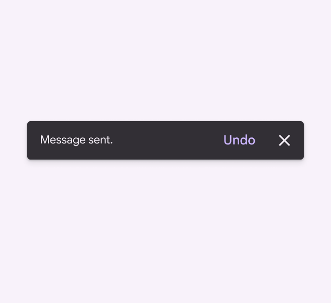

close Don’t

Avoid using periods to end single sentences

### Use contractions

Contractions can make a sentence easier to understand and scan.

However, sometimes "do not" can give more emphasis than "don't” when caution is needed.

check Do

Avoid spelling out words that can be contractions

close Don’t

Phrases that aren’t contracted can feel stiff or overly formal

### Use serial commas

Use the serial (or Oxford) comma, except before an ampersand.

Always place commas inside quotation marks.

check Do

Use a serial comma in lists of three or more items

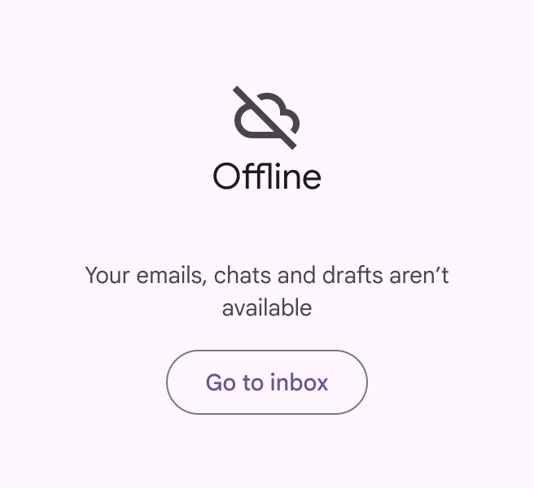

close Don’t

Don’t skip serial commas before “and”

### Use commas for numbers between 1,000 and 1 million

Use commas for numbers over 1,000. Don’t use commas when identifying something, such as a:

-   Street address
-   Radio frequency
-   Year

For numbers over 1 million, comma use depends on context. “Million” can be abbreviated with with “M” and the value can be rounded when the intent is to give people a sense of the volume, rather than the exact numbers.

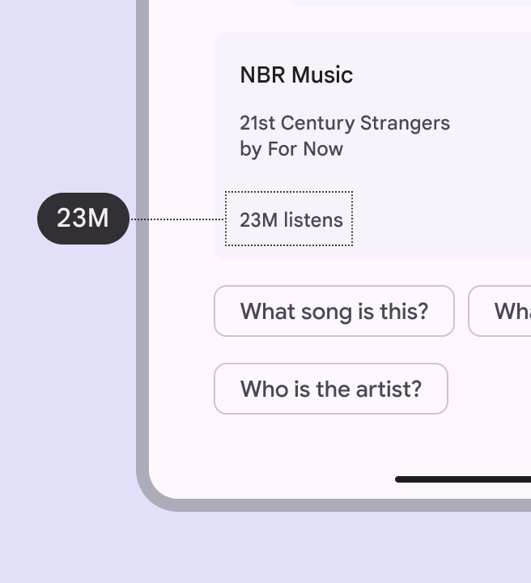

check Do

Abbreviate “million” with “M” and don’t use commas when giving people a sense of volume

check Do

Use commas in numbers between 1,000 and 1 million

### Skip colons in headings

For headings on lists of items, do not use colons. For lists within body text, use a colon.

Use colons for lists within body text

### Use exclamation points sparingly

Exclamation points can come across as shouting or overly friendly. Some exceptions include greetings or congratulatory messages.

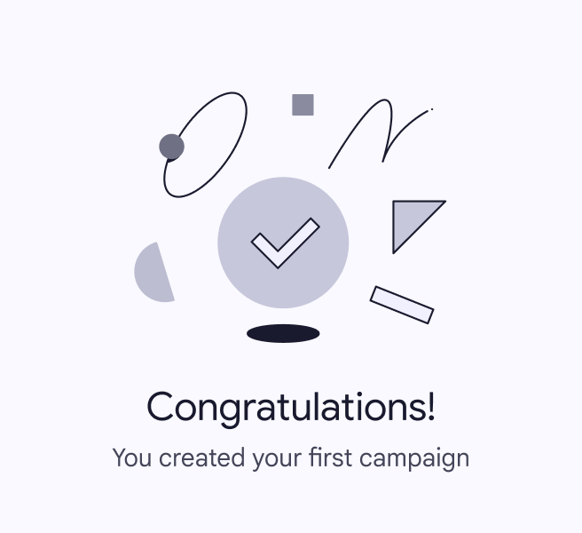

check Do

Exclamation marks can be used to emphasize celebratory moments

close Don’t

Avoid using exclamation marks for empty states and common tasks. Save it for bigger accomplishments.

### Use ellipses sparingly

Use ellipses to indicate an action in progress or incomplete text. Truncated text may appear with ellipses, but check with your engineering partners before implementing, as this often happens automatically.

Don’t add a space before ellipses. Omit ellipses from menu items or buttons that open a dialog or start a process.

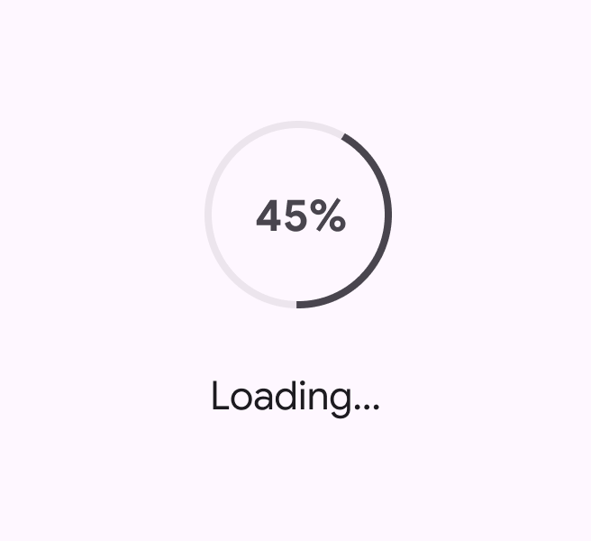

check Do

Ellipses show an action in progress

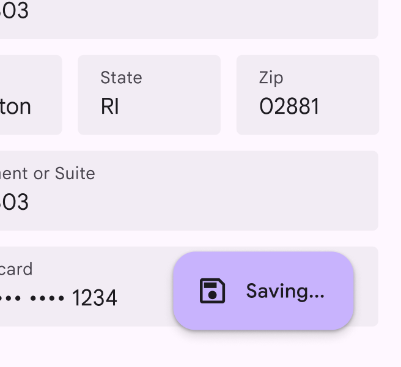

close Don’t

Don’t use ellipses in buttons or menu items

### Use parentheses to define terms

Parentheses can be used to define acronyms or jargon or when referencing a source. They shouldn’t be used when adding a side note or an afterthought of a sentence.

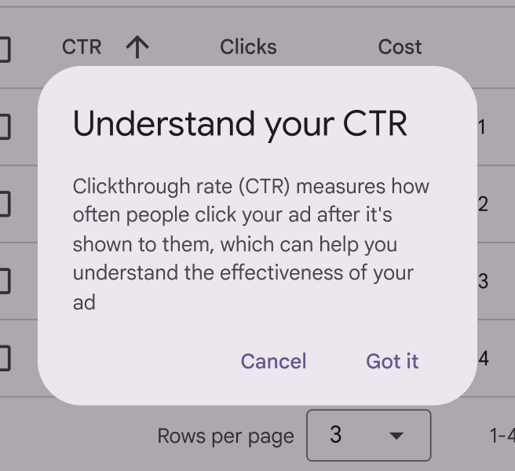

check Do

Use parentheses to define terms and jargon

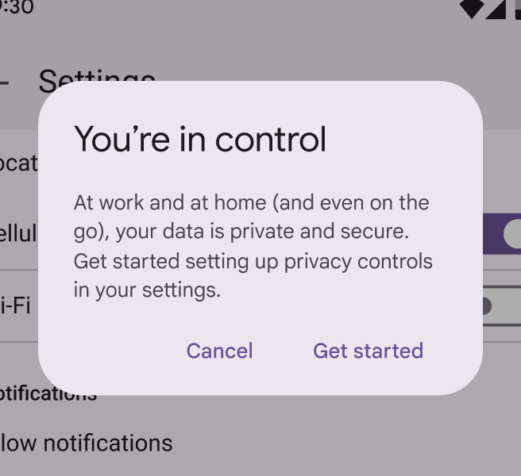

close Don’t

Don’t use parentheses to add extra thoughts. If information is needed, include it in the sentence without parentheses for easier scanning and improved comprehension.

### Skip ampersands in body text

The “&” symbol can be used instead of “and” in headlines, column headers, table headers, navigation labels, and buttons. However, when there’s room, spelling out “and” can improve readability and make scanning easier.

“And” should be spelled out in sentences and paragraphs, before the final item in a 3+ item list, and in email subject lines.

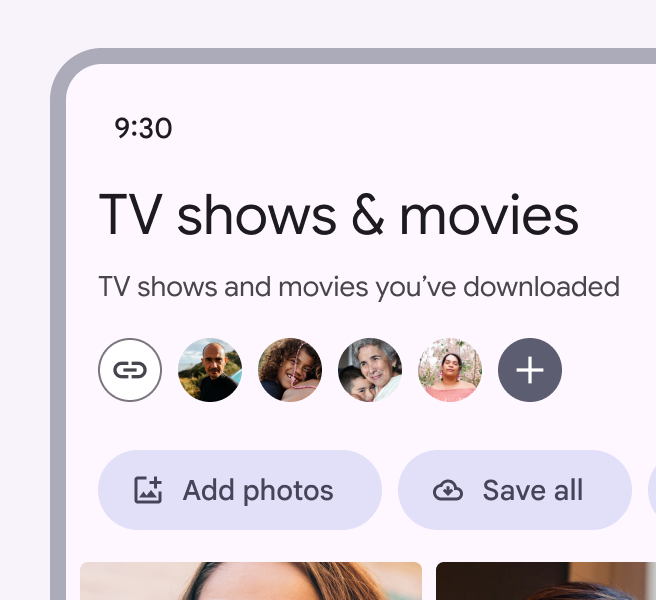

exclamation Caution

Ampersands can be used in headlines where there's limited space

close Don’t

Avoid ampersands in email subject lines

### Use dashes with caution

Dashes and hyphens can interrupt a sentence and lead to a fragmented experience, so they should be used with caution. There are three kinds of dashes:

-   Em dash: —

-   En dash: –

-   Hyphen: -

Em dashes are best avoided in UX writing, as they indicate a break in the flow of a sentence that could be simplified using a comma, period, or new sentence. 

Use an en dash without spaces to indicate a range, such as 9 AM–Noon.

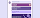

Use an en dash without spaces for ranges

### Use hyphens with care

Hyphens can help readers better understand how words relate to each other by binding closely related words. They can also be used to represent negative numbers, such as -100. Spaces should never be used surrounding hyphens.

Refer to the [Associated Press (AP) style guidelines](http://www.apstylebook.com) if you are unsure whether an adjective or noun phrase needs a hyphen.

| **Rule** | **Examples** | **Why** |
| --- | --- | --- |
| **Hyphenate adjective phrases** | Case-by-case basis Best-in-class performance Once-in-a-lifetime opportunity | When multiple words are used together as an adjective, they should be hyphenated  |
| Cell phone number Chocolate chip cookie | However, proper nouns and common, easily understood adjective phrases don't need to be, such as "cell phone number" or "chocolate chip cookie" |
| **Hyphenate noun phrases** A noun phrase is two or more words acting as a noun. These phrases are hyphenated in certain cases: | Sign-off Drive-through Go-ahead | Hyphenate a noun phrase if it contains a verb followed by an adverb |
| Higher-up Most-read | Hyphenate an adjective phrase that is functioning as a noun |
| Jack-of-all-trades Stick-in-the-mud | Some noun phrases, especially long or complicated ones, are always hyphenated |
| **Don't hyphenate verb phrases** A verb phrase is two or more words acting as a verb. These should not be hyphenated. | Look out for falling rocksPlease drive in and drop off your carCheck in to the room when you arrive | Don't hyphenate a verb followed by an adverb or preposition if it's functioning as a verb phrase. For example, "check in" would not need a hyphen when used as a verb, such as "check in to the room," rather than as a noun, like "the next check-in." Also, note that since "in" is a part of the verb, it can't be combined with "to" to form "into," since check into doesn't mean the same as check in to. |

### Use italics sparingly

Italics typically aren't easy to read. When emphasizing text, use bold weight instead.



However, italics can provide unique emphasis when applied to a single word or phrase, like a name or title.

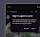

check Do

Italicize a word or phrase

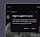

close Don’t

Don’t italicize a sentence

### Don’t use caps blocks 

Avoid using caps blocks altogether; they're not accessible.

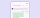

close Don’t

Don't use caps block. Use sentence case for all product text.
