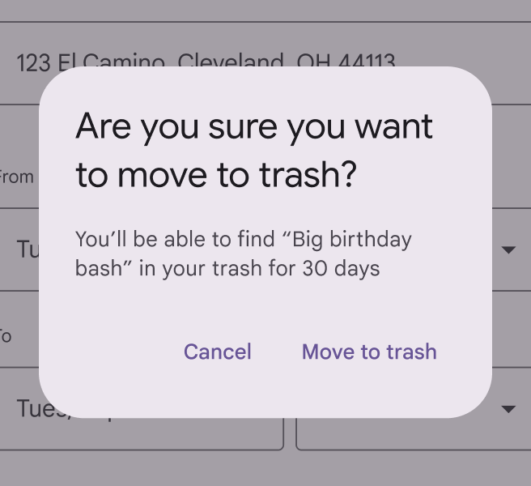
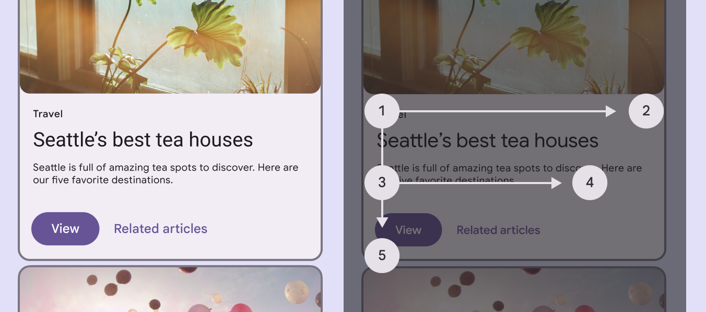
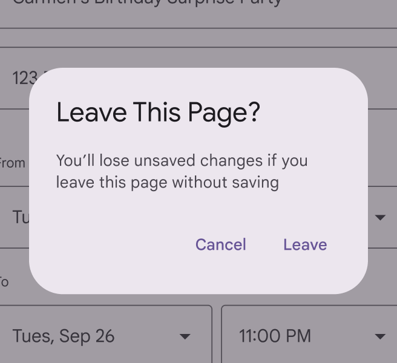
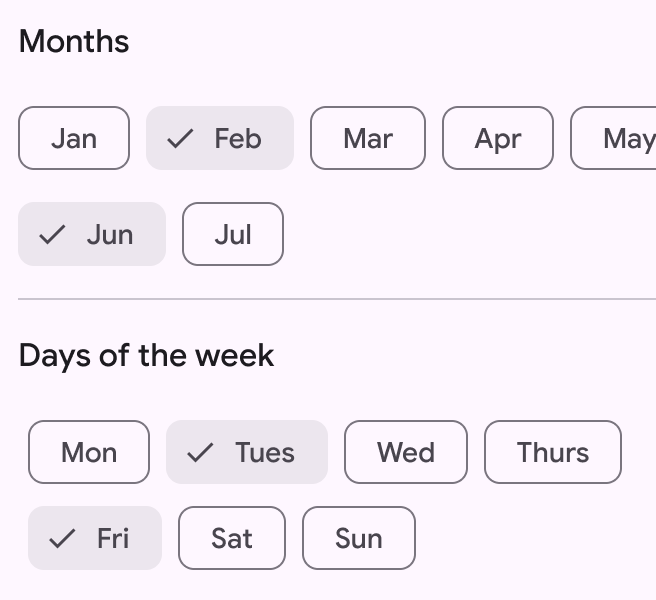

# Style guide

> UI text should be understandable by anyone, anywhere

### Explain consequences

Emphasize the results of the user’s potential action in neutral, direct language. Avoid cautions or warnings that might sound alarming, intimidating, or condescending. Focus instead on communicating the consequences of a function.

check Do

Tell users what will happen if they take an action and how they can undo it

close Don’t

Don’t misrepresent consequences or try to influence a user’s decision

### Use scannable words and formats

People scan UI text in search of the most meaningful content to them. Help by using specific titles and headings that clearly describe a topic. When users are skimming or hurrying through an action, this organization helps them avoid mistakes and unintentional actions.

Use headings and subheads to prioritize and group information

### Use sentence case

Unless otherwise specified, use sentence-style capitalization, where only the first letter of the first word in a sentence or phrase is capitalized. All text, including titles, headings, labels, menu items, navigation components, app bars, and buttons should use sentence-style capitalization.

Products and branded terms may also be capitalized.

check Do

Capitalize the first word of a sentence or phrase

close Don’t

Don’t use title case capitalization. Instead, use sentence case.

### Use abbreviations sparingly

Spell out words whenever possible. Shortened forms of words can be difficult for people to understand and screen readers to read. Avoid Latin abbreviations in UI text such as e.g. or etc. Instead, use full phrases like "for example," or "and more."

check Do

When an abbreviation is appropriate, make sure it’s formatted and spelled correctly to avoid confusion

close Don’t

Avoid using abbreviations when there’s space to spell out a word
