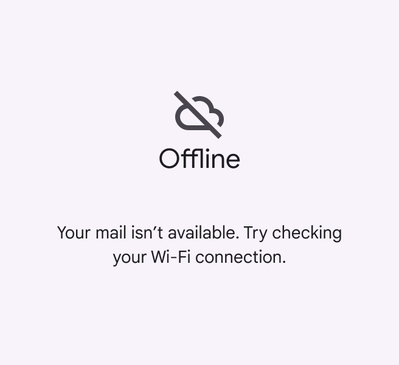
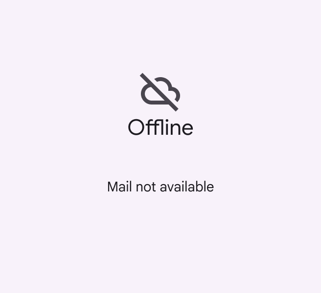
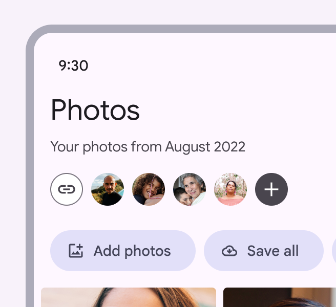
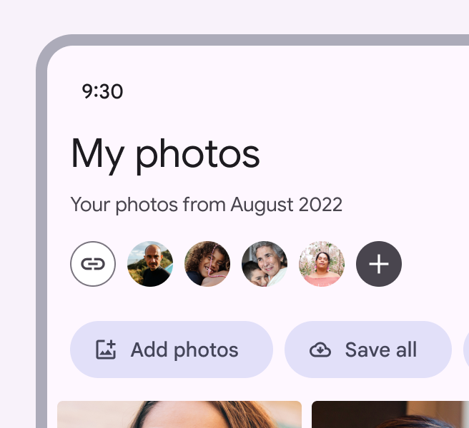
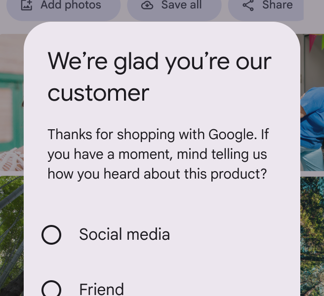
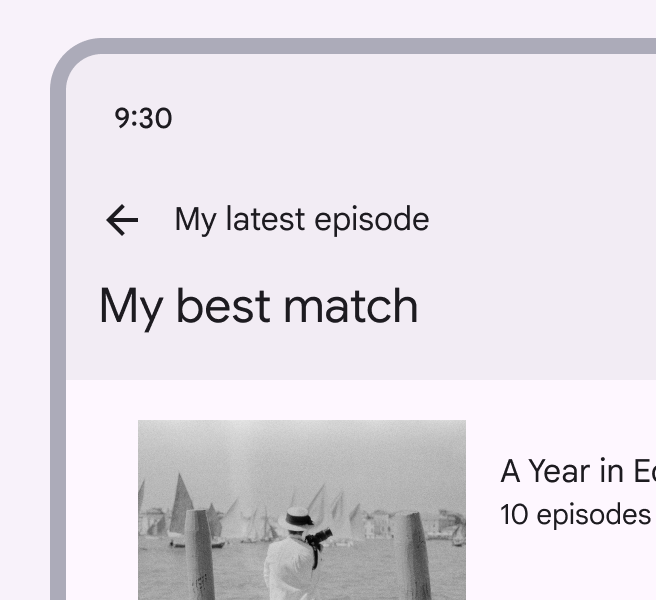
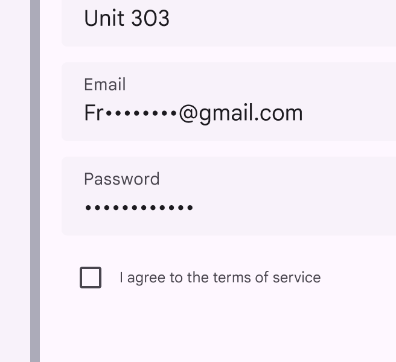
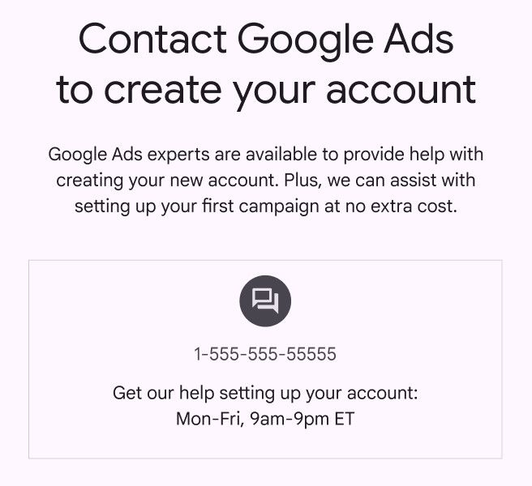

# Style guide

> UI text should be understandable by anyone, anywhere

## Pronouns

### Use second person pronouns ("you")

Use the second-person pronouns “you” and “your” to help the user to feel like the UI is talking to them and referring to their actions

check Do

Write from the user’s point of view to help them take action

close Don’t

Avoid writing that sounds impersonal and robotic

### Don’t combine first and second person

Avoid mixing "me" or "my" with "you" or "your.” It can cause confusion to see both forms of address in the same context.

check Do

Write from a user’s point of view by emphasizing their perspective with “you” and “your”

close Don’t

Don’t mix different forms of address in the same screen. Instead, use “you” and “your” or get rid of the pronoun.

### Use caution with “I” and “we”

When written on behalf of a large, global company like Google, “we” or “I” may come across as robotic or disconcerting. 

Focus on the user’s point of view, rather than Google’s, and consider if it’s possible to rewrite a phrase without “we.”

close Don’t

Don’t use first person pronouns to speak for the voice of Google

close Don’t

Avoid using first person pronouns. Write from the user’s point of view by using second person pronouns or removing pronouns altogether.

Some legal texts may merit an exception: “I” or “my” (the first person) emphasizes ownership in agreements or acknowledgments. For example, “I agree to the terms of service.”

check Do

First person pronouns can help users understand when they’re making impactful decisions

exclamation Caution

Use caution with “we” or “our.” Even when these pronouns represent real people employed by Google, seeing first person pronouns in UI text can be confusing or jarring.
