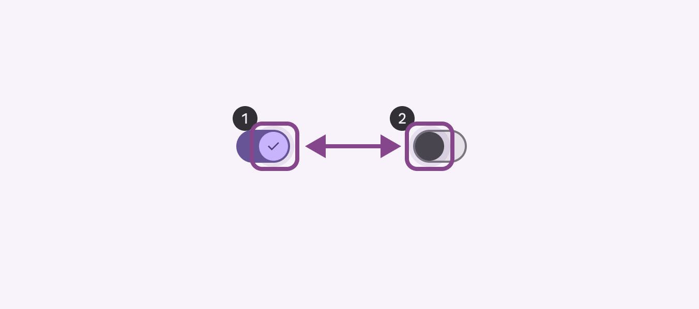
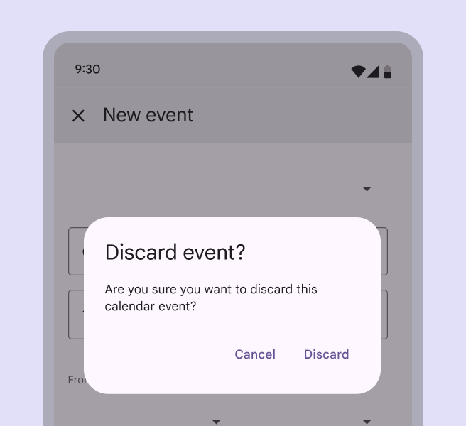
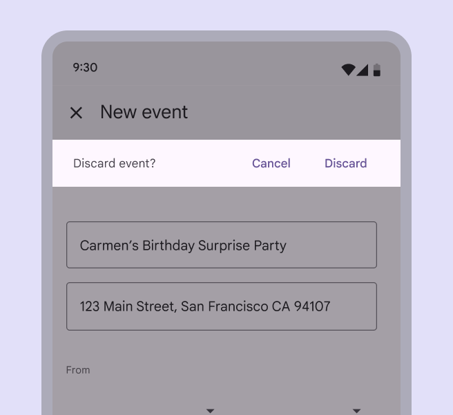

# Designing

> Implement intuitive, accessible layouts, considering structure, color, and flow

Designing and implementing accessible product experiences involve a range of considerations. The framework Material uses draws on WCAG standards and industry best practices.

The three stages described in these tabs help **translate a visual UI into a text-based, linear user experience that maps to code**. Color and contrast also support accessible navigation.

### Accessibility markup

Accessibility markup is an integral part of creating documentation for design specs. 

> 1\. Switch in the on state with visible focus 

> 2\. Switch in the off state with visible focus

### Implementing accessibility

By using standard platform controls and semantic HTML (on the web), apps automatically contain the markup and code needed to work well with a platform’s assistive technology. Meeting each platform's accessibility standards and supporting its assistive technology (including shortcuts and structure) gives users an efficient experience.

check Do

Use native elements, such as the standard platform dialog

close Don’t Be wary of using non-standard elements, such as a non-standard platform dialog to perform a standard dialog task. It requires extra testing to work well with assistive technology.
