# States

> States show the interaction status of a component or UI element

## Enabled

An enabled state communicates an interactive component or element. Enabled states use the default styling for each interactive component.

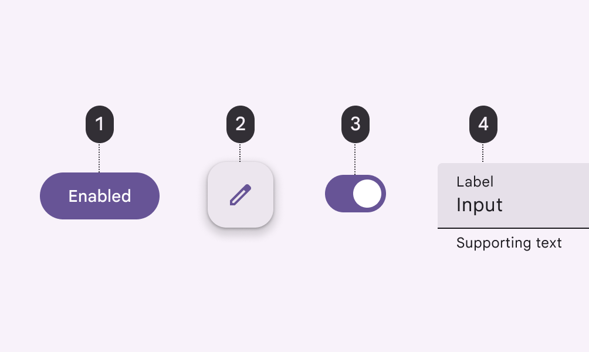

Enabled states for:

1.  Button
2.  FAB
3.  Switch
4.  Text field

## Disabled

A disabled state communicates when a component or element isn’t interactive. This state is visually communicated through color changes and reduced elevation.

**Disabled states don't need to meet Material's contrast requirements.**

Disabled button

Disabled states **are** inherited by action, selection, and input components:

-   Buttons
-   Cards
-   Checkboxes
-   Chips
-   List items
-   Radio buttons
-   Switches
-   Text fields

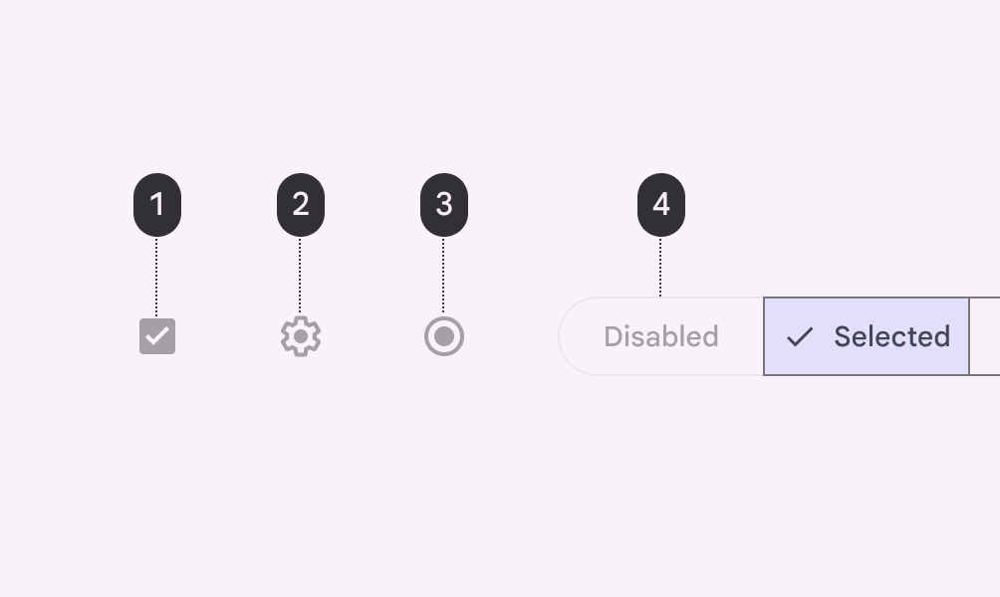

Disabled states for:

1.  Checkbox
2.  Icon button
3.  Radio button
4.  Segmented button

Disabled states **aren't** inherited by communication, containment, navigation, and some actions components: 

-   App bars
-   Badges
-   Dialogs
-   Floating action buttons (FABs)
-   Menus
-   Navigation bar, drawer, and rail
-   Sheets
-   Tabs
-   Tooltips

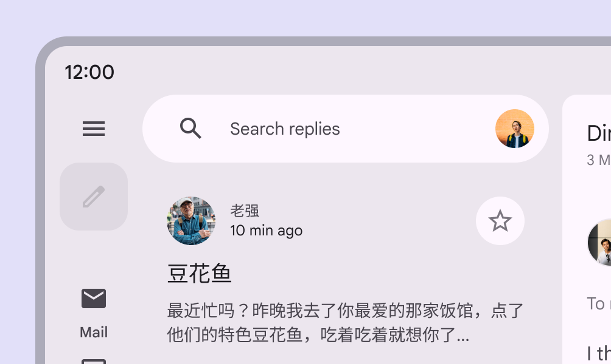

close Don’t

If the action represented in the FAB is unavailable, the FAB shouldn't appear

### Behavior

Disabled components can’t be focused, dragged, or pressed, and they don’t change state when tapped or hovered over.

A disabled button doesn’t inherit hover or other state layers

There can be any number of disabled states in a layout.

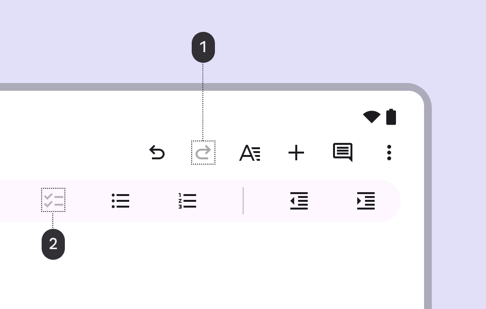

1.  Disabled redo icon button
2.  Disabled checklist icon button

## Hover

Hover states are initiated by the user pausing over an interactive element using a cursor.

The lower-emphasis surface overlay for hover states can be applied to the entire component, elements within a component, or as a circular shape over part of the component.

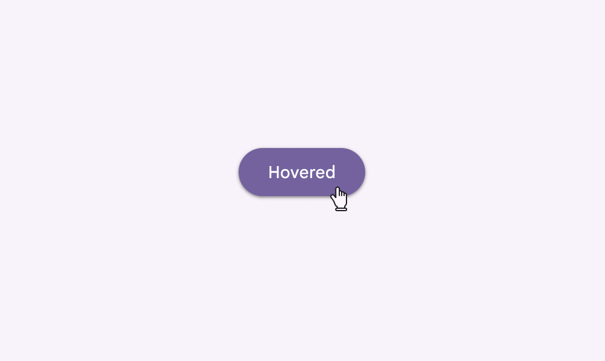

Hovered button

Hover states **are** inherited by action, selection, and input components:

-   Buttons
-   Cards
-   Checkbox
-   Chips
-   Date and time pickers
-   List items
-   Slider
-   Switch
-   Text fields

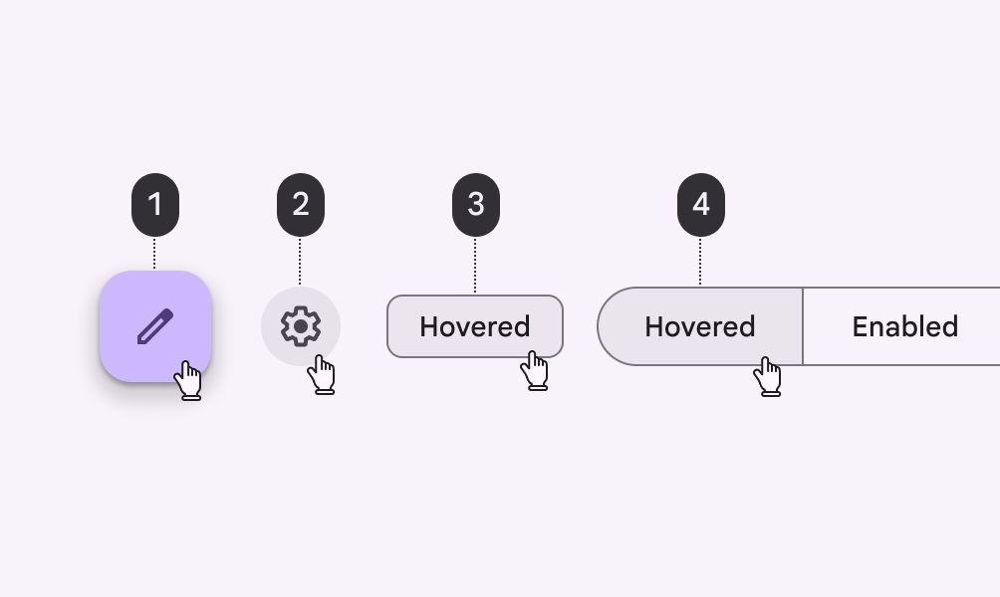

Hovered states for:

1.  FAB
2.  Icon button
3.  Chip
4.  Segmented buttons

Hover states **aren’t** inherited by communication, containment, or navigation components: 

-   App bars
-   Badges
-   Dialogs
-   Menus
-   Navigation bar, drawer, and rail
-   Sheets
-   Tabs

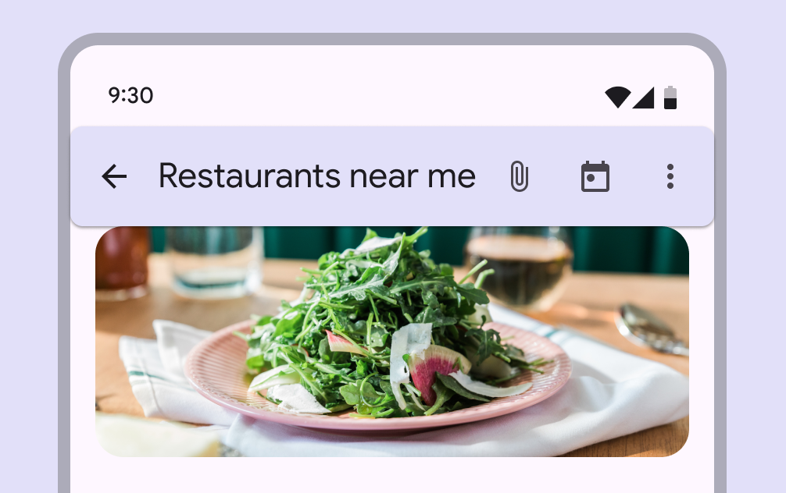

close Don’t

The individual components that are actionable within the app bar inherit hover states, not the whole app bar

### Behavior

Hover states are initiated by the user pausing over an interactive element using a cursor.

Hover states appear and disappear using a low-emphasis animated fade

Hover states can be combined with focused, activated, selected, or pressed states.

A selected filter chip in both selected and hover states

There can only be one hover state at a time in a layout.

Hover state can only be on one element at a time based on cursor position

## Focused

A focused state communicates when a user has highlighted an element using a keyboard or voice. Focus states apply to all interactive components.

The higher-emphasis surface overlay for focused states can be applied to the entire component, elements within a component, or as a circular shape over part of the component.

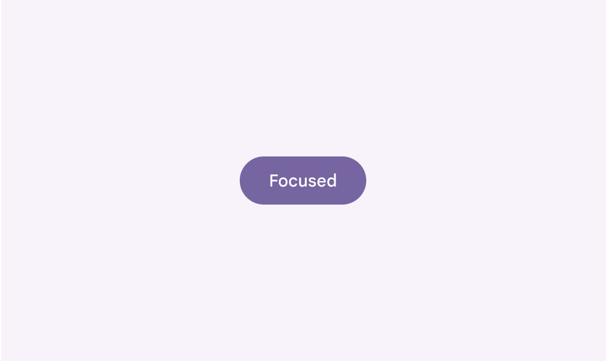

Focused button

Focus states **are** inherited by action, selection, and input components:

-   Buttons
-   Cards
-   Checkbox
-   Chips
-   Date and time pickers
-   List items
-   Selection controls
-   Text fields

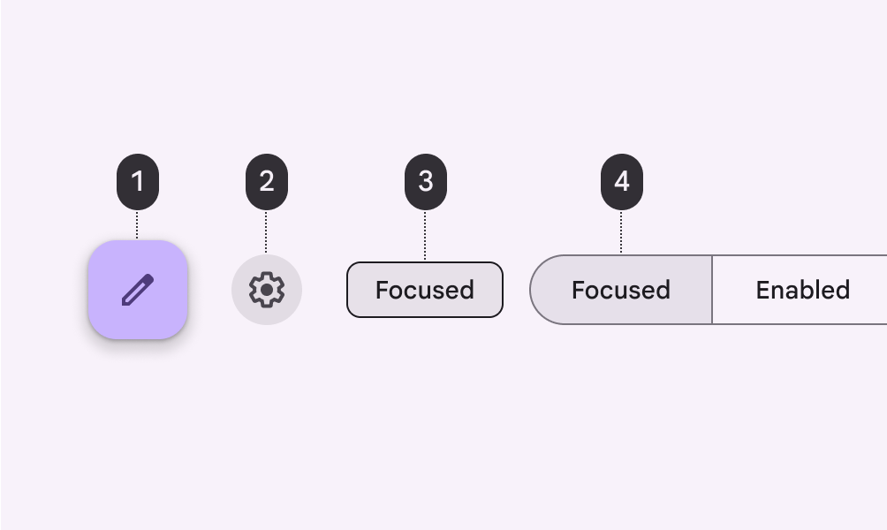

Focused states for:

1.  FAB
2.  Icon button
3.  Chip
4.  Segmented buttons

Focus states **aren’t** inherited by most communication, containment, or navigation components:

-   App bars
-   Badges
-   Banner
-   Card
-   Dialogs
-   Navigation bar, drawer, and rail
-   Sheets

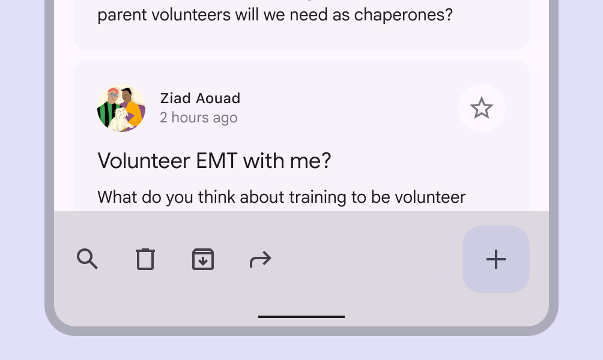

close Don’t

The individual components that are actionable within the app bar inherit focus states, not the whole app bar

### Keyboard focus indicator

Many people use the **Tab** key or other shortcut to navigate the interactive elements of a web page, like links, buttons, and chips.

When an element is tabbed to, it appears in its focused state with a ring-like **keyboard focus indicator**. This indicator helps web users know where they are on the page.

While focused, an element can be acted on with the keyboard.

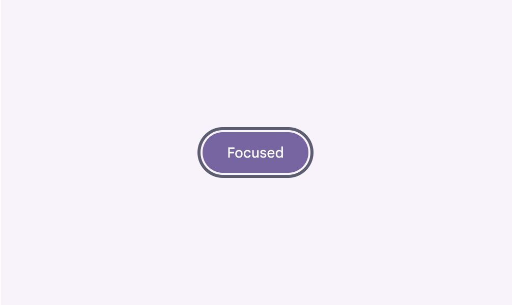

Keyboard focus indicator for a filled button

### Behavior

Focus states are initiated by the user by pressing the **Tab** key on the keyboard (or equivalent).

Focus states can be represented in combination with hover, activated, or selected states.

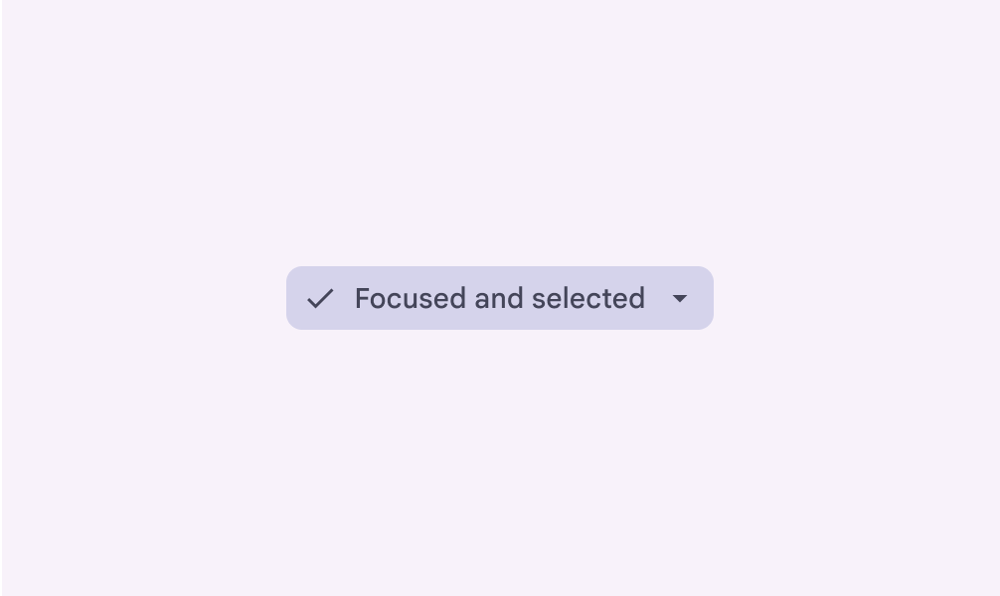

A selected filter chip in both selected and focused states

There can only be one focus state at a time in a layout.

A focus state applied to one card at a time

## Pressed

A pressed state communicates a user-initiated tap or click via cursor, keyboard, or voice input. This state applies to all interactive components.

Pressed states trigger a change in composition and should be high-emphasis.

A ripple overlay signifies a pressed state. It can be applied to an entire component or elements within a component, or as a circular shape over part of the component.

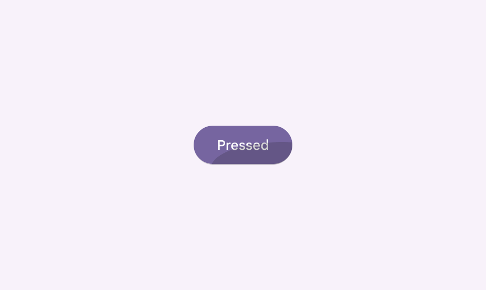

Pressed button

Some components, such as buttons or cards, can inherit elevation to signify a pressed state.

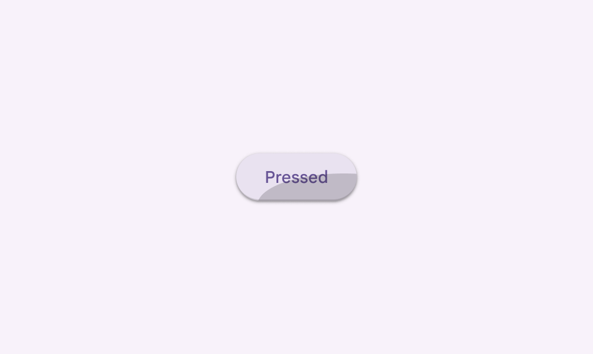

Pressed button with elevation

Pressed states **are** inherited by action, selection, and some containment components: 

-   Buttons
-   Cards
-   Checkbox
-   Chips
-   List items
-   Text fields

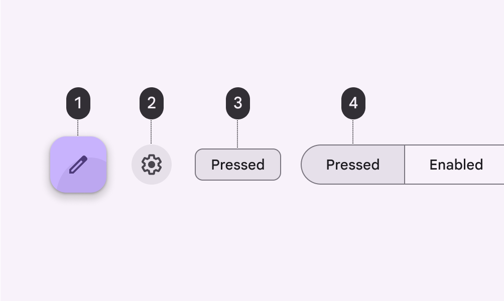

Pressed states for:

1.  FAB
2.  Icon button
3.  Chip
4.  Segmented button

Pressed states **aren’t** inherited by communication, navigation, or some containment components: 

-   App bars
-   Badges
-   Bottom navigation
-   Dialogs
-   Menus
-   Sheets
-   Tabs

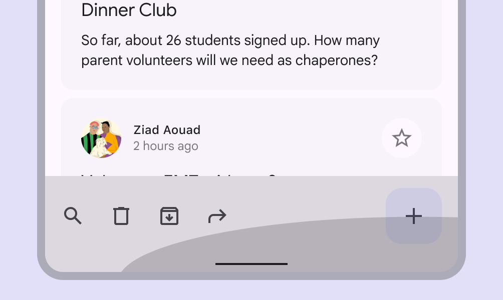

close Don’t

The individual components that are actionable within the app bar inherit pressed states, not the whole app bar

### Behavior

Pressed states are initiated by user keyboard or voice input on an interactive element.

Activated states appear in user-initiated order

Pressed states can be combined with hovered, focused, activated, or selected states.

Activated states can be represented in combination with hover and focus

There may only be a single pressed state at a time in a layout.

A pressed state applied to one card at a time

## Dragged

A dragged state occurs when a user presses and moves an element or component. Dragged states should be low emphasis, to avoid distracting users from their task.

Dragged states use a lower emphasis overlay. It can be applied to the entire component or to elements within a component.

Some components, such as list items, chips, or cards, can inherit elevation to signify a dragged state.

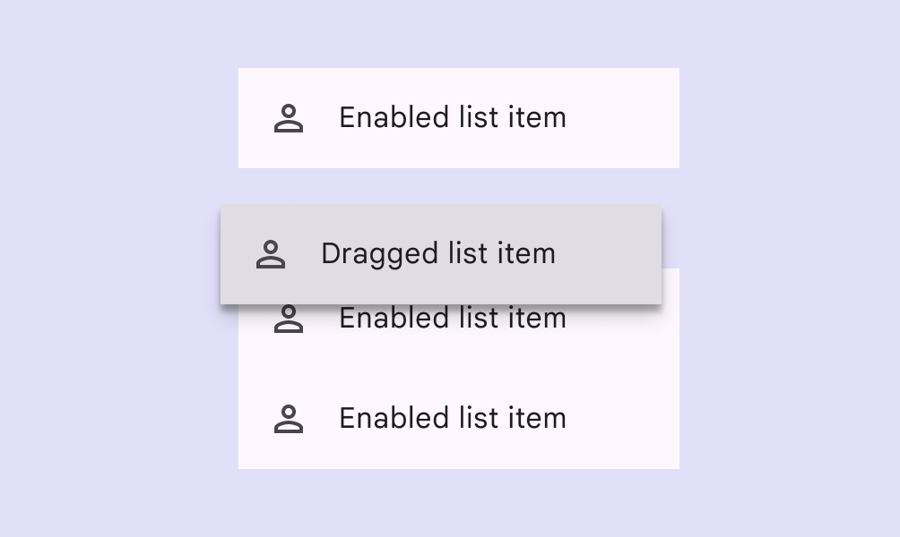

Dragged list item

Dragged states **are** inherited by some containment and selection components: 

-   Cards
-   Chips
-   List items
-   Sliders

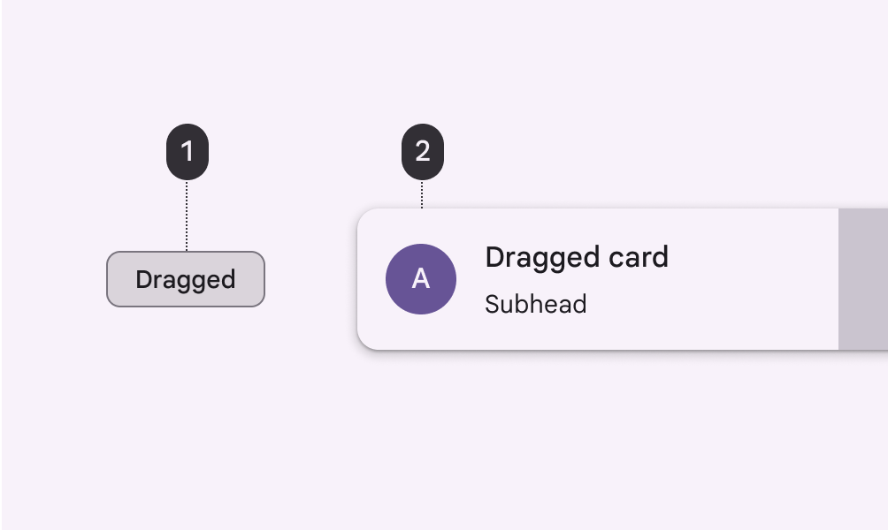

Dragged states for:

1.  Chip
2.  Card

Dragged states **aren’t** inherited by action, communication, navigation, or some containment components: 

-   App bars
-   Badges
-   Buttons
-   Dialogs
-   Menus
-   Navigation bar, drawer, and rail

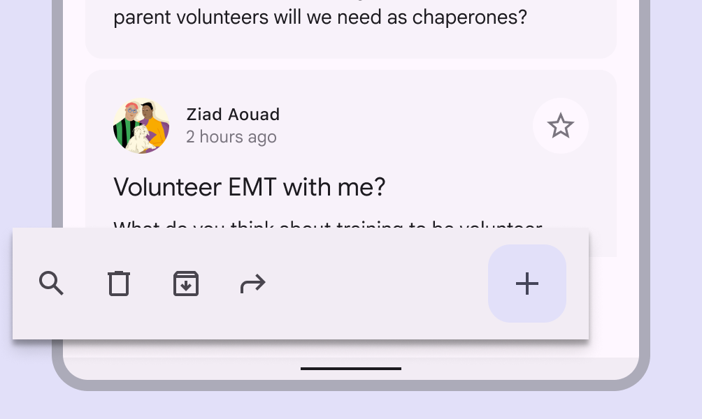

close Don’t

Components like an app bar that require consistent placement should not inherit dragged states

### Behavior

Dragged states are initiated when users touch and hold elements, using an input method such as a tap or click.

A list item in a dragged state

There may only be a single dragged state at a time within a layout.

Dragged state applied to one card at a time
