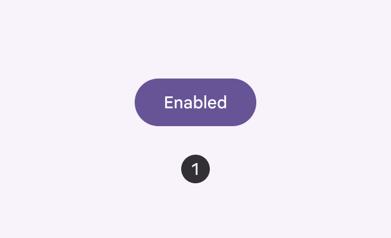
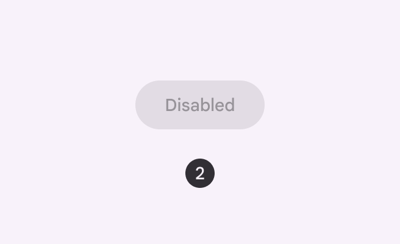
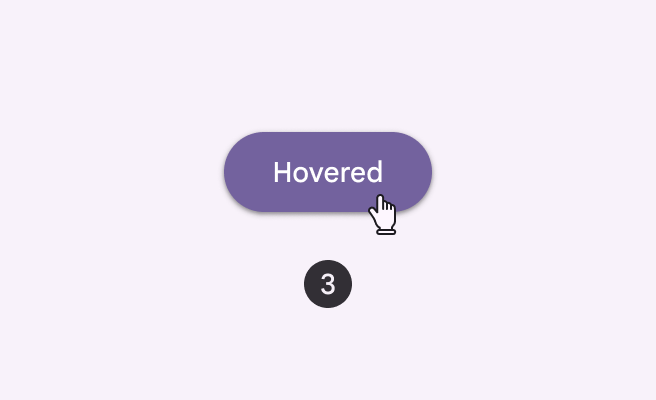
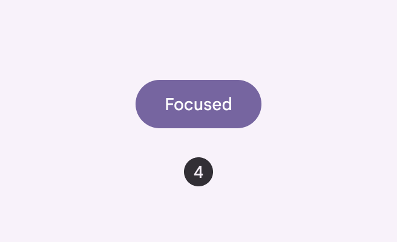
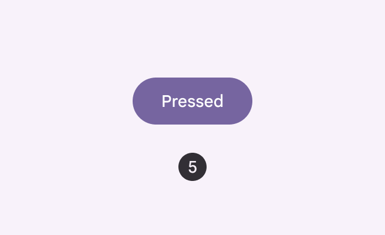
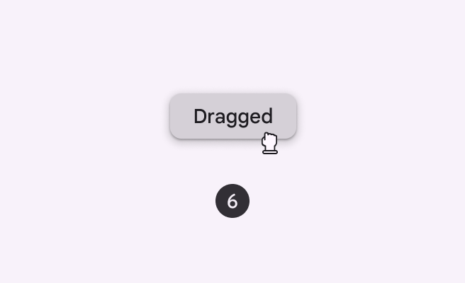

# States

> States show the interaction status of a component or UI element

-   States have two visual indicators to ensure accessibility
-   States can be combined, such as selection and hover
-   Apply states consistently across components

## Resources

| Type | Link | Status |
| --- | --- | --- |
| Design | [Design Kit](http://goo.gle/m3-design-kit) | Available |

1\. [Enabled
](/m3/pages/interaction-states/applying-states#39b2fc90-01db-41b5-b6f8-47be61ed1479)An enabled state communicates an interactive component or element.

2\. [Disabled](/m3/pages/interaction-states/applying-states#4aff9c51-d20f-4580-a510-862d2e25e931)
A disabled state communicates an inoperable component or element.

Enabled button

Disabled button

3\. [Hover](/m3/pages/interaction-states/applying-states#71c347c2-dd75-485b-892e-04d2900bd844)
A hover state communicates when a user has placed a cursor above an interactive element.

4\. [Focused](/m3/pages/interaction-states/applying-states#bc6d6853-48ef-490e-8076-448e89e69f0f)
A focused state communicates when a user has highlighted an element, using an input method such as a keyboard or voice.

Hovered button

Focused button

5\. [Pressed](/m3/pages/interaction-states/applying-states#c3690714-b741-492d-97b0-5fc1960e43e6)
A pressed state communicates a user tap.

6\. [Dragged](/m3/pages/interaction-states/applying-states#c97582c4-5fef-42ce-9c34-71f8dcc5b8ad)
A dragged state communicates when a user presses and moves an element.

Pressed button

Dragged chip
