# Bidirectionality & RTL

> Design products that adapt to languages that read right-to-left (RTL)

[Over 2 billion people](https://www.w3.org/International/questions/qa-scripts.en.html) read and write in right-to-left (RTL) languages like Arabic, Hebrew, Farsi, and Urdu. Layouts should support both left-to-right (LTR) and RTL languages through mirroring and other best practices to ensure content is easy for global audiences to understand and navigate. Consider the holistic experience including [global writing](/m3/pages/global-writing/overview), localizing voice and [design principles for culturally appropriate icons](/m3/pages/icons/designing-icons#5f0e344b-17f8-4b91-b0e4-45671b9900f4).

Material's components are built to support RTL, such as naming elements and tokens as "leading" and "trailing." However, extra configuration may be needed to achieve specific RTL situations.

## Mirroring

When a layout is changed from LTR to RTL (or vice-versa), or flipped horizontally, it’s often called mirroring. UI elements and text that typically appear on the left in LTR aligns to the right. Reading flow starts from the top right corner, instead of the top left.

Not all elements mirror with RTL languages. For example, graphs and charts maintain a LTR directionality for Persian and Urdu.

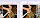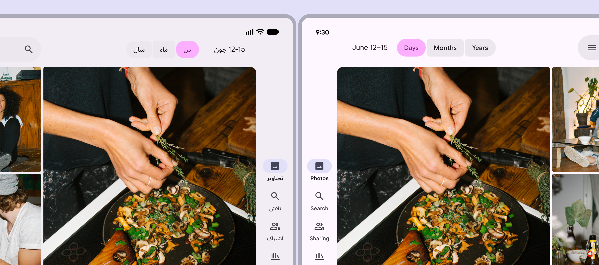

A mirrored layout in an RTL language reverses the alignment and ordering of elements

## Text rendering

Correct text rendering is foundational for a great user experience, and it’s critical for readability and usability. Text rendering has two parts:

1.  Alignment: How the edges of the text box are placed alongside other elements

2.  Directionality: How text and other elements flow within a text box, like left-to-right or right-to-left

In RTL languages, text is usually right-aligned, and elements flow from right-to-left.

Common issues with RTL language rendering are text entry, cursor position, punctuation, phone numbers, and URLs.

Improperly rendering text in RTL languages can create cognitive overload and negatively impact user sentiment and trust.

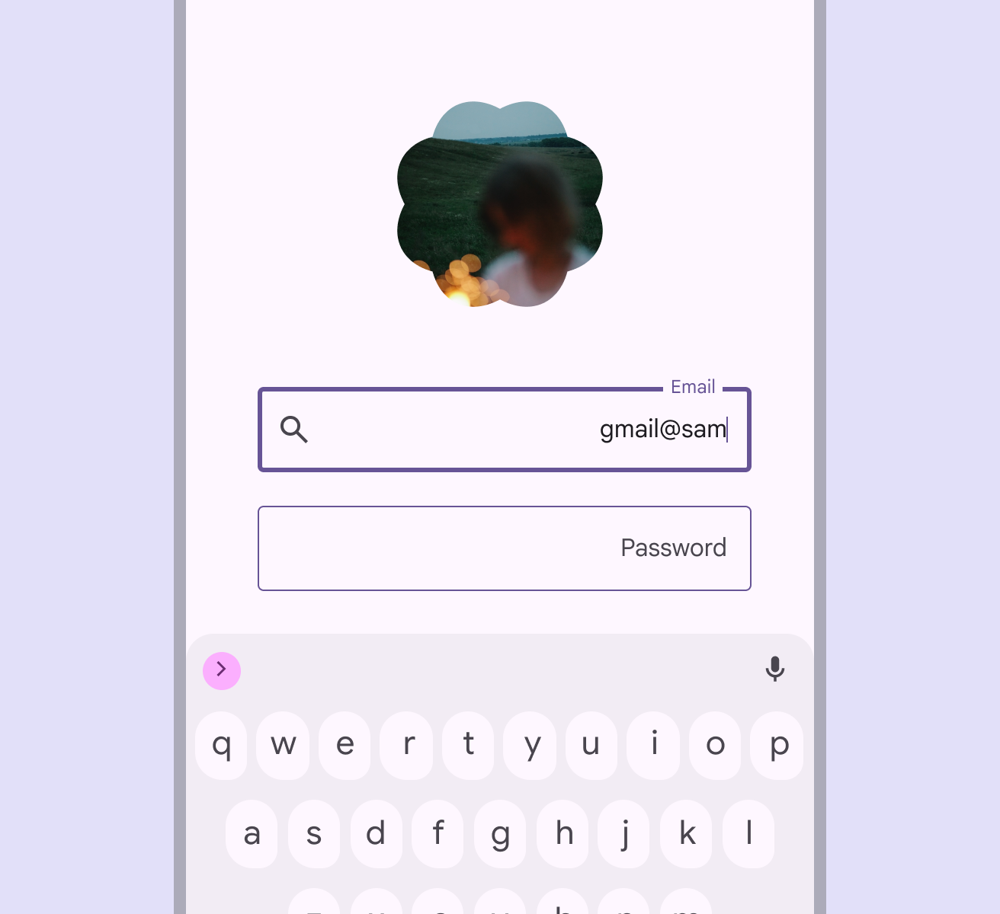

close Don’t

Don't reverse the order of the email username and domain (@google.com). The domain should always be to the right of the username. Usernames can still be written RTL, with the cursor moving to the left.

Note: This example isn’t translated to illustrate a common issue with text rendering.

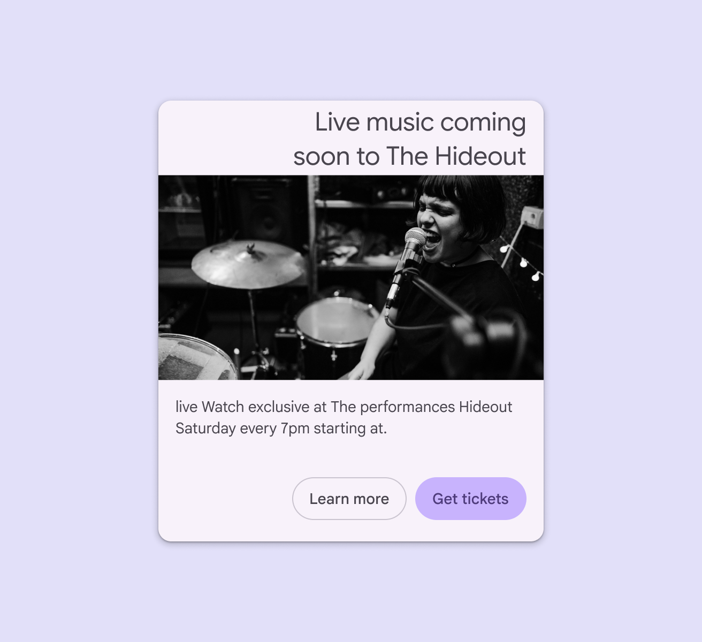

close Don’t

Don’t apply LTR directionality to RTL content, because it may scramble word order. To ensure readability across all languages, the content should have both RTL alignment and directionality.

Note: This example isn’t translated to illustrate a common issue with text rendering.

## Icons & symbols

In RTL languages, directional UI icons, like back and forward, should be mirrored. However, in Hebrew, timelines and media controls on a page should retain left-to-right directionality.

The meaning of icons and symbols can vary significantly across cultures. For additional guidance, refer to [design principles for icons](/m3/pages/icons/designing-icons#5f0e344b-17f8-4b91-b0e4-45671b9900f4).

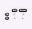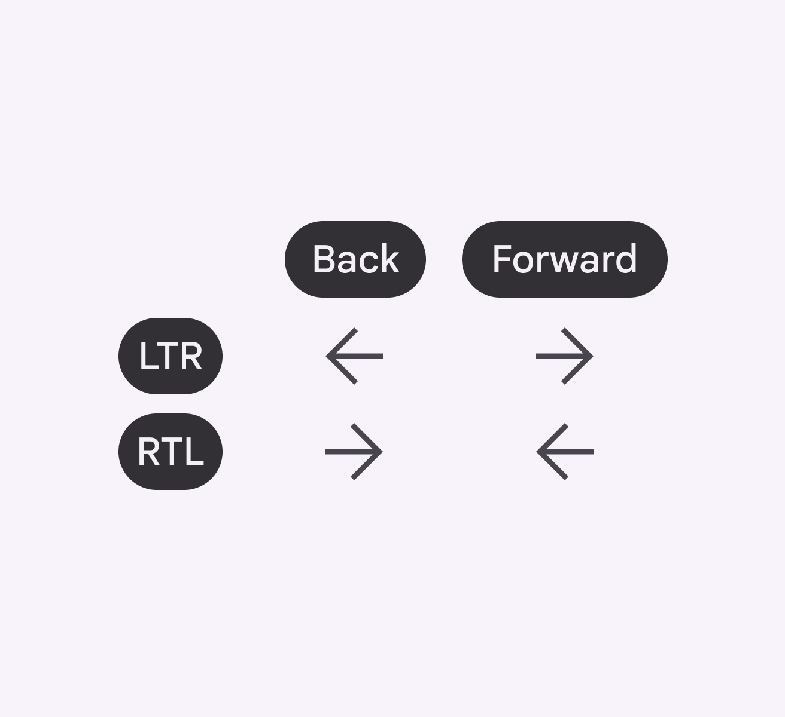

Back and foward icons are mirrored in RTL

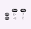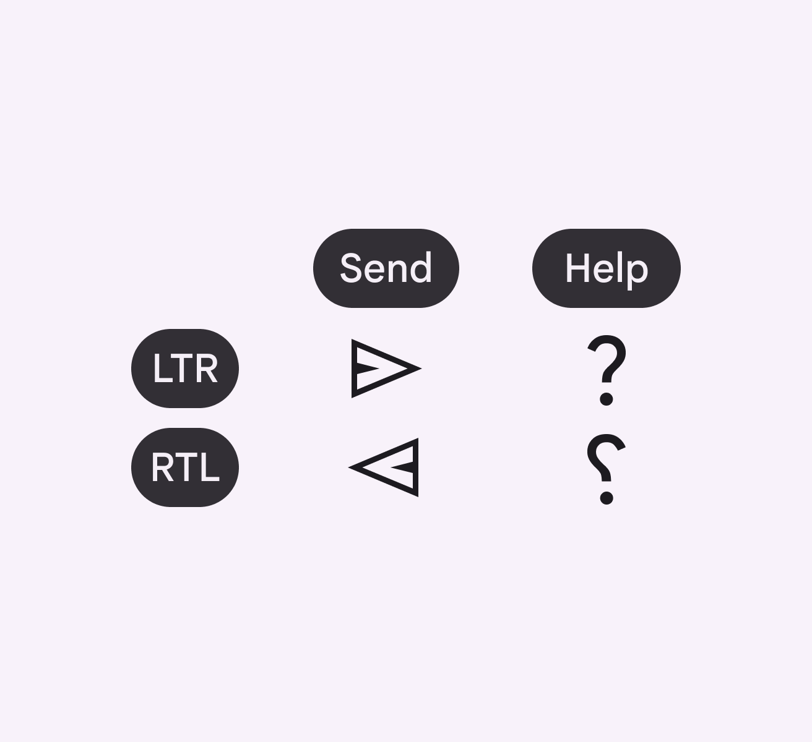

Send buttons are mirrored in RTL. Help icons are mirrored in some RTL languages, like Urdu and Persian.

## Time

Linear representations of time are often mirrored in RTL language experiences.

Linear progress indicators should move from right to left for most RTL languages, except Hebrew where it should remain LTR.

Circular representations of time remain the same.

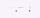

1.  RTL linear progress indicator starts to fill progress from the right 

2.  Circular progress indicators move clockwise

### Media players

Media controls for video or audio players are always LTR.

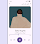

In Urdu, controls and progress for media and a podcast title are shown in LTR, while all other content is RTL

### Clocks

For RTL languages, the directionality of time remains LTR, and clocks still turn clockwise. However, the AM/PM symbols for 12h clocks should be placed to the left. The 24-hour clock is often used in countries where the primary language isn’t English.

Clock icons, circular refresh icons, and progress indicators with arrows pointing clockwise shouldn’t be mirrored.

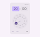

24-hour clocks in RTL move clockwise, but mirror elements such as buttons

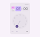

12-hour clocks in RTL move clockwise, but mirror UI elements such as AM/PM and buttons

## Canonical layout examples

### List-detail

The [list-detail layout](/m3/pages/canonical-examples/list-detail):

-   Is a single-pane at compact breakpoints Breakpoints are opinionated window sizes where a layout changes to match available space, device conventions, and ergonomics (previously window size classes). [More on breakpoints](/m3/pages/breakpoints) , switching between list and detail views

-   Divides the window into two side-by-side panes on large screens

-   Is mirrored in RTL

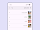

List-detail mirrored for RTL, where text and other elements are aligned to the right and flow from right to left

### Feed

Use a [feed layout](/m3/pages/canonical-examples/feed) to arrange content elements like cards in a configurable grid for quick, convenient viewing of a large amount of content. The feed layout is mirrored in RTL.

Feed layout mirrored for RTL, where the order of text, grid, and other elements align to the right and flow from right to left

### Supporting pane

Use the [supporting pane layout](/m3/pages/canonical-examples/supporting-pane) to organize content into primary and secondary display areas. The supporting pane layout is mirrored in RTL.

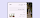

Supporting pane to the left of the primary content. Text and other elements within the pane are aligned to the right and flow from right to left.

## Component examples

### Badges

Change the position and alignment of [badges](/m3/pages/badges/overview) for RTL languages.

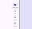

Small badge appears on the top left of the icon

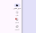

Large badge appears on the top left of the icon

### Toolbars

[Toolbars](/m3/pages/toolbars/overview) provide actions related to the current page. For RTL languages, mirror the order of the tools.

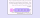

Mirrored floating toolbar, where the FAB appears on the left

### App bars

[App bars](/m3/pages/app-bars/overview) are placed at the top of the screen to help people navigate through a product:

-   Mirror an app bar’s layout in RTL

-   Flip appropriate icons, such as arrows

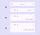

1.  RTL center-aligned, small app bars 

2.  RTL medium, flexible app bar 

3.  RTL large, flexible app bar

### Navigation rail

The [navigation rail](/m3/pages/navigation-rail/overview) is placed on the leading edge of the screen, on the left side for LTR, and on the right for RTL.

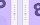

Based on the language, a navigation rail is set on a screen’s leading edge:

-   Right side for RTL languages

-   Left side for LTR languages

### Expanded navigation rail

Expanded navigation rails that open from the side are always placed on the leading edge of the screen, on the left for LTR languages, and on the right for RTL.

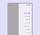

RTL expanded navigation rails open from the leading edge and should include mirrored icons

### Text fields

Icons in [text fields](/m3/pages/text-fields/guidelines#5c8a5f07-b1a5-455f-bf76-7ff0d724f6b0) are optional. Leading and trailing icons change their position based on LTR or RTL contexts.

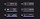

Icons, symbols, and label text for RTL: 

1.  Icon signifier 

2.  Valid or error icon 

3.  Clear icon 

4.  Voice input icon 

5.  Dropdown icon 

6.  Image

### Chips

The leading icon of input chips can be an icon, logo, or circular image.

The trailing icon is always aligned to the end side of the container. It’s placed on the right for LTR and on the left for RTL.

Filter chips shown in an RTL layout. Note: This example is not translated to help illustrate mirroring.

## Swipe gestures

Gestures are the ways people interact with UI elements using touch or body motion.

People can navigate horizontally between peer views like tabs and to complete actions.

RTL swiping and gestures should mirror their counterparts in LTR. If a product includes a delete icon revealed when swiped from the right for LTR languages, the same should be possible on the left for RTL languages.


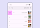

Swiping reveals additional action in RTL list layout

On Android, [predictive back](https://github.com/material-components/material-components-android/blob/master/docs/foundations/PredictiveBack.md) allows people to swipe left or right on the screen to go back or dismiss modal components.

RTL predictive back features should mirror those found in a LTR context.

The predictive back gesture should adjust for RTL languages
