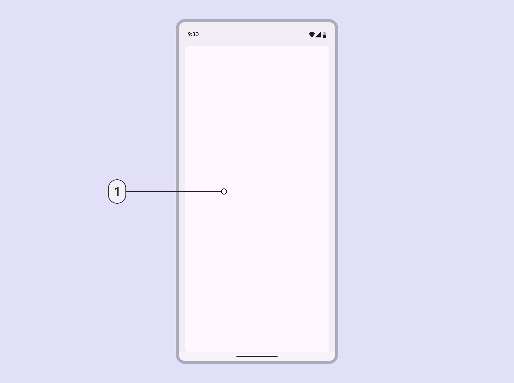

# Breakpoints

> Breakpoints ensure layouts work across a wide range of devices

Layouts for compact breakpoints Breakpoints are opinionated window sizes where a layout changes to match available space, device conventions, and ergonomics (previously window size classes). [More on breakpoints](/m3/pages/breakpoints) are for **screen widths smaller than 600dp.**

A compact breakpoint focuses on a single view

## Navigation

Use a navigation bar or modal expanded navigation rail.

Place navigation components close to the edge of the screen where they’re easier to reach.

Place navigation elements near the bottom of a compact window so they’re easy to reach

## Panes

Use a single pane in compact layouts.

1.  Single-pane layouts work best for compact breakpoints

## Spacing

Margins are 16dp from the leading and trailing edge of the window.

In compact layouts, use 16dp margins

## Special considerations

A compact layout will need to transition dynamically to a medium or expanded layout when:

-   A foldable device is unfolded

-   A mobile device is rotated from portrait to landscape

-   A tablet exits split-screen mode

-   A product is resized to be larger in multi-window mode

-   A free-form window is resized

Compact layouts should dynamically transition to larger layouts when a device is unfolded or rotated
