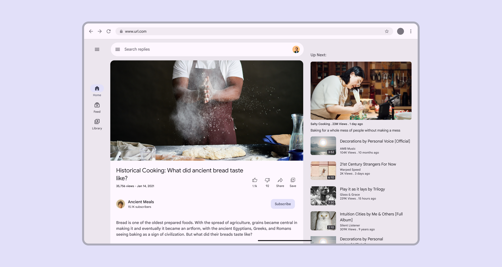
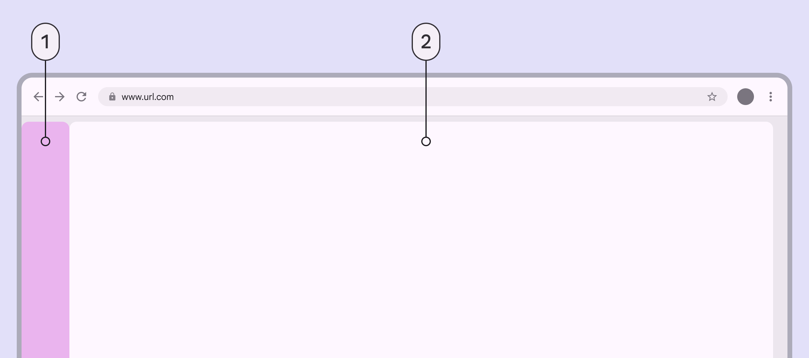
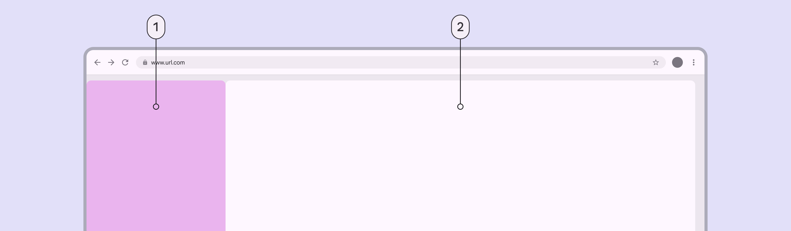
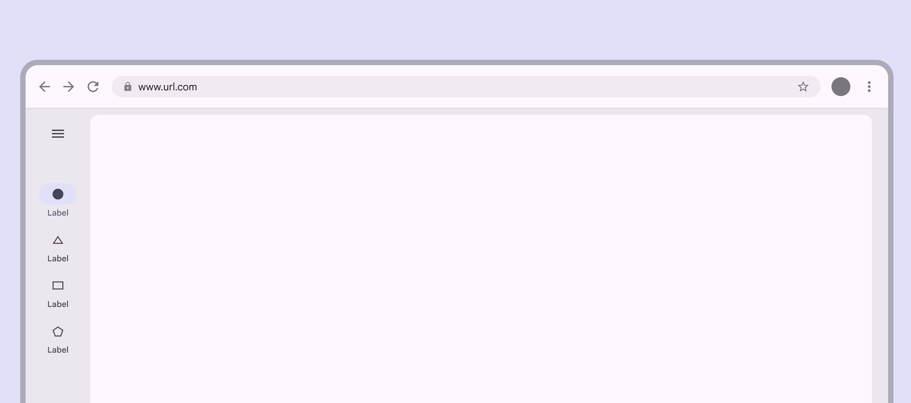
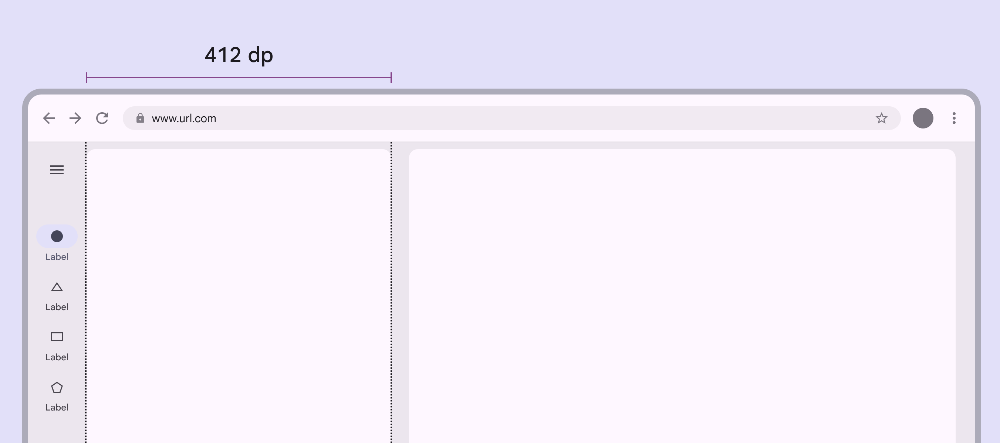
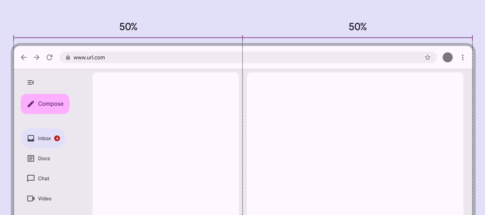
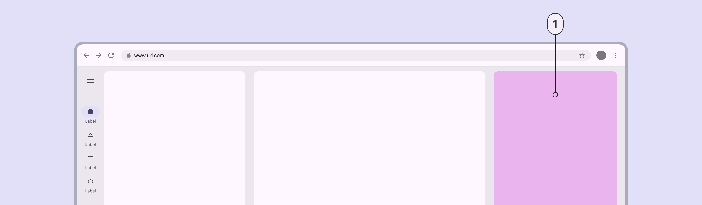
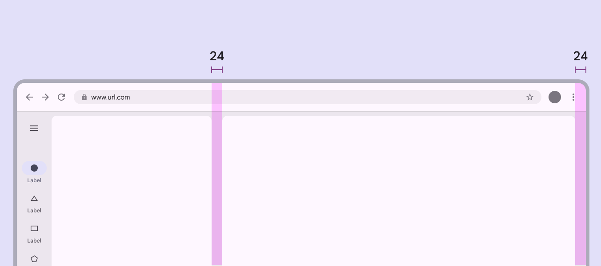
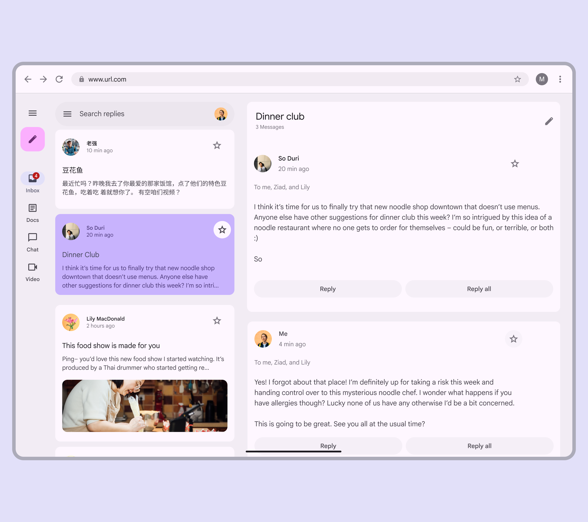

# Breakpoints

> Breakpoints ensure layouts work across a wide range of devices

These breakpoints are most useful for creating web experiences tailored to laptop and desktop devices. Some products may not need large and extra-large breakpoints. Consider your platform’s conventions and users when making decisions on which breakpoints to design for.

-   Layouts for large breakpoints Breakpoints are opinionated window sizes where a layout changes to match available space, device conventions, and ergonomics (previously window size classes). [More on breakpoints](/m3/pages/breakpoints) are for screen widths **from 1200dp to 1599dp**

-   Layouts for extra-large breakpoints are for screen widths of **1600dp and larger**

A two-pane layout is recommended for large and extra-large breakpoints

## Navigation

Use a navigation rail Navigation rails let people switch between UI views on mid-sized devices. [More on navigation rails](/m3/pages/navigation-rail/overview) , either collapsed or expanded, depending on the amount of content.



For sorting, filtering, or secondary navigation, use tabs or other components directly in the pane.

1.  Collapsed navigation area

2.  Single-pane layout

An expanded navigation rail is best suited for extra-large windows, where there's still plenty of room for content. Consider collapsing the navigation rail when space is needed, or when on pages deeper in the page hierarchy.

1.  Expanded navigation area

2.  Single-pane layout

## Panes

A two-pane layout is often best for large and extra-large breakpoints. 



However, a single-pane layout can work when displaying visually- or information-dense content, such as videos.

Only use a single-pane layout for dense content or media

When using a [fixed-and-flexible](/m3/pages/scaffold/panes#92371c3b-587d-4c6f-8105-05b69dcec81a) layout, the fixed pane should have a width of 412dp by default. 

Fixed panes should be 412dp in large and extra-large layouts

When using a [split-pane layout](/m3/pages/scaffold/panes#dc7982b7-754c-410a-9e88-18a54557c87b), the spacer should be visually centered by default, even when using an expanded navigation rail. 

In split-pane layouts, navigation components shrink the leading pane, so the spacer remains centered

## Additional panes

The extra-large breakpoint supports using a standard side sheet Standard side sheets display content without blocking access to the screen’s primary content, such as an audio player at the side of a music app. They're often used in medium and expanded window sizes like tablet or desktop. [More on side sheets](/m3/pages/side-sheets/overview) as a third pane. When the side sheet is present, the navigation rail can remain visible, collapse, or hide completely. Don't use more than three panes. 



Note: Fixed panes in this window size are recommended to be 412dp, but side sheets have a default maximum width of 400dp. 

1.  Standard side sheet (third pane)

## Spacing

Large and extra-large layouts have a leading and trailing margin of 24dp.

The spacer A spacer is the space between two panes. If panes can be resized, the spacer contains a drag handle. between panes is 24dp.

Use 24dp for margins and spacers in large and extra-large layouts

## Special considerations

Large and extra-large layouts will need to transition dynamically to a smaller layout when:

-   The app goes from full-screen to split-screen

-   Multi-window mode is initiated

-   A free-form window is resized

Pay attention to typographic elements such as line length to ensure readability on large and extra-large layouts.

Consider how a large layout should change at smaller breakpoints
