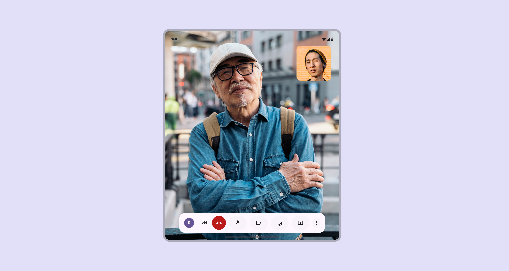
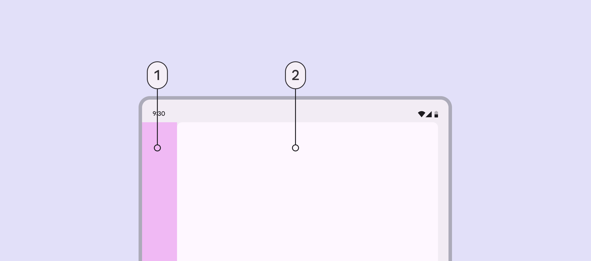
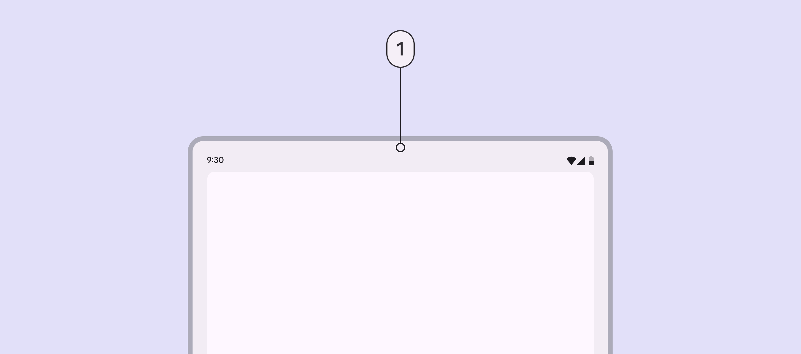
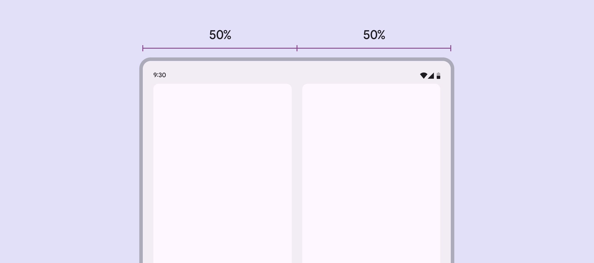
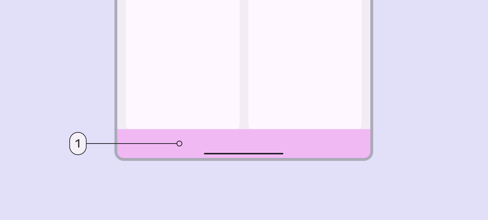
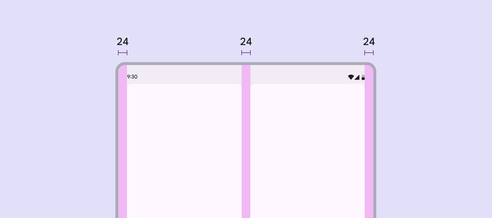
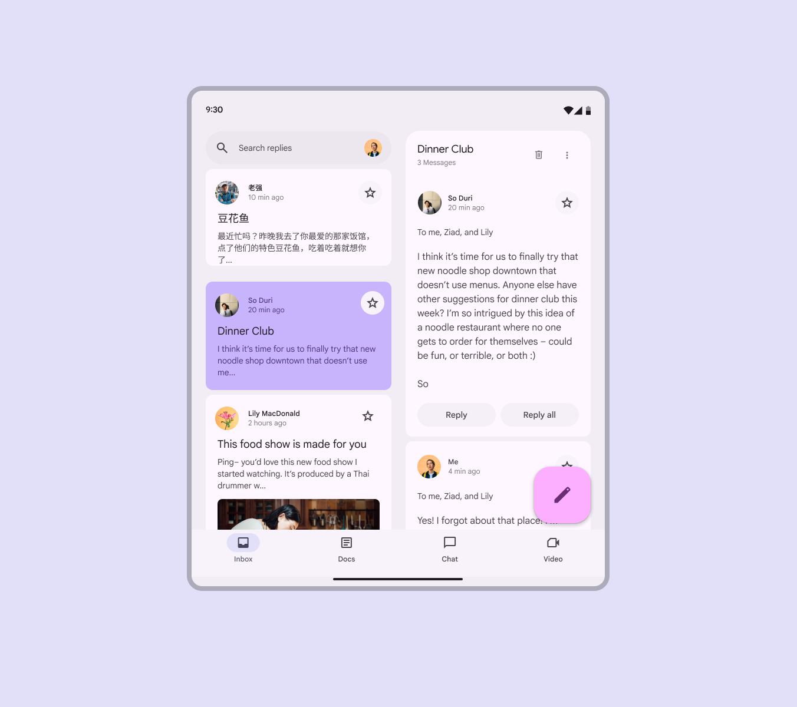
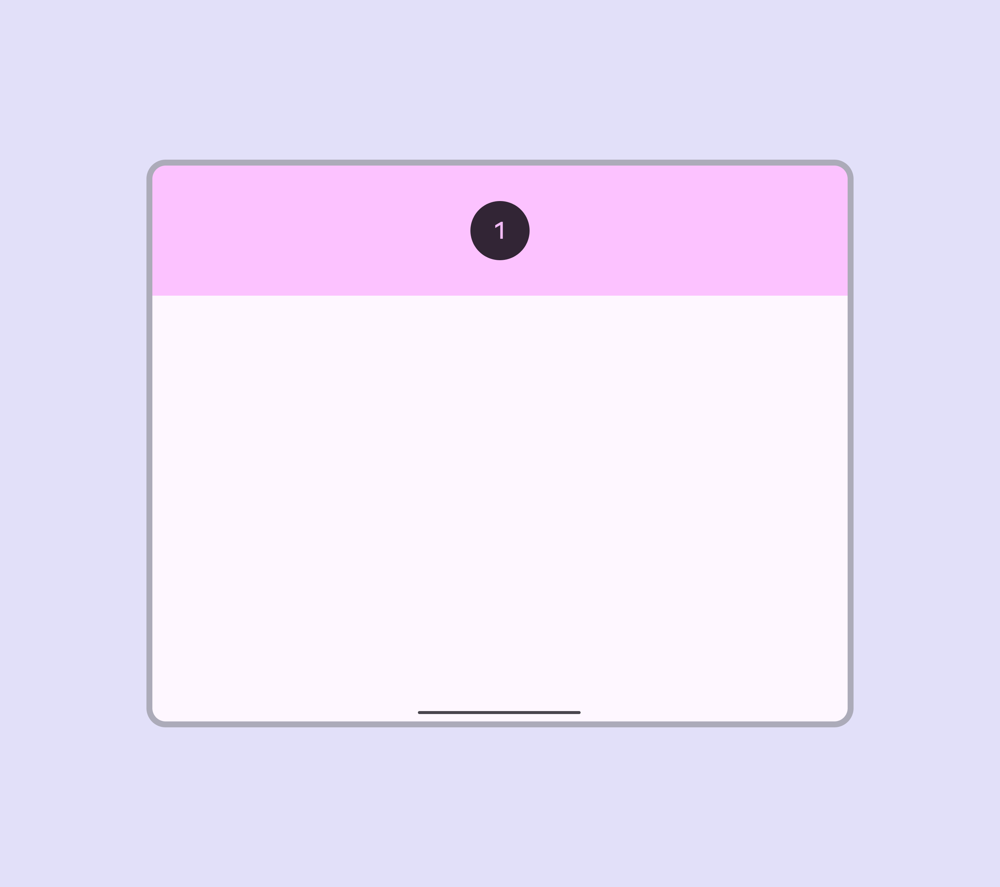
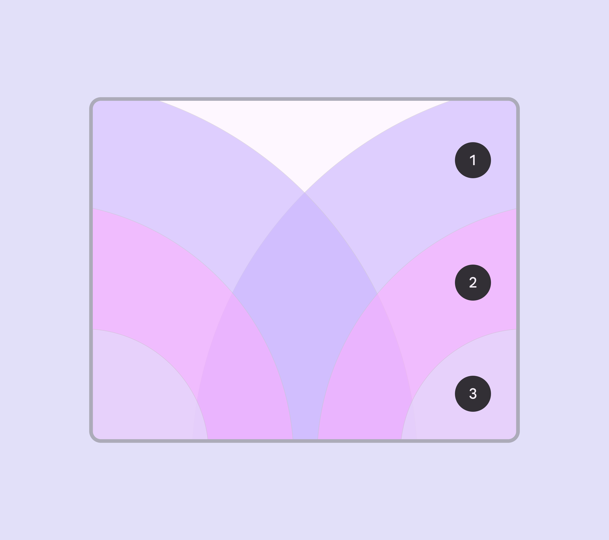

# Breakpoints

> Breakpoints ensure layouts work across a wide range of devices

Layouts for medium breakpoints Breakpoints are opinionated window sizes where a layout changes to match available space, device conventions, and ergonomics (previously window size classes). [More on breakpoints](/m3/pages/breakpoints) are for **screen widths from 600dp to 839dp.**

Single-pane layouts can focus attention on one action or view, such as a video call

## Navigation

Place navigation components close to edges of the window where they’re easier to reach:

-   Single-pane layouts: Navigation rail Navigation rails let people switch between UI views on mid-sized devices. [More on navigation rails](/m3/pages/navigation-rail/overview)

-   Two-pane layouts: Navigation bar Navigation bars let people switch between UI views on smaller devices. [More on navigation bars](/m3/pages/navigation-bar/overview)

The navigation rail can be hidden in secondary destinations as long as the primary destination can still be accessed using a back button.

1.  Navigation area

2.  Single pane

## Panes

### Single-pane layout



In a medium layout, a single pane is recommended because of limited screen width.

1.  A single-pane layout is recommended for medium breakpoints

### Two-pane layout

Limit use of two panes for content with lower information density, such as a settings screen.

Each pane in a two-pane layout should take up 50% of the window width. Avoid setting custom widths. A drag handle can be used to expand or collapse panes to be 100% of the window width.

Two-pane layouts should use 50% widths for each pane by default

When adding navigation to a two-pane layout, use a navigation bar. This allows the panes to fully use the available window width.

Two-pane layout with:

1.  Navigation bar

## Spacing

Medium layouts have margins of 24dp.

The spacer A spacer is the space between two panes. If panes can be resized, the spacer contains a drag handle. between panes is also 24dp.

Use 24dp for margins and spacer in a medium layout

## Special considerations

A medium layout will need to transition dynamically to a compact or expanded layout when:

-   A foldable device is folded

-   A tablet is rotated from portrait to landscape

-   A product goes from full-screen to split-screen

-   Multi-window mode is initiated

-   A free-form window is resized

Think of how a medium layout should change to a compact or expanded layout

### Reachability

For horizontal tablets and unfolded foldables, the top 25% of the screen is likely out of reach, unless the grip is adjusted. To accommodate device and hand sizes, limit the amount of interactions that are placed in the upper 25% of the screen.

1.  Limit interactions in the upper quarter of a screen, as they can be hard to reach

Avoid placing essential interactive elements too close to the bottom edge of the screen. Some users, particularly those with larger hands, might struggle to reach this area.

Specify interactions in a layout with these ergonomic regions in mind:

1.  Users can reach this area by extending their fingers, which makes it inconvenient

2.  Users can reach this area comfortably

3.  Reaching this area is challenging when holding the device

Medium breakpoint ergonomic regions:


1.  Inconvenient

2.  Comfortable

3.  Challenging
