# Breakpoints

> Breakpoints ensure layouts work across a wide range of devices

Material uses breakpoints to create adaptive designs that work across devices:

-   There are five main breakpoints Breakpoints are opinionated window sizes where a layout changes to match available space, device conventions, and ergonomics (previously window size classes). [More on breakpoints](/m3/pages/breakpoints) : compact, medium, expanded, large, and extra-large

-   Layouts typically transition from a single pane to two or three panes as window size increases

-   When moving across breakpoints, decide which elements to reveal, divide, resize, reposition, or swap

## Breakpoints overview

A breakpoint (previously window size class) is the window size at which a layout needs to change to match available space, device conventions, and ergonomics. These apply to Android and web.

All devices fall into one of five Material breakpoints:

-   Compact

-   Medium

-   Expanded

-   Large

-   Extra-large

Rather than designing for an ever-increasing number of display states, focusing on breakpoints ensures layouts work across a wide range of devices.

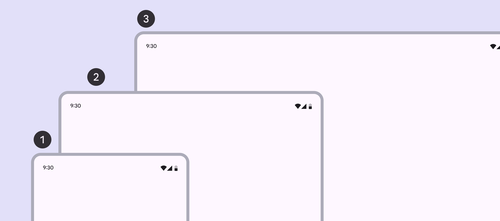

1.  Compact

2.  Medium

3.  Expanded

Large and extra-large breakpoints are used on devices like laptops, desktops, and external monitors.

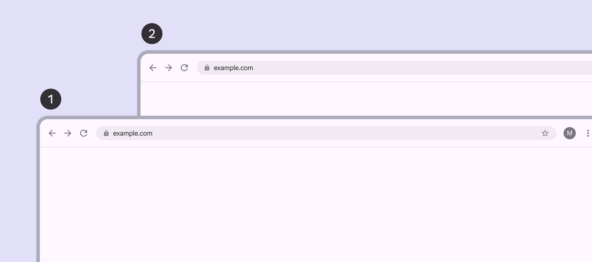

1.  Large

2.  Extra-large

**Design for breakpoints instead of specific devices because:**

-   The amount of available window space is dynamic and changes based on user behavior, such as multi-window modes or unfolding a foldable device

-   Devices fall into different breakpoints based on orientation

| Breakpoint | Width (dp) | Common devices |
| --- | --- | --- |
| Compact | Under 600dp | Phone in portrait |
| Medium | 600–839dp | Tablet in portraitFoldable in portrait (unfolded) |
| Expanded | 840–1199dp | Phone in landscapeTablet in landscapeFoldable in landscape (unfolded)Desktop |
| Large | 1200–1599dp | Desktop |
| Extra-large | 1600dp+ | DesktopUltra-wide monitors |

### Height breakpoints

On Android, compact, medium, and expanded breakpoints are also available for [height](https://developer.android.com/develop/ui/compose/layouts/adaptive/support-different-display-sizes#window_size_classes). These can be used to adjust the layout when available vertical space is unusually small or large. However, since most layouts contain vertically scrolling content, it's rare that layouts need to adjust to available height.

## Designing across breakpoints

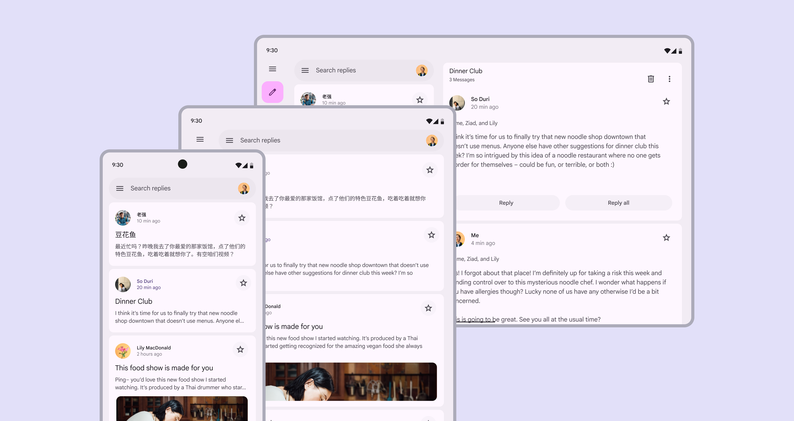

Products should automatically adapt to any breakpoint

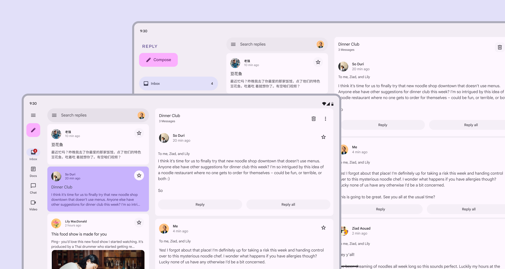

A product’s layout should adjust to fit each breakpoint. For example, a large window can have two panes, while an extra-large window can have three.

Each product view should have a layout for the breakpoints most appropriate for your platform and users.

Different components are recommended for performing the same function across the five layouts.

| Breakpoint | Panes | Navigation | Communication | Action |
| --- | --- | --- | --- | --- |
| Compact | 1 | Navigation bar, modal expandednavigation rail | Simple dialogFull-screen dialog | Bottom sheet |
| Medium | 1 (recommended) or 2 | Navigation bar, modal expandednavigation rail | Simple dialog | Menu |
| Expanded | 1 or 2 (recommended) | Modal or standard expandednavigation rail | Simple dialog | Menu |
| Large | 1 or 2 (recommended) | Modal or standard expandednavigation rail | Simple dialog | Menu |
| Extra-large | 1 to 3 (recommended) | Modal or standard expandednavigation rail | Simple dialog | Menu |

Start by designing for one breakpoint, then adjust the layout for the next size by asking these five questions:

### 1\. What should be revealed?

Parts of the UI that are hidden on smaller devices can be revealed in larger layouts. 

For example:

-   On mobile, the navigation rail is collapsed by default

-   On an expanded device, the navigation rail can be open by default, revealing more actions and features

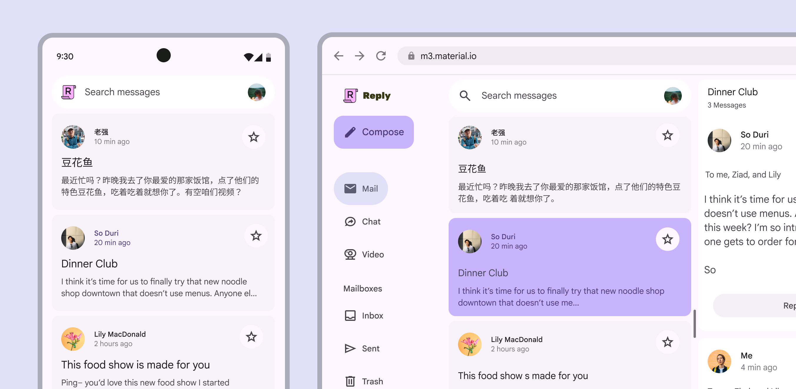

A product’s navigation rail can be revealed in an expanded layout

The same can be applied to [panes](/m3/pages/scaffold/panes). Larger layouts can simultaneously display an inbox pane and a pane containing a selected conversation. Additional space doesn’t just mean making the same thing bigger.

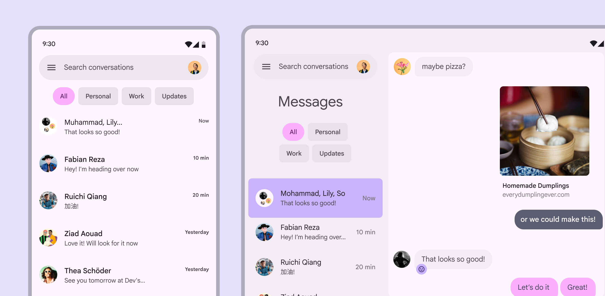

An expanded layout for a messaging app reveals a second pane with the selected conversation

### 2\. How should a screen be divided?

When dividing a screen into layout panes, consider the breakpoint:


-   Compact and medium breakpoints: 
A single pane works best

-   Expanded and large breakpoints: 
Two panes are recommended

-   Extra-large breakpoints: Consider using three panes

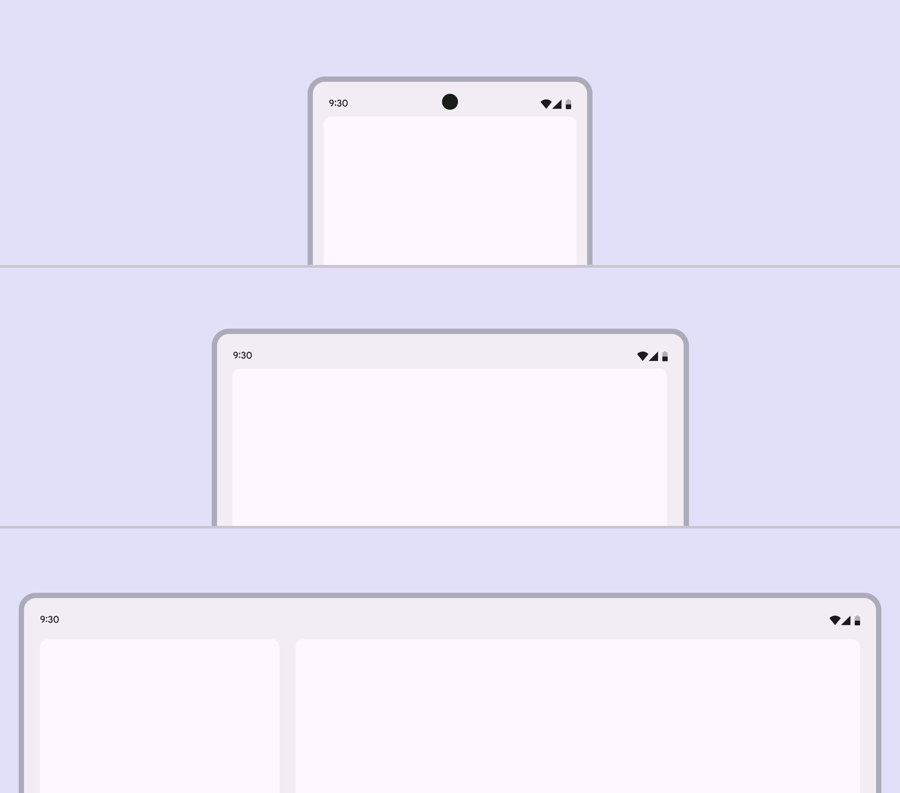

Compact and medium breakpoints should use a single pane, while larger breakpoints can use two

At medium breakpoints, two panes are useful when they contain low-density content with clear actions.



Don’t use two panes in medium layouts with high information density, as it can reduce usability.

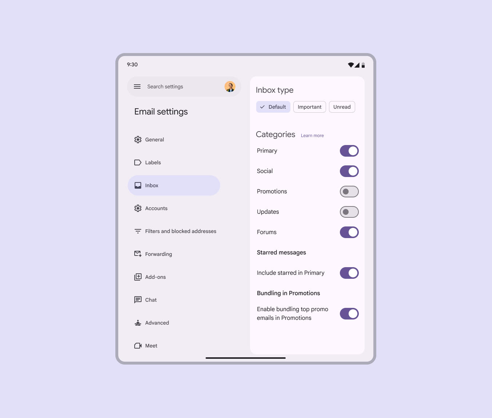

A settings view with low-density content and quick actions is a good use of two panes in a medium layout

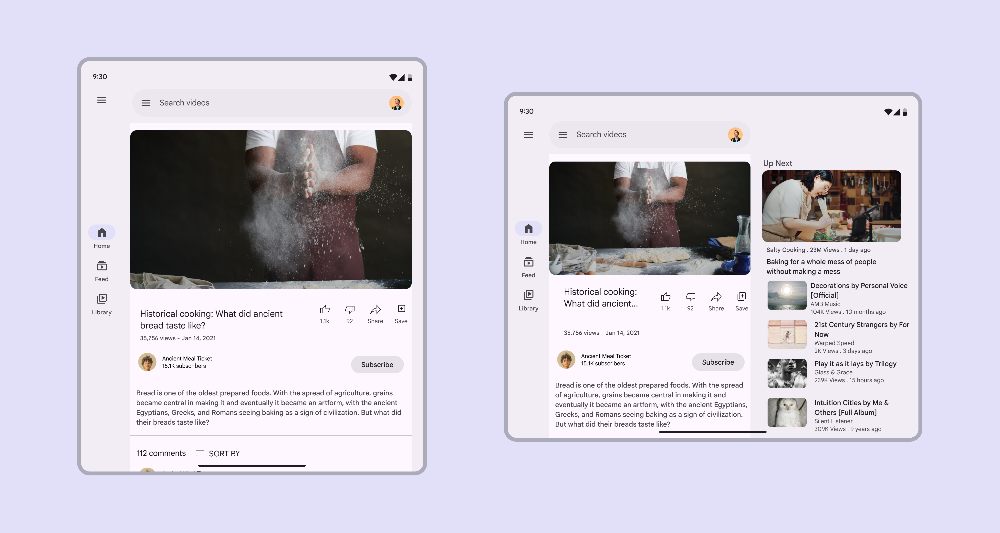

Rotating a device often changes the breakpoint. A layout can have two panes in landscape orientation, and one pane in portrait.

Single-pane layouts can focus attention on one action or view, creating a distraction-free environment for a specific goal such as:

-   Playing a game

-   Watching a movie

-   Video calls

-   Creative applications

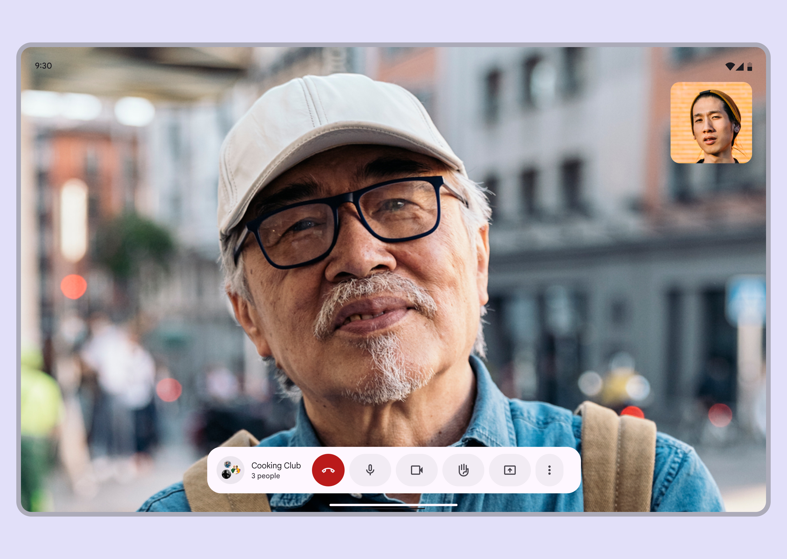

Consider using an immersive single-pane layout for video calls

### 3\. What should be resized?

UI elements that are small on compact screens can grow as breakpoints increase. Panes can also expand to rearrange elements and make better use of space.

Consider resizing:

-   Cards

-   Feeds

-   Lists

-   Panes

Resizing can highlight imagery and improve text readability. This type of adaptation affects the scale of content and the relationship between objects on screen. For example, a vertical card on mobile can adjust its margins, orientation, text size, and density to better fit a tablet.

Across all breakpoints, adjust margins and type styles to keep text between 40–60 characters per line.

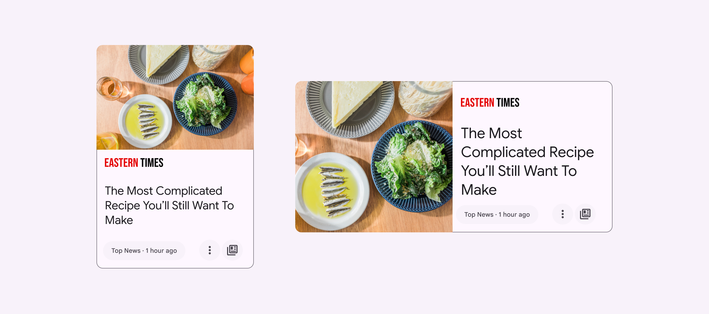

A small card in a compact layout can be resized larger in a medium or expanded layout

### 4\. What should be repositioned?

A UI and its components can reflow or reposition to make use of additional space on expanded screens and in resized panes. Repositioning is also a way to match the ergonomic and input needs that change across device sizes, such as shifting actions from the bottom of a compact window to the leading edge of medium and expanded windows. This method is similar to responsive design on the web.

Consider:

-   Repositioning cards

-   Adding a second column of content

-   Creating a more complex layout of photos

-   Introducing more negative space

-   Ensuring reachability for navigation and interactive elements

Internal elements can be anchored to the left, right, or center as a parent container scales. Internal elements can also maintain fixed positions, such as a floating action button (FAB) in a navigation rail.

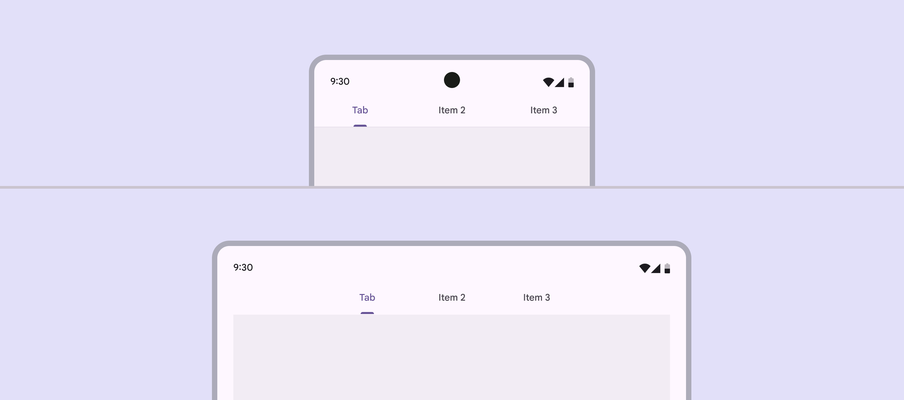

Tabs can remain anchored to the middle of a layout at both compact and medium breakpoints

In the case of a button, the icon and text label within the button container can remain anchored to each other, staying centered as the button container scales horizontally.

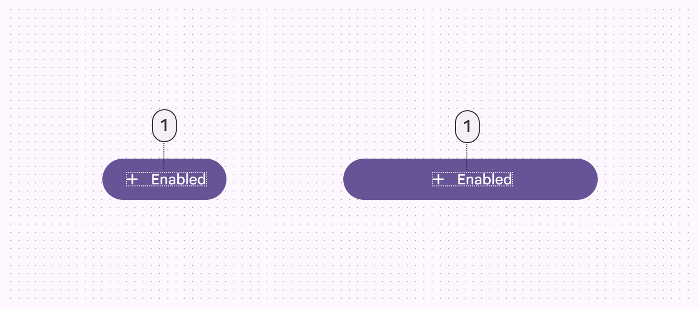

Button icons and label text can remain anchored to each other no matter the width

### 5\. What should be swapped?

As a layout changes across breakpoints, components with similar functions can also be exchanged. This makes it possible to adjust a layout for large-scale changes to the ergonomic and functional qualities of an interface.

For example, a bottom navigation bar in a compact layout can be swapped with a navigation rail in a medium layout.

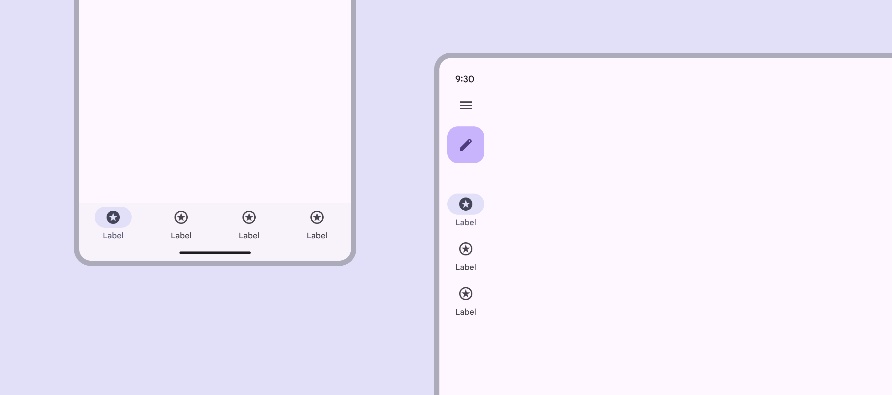

check Do

Swap a navigation bar in a compact layout for a navigation rail in a medium or expanded layout

Likewise, a navigation rail can swap from collapsed to expanded at larger breakpoints.

Use caution when swapping components. Make sure:


-   The interchangeable components are functionally equivalent

-   The component swap serves a functional and ergonomic purpose

Don’t swap a button for a chip. Be careful when changing between list items and cards.

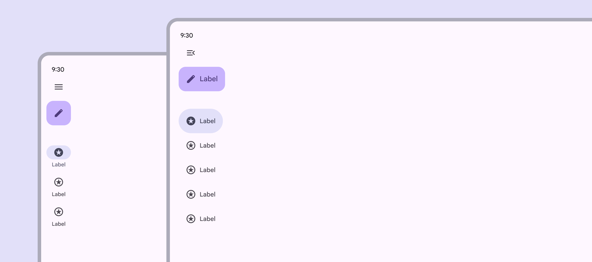

check Do

A collapsed navigation rail in medium or expanded layouts can become an expanded navigation rail in large or extra-large layouts

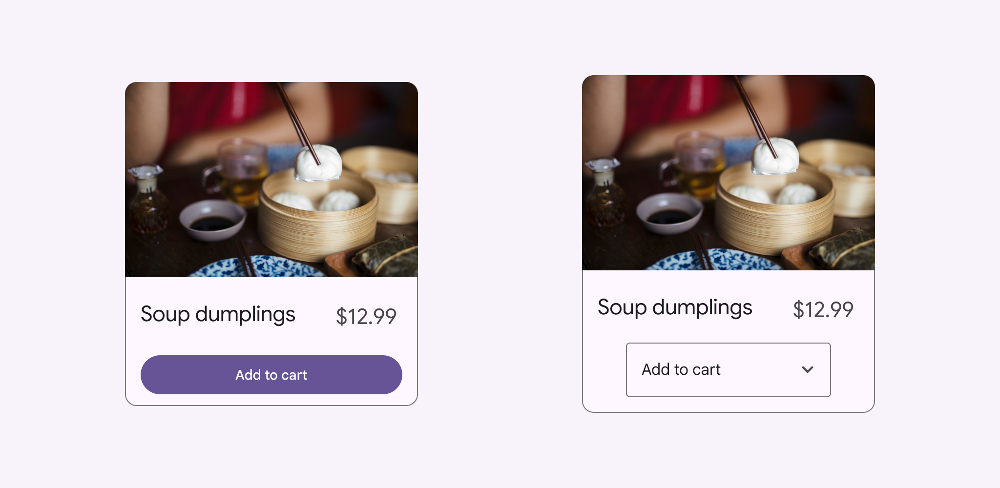

close Don’t

Don’t arbitrarily swap components that aren’t functionally equivalent, such as swapping a button with a menu

### Common swappable components

| Component type | Compact | Medium | Expanded |
| --- | --- | --- | --- |
| Navigation | Navigation bar Navigation bars let people switch between UI views on smaller devices. [More on navigation bars](/m3/pages/navigation-bar/overview) | Collapsed navigation rail Collapsed navigation rails take up minimal space and are best for medium windows and larger. [More on navigation rails](/m3/pages/navigation-rail/overview) | Collapsed navigation rail Collapsed navigation rails take up minimal space and are best for medium windows and larger. [More on navigation rails](/m3/pages/navigation-rail/overview) |
| Navigation | Modal expanded navigation rail Expanded navigation rails show text labels and an extended FAB, and can be default or modal. [More on navigation rails](/m3/pages/navigation-rail/overview) | Modal expanded navigation rail Expanded navigation rails show text labels and an extended FAB, and can be default or modal. [More on navigation rails](/m3/pages/navigation-rail/overview) | Standard expanded navigation rail Expanded navigation rails show text labels and an extended FAB, and can be default or modal. [More on navigation rails](/m3/pages/navigation-rail/overview) |
| Communication | Basic or full-screen dialog Full-screen dialogs fill the entire screen, displaying actions that require a series of tasks to complete. They're often used for creating a calendar entry. [More on full-screen dialogs](/m3/pages/dialogs/overview) | Basic dialog Basic dialogs interrupt users with urgent information, details, or actions. They're often used for alerts, quick selection, or confirmation. [More on basic dialogs](/m3/pages/dialogs/overview) | Basic dialog Basic dialogs interrupt users with urgent information, details, or actions. They're often used for alerts, quick selection, or confirmation. [More on basic dialogs](/m3/pages/dialogs/overview) |
| Supplemental selection | Bottom sheet Bottom sheets show secondary content anchored to the bottom of the screen. [More on bottom sheets](/m3/pages/bottom-sheets/overview) | Menu Menus display a list of choices on a temporary surface. [More on menus](/m3/pages/menus/overview) | Menu Menus display a list of choices on a temporary surface. [More on menus](/m3/pages/menus/overview) |
