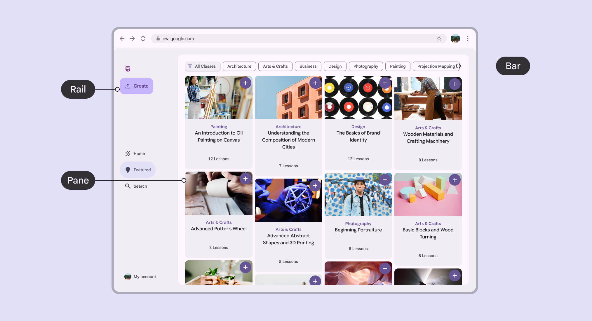
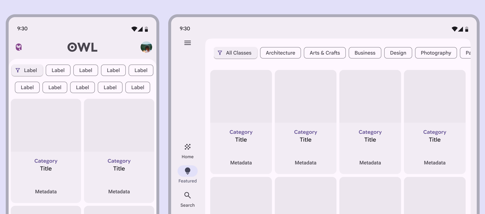
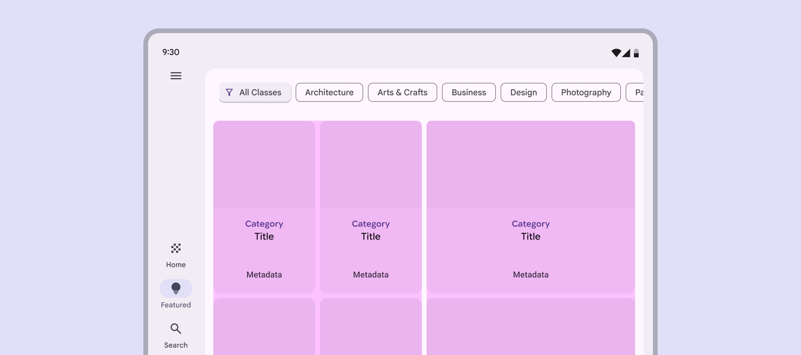
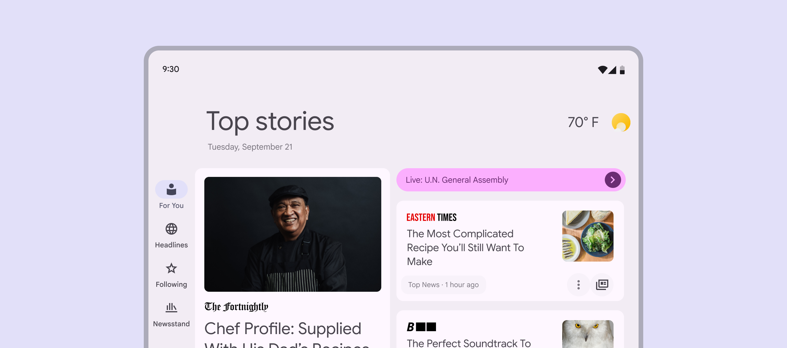
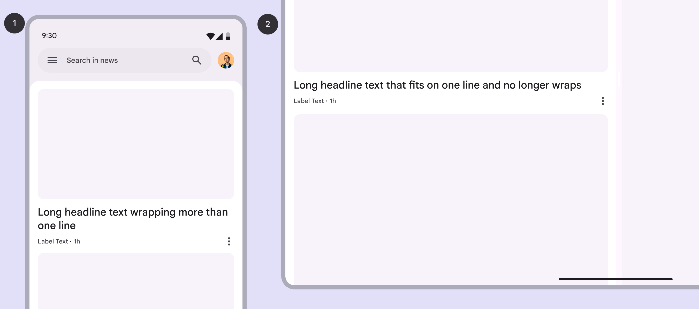
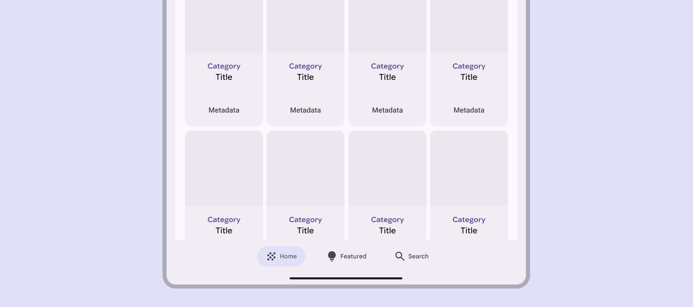
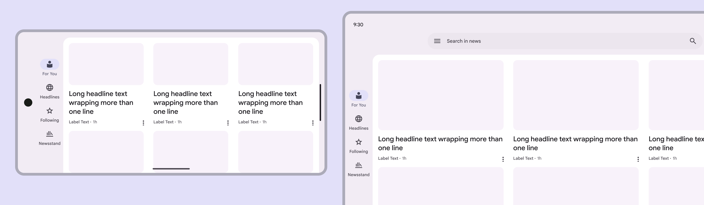

# Canonical layout examples

> Canonical layout examples are designs for common screen layouts across all breakpoints

A feed layout uses a grid composition to enable quick content browsing and discovery. Key use cases include news, photos, and social media.

Feed layouts help people quickly browse and discover content

## Usage

Use a feed layout to show different pieces of content through cards and lists.

Feeds support displays of almost any size as grids can adapt from single to multi-column.

Feed layouts can adapt the number of columns across breakpoints

## Dividing space

A feed composition is flexible enough to allow for content with varying proportions and sizing.

Feeds can organize content of different sizes, like using small and large cards

Use size and position to establish relationships among content elements.



Feed items should reflow when the amount of available space changes like:

-   Rotating or unfolding a device

-   Entering multi-window mode

The order of items is determined by their position. 



[More on adaptive design for cards](/m3/pages/cards/guidelines#99e8d17d-5bde-4bb9-8784-0ca403325b10)

Feed items can change size to group content

## Across breakpoints

### Compact

A feed layout should stack vertically, like a list of cards with individual items filling the width of the pane.

In compact windows, the cards in a feed stack vertically, filling the full width:


1.  Compact breakpoint

2.  Expanded breakpoint

### Medium

A feed layout can support components with different widths and be split across multiple columns.

Feed layouts can add columns in a medium window

### Expanded, large, & extra-large

A feed layout can support components with different widths and be split across multiple columns. The number of columns should usually increase at expanded breakpoints.

Column width can increase at larger breakpoints
