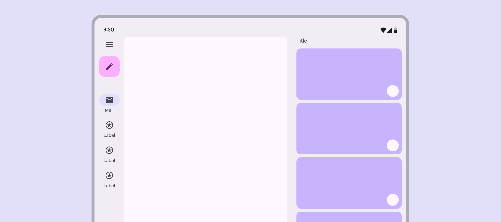
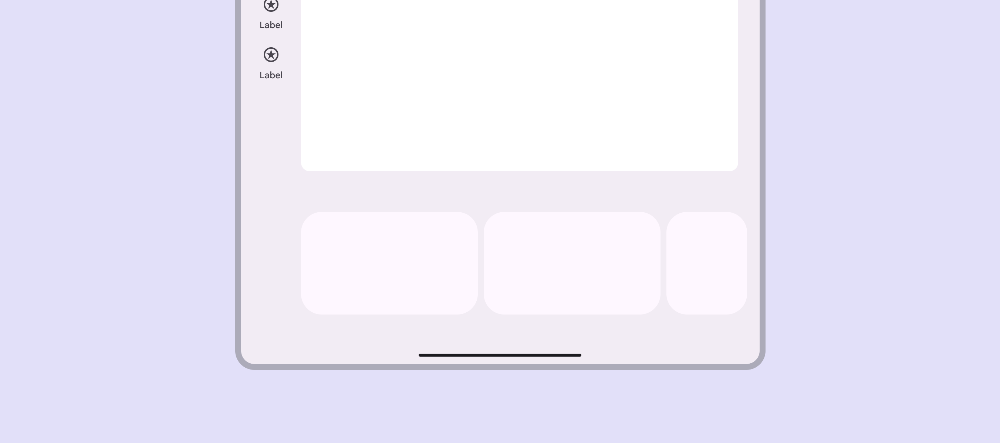
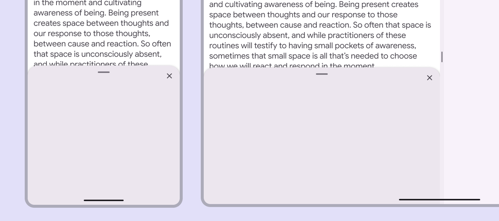
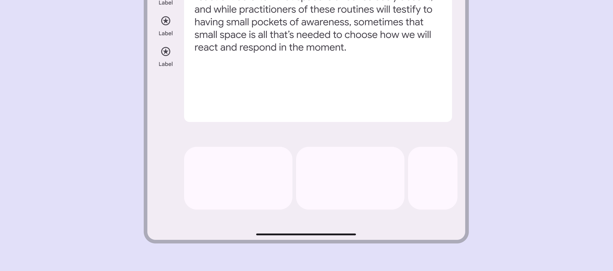
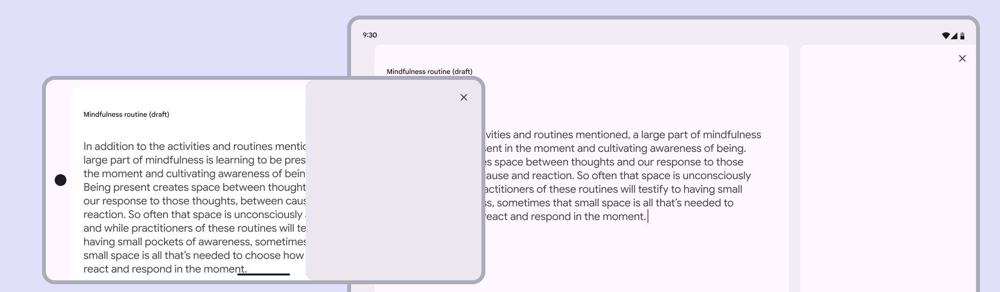

# Canonical layout examples

> Canonical layout examples are designs for common screen layouts across all breakpoints

The supporting pane layout organizes content into primary and secondary areas. 



The primary area contains the main content and occupies the majority of the space. The secondary area contains supporting content.



Key use cases for supporting pane layouts include:

-   Productivity

-   Document editing and commenting

-   Content and media browsing

Supporting pane layouts organize content into primary and secondary areas

## Usage

Use the supporting pane layout when the secondary content is only meaningful in relation to the primary content. 



For content with a parent-child relationship, use a [list-detail layout](/m3/pages/canonical-layouts/list-detail/) instead.

Supporting panes provide contextual info for the primary area

## Dividing space

The window is divided between a focus pane and a supporting pane.



Depending on the breakpoint, the supporting pane may appear below or beside the focus pane.

Supporting panes can appear beside or below the primary area

| Supporting pane placement | Pane width | Breakpoint |
| --- | --- | --- |
| Below | Flexible | Compact or Medium |
| Leading or trailing | Fixed (360 dp) | Expanded |

## Across breakpoints

### Compact

The supporting pane should appear below the focus pane. 

A bottom sheet can be useful for keeping focus on the primary pane while providing access to supporting information.

Bottom sheets can provide supporting information in compact windows

### Medium

The supporting pane should appear below the focus pane.

Supporting panes appear below the focus pane in medium windows

### Expanded

The supporting pane should appear on the leading or trailing side of the focus pane.

Supporting panes appear beside the focus pane in expanded windows
