# Grids & spacing

> Grids and spacing organize content and actions for any layout

-   Information density is the consideration of the amount of information visible on the screen

-   The default target size should be at least 48x48 CSS pixels

-   People can change density as long as the density controls are accessible

-   Apply density thoughtfully; not every layout needs it

-   Layout and component scaling (component adaptation or component density) can allow people to scan, view, or compare more information at once

Information density can change based on context and preference

Consider whether components should scale

**Information density**

-   Information density can be achieved through layout
and design decisions without using component
scaling

-   Some people may not benefit from increased density

**Component scaling**

-   Components can adapt and change dimensions to help people scan, view, or compare different amounts of information

-   Don't apply component scaling by default if it would result in a target below 48x48 CSS pixels

Information density and component scaling can be used together to provide more information and additional user control

## Information density

Information density refers to the amount of content (such as text, images, or videos) in a given space.

A layout’s spacing dimensions, including margins, spacers, and padding, can change to increase or decrease its information density. High density layouts are useful when people need to scan, view, or compare a lot of information, such as in a data table. Increasing the layout density of lists, tables, and long forms makes more content available on-screen.

Consider density settings in the context of a device. Although a person may prefer a denser layout for desktop, they may not for mobile. Density shouldn’t automatically change across breakpoints Breakpoints are opinionated window sizes where a layout changes to match available space, device conventions, and ergonomics (previously window size classes). [More on breakpoints](/m3/pages/breakpoints) or orientation unless a person changes it.

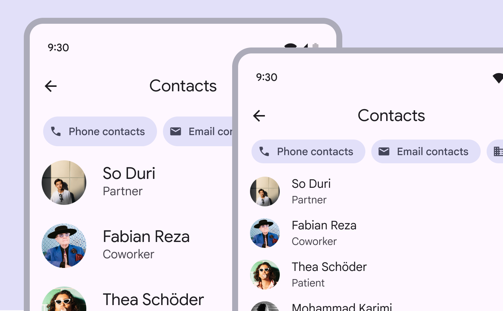

check Do

Consider using higher density information design when people need to scan lots of information

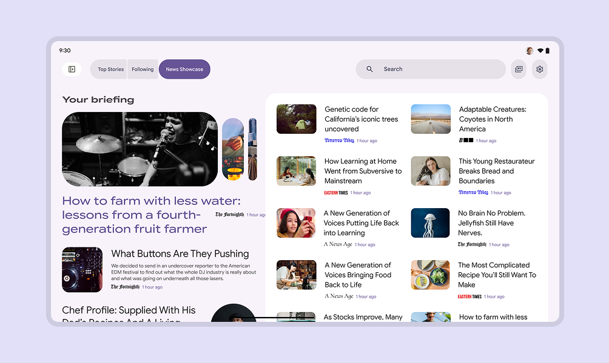

Consider the amount and priority of information on-screen. Higher density can be useful for data-rich products where people expect to scan lots of information quickly. Examples: News, financial portals, dashboards

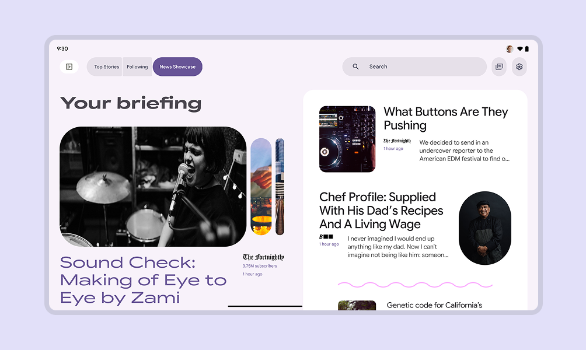

Lower density can be better for sites prioritizing aesthetics, a focused message, less information, or easier navigation

## Component scaling

The component density scale controls the internal spacing of individual components.

The density scale is numbered, starting at 0 for a component’s default density. The scale moves to negative numbers (-1, -2, -3) as space decreases, creating higher density.

Higher density is typically applied by decreasing the top and bottom padding or overall height by 4dp.

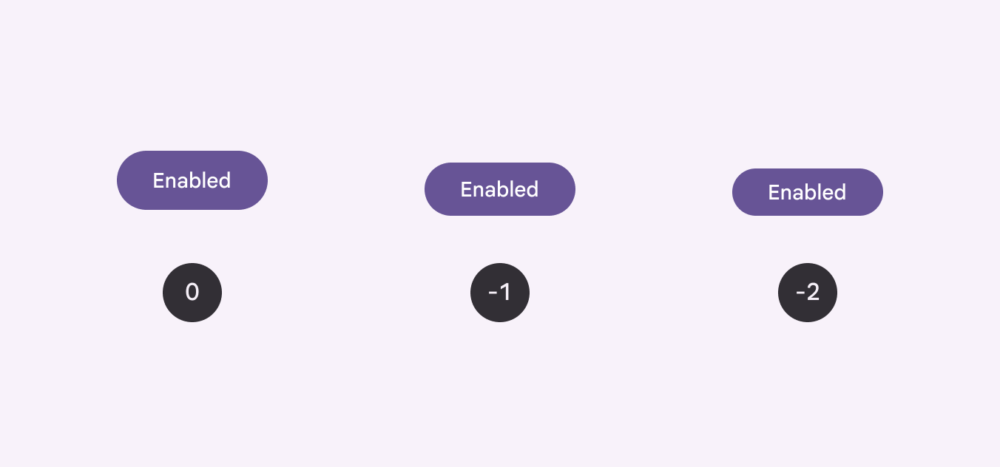

Apply component density based on the needs and layout of a design

Center the grouped element within the component container.

Text size shouldn’t change as the container size scales.

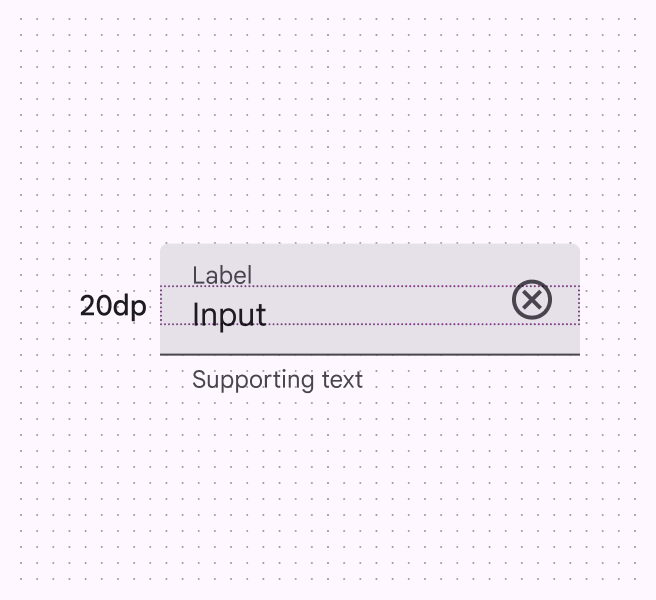

The measurement between the label and input is 20dp

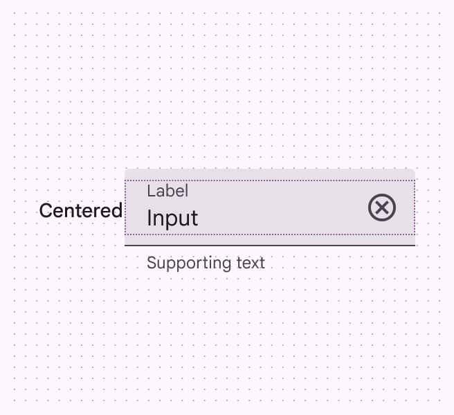

The label and input are centered within their parent container

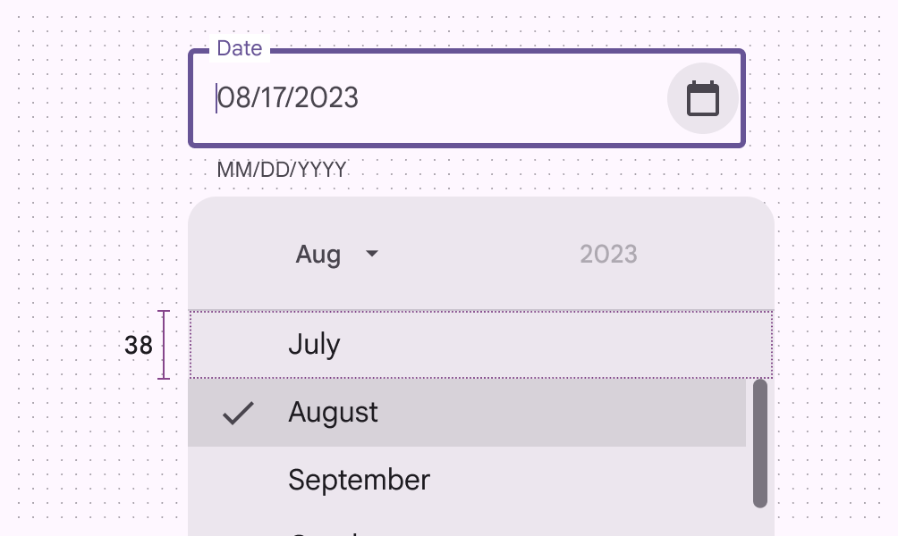

close Don’t

Don’t increase density in UIs that involve focused tasks, such as selecting from a menu. It reduces usability by limiting selectable space.

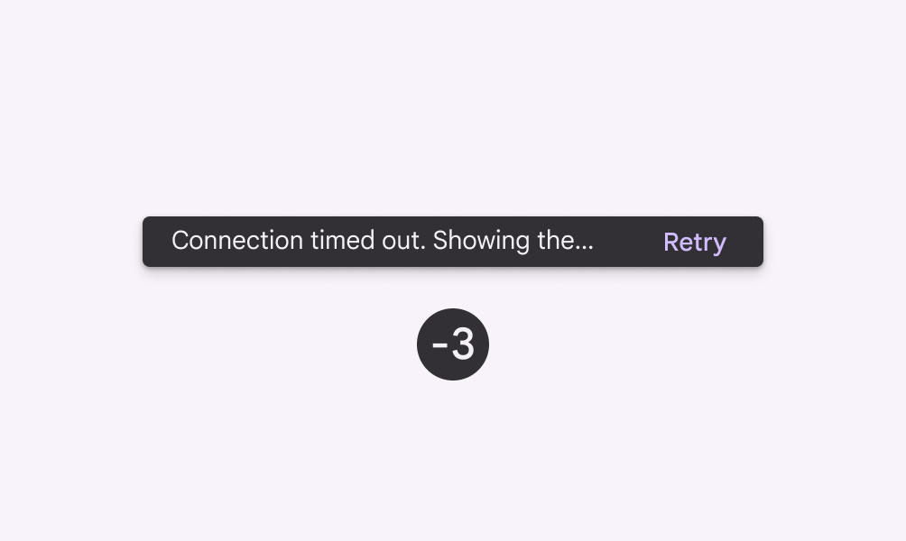

close Don’t

Don't increase the density in components that alert a person of changes, such as snackbars or dialogs

### Avoid applying component scaling by default

People should be able to **opt in** to dense layouts and components.

To ensure density settings can be easily reverted, settings interactions must use default target sizes (48x48 CSS pixels).



Don't scale layouts below 48x48dp by default.

People can opt in to dense layouts in settings

## Targets

Dense components can be less accessible because interactive elements are smaller, so use caution when increasing information density.

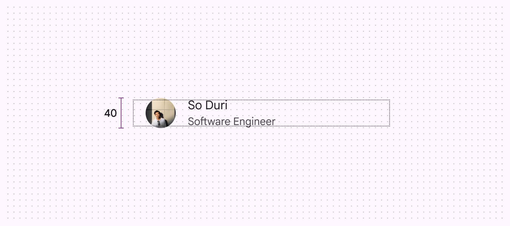

exclamation Caution

Use caution when applying component scaling where selectable targets will be reduced to less than 48x48dp. Only apply density where it provides a better experience.

Use caution when applying density to interaction targets. Accessible targets should retain a minimum of 48x48dp, even if the visual element, such as an icon, is smaller.

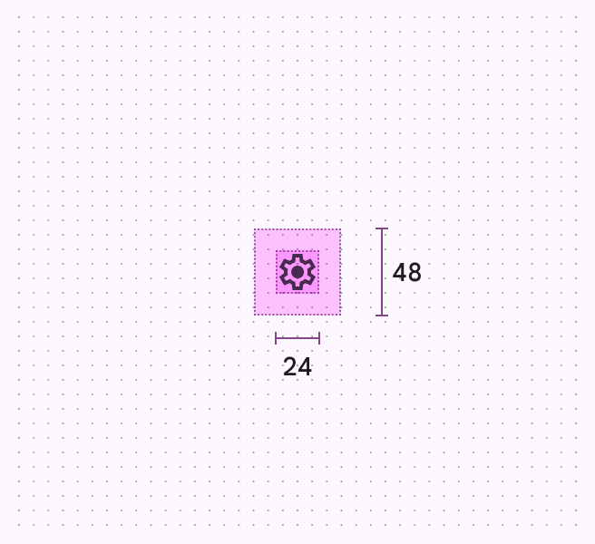

The target should remain 48x48dp, even if the icon is smaller

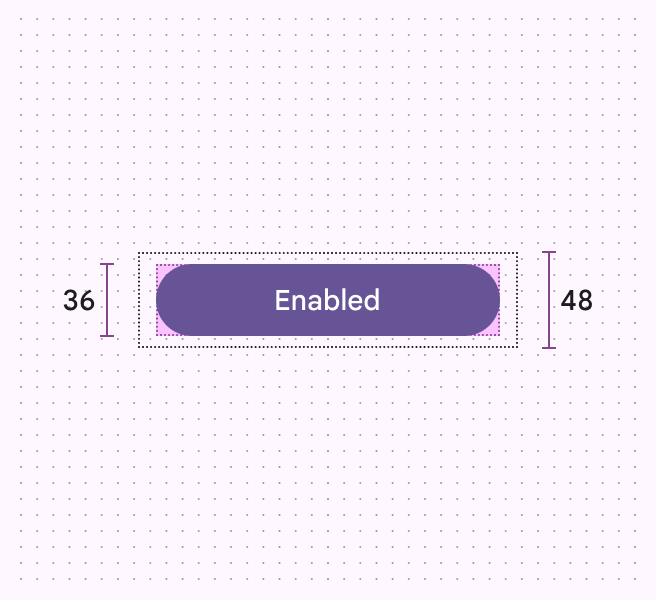

The interaction target of a common button can be larger, as long as it meets the 48x48dp minimum size

## Pixel density

Pixel density is the number of pixels per inch. High-density screens have more pixels per inch than low-density ones. Elements with the same pixel dimensions appear larger on low-density screens and smaller on high-density screens.

To calculate pixel density:

Pixel density = Screen width (or height) in pixels / Screen width (or height) in inches

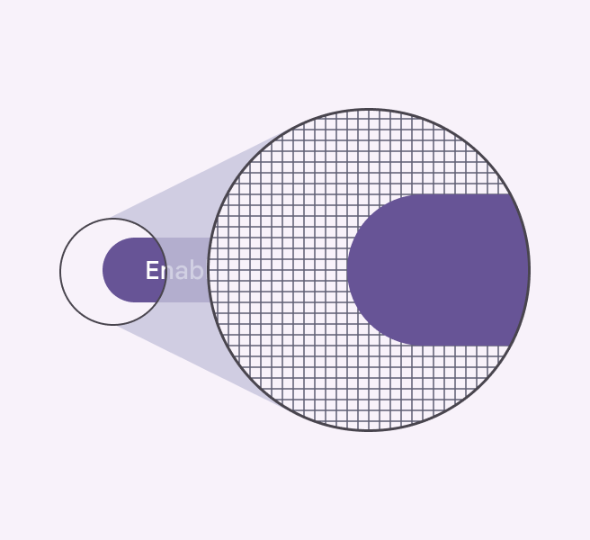

High-density elements have more pixels per inch

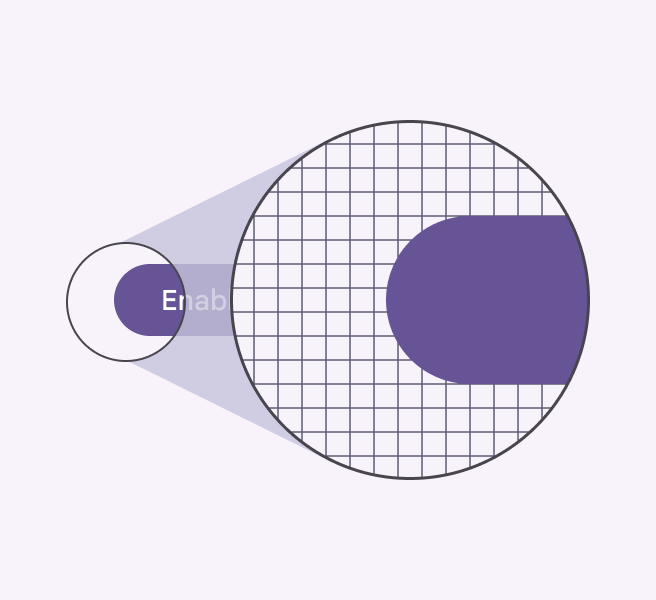

Low-density elements have fewer pixels per inch

### Density-independent pixels

Density-independent pixels, written as dp, are flexible units that scale to have uniform dimensions on any screen. They provide a flexible way to accommodate a design across devices. The Material design system uses density-independent pixels to display elements consistently on screens with different densities.

A dp is equal to one physical pixel on a screen with a density of 160.

To calculate dp:
dp = (width in pixels \* 160) / screen density

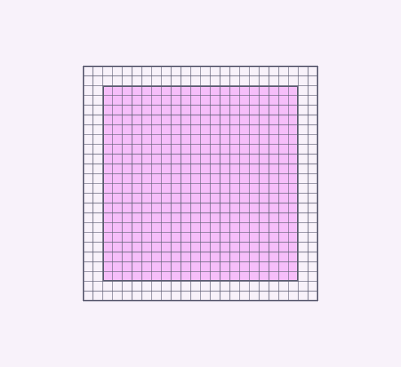

Low-density screen displayed with density independence

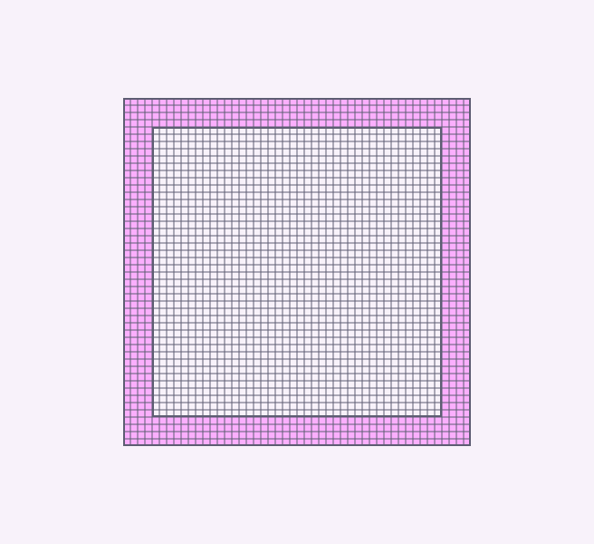

High-density screen displayed with density independence

| Screen physical width | Screen density | Screen width in pixels | Screen width in dps |
| --- | --- | --- | --- |
| 1.5 in | 120 | 180 px | 240dp |
| 1.5 in | 160 | 240 px |
| 1.5 in | 240 | 360 px |
