# Grids & spacing

> Grids and spacing organize content and actions for any layout

-   Layouts in Material are based on a grid that adapts across all breakpoints Breakpoints are opinionated window sizes where a layout changes to match available space, device conventions, and ergonomics (previously window size classes). [More on breakpoints](/m3/pages/breakpoints) (previously window size classes)

-   Parts of the layout scaffold A scaffold is a fundamental UI design structure that provides a standard platform for assembling key screen components. [More on scaffold](/m3/pages/scaffold) like rails and panes are positioned on this grid to create consistent adaptive layouts

-   The structure and spacing values used in a grid can add personality to a product’s layout

## How to use grids

### Start with placing grid columns

Grids adapt across breakpoints Breakpoints are opinionated window sizes where a layout changes to match available space, device conventions, and ergonomics (previously window size classes). [More on breakpoints](/m3/pages/breakpoints) . As the size increases, column count, width, and spacing change as well.

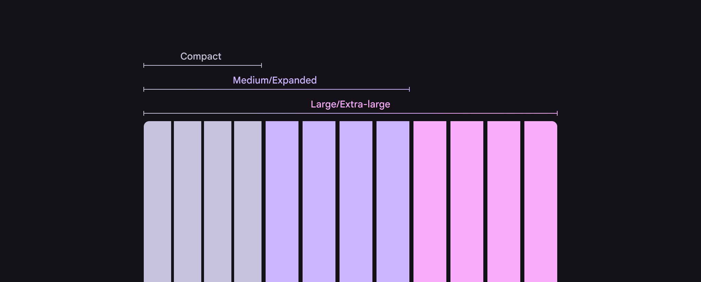

The number and size of columns changes based on breakpoints

When moving between sizes, column count may increase to show more content or controls.

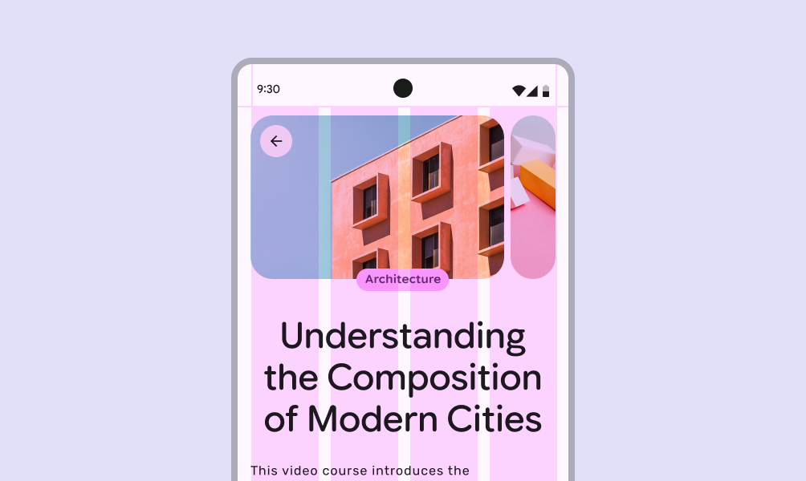

On compact screens, fewer columns are used to create a focused layout

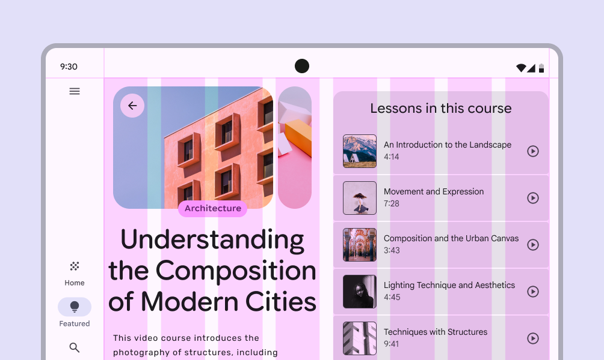

As screen size increases, for example when a foldable screen is unfolded, additional columns allow for a richer layout

### Place bars & rails

Populate regions of the layout scaffold A scaffold is a fundamental UI design structure that provides a standard platform for assembling key screen components. [More on scaffold](/m3/pages/scaffold) that are closest to the edges of the screen’s usable space first. This may include:

-   Bars like the navigation bar Navigation bars let people switch between UI views on smaller devices. [More on navigation bars](/m3/pages/navigation-bar/overview) and rail Navigation rails let people switch between UI views on mid-sized devices. [More on navigation rails](/m3/pages/navigation-rail/overview)

-   Components like toolbars Toolbars display frequently used actions relevant to the current page. [More on toolbars](/m3/pages/toolbars/overview) and app bars App bars contain page navigation and information at the top of a screen. [More on app bars](/m3/pages/app-bars/overview)

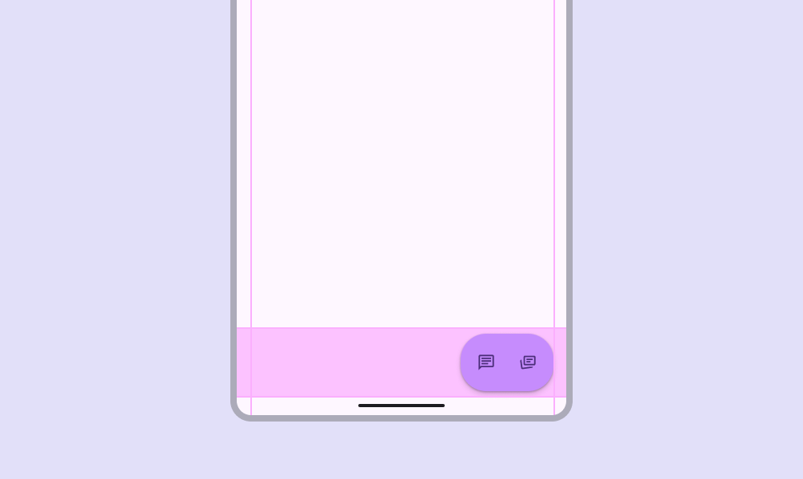

The bar region can contain a toolbar

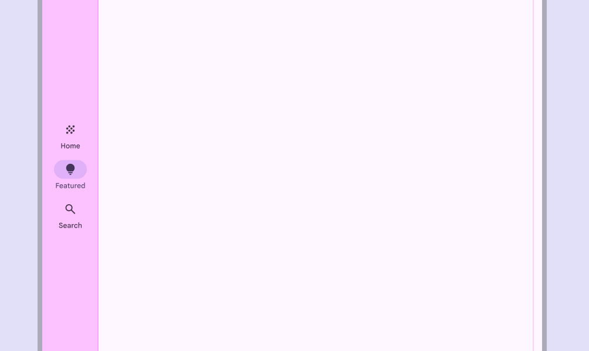

The rail region on larger screens usually contains a navigation rail

### Place panes

Next, populate the main region of the screen with panes with content and components, based on available space and structure.

See the [canonical layout examples](/m3/pages/canonical-examples) for ideas on which panes are appropriate for a product.

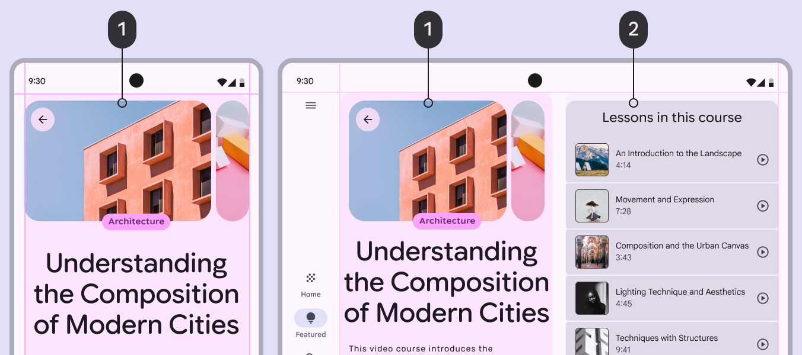

1.  Primary pane

2.  Supporting pane

## Rulers & alignment

Rulers are a set of recommended global alignment lines that help create consistent focal points in a product, while keeping content and components consistently aligned.

[How to implement rulers in Compose](https://developer.android.com/reference/kotlin/androidx/compose/ui/layout/Ruler)

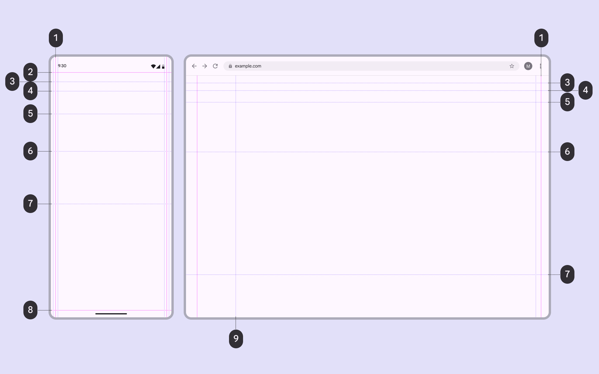

1.  Margin

2.  Bar or safety region

3.  Title

4.  Content 1

5.  Content 2

6.  Content 3

7.  Content 4

8.  Bar or safety region

9.  Rail

### Bar & safety rulers

Bar and safety rulers reserve space for [system UI](https://developer.android.com/training/system-ui) elements like the status bar and gesture navigation.

They ensure actionable content like app bars App bars contain page navigation and information at the top of a screen. [More on app bars](/m3/pages/app-bars/overview) aren’t covered by system UI.

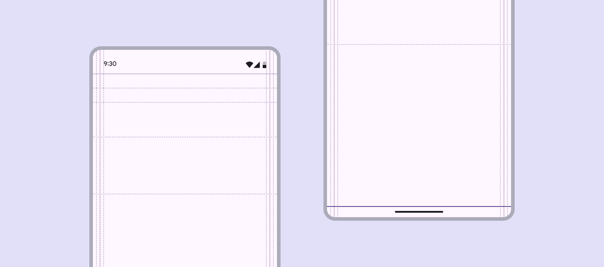

Bar and safety rulers align to the edges of a screen’s usable space, providing a reference for where system UI like the status bar or gesture navigation appear

### Title rulers

The title ruler creates consistency for the screen’s title, aligning the text, icons, and other components in an app bar.

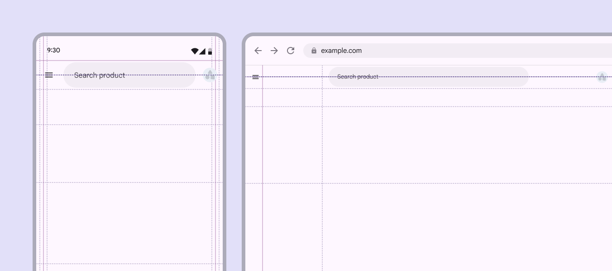

The title ruler aligns with the title in an app bar

### Content rulers

Use content rulers to align and anchor key content, such as headlines and carousels Carousels show a collection of items that can be scrolled on and off the screen. [More on carousels](/m3/pages/carousel/overview) .

-   First content ruler: Emphasizes major blocks like hero images, headlines, or primary components

-   Secondary rulers: Determine where supplementary text or actions begin

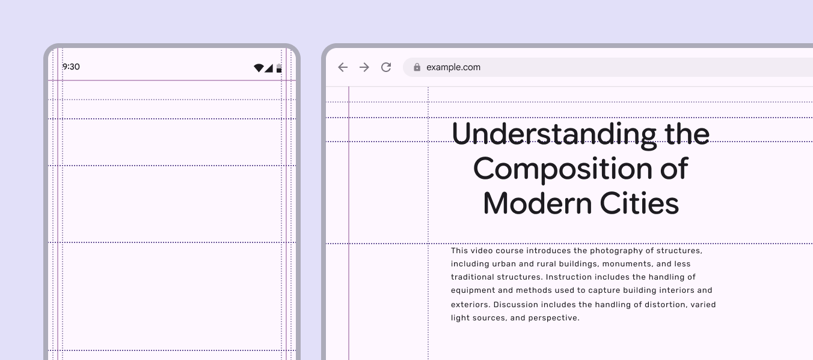

Content rulers offer flexible alignment options to help create a consistent layout across a product

Realigning primary components or content to a content ruler can create strong hierarchy and visual rhythm across a product

### Ruler options

Margin rulers come with some wiggle room to determine how tight or loose a product’s content feels on-screen. The standard ruler can be adjusted to the left or right.

Choosing a narrower or wider margin can create or remove negative space, or create expressive moments in a content-forward product.

Margin rulers can adjust to create more or less negative space

Rulers can also be used to create more immersive experiences. For example, a photo grid can take the full width of the screen, while components like search Search lets people enter a keyword or phrase to get relevant information. [More on search](/m3/pages/search/overview) use wider margins.

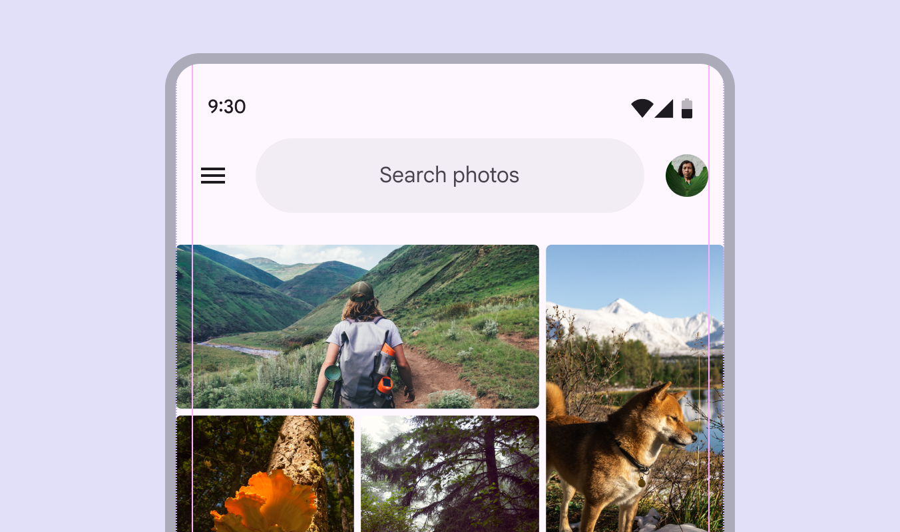

Rulers allow components and media to use different margin widths
