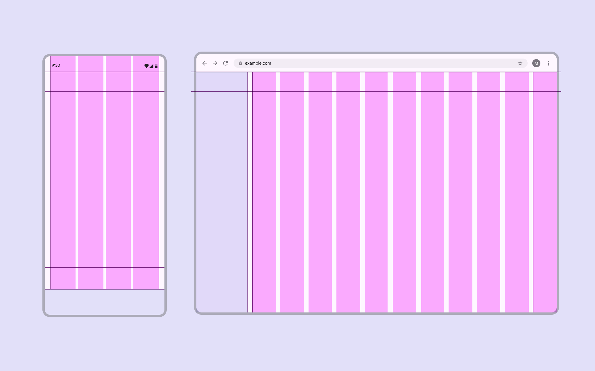

# Grids & spacing

> Grids and spacing organize content and actions for any layout

-   Grids create a consistent foundation and adapt across breakpoints Breakpoints are opinionated window sizes where a layout changes to match available space, device conventions, and ergonomics (previously window size classes). [More on breakpoints](/m3/pages/breakpoints/overview) (previously window size classes)

-   Use spacing to group related information and direct people’s attention to key actions

-   Density helps people see and compare more information in data-heavy views

Layouts in Material are based on a grid that adapts across all screen sizes

## Availability & resources

| Type | Resource | Status |
| --- | --- | --- |
| Design | [M3 Design Kit (Figma)](https://www.figma.com/community/file/1035203688168086460) | Available |
| [Spacing system & tokens](/m3/pages/spacing/overview) | Available |
| Implementation | [Jetpack Compose: Rulers](https://developer.android.com/reference/kotlin/androidx/compose/ui/layout/Ruler) | Available |

## What’s new

##### **May 2026**

-   How to use grids and rulers to adapt layouts across devices

-   Expressive spacing guidelines

As screen size increases, additional columns allow for a richer layout
