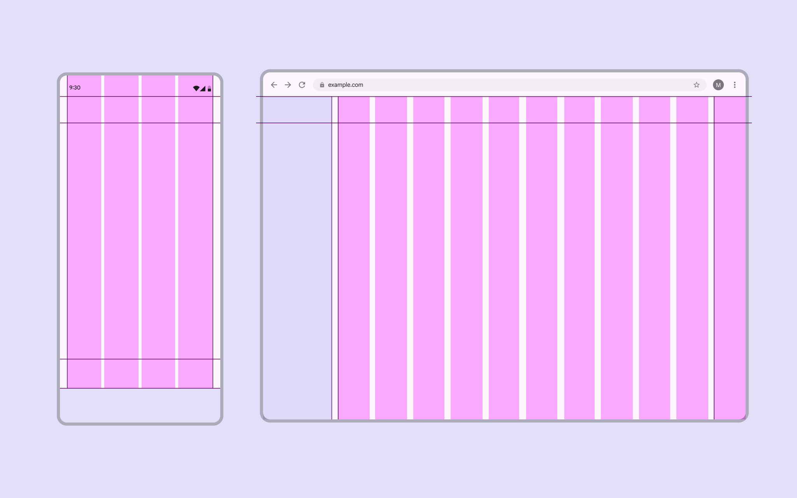
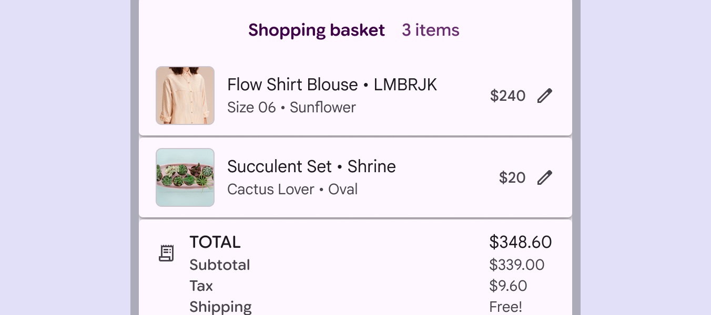
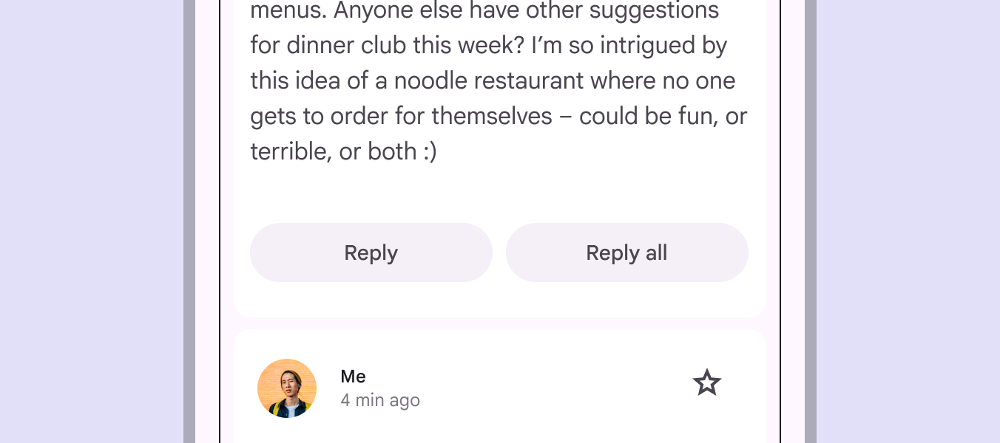
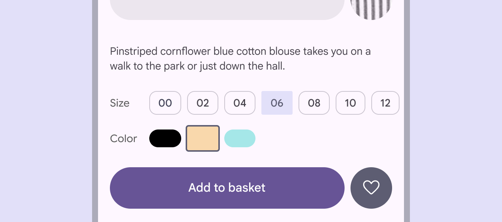
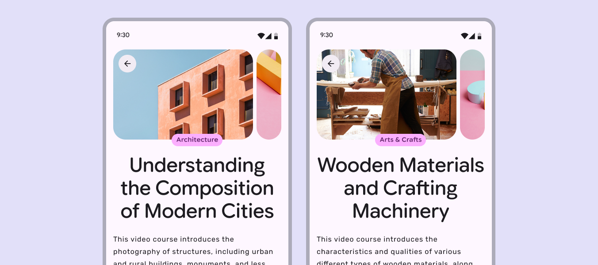
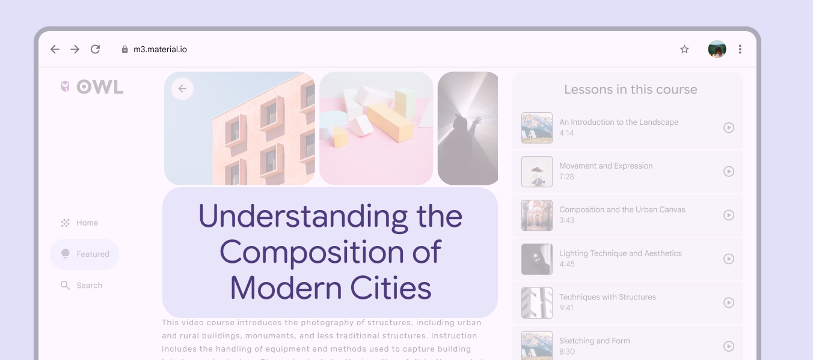

# Grids & spacing

> Grids and spacing organize content and actions for any layout

-   Spacing helps group content, direct attention, and shape the personality of a product

-   A denser layout can feel more serious and focused, while a more spacious layout can feel calm and open

-   Material’s spacing system can adapt to breakpoints Breakpoints are opinionated window sizes where a layout changes to match available space, device conventions, and ergonomics (previously window size classes). [More on breakpoints](/m3/pages/breakpoints) and density settings. [More on the spacing system](/m3/pages/spacing/overview)

Desktop layouts can use more generous spacing than mobile layouts

## Spacing to group content

Grouping connects related elements that share context, such as an image and its caption. Use spacing to visually tie elements together and establish boundaries between unrelated items.

Placing a caption under an image creates an implicit group

**Explicit grouping** uses visual boundaries like outlines, dividers, and shadows to group related elements in an enclosed area.

It can also indicate that an item is interactive, such as:

-   List items between dividers

-   A card displaying an image and its caption

Outlines define clear boundaries to explicitly group elements

**Implicit grouping** uses close proximity and open space (rather than lines and shadows) to group related items.

For example, the items in a carousel are placed close together, with space around the composition to separate them from other content.

Close spacing implicitly groups carousel images

## Spacing to direct attention

Use rhythm, similarity, and other grouping principles to distinguish and highlight important elements.

### Rhythm

Consistent spacing between related elements or groups makes them easier to navigate with the eye.

Cards should maintain consistent horizontal spacing to establish a strong rhythm when their height varies

### Similarity

Similar elements should have the same spacing and sizing in a layout to show they’re related.

Leading elements like thumbnails, avatars, or icons should always be aligned.

Thumbnails in a shopping basket should use identical sizes and styles to signal that each one represents a product, even if the original photos have different aspect ratios

### Proximity

Place components near each other to create cohesive groups. This helps people understand the relationships between information and actions.

For example, buttons should be close to the content they’re affecting.

Placing two buttons as a group near content implies they’ll both affect it in similar ways

### Continuity

Place related elements in a container, row, or column to establish a clear group or relationship.

Use a row of chips to signal a single, unified control

## Spacing as expression

Give the most important content, tasks, or actions visual prominence with generous spacing and the brightest surfaces.

### Focal points

Consistent placement of key actions and information helps build recognizable focal points across a product.

Carousel images, categories, and titles should appear in a consistent location across pages

### Negative space

Allow negative space to give form and meaning to elements on screen. Framing important actions or content with generous spacing creates emphasis.

Negative space gives shape and emphasis to the course header
