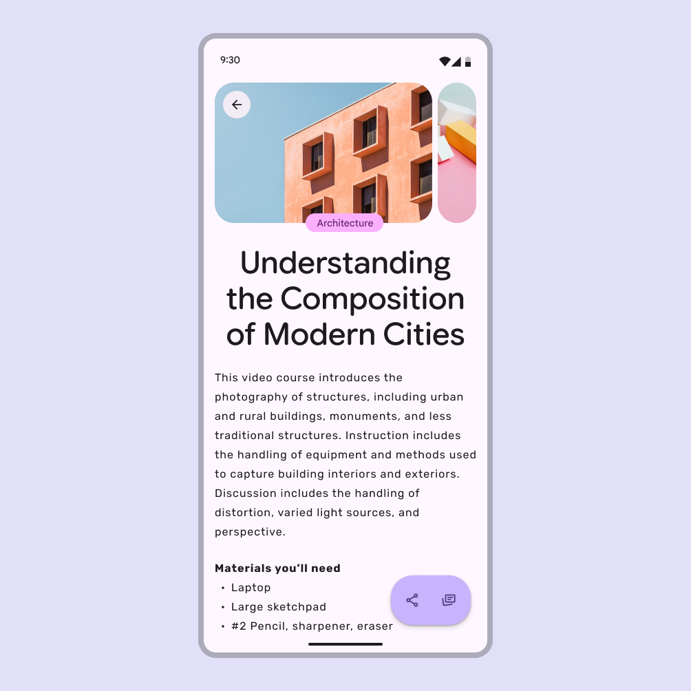
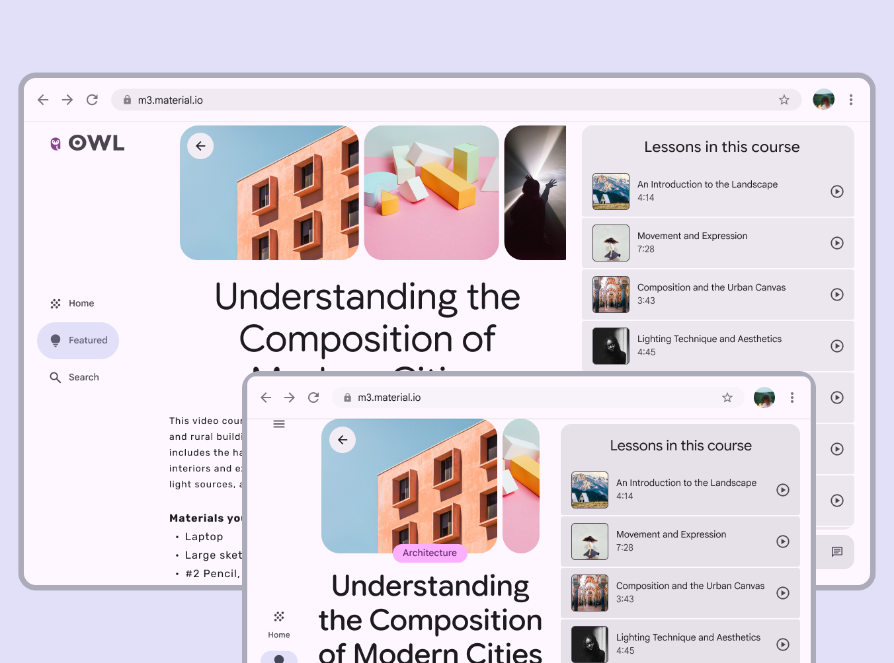
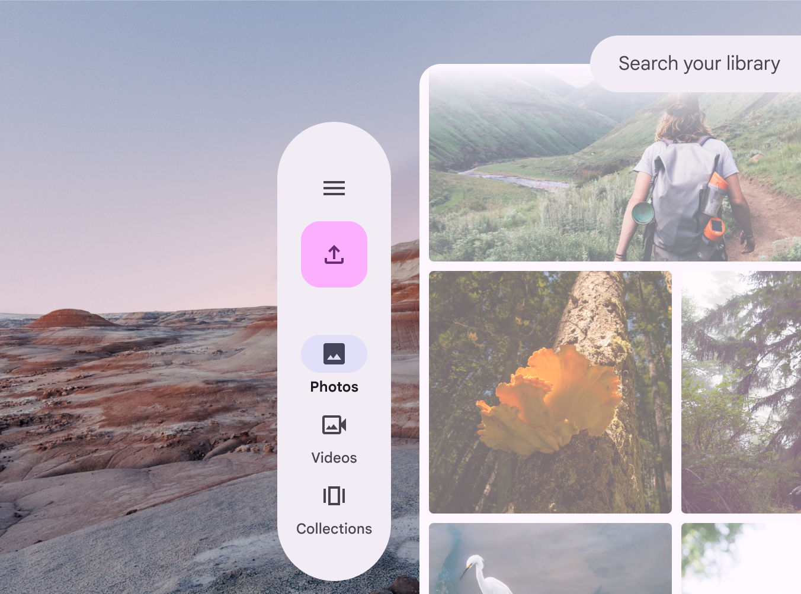
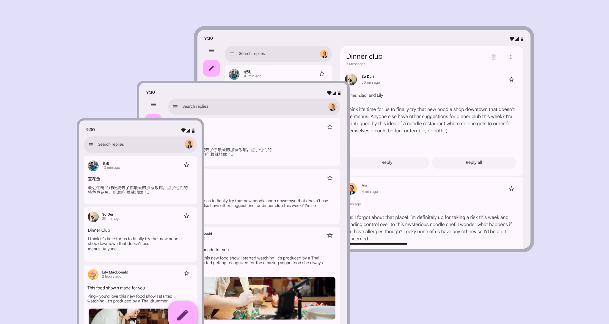
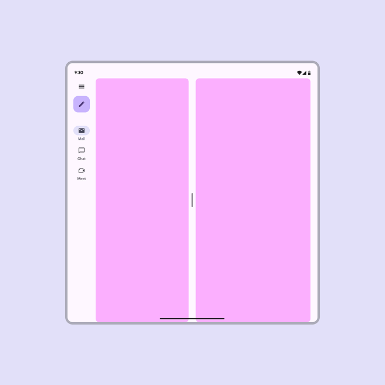
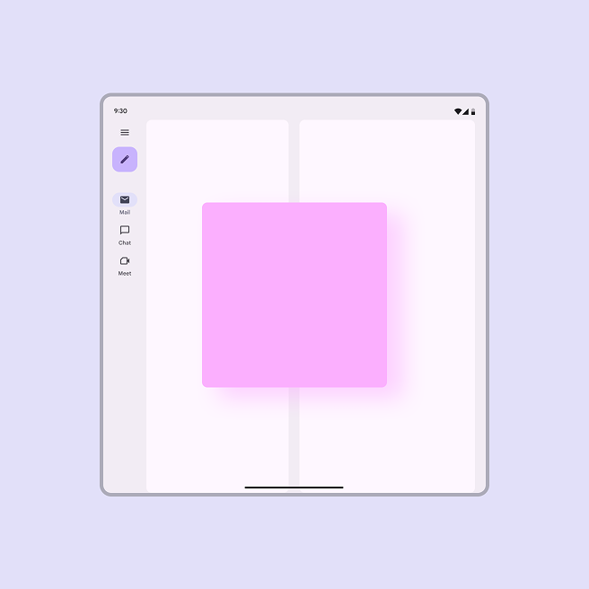
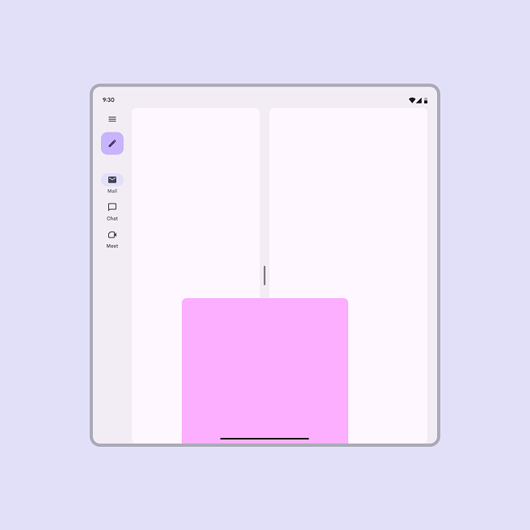
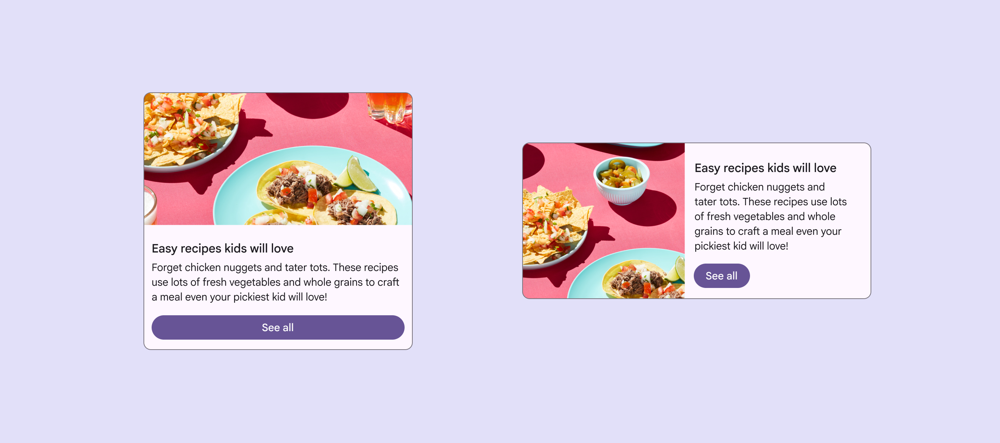
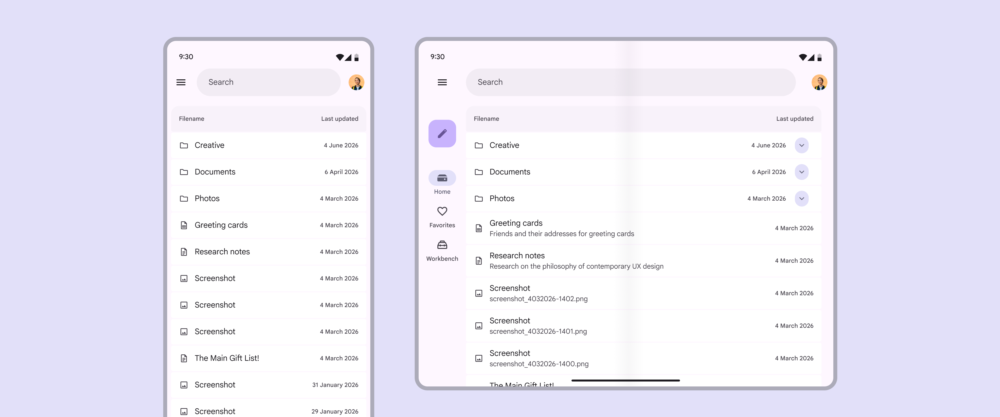
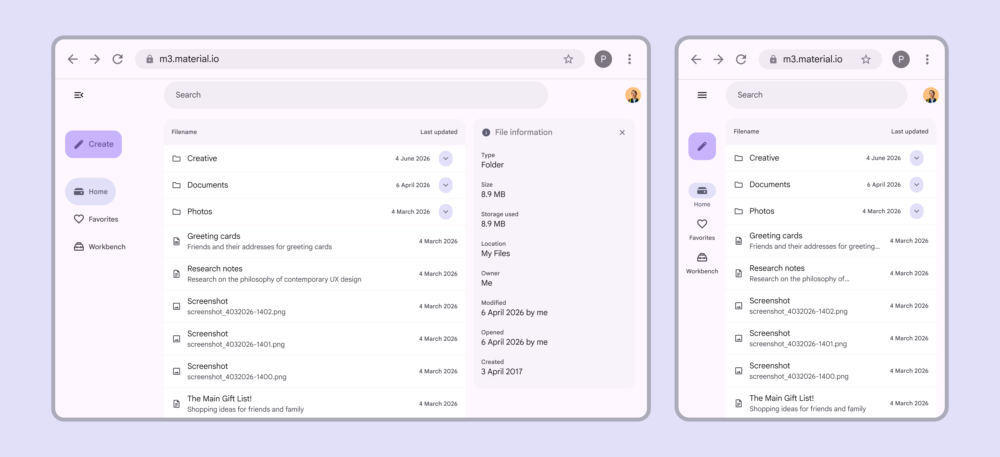

# Layout overview

> Layout is the visual and strategic arrangement of elements on a screen

## What’s adaptive design?

Adaptive design is a set of techniques to change an interface to fit different contexts. While responsive design scales a single layout to fit any screen, adaptive design customizes a product to optimize the experience on each device.

Designing adaptive experiences goes beyond customizable properties like color, typography, and shape. The structure, individual components, and entire layouts can adapt based on:

-   People: Individual preferences and settings

-   Devices: Watch, phone, foldable, tablet, desktop, or XR device

-   Usage: Screens dynamically change as a person resizes windows, changes orientation, or switches device

## Designing adaptive experiences

Layouts must be versatile, designed to adapt fluidly across three primary experience types: **mobile**, **desktop**, and **spatial**. Start with mobile and make sure your product's layout and components can scale and adapt seamlessly all the way up to spatial environments.

While each experience has different primary input methods, designs should be built with all inputs in mind—touch, pointer, and physical keyboard—since users may use your product in a desktop environment regardless of their device type.

### Mobile

Mobile experiences include phones, foldables, and tablets.

On mobile, an app can be shown in several window modes:

-   Full-screen: The app takes up the entire screen, the default for mobile

-   Split-screen: Two or more apps share the screen simultaneously, common on tablets and foldables

-   Bubbles: Floating windows that let people multitask without leaving their current context

Mobile layouts default to a full-screen window

### Desktop

Desktop experiences use free-form windows that adapt across breakpoints Breakpoints are opinionated window sizes where a layout changes to match available space, device conventions, and ergonomics (previously window size classes). [More on breakpoints](/m3/pages/breakpoints) .

People can use split screens, floating windows, and free-form windows for multi-tasking.

A tablet can convert to a desktop experience when a physical keyboard and mouse are connected. Similarly, Android mobile devices can transition into a desktop-like environment when connected to an external monitor.

A desktop layout can adjust from three to two columns to fit a medium breakpoint

### Spatial

Extended reality (XR) experiences use multiple free-form windows within virtually limitless screens. Immersive modes, such as Android XR’s [full space](https://developer.android.com/design/ui/xr/guides/foundations), allow components to be positioned freely in 3D space.

[More on XR design](/m3/pages/xr-design)

In an XR full space layout, a navigation rail can become an orbiter, and float to the side of the main pane

## Adaptive layouts

The Material 3 adaptive system uses panes Panes are layout containers that house other components and elements within a single app. A pane can be: fixed, flexible, floating, or semi permanent. [More on panes](/m3/pages/scaffold/panes/) and breakpoints Breakpoints are opinionated window sizes where a layout changes to match available space, device conventions, and ergonomics (previously window size classes). [More on breakpoints](/m3/pages/breakpoints) to organize content into adaptive layouts.

Panes are the building blocks of layout; a pane is a single destination in the product. For example, in a messaging app, the list of messages is one pane, and and a specific conversation thread is another.

Panes are the primary segments of a layout, and can change based on context

As the pane or window resizes—or as someone navigates a product—panes may change size, enter and exit the screen, and reorganize themselves to make the experience more usable or easier to navigate. These patterns are called adaptive strategies. Material has three adaptive strategies that create a cohesive experience across breakpoints: [show and hide](/m3/pages/scaffold/panes#bbe68948-bc05-4f7c-b870-6254439e4fd8), [levitate](/m3/pages/scaffold/panes#96bf71b8-04b8-4fff-97c7-9bc782fbf401), and [reflow](/m3/pages/scaffold/panes#e0a573e9-8c62-4772-8d81-47955ff83196).

Co-planar: Panes are displayed side by side

Floating: A pane is displayed above other panes or content, like a dialog

Docked: A pane is displayed above other panes and one of its edges extends beyond one side of the screen, like a bottom sheet

In Compose, the [Navigation 3](https://developer.android.com/guide/navigation/navigation-3) library allows multiple destinations to be shown on screen at the same time, and enables layouts to adapt seamlessly across window sizes and screens.

Navigation destinations remain consistent regardless of screen sizes with Navigation 3

### Adapting components

Components can adapt in appearance, placement, and behavior based on factors like:

-   Where components are placed in relation to their containers, content, and pane boundaries

-   How components use space

-   How components enable usage across different device and input types

Most Material components respond using three main strategies: resizing, showing and hiding, and presentation changes.

#### Resizing

Components should resize in response to their content and their placement in a layout.

For example, buttons Buttons let people take action and make choices with one tap. [More on buttons](/m3/pages/common-buttons/overview) may scale along with their parent container, or hug their contents and maintain a left or right alignment.

Buttons can hug their contents or span their containers based on context

#### Showing & hiding

Components should show and hide information, or collapse and expand to selectively reveal content that best suits the space.

For example, list Lists are continuous, vertical indexes of text and images. [More on lists](/m3/pages/lists/overview) items may reveal descriptions or other additional information as their parent container scales.

List items can reveal more text on a tablet

#### Presentation changes

Presentation changes include the orientation of elements and changes to specific properties, like color, type, and shape.

Components can also change configurations. For example, when a window size increases, a FAB Floating action buttons (FABs) help people take primary actions. [More on FABs](/m3/pages/fab/overview) can change to an extended FAB, and navigation rails Navigation rails let people switch between UI views on mid-sized devices. [More on navigation rails](/m3/pages/navigation-rail/overview) can be automatically expanded.

The extended FAB can change to a standard FAB when the window is smaller
