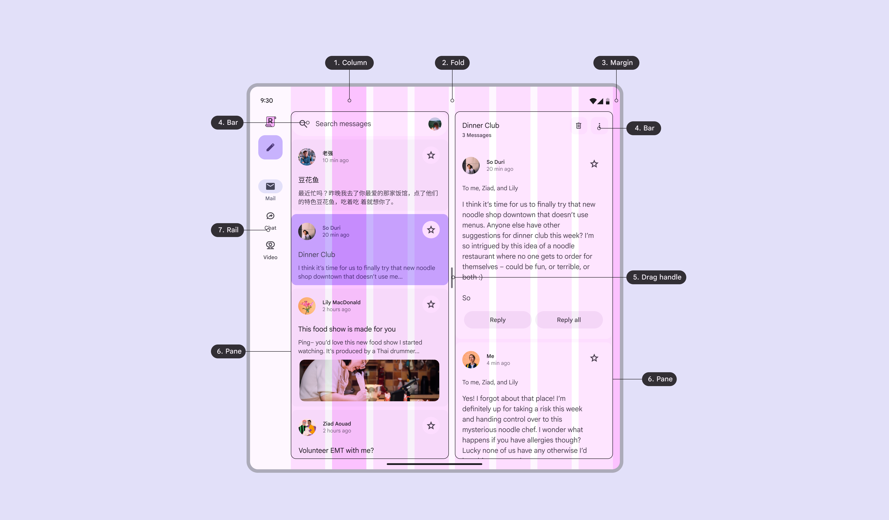
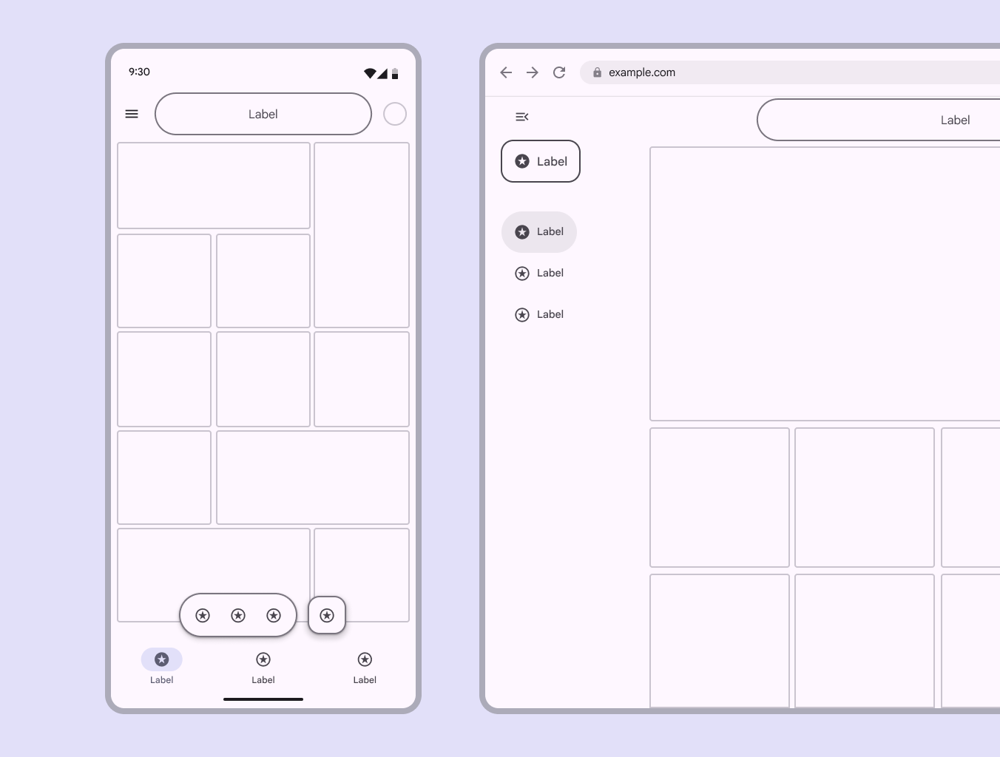

# Layout overview

> Layout is the visual and strategic arrangement of elements on a screen

-   Use layout to organize all elements in a screen, signal hierarchy, and draw attention to key actions

-   Adapt layouts to compact, medium, expanded, large, and extra-large  breakpoints Breakpoints are opinionated window sizes where a layout changes to match available space, device conventions, and ergonomics (previously window size classes). [More on breakpoints](/m3/pages/breakpoints) (previously window size classes)

-   Build from an established [canonical layout example](/m3/pages/canonical-examples)

-   Design for [bidirectionality](/m3/pages/bidirectionality-rtl) to support both left-to-right (LTR) and right-to-left (RTL) languages

-   Apply consistent arrangement, sizing, and spacing to create a functional layout structure

-   Material layout guidance is implemented on Android and applies to web

1.  Column

2.  Fold

3.  Margin

4.  Bar

5.  Drag handle

6.  Pane

7.  Rail

## Availability & resources

| **Type** | **Resource** | **Status** |
| --- | --- | --- |
| Design | [M3 Design Kit](https://www.figma.com/community/file/1035203688168086460) (Figma) | Available |
| [Spacing system & tokens](/m3/pages/spacing/overview) | Available |
| Implementation | [Jetpack Compose: Canonical layouts](https://developer.android.com/develop/ui/compose/layouts/adaptive/canonical-layouts) | Available |
| [Jetpack Compose: Rulers](https://developer.android.com/reference/kotlin/androidx/compose/ui/layout/Ruler) | Available |
| [Android Views (MDC-Android): Canonical layouts](https://github.com/android/user-interface-samples/tree/main/CanonicalLayouts) | Available |
| [Jetpack Compose: Navigation3](https://developer.android.com/guide/navigation/navigation-3/migration-guide) | Available |

## What's new

When creating new layouts, use the layout scaffold A scaffold is a fundamental UI design structure that provides a standard platform for assembling key screen components. [More on scaffold](/m3/pages/scaffold/overview) , start from a canonical layout example Designs for common screen layouts across breakpoints [More on canonical examples](/m3/pages/canonical-examples/overview) , and ensure layouts scale across breakpoints Breakpoints are opinionated window sizes where a layout changes to match available space, device conventions, and ergonomics (previously window size classes). [More on breakpoints](/m3/pages/breakpoints) .

##### **May 2026**


Layout structure and design:

-   Introduced layout scaffold, to create adaptive layouts efficiently

-   New adaptive guidelines for mobile, desktop, and spatial devices

-   Updated canonical layout examples

-   [Spacing system](/m3/pages/spacing/overview)

Naming:

-   Window size classes renamed to breakpoints

-   Responsive layout renamed to [adaptive design](/m3/pages/layout-overview/adaptive-design)

The Material layout scaffold enables layouts to adapt across different screen sizes

## Layout terms

-   **Adaptive design**: Techniques that allow an interface to dynamically respond to contexts like user preferences, device type, state, and breakpoints

-   **Bars**: Can frame the page to help people navigate through a product, and typically house the app bar and bottom navigation bar

-   **Bidirectionality**: A writing system that displays text and content from right-to-left (RTL) 

-   **Breakpoints**: Opinionated window sizes where a layout changes to match available space, device conventions, and ergonomics (previously window size classes)

-   **Column**: One or more vertical blocks of content within a pane

-   **Drag handle**: The component that resizes panes

-   **Fold**: A flexible area of the screen or a hinge that separates two displays on foldable devices

-   **Gap**: The space between components or elements within a container

-   **Margin**: The space between the edge of the screen and any elements inside of it

-   **Multi-window mode**: Enables multiple apps to share the same screen simultaneously

-   **Pane**: A layout container that houses other components and elements within a single app. A pane can be fixed, flexible, floating, or semi-permanent.

-   **Rails**: The perimeter space surrounding panes that holds key elements such as navigation rails, toolbars, and pane control

-   **Right-to-left (RTL) language**: Languages written and read right-to-left, such as Arabic, Hebrew, and Farsi, used by [over 2 billion people](https://www.w3.org/International/questions/qa-scripts.en.html)

-   **Rulers**: An opinionated set of global alignment lines that help organize building blocks in a layout

-   **Safety region**: Zones reserved for system UI elements outside the application space, such as status bar or gesture bar

-   **Scaffold**: A fundamental UI design structure that provides a standard platform for assembling key screen components

-   **Spacer**: The space between two panes on a foldable device
