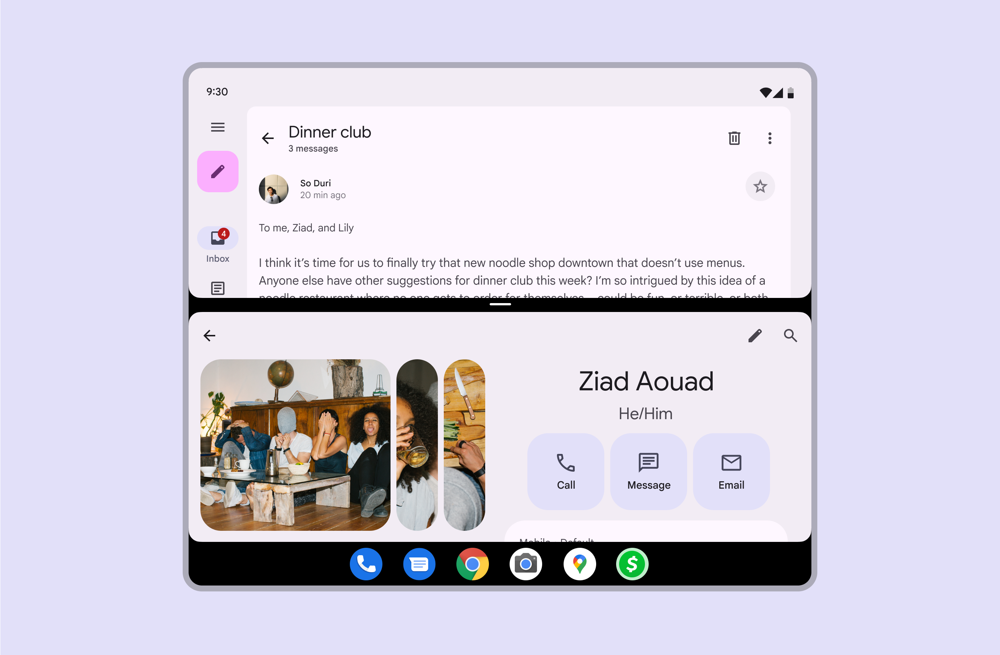
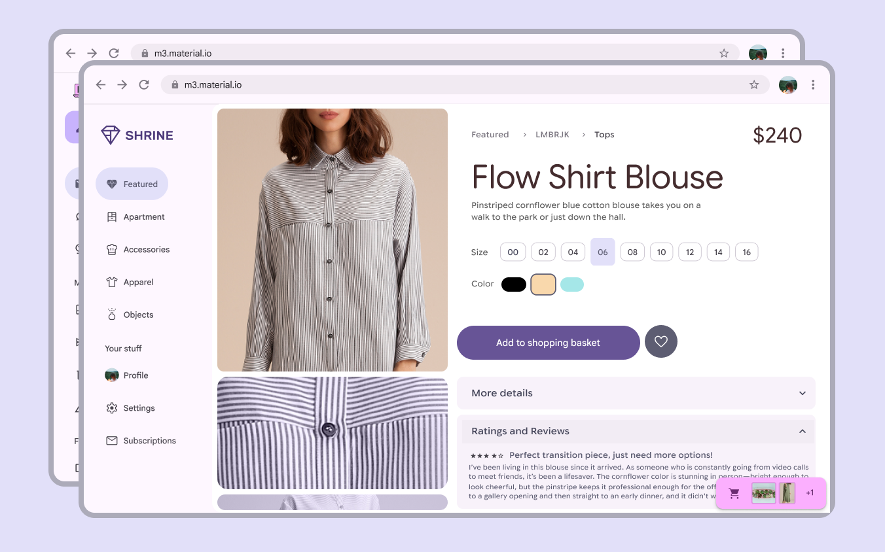
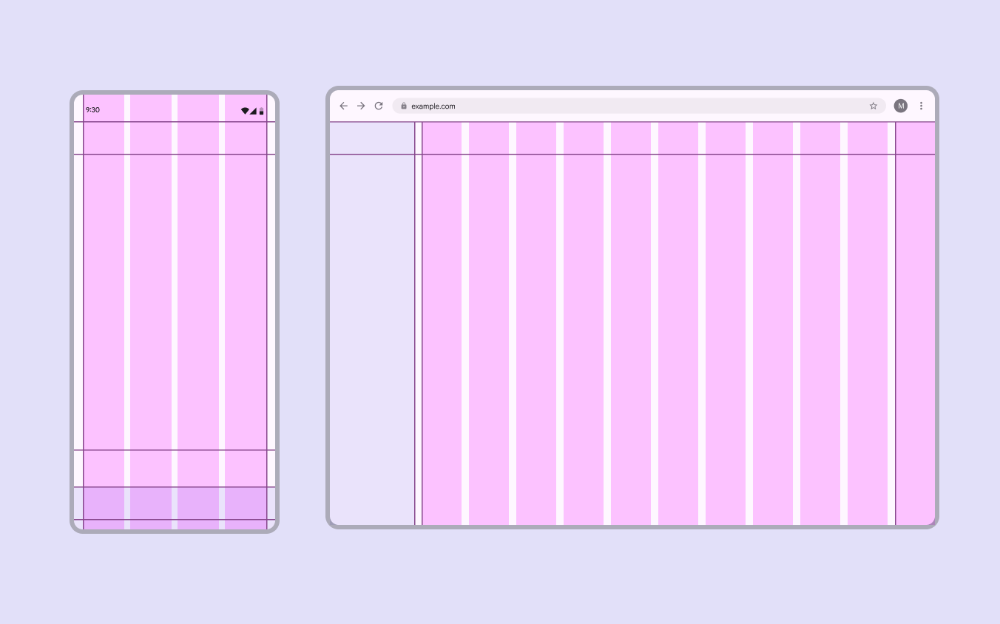
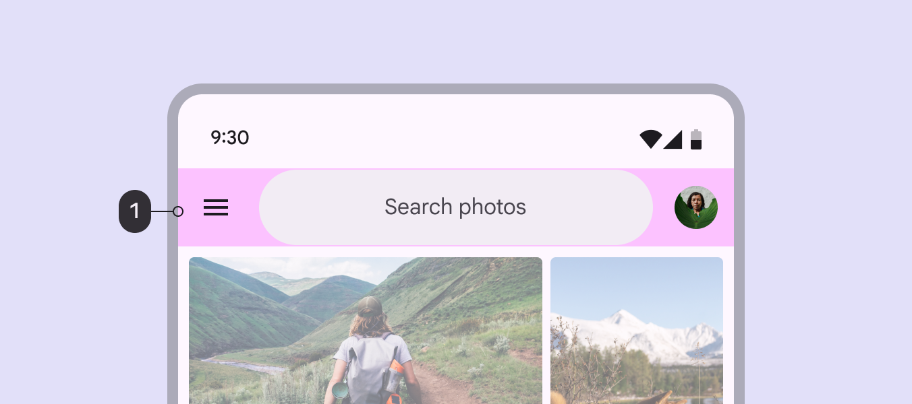
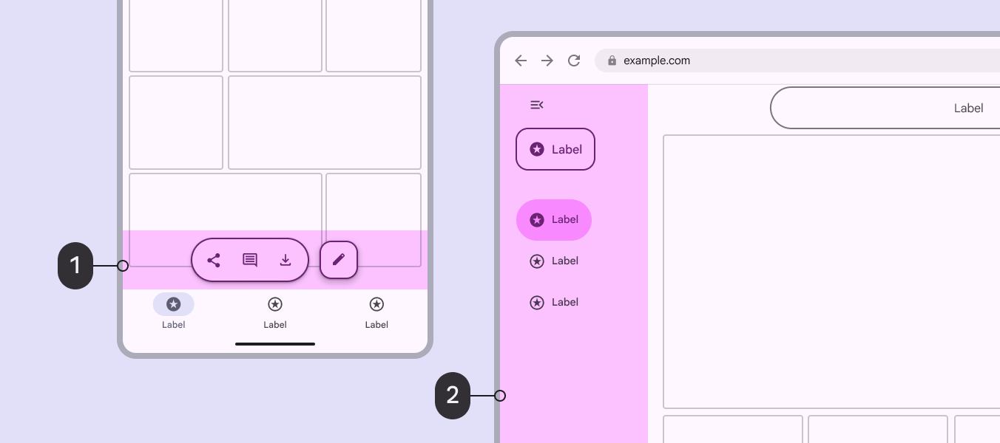
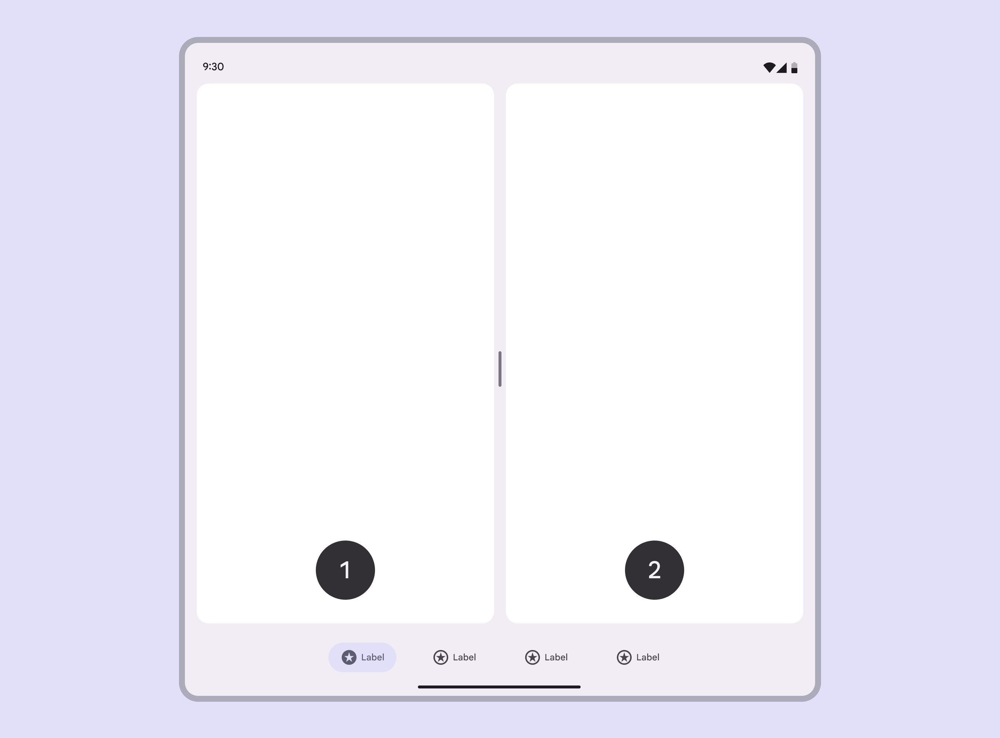
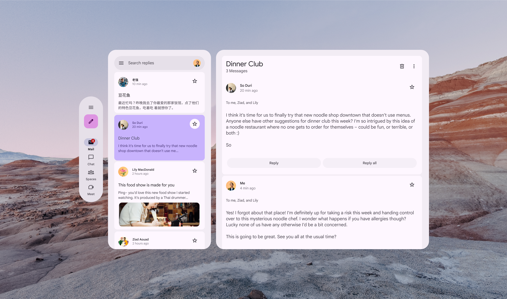
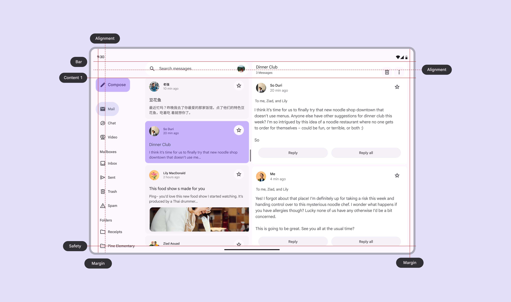

# Layout overview

> Layout is the visual and strategic arrangement of elements on a screen

## Parts of layout

### Windows

A window frames and contains an app or product.

Many systems support multi-window views, which display multiple apps at once.

[Multi-window support guide for Android](https://developer.android.com/develop/ui/compose/layouts/adaptive/support-multi-window-mode)

Two windows can be shown at once with a taskbar underneath

On desktop, windows can be resized and moved around freely. They should adapt to various screen sizes.

[More on adaptive design](/m3/pages/layout-overview/adaptive-design)

Windows can be moved around, resized, and adapt to different screen sizes

### Grids

The layout grid is the foundation for every layout. It provides a structural framework for organizing components, content, and actions.

Use the grid to:

-   Group related information in columns

-   Apply spacing consistently

-   Create focal points for primary actions

-   Align building blocks like bars, rails, and panes

[More on grids](/m3/pages/grids-spacing/grids)

Column count, width, and spacing dynamically adjust to different breakpoints

## Layout scaffold

### Bars

Bars help people navigate through a product. Use bars to:

-   Frame the main content

-   Contain an app bar App bars contain page navigation and information at the top of a screen. [More on app bars](/m3/pages/app-bars/overview) or navigation bar Navigation bars let people switch between UI views on smaller devices. [More on navigation bars](/m3/pages/navigation-bar/overview)

-   Span one or multiple panes 


[More on bars](/m3/pages/scaffold/bars)

1\. App bars are placed at the top of the screen to help people navigate by providing a description of the screen and 1–2 essential actions, like search or back navigation

### Rails

Rails are the next level in layout after bars, filling the perimeter space surrounding panes, or floating above them. They contain key elements such as navigation rails Navigation rails let people switch between UI views on mid-sized devices. [More on navigation rails](/m3/pages/navigation-rail/overview) , toolbars Toolbars display frequently used actions relevant to the current page. [More on toolbars](/m3/pages/toolbars/overview) , chat inputs, FABs Floating action buttons (FABs) help people take primary actions. [More on FABs](/m3/pages/fab/overview) , and other primary controls.

[More on rails](/m3/pages/scaffold/rails)

1.  On mobile, the rail region can contain a toolbar

2.  On desktop, the rail region can contain the navigation rail

### Panes

Just like panes of glass that make up a window in the real world, panes in Material make up most of the layout in a window.

All content must be in a pane. A layout can contain 1–3 panes of various widths, which adapt dynamically to the breakpoint Breakpoints are opinionated window sizes where a layout changes to match available space, device conventions, and ergonomics (previously window size classes). [More on breakpoints](/m3/pages/breakpoints/overview) (formerly window size class) and the person’s language setting. For right-to-left (RTL) languages, navigation components will be on the right.

People can navigate to or between panes. Presenting multiple panes at once can make a product more efficient and easier to use.

[More on panes](/m3/pages/scaffold/panes/)

1.  First pane

2.  Second pane

#### Containment

On most devices, panes can blend in with the background. This is called implicit grouping, and helps show relationships between panes.

Explicit grouping uses distinct colors or outlines to visually delineate content.

[More on spacing to group content](/m3/pages/grids-spacing/spacing#e7e6d1ac-031a-4757-afcf-b223f23654ea)

In multiple-pane layouts, use color to show emphasis and close spacing to group related content

In spatial environments, panes use a container color to separate them from the passthrough or virtual environment.

Use contrast between panes and the background to create a spatial effect in XR

### Drag handles

Drag handles can be used to resize panes in a layout. They can:

-   Adjust the width of flexible panes

-   Fully collapse and expand fixed panes to quickly switch between a single and two-pane layout

Drag handles can adjust pane size in a list-detail layout

### Rulers

Rulers are a set of global alignment lines. They help to align elements across all layers of the layout.

[How to implement rulers in Compose](https://developer.android.com/reference/kotlin/androidx/compose/ui/layout/Ruler)

Rulers ensure global alignment across a product, keeping margins and placement consistent
