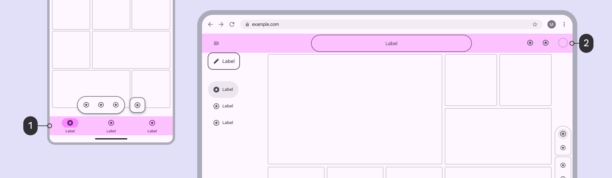
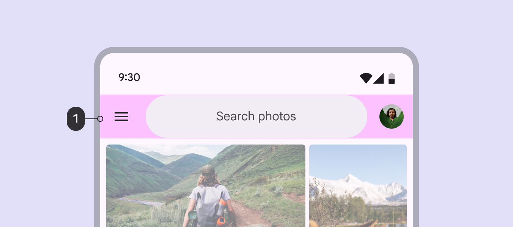
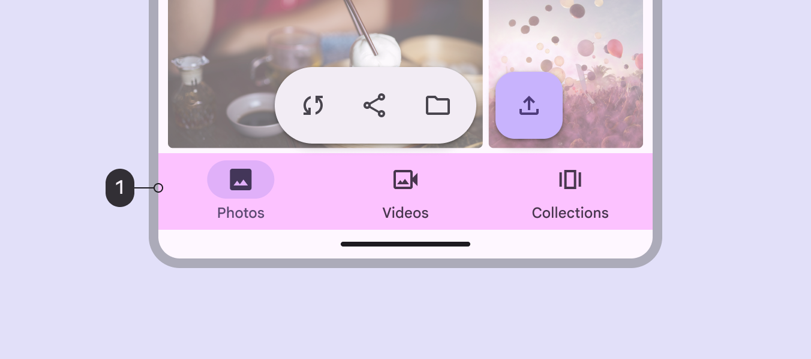
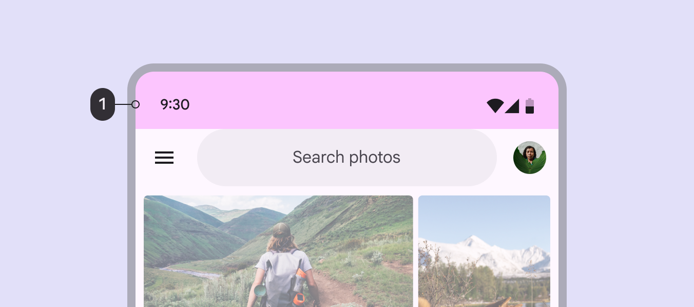

# Scaffold

> A fundamental UI design structure that provides a standard platform for assembling key components

## Bars

Bars frame the screen to help people navigate through a product. They typically contain an app bar App bars contain page navigation and information at the top of a screen. [More on app bars](/m3/pages/app-bars/overview) or bottom navigation bar Navigation bars let people switch between UI views on smaller devices. [More on navigation bars](/m3/pages/navigation-bar/overview) .

Bars can span a single pane or across the full width of a window.

1.  A navigation bar occupies the bottom bar region on mobile

2.  An app bar occupies the top bar region on the web

App bars are placed at the top of the screen to help people navigate, providing a title and 1–2 essential actions like search or back.

1.  The app bar sits at the top of the screen, outside of the safety region

Navigation bars let people switch between 3–5 primary UI views at compact Window widths smaller than 600dp, such as a phone in portrait orientation. [More on compact breakpoints](/m3/pages/breakpoints/compact) or medium Window widths from 600dp to 839dp, such as a tablet or foldable in portrait orientation. [More on medium breakpoints](/m3/pages/breakpoints/medium) breakpoints.

1.  The navigation bar sits at the bottom of the screen, above the safety region

### Safety region

Bars are placed adjacent to the safety regions, which contain [system UI](https://developer.android.com/develop/ui/compose/system/system-bars) elements.

The safety region shouldn’t contain primary content.

1.  The safety region—at the top and bottom edges of the screen on compact devices—protect system UI elements
