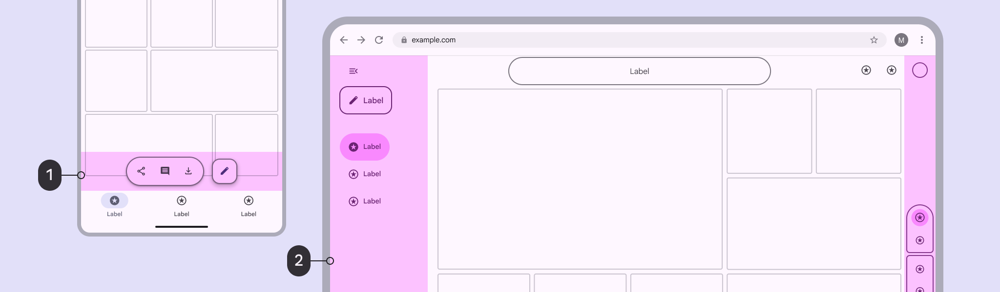
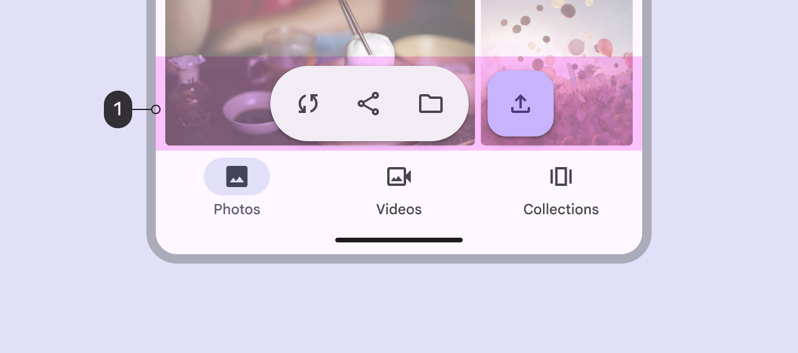
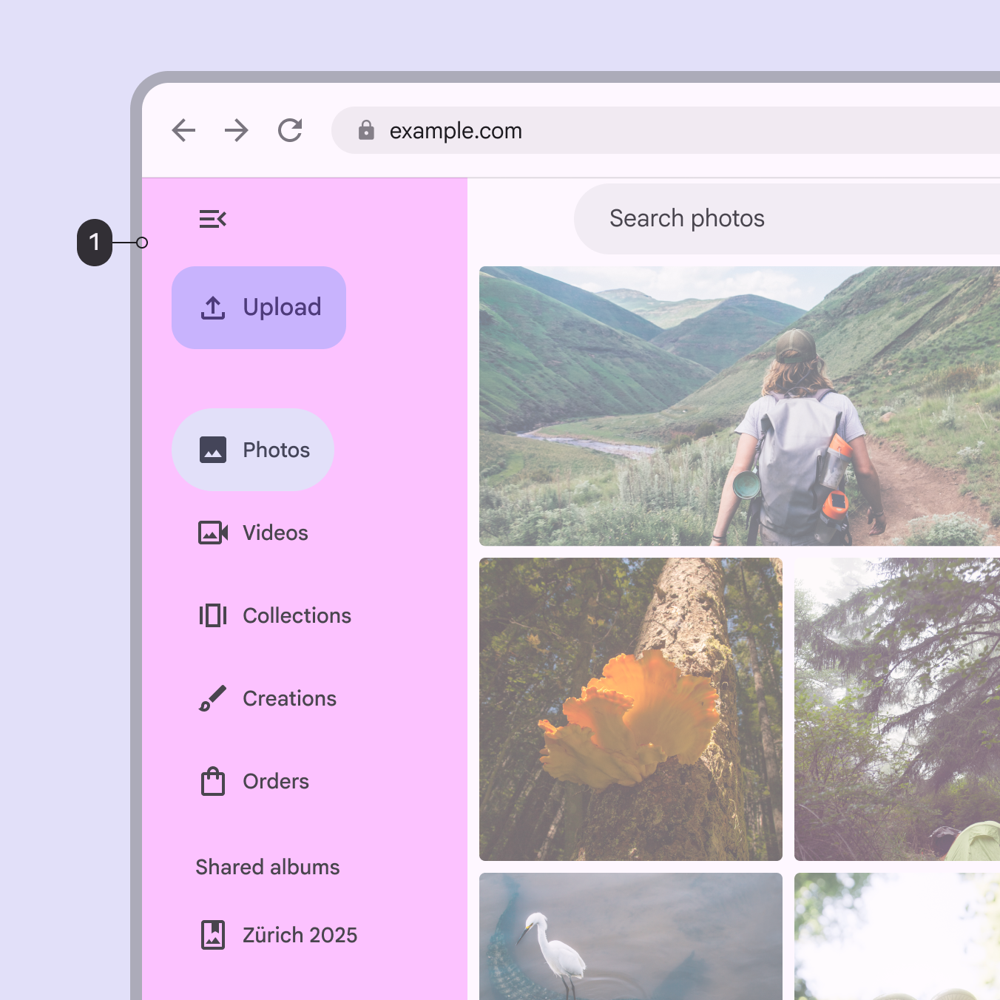
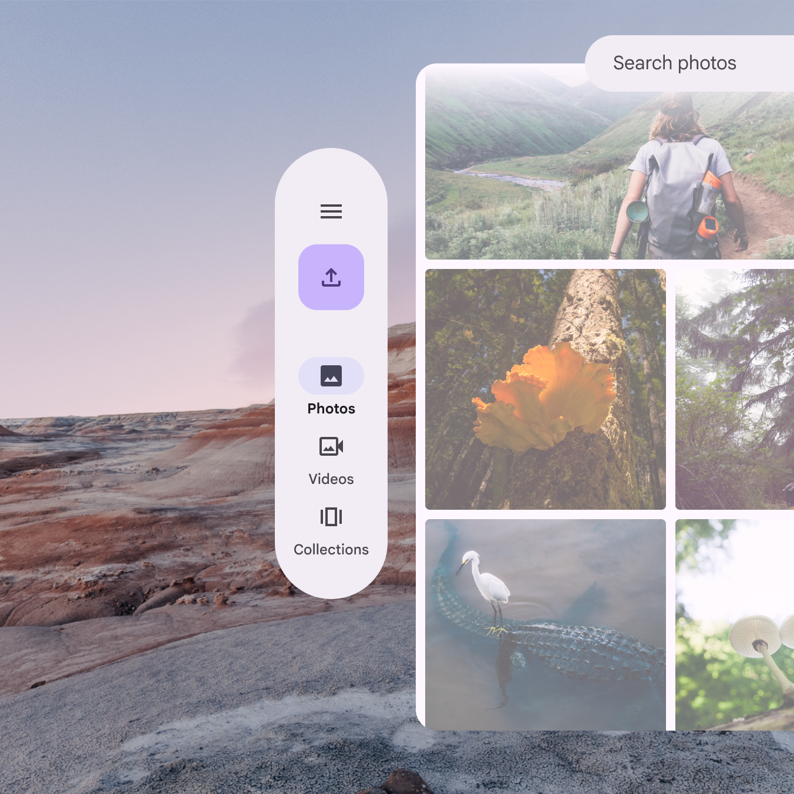

# Scaffold

> A fundamental UI design structure that provides a standard platform for assembling key components

## Rails

Rails are the next level in layout after bars, filling the perimeter space surrounding panes or floating above them.

Rails occupy the spaces immediately adjacent to bars:

1.  A toolbar sits above the navigation bar

2.  A navigation rail and companion rail occupy the leading and trailing sides of a large window

On compact screens, the top and bottom rail regions can be used for components like:

-   Toolbars Toolbars display frequently used actions relevant to the current page. [More on toolbars](/m3/pages/toolbars/overview)

-   Chat inputs

-   FABs Floating action buttons (FABs) help people take primary actions. [More on FABs](/m3/pages/fab/overview)

-   Other primary controls related to an individual screen

1.  On mobile, a toolbar can float in the rail region

On larger screens, there are rails on the sides of the screen (as well as top and bottom). The leading side rail region commonly holds the navigation rail Navigation rails let people switch between UI views on mid-sized devices. [More on navigation rails](/m3/pages/navigation-rail/overview) .

At larger breakpoints, the leading rail region can be occupied by an expanded navigation rail

The rail region on the trailing side of a large screen can hold supporting controls or actions that modify or relate to the content in a pane.

The rail region can also be occupied by a vertical toolbar or other controls

In [XR](/m3/pages/xr-design/overview/), rail components can become [orbiters](https://developer.android.com/design/ui/xr/guides/spatial-ui#orbiters), which float outside the visible content area.


In full space, an XR navigation rail can float outside the main content as an orbiter
