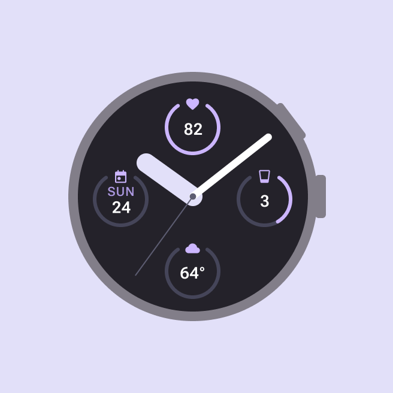
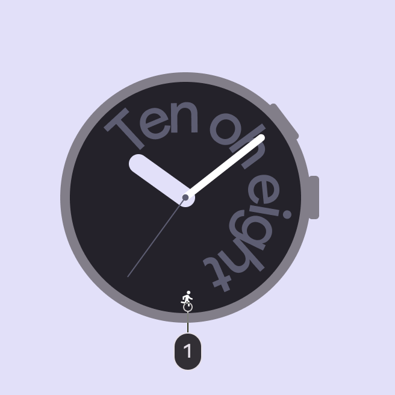
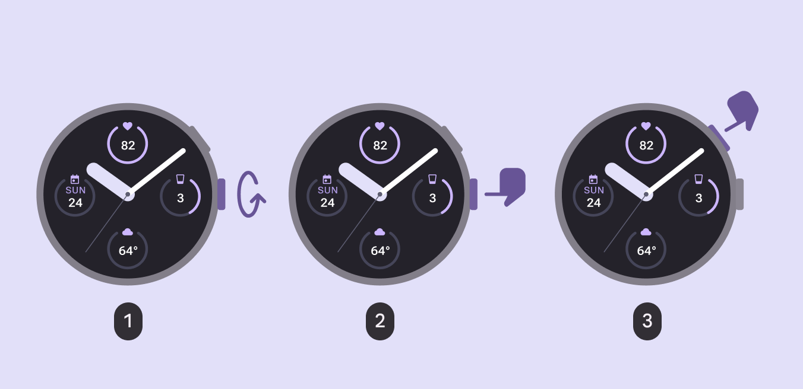
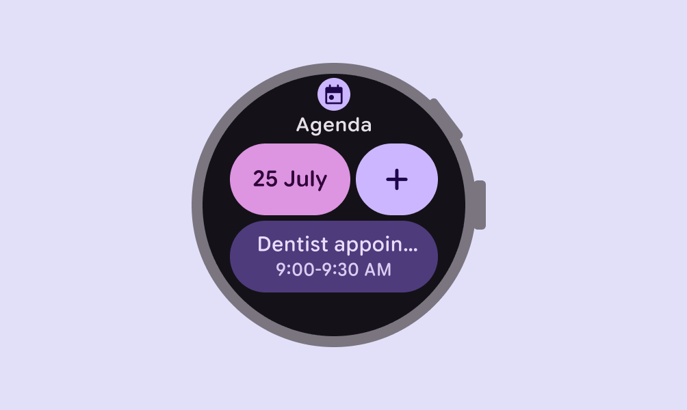
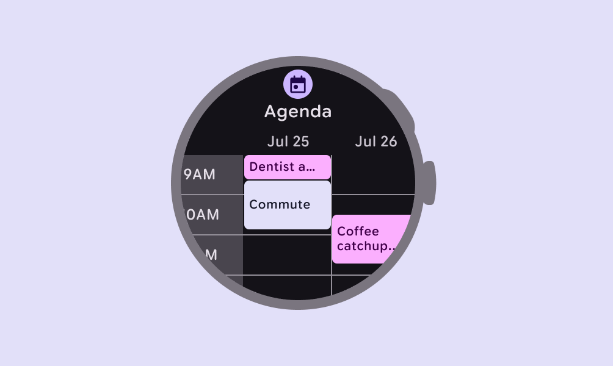
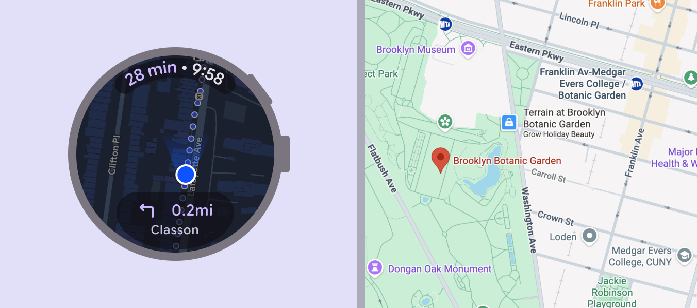
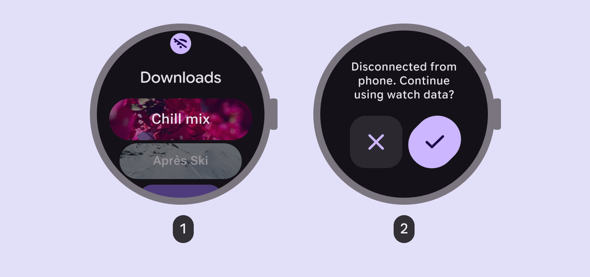
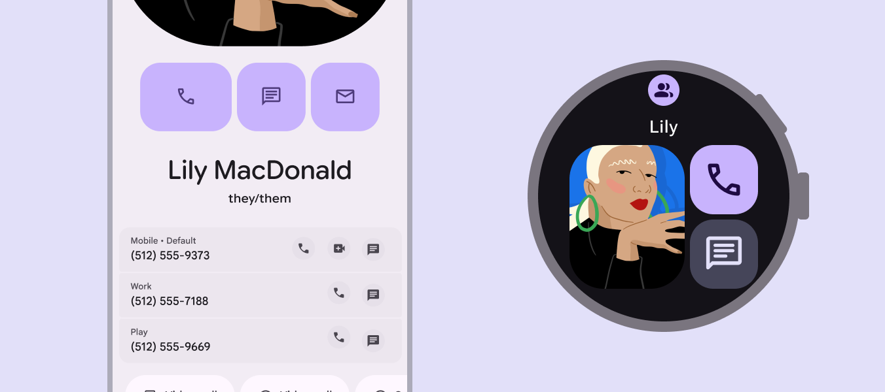
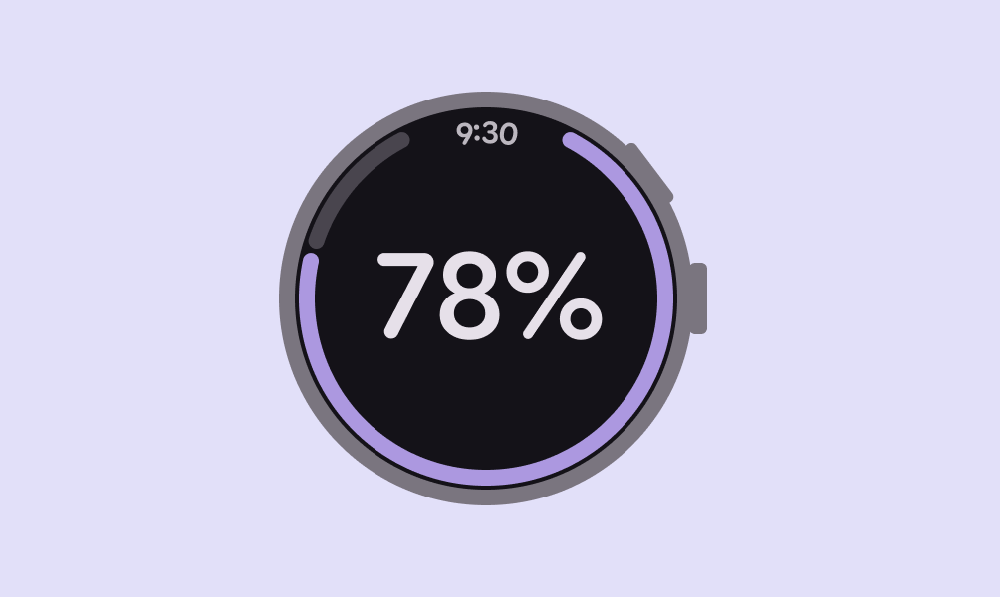

# Design for watches

> Watches have special design considerations and interaction patterns

## Resources

| Type | Resource |
| --- | --- |
| Design | [Get Started with M3 Expressive](https://m3.material.io/get-started) |
| [UI Design for Wear OS](https://developer.android.com/design/ui/wear/guides/get-started/design-for-wearables) |
| [Figma Design Kits for Wear OS](https://developer.android.com/design/ui/wear/guides/get-started/design-kits) |
| Implementation | [Android Developers: Wear OS](https://developer.android.com/training/wearables) |
| [Jetpack Compose for Wear OS](https://developer.android.com/training/wearables/compose?version=3) |

## Anatomy

### The watch face

Watch faces display the time, as well as  other information and can provide access to other functions through apps and tiles.

They can also include complications, self-contained details that can show contextual info like heart rate or progress.

Ongoing activities on the watch face show in-progress actions, like a stopwatch countdown or a workout timer.

**Complications** are details on the watch face that can be customized for style or function

**1\. Ongoing activities**, like timers, media players, or workouts, can be accessed from the watch face

### Physical buttons

Wearable devices can have a variety input surfaces, which include physical buttons and controls.

1.  Rotating side buttons: Used for volume control, or to scroll through options or lists

2.  System buttons: Dedicated to OS functions like powering on and off, and cannot be customized

3.  Multifunction buttons: Used by apps for custom actions like starting and stopping a stopwatch

## Design principles

-   Tailor layouts for different screen sizes with [adaptive design](https://developer.android.com/design/ui/wear/guides/foundations/adaptive-design)

-   Design for short interactions to conserve battery

-   Focus on one or two tasks at a time rather than a full app experience

-   Test designs in situations that involve movement to make sure the design is usable at a glance

check Do

At-a-glance views allow people to quickly see calendar events

close Don’t

Don't create complex and detailed apps such as a calendar grid

### Always relevant

Watches are always with people. Consider how to update app content based on context, such as time, place, and activity.

Navigation on a watch complements the experience on a phone

### Works offline

Design for slow connections and offline use, such as exercising and commuting.

The network state can be communicated through:

1.  An offline icon

2.  A dialog

## Interaction patterns

### Cross-device experiences

Watches are often dependent on connected phones for functionality or complex interactions. In some cases, a watch and a phone are used together to accomplish different parts of the same task.

Consider how experiences can be consistent and complement the strengths of each device.

[More on multidevice development for Android](https://developer.android.com/multi-device-development)

check Do

Consider which actions are appropriate for each device

### Always on displays

Watches can have always on displays, which allow ambient content to be shown when the watch isn’t in use.

This are especially helpful for ongoing experiences like a timer or a workout that should remain in view. Because they remain on the screen for long time periods, consider limiting the number of pixels that are illuminated.

[More on always-on apps and system ambient mode in Wear OS](https://developer.android.com/training/wearables/always-on)

Limit the number of illuminated pixels for a display that's always on
