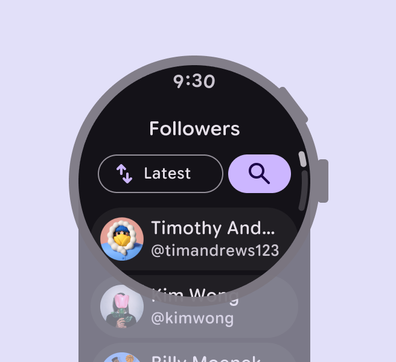
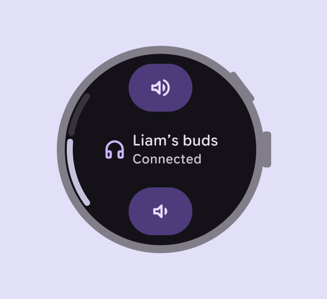
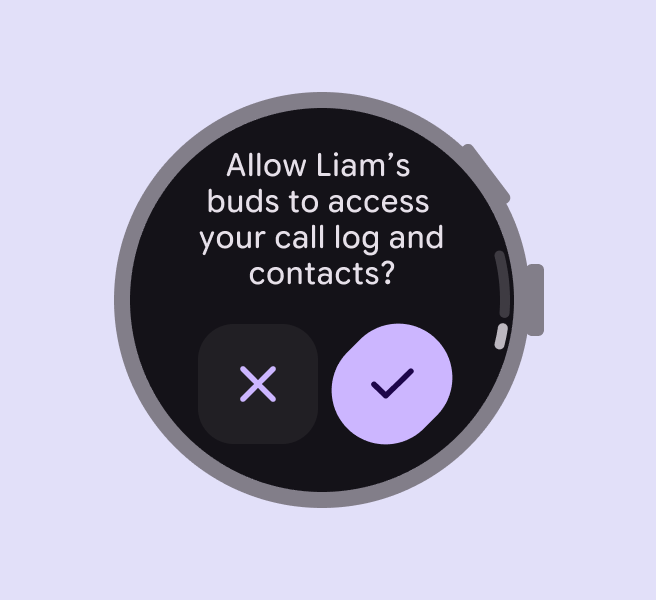
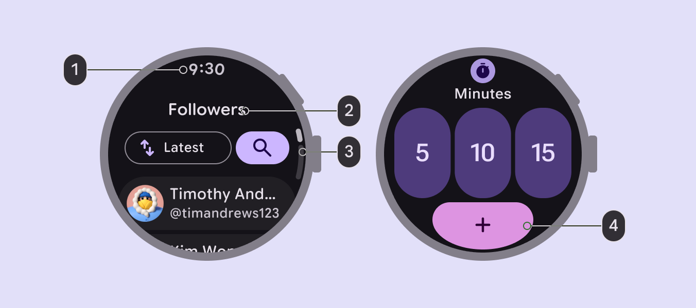
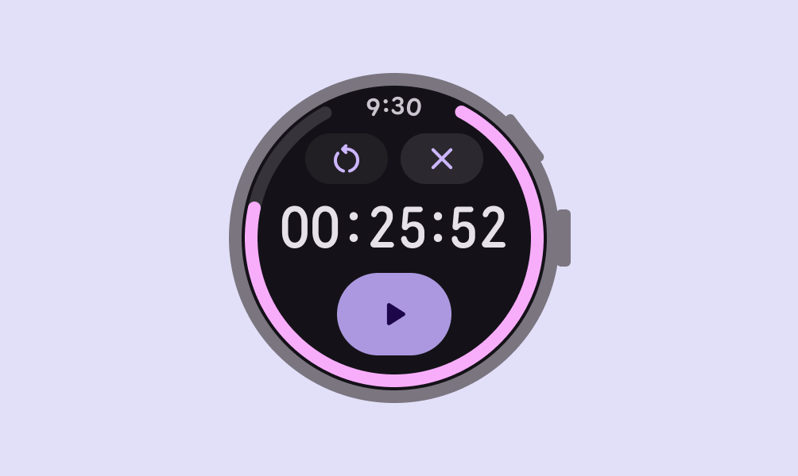
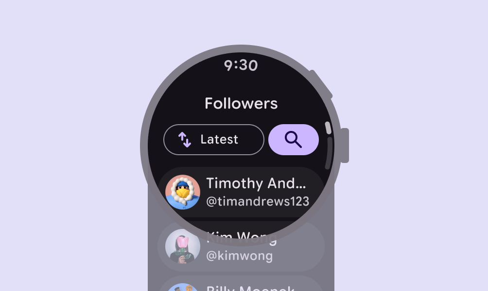
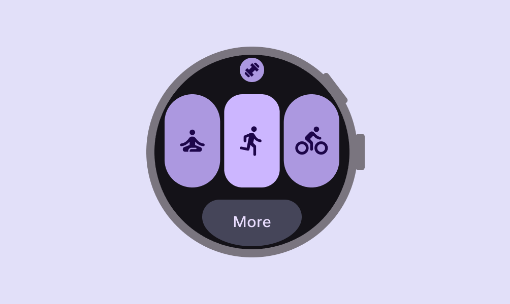
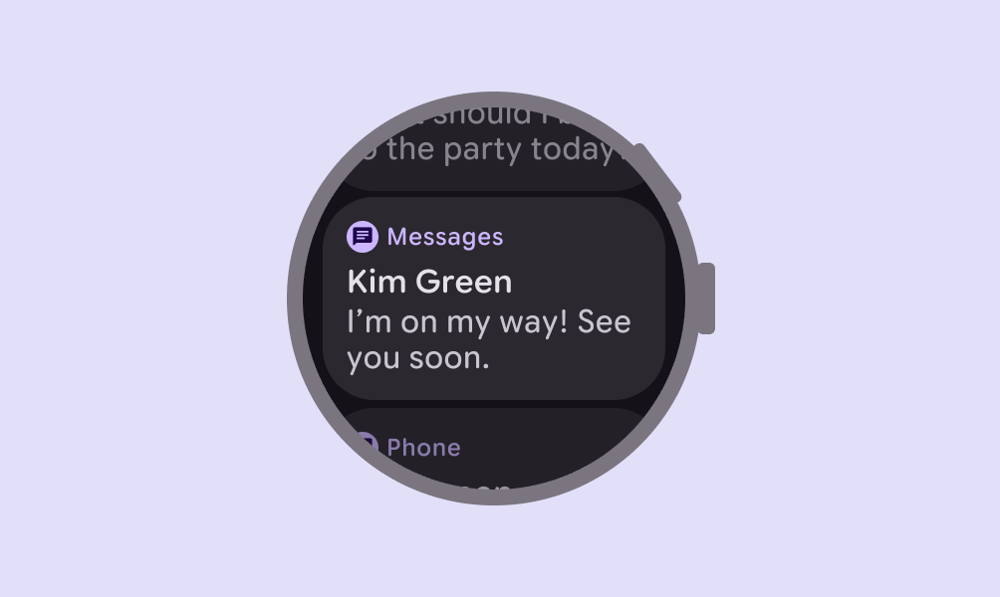
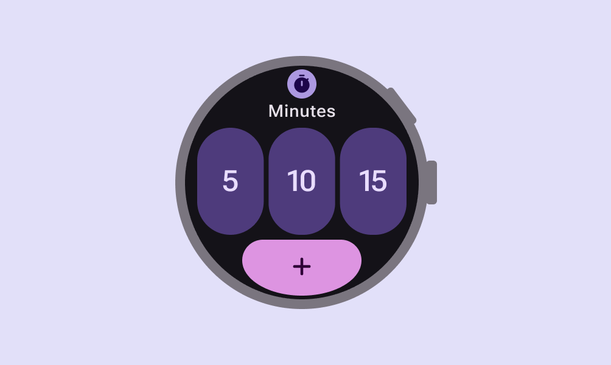
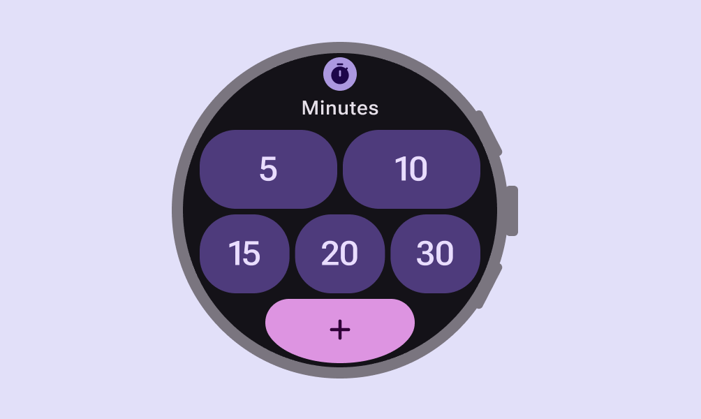

# Design for watches

> Watches have special design considerations and interaction patterns

## Resources

| Type | Resource |
| --- | --- |
| Design | [Wear OS common design layouts](https://developer.android.com/design/ui/wear/guides/foundations/common-layouts) |
| [Adaptive layout for Wear OS](https://developer.android.com/design/ui/wear/guides/foundations/adaptive-design) |
| [Figma Design Kit for Wear OS Apps](https://www.figma.com/community/file/1506418396052412186) |
| [Figma Design Kit for Wear OS Tiles](https://www.figma.com/community/file/1507852095734722321/m3-wear-os-tiles-design-kit?fuid=1348995927136540612) |
| Implementation | [Android Developers: Wear OS](https://developer.android.com/training/wearables) |

## Layout principles

**Prioritize content**

Place the most important information at the top of the screen.

**Limit choices**

Reduce the number of actions to prevent decision fatigue. Focus on critical tasks to help people get things done within seconds.

**Simplify navigation**

Use a clear, shallow hierarchy so people don't get lost in complex menus. Aim to display content and navigation inline.

## Standard layouts

For scrolling and non-scrolling apps:

-   The time is shown on most app screens

-   Edge-hugging buttons are used for round screens

-   Show an indicator if more content is available on a scrolling apps

Wear OS offers [Figma Design Kits](https://developer.android.com/design/ui/wear/guides/get-started/design-kits) for standard layouts, with components, styles, and variables.

1.  Time text

2.  Page title

3.  Scroll indicator

4.  Action button

### Non-scrolling layouts

Non-scrolling layouts are for focused tasks or single-screen interactions where all content fits within the display, such as:


-   Media players

-   Pickers and switchers

-   Fitness tracking screens

-   Confirmation dialogs 

[More on non-scrolling layouts for Wear OS](https://developer.android.com/design/ui/wear/guides/surfaces/apps/layouts/scrolling)

Use non-scrolling layouts for focused tasks like a timer

### Scrolling layouts

Scrolling layouts can show content that exceeds the screen height, such as lists or dialogs. These might include:

-   Message threads

-   Contact lists

-   Menu options

[More on scrolling layouts for Wear OS](https://developer.android.com/design/ui/wear/guides/surfaces/apps/layouts/scrolling)

Lists use scrolling layouts to show additional options

### Tiles

Tiles (or widgets) are designed for glanceability. Use them to show timely updates or to help people perform frequent tasks quickly, such as checking progress towards a goal or viewing the weather.

Tiles are accessible with a swipe from the watch face. They have a fixed screen height and don't scroll.

[More on tiles for Wear OS](https://developer.android.com/design/ui/wear/guides/foundations/common-layouts/tiles)

Use tiles for quick access to to a few key options

### Notifications

Notifications can be expanded to offer more interactions, such as replying to a message, opening a location on a map, or playing a song.

Wear OS provides notification templates for instant messaging and calendar events.

[More on notifications for Wear OS](https://developer.android.com/training/wearables/notifications)

Notifications should offer easy access to more interactions

### Adaptive layout

Adaptive design allows apps to adapt to different screen sizes and device contexts. On Wear OS, this means apps scale and reorganize to maximize the available space on both small and large round displays. [The Material 3 Compose component library](https://developer.android.com/jetpack/androidx/releases/compose-material3?_gl=1*1ntglil*_ga*NzMzMjg1Nzc1LjE3NDg5MTM2NjI.*_ga_QPQ2NRV856*czE3NjQ3MDkwMjUkbzc2JGcxJHQxNzY0NzEwNjAyJGo0MCRsMCRoMA..) has built-in adaptive behavior.

-   Design for small screens first: Start by designing for the smallest common screen size

-   Use percentages: Define margins and padding using percentages rather than fixed pixel values. This prevents clipping and ensures content remains centered and proportional as the screen size increases.

-   Add value on larger screens: Use the extra space on screens larger to show more content, such as additional buttons, text lines, or data visualizations

-   Test all font sizes: Font scaling and accessibility settings such as bold text may cause changes in the size of UI elements

[More on adaptive layout for Wear OS](https://developer.android.com/design/ui/wear/guides/foundations/adaptive-design)

Design for small screens first, starting with a 192dp size watch

Show more content on devices that are larger than 225dp
