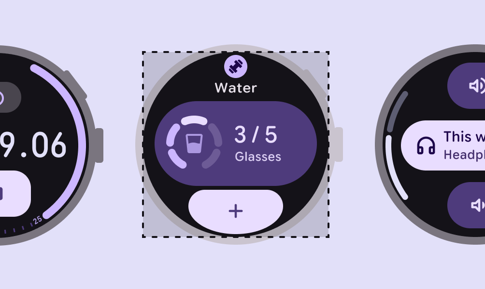
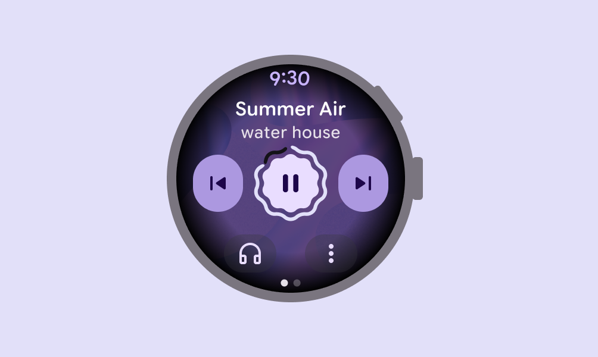
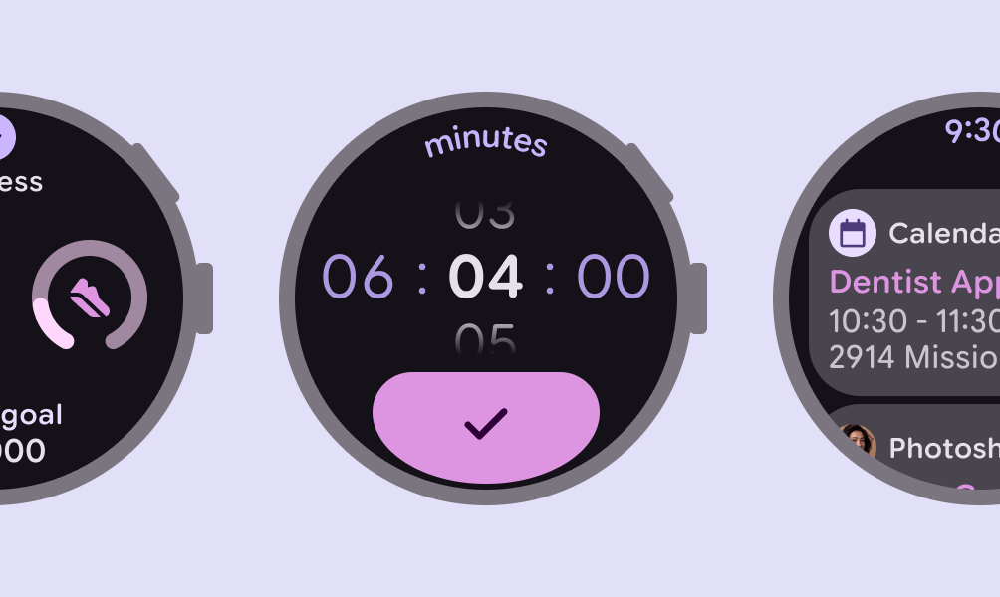

# Design for watches

> Watches have special design considerations and interaction patterns

## Resources

| Type | Resource |
| --- | --- |
| Design | [About M3 Expressive](https://m3.material.io/) |
| [M3 Expressive on Wear OS](https://developer.android.com/design/ui/wear/guides/get-started) |
| [Figma Design Kits for Wear OS](https://developer.android.com/design/ui/wear/guides/get-started/design-kits) |
| Implementation | [Android Developers: Wear OS](https://developer.android.com/training/wearables) |
| [Jetpack Compose for Wear OS](https://developer.android.com/training/wearables/compose?version=3) |

## New in GM3 Expressive

Design expressive layouts for watches with harmonious shape, animation, color, and typography treatments. All examples shown here are based on Material for Wear OS. [More on M3 Expressive on Wear OS](https://developer.android.com/design/ui/wear/guides/get-started)

### Designed for round screens

A new shape system with edge-hugging containers and buttons creates variety and visual balance on round screens.

[More on shape system for Wear OS](https://developer.android.com/design/ui/wear/guides/get-started/apply)

Controls for smartwatches can adapt to the form factor

### Expressive motion & springs

A new physics-based system makes interactions and transitions feel more alive, fluid, and natural.

[More on M3 motion physics](/m3/pages/motion-overview/how-it-works)

Use motion to make interactions intuitive

### Shape morphing

With shape morphing, controls respond to show interaction. Containers change corner radius.

[More on M3 shape morphing](/m3/pages/shape/shape-morph)

Selected buttons change shape to show interaction

### Rich color

Dynamic color and deep tonal palettes are applied in a system of color roles Material has 26 standard color roles organized into six groups: primary, secondary, tertiary, error, surface, and outline. [More on color roles](/m3/pages/color-roles#8b68e9f2-2db2-408f-b002-55adba3b6299) to create depth and variety.

[More on color for Wear OS](https://developer.android.com/design/ui/wear/guides/styles/color)

The color system includes three main colors and specific color roles to create depth and variety

### New type roles

Along with an updated and optimized [type scale](https://developer.android.com/design/ui/wear/guides/styles/typography/type-scale-tokens), new styles serve specific use cases for watches:

-   [Arc](https://developer.android.com/design/ui/wear/guides/styles/typography/apply#arc-styles) text for curved titles

-   [Numeral](https://developer.android.com/design/ui/wear/guides/styles/typography/apply#numeral-styles) text for bigger, stylized text

[More on typography for Wear OS](https://developer.android.com/design/ui/wear/guides/styles/typography)

The baseline type scale is optimized for round screens to keep text legible in a compact space
