# Design for watches

> Watches have special design considerations and interaction patterns

## Resources

| Type | Resource |
| --- | --- |
| Design | [M3 Expressive on Wear OS](https://developer.android.com/design/ui/wear/guides/get-started) |
| [Typography for Wear OS](https://developer.android.com/design/ui/wear/guides/styles/typography) |
| [Color for Wear OS](https://developer.android.com/design/ui/wear/guides/styles/color) |
| [Motion for Wear OS](https://developer.android.com/design/ui/wear/guides/get-started/apply#shape-motion) |
| Implementation | [Android Developers: Wear OS](https://developer.android.com/training/wearables) |
| [Jetpack Compose for Wear OS](https://developer.android.com/training/wearables/compose?version=3) |

## Typography

GM3 Expressive adds two type styles specially designed for watches. [More on the type scale for Wear OS](https://developer.android.com/design/ui/wear/guides/styles/typography/type-scale-tokens)

### Numerals

Numeral text styles display numbers, usually only a few digits at a time. This text can take on more expressive properties at larger display sizes without the accommodations usually required by text that must be localized.

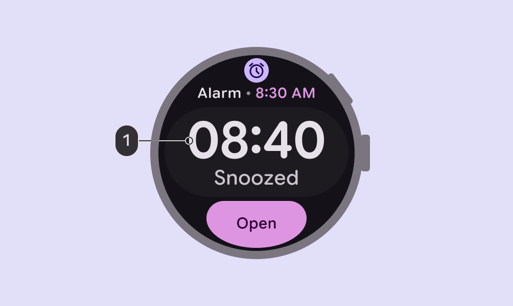

1.  Numeral Large

### Arc text

Arc text is specially designed for text following a curved path on a round screen, such as page titles, confirmation overlays, or a call to action. It optimizes character spacing for text displayed along a curve at the top or bottom of a round screen.

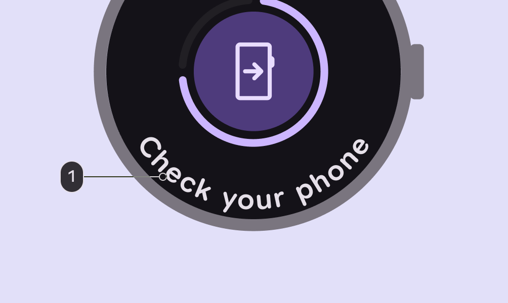

1.  Arc Large

## Color

Material for Wear OS provides a custom [color system](https://developer.android.com/design/ui/wear/guides/styles/color/system) to create vibrant experiences and clear visual hierarchy.

### Build from black

Watches are designed with a black background, instead of the tinted background that phones use.

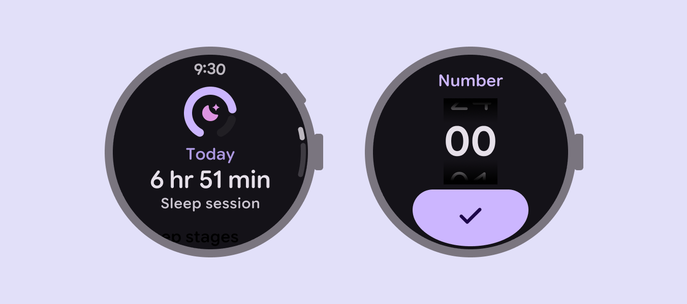

Watches use a black background to conserve battery

### Color roles

Since watches are used throughout the day, color tokens Design tokens are the building blocks of all UI elements. The same tokens are used in designs, tools, and code. [More on tokens](/m3/pages/design-tokens/overview) for Wear OS are specifically tailored for dark themes in low-light environments and light themes for daylight environments.

[More on color roles for Wear OS](https://developer.android.com/design/ui/wear/guides/styles/color/roles-tokens)

check Do

Buttons with (2) **on primary** on (1) **primary** and (4) **on** **primary container** on (3) **primary container** stay legible as the contrast level changes

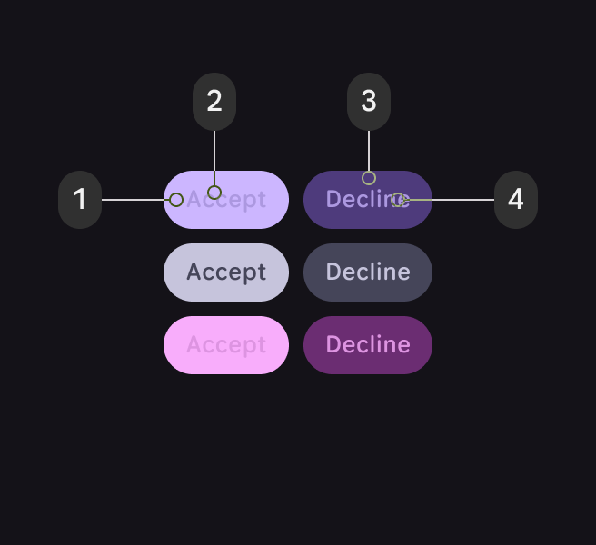

close Don’t

Buttons with (2) **primary dim** on (1) **primary** or (4) **primary dim** on (3) **primary container** become illegible as contrast levels shift

### Recommended color combinations for Wear OS

Below are some common color pairings that can help establish priority, function, and elevation.

-   Use **primary dim** to highlight important elements and **tertiary** to provide standout feedback, such as tap responses

-   When the main action isn't clear, use **tertiary** and **primary** for main actions and **secondary container** for complementary actions

-   Use **secondary** and **primary container** to show two equally important options or containers, while maintaining contrast

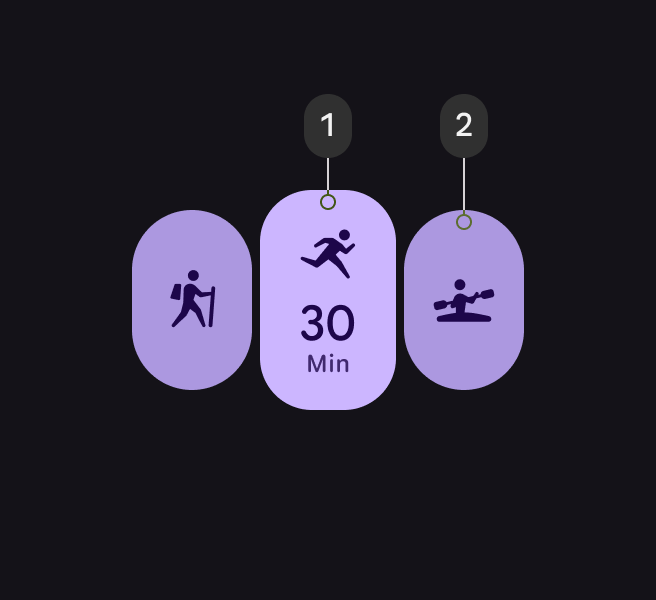

1.  Primary

2.  Primary dim

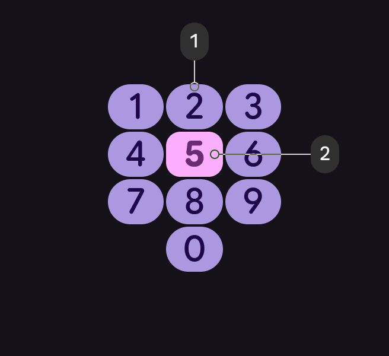

1.  Primary dim

2.  Tertiary

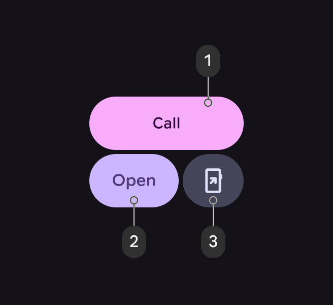

1.  Tertiary

2.  Primary

3.  Secondary container

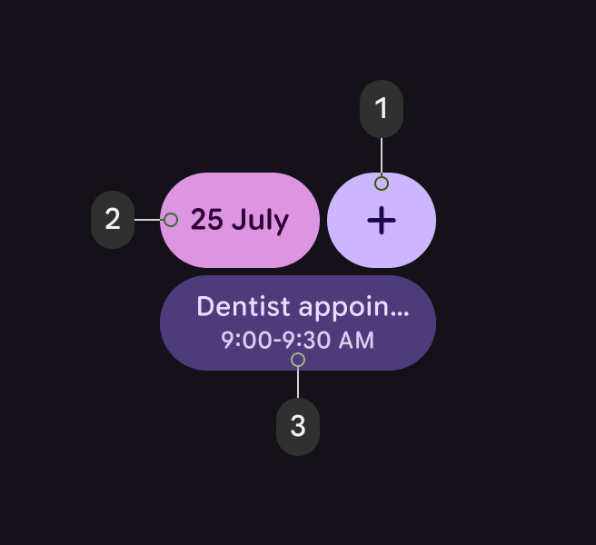

1.  Primary

2.  Tertiary

3.  Primary container

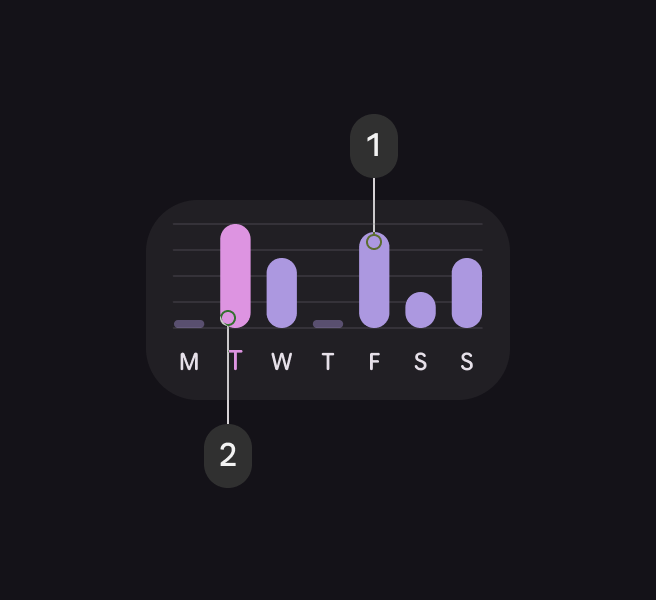

1.  Primary dim

2.  Tertiary dim

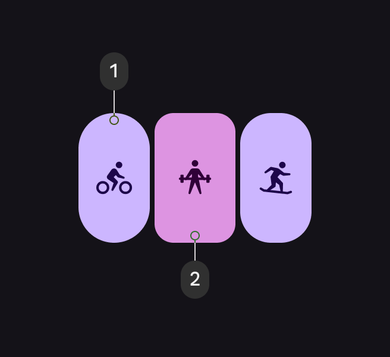

1.  Primary

2.  Tertiary dim

## Motion and transitions

Expressive motion makes interactions feel more alive, fluid, and natural. Use transitions give intuitive feedback to show how an app works, such as standard patterns for changes in state or hierarchy.

[More on shape and motion for Wear OS](https://developer.android.com/design/ui/wear/guides/get-started/apply#shape-motion)

Use expressive motion to show items selected

## Haptics

Haptics are tactile effects used to grab a person’s attention for something important, or add emphasis to an interaction on the screen. You can use haptics to provide responsive feedback to scrolling and selecting items from a list, or controlling volume.

Use system-defined patterns and tokens (when available) to reinforce interaction expectations. Synchronize haptics with UI motion and sound to provide richer feedback.

-   Use stronger haptics for key interactions, such as a payment confirmation

-   Use subtler haptics for precision interactions, such as scrolling through a list

[More on haptics for Wear OS](https://developer.android.com/develop/ui/views/haptics/haptics-principles)

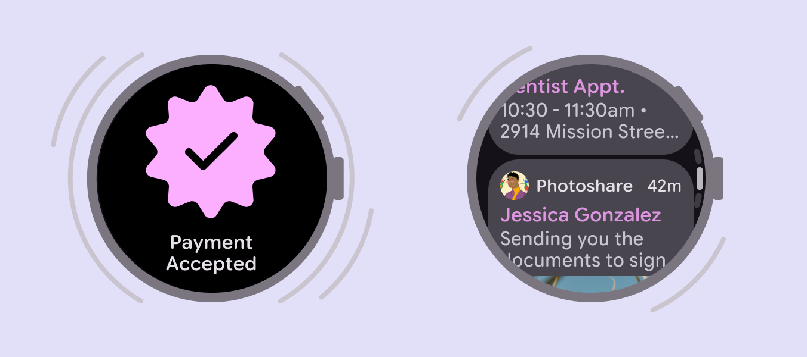

Use stronger haptics for key interactions and subtler feedback for precision interactions
