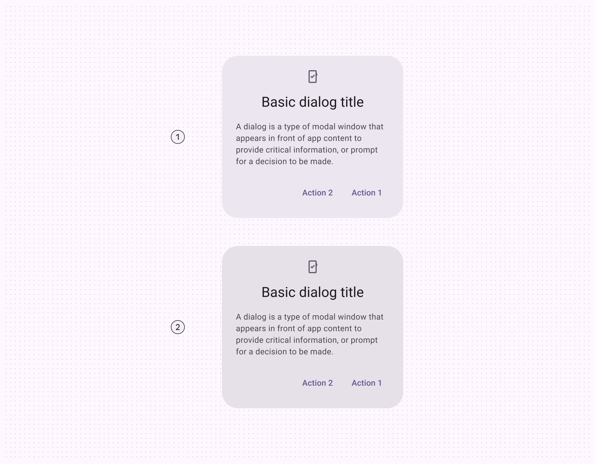
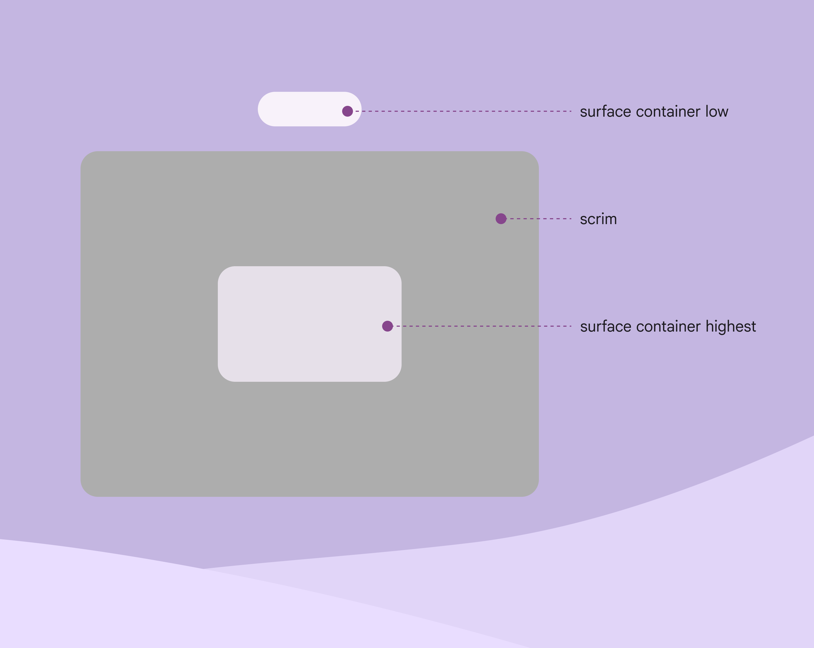
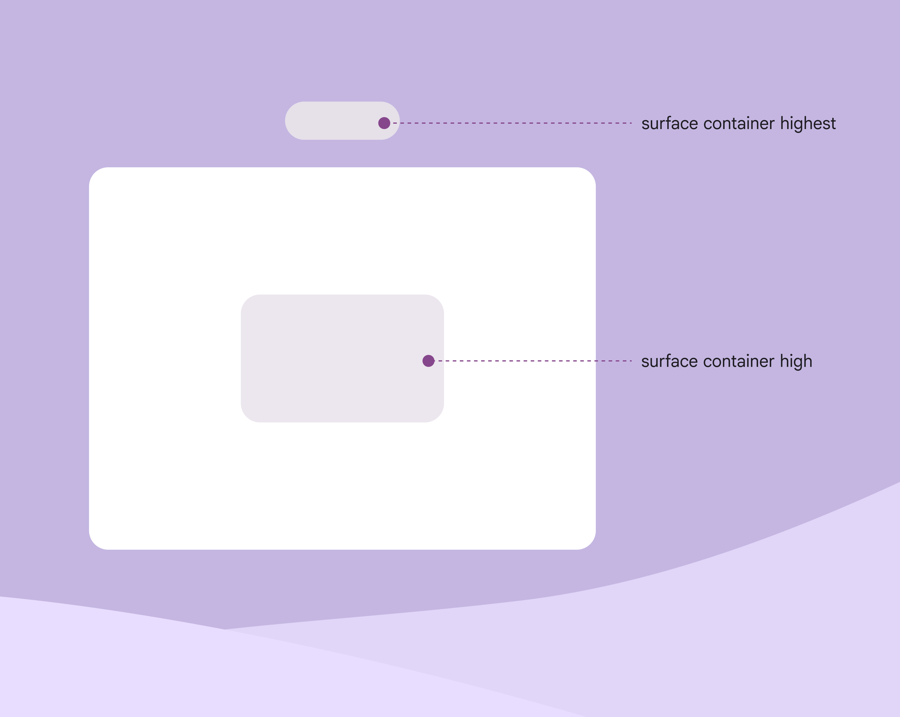
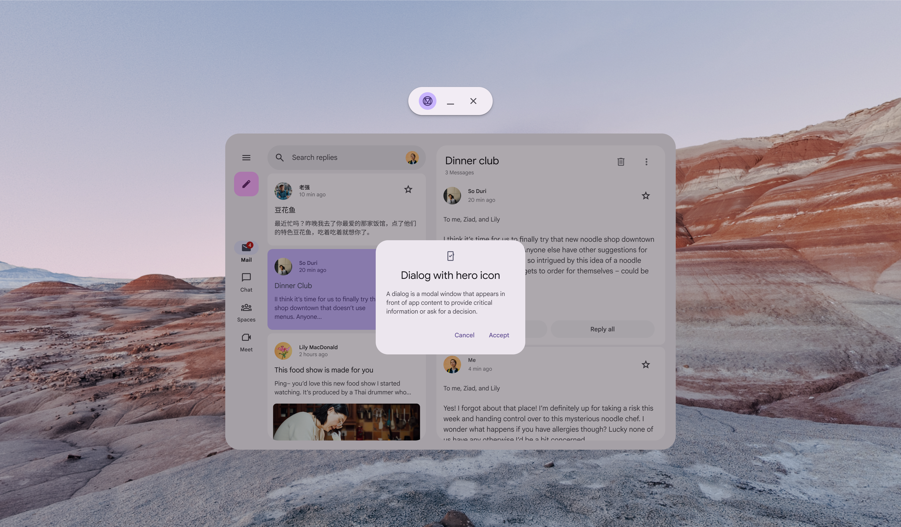
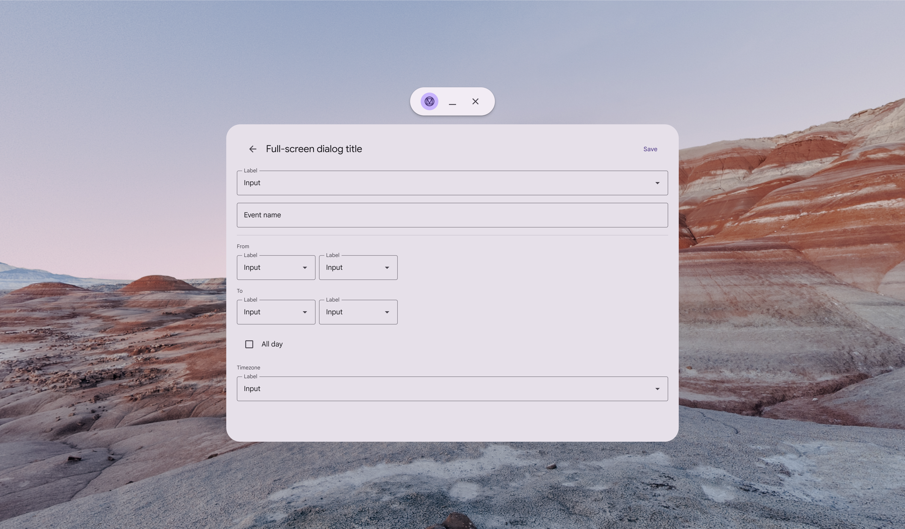
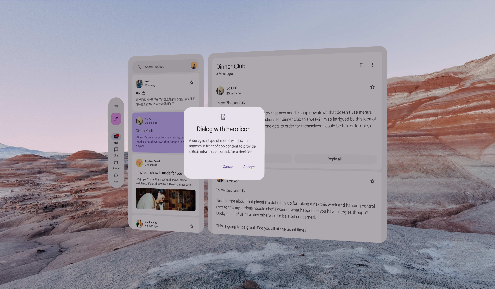

# XR components

> Learn how Material 3 Expressive components adapt to extended reality devices

star

Note:

XR guidelines are primarily intended for designers. Find what’s implemented in code in the [design kit](https://www.figma.com/community/file/1035203688168086460).

Extended reality (XR) introduces spatial capabilities, such as using depth to make dialogs stand out from the background. Currently, [spatial dialogs](https://www.figma.com/community/file/1035203688168086460) are only available in full space Full space is Android XR’s immersive mode and supports spatial components. [More on full space](https://developer.android.com/design/ui/xr/guides/foundations#modes) . For home space Home space is compatible with mobile and large screen apps, but doesn’t support spatial components. [More on home space](https://developer.android.com/design/ui/xr/guides/foundations#modes) , follow Material’s general [dialog guidance](/m3/pages/dialogs/overview).

## Color & elevation 

XR uses color roles Material has 26 standard color roles organized into six groups: primary, secondary, tertiary, error, surface, and outline. [More on color roles](/m3/pages/color-roles?s=m3) to communicate the elevation of UI elements. Dialogs can use two color options: **surface container high** or **surface container highest**.

star

Note:

Color and elevation for spatial dialogs aren’t available in Jetpack Compose yet. These need to be customized manually.

1.  Surface container high
2.  Surface container highest

For effective visual hierarchy, a dialog should be the most prominent element. 

Add a scrim behind a dialog to improve its visibility. Scrims prevent other content from being selected until the dialog action is complete.

check Do

Make sure a spatial dialog’s color is higher than all other UI elements, and use a scrim

The dialog should have the highest elevation in the product.

For example, if the dialog is **surface container high**, don’t use **surface container highest** for any other elements.

close Don’t

If a dialog’s color is **surface container high**, don’t use **surface container highest** for any other element

## Usage

Only use [basic dialogs](/m3/pages/dialogs/guidelines#97ac3858-3932-4084-ae8e-73e42b7cb752) in XR. This keeps the required action in the person’s [field of view](https://developer.android.com/design/ui/xr/guides/spatial-ui#where-place). 

check Do

A basic dialog elevated above an app in home space

close Don’t

Avoid using full-screen dialogs in XR. Required actions could appear beyond a person’s field of view.

## Spatial dialogs

In full space Full space is Android XR’s immersive mode and supports spatial components. [More on full space](https://developer.android.com/design/ui/xr/guides/foundations#modes) , dialogs can be elevated spatially Spatial elevation displays a component above an app on the Z-axis. [More on spatial elevation](<https://developer.android.com/design/ui/xr/guides/spatial-ui#spatial-elevation >) via [overrides](https://developer.android.com/develop/xr/jetpack-xr-sdk/material-design#use-enablexrcomponentoverrides). This helps dialogs stand out from their background in XR.

Side view of a basic dialog with spatial elevation in full space

## Behavior

### Effect

The spatial dialog should scale uniformly. It also fades in when appearing, and fades out when disappearing. 

The dialog's scrim only fades in and out.

Front view of a spatial dialog in motion in full space

### Movement

When activated, the spatial dialog rises from the app to the highest resting level on the Z-axis. 

When the action is complete, it returns to a normal resting level.

The dialog's scrim stays at the app content level at all times.

To prevent motion sickness, use [standard easing](/m3/pages/motion-easing-and-duration/tokens-specs#601d5552-a6e6-4d74-9886-ff8f24b9ec35) and [long duration](/m3/pages/motion-easing-and-duration/tokens-specs#48bf653e-46f9-48f5-87e0-eaf8ea3fe716) motion tokens.

Side view of a spatial dialog in motion in full space

## Placement

Consider factors like field of view, viewing distance, and possible interactions when deciding where to place dialogs in XR.

A dialog’s placement can be adjusted to accommodate specific needs, such as improved ergonomics or [right-to-left (RTL) languages](/m3/pages/bidirectionality-rtl).

### Elevation: Highest resting level

Display spatial dialogs at the **highest resting level**. When setting the depth value of the highest resting level, make sure the elevated dialog is at a comfortable viewing distance from the person. [More on spatial elevation](https://developer.android.com/design/ui/xr/guides/spatial-ui#spatial-elevation)

A spatial dialog moves to the highest resting level in full space

### Center spatial dialogs in field of view

Spatial dialogs should be centered in a person’s [field of view](https://developer.android.com/design/ui/xr/guides/spatial-ui#where-place). If the dialog **can’t** track head movements, position it in the center of the app’s content. 

If the dialog **can** track head movements, configure it with a lazy follow behavior. This keeps the dialog anchored to the center of a person’s field of view until an action is taken.

A dialog in full space stays centered in a person’s field of view

## Accessibility considerations

[XR accessibility](/m3/pages/xr-design/accessibility) guidelines are still evolving. Spatial dialogs should follow applicable Material [dialog accessibility standards](/m3/pages/dialogs/accessibility).
