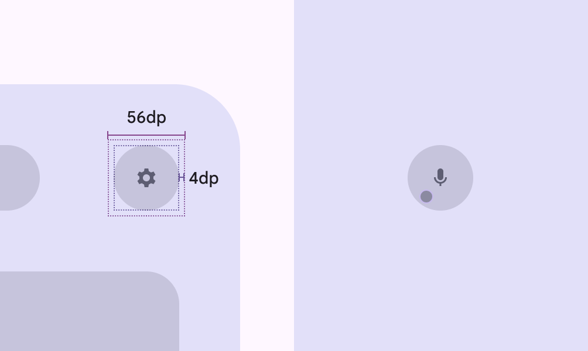

# Design for immersive XR

> Resources and guidance for immersive extended reality (XR) devices

## Use cases

XR presents unique physical constraints. Designing accessible XR products means accounting for different bodies, postures, and sensory abilities.

People should be able to do the following with assistive technology:

-   Navigate and interact with spatial content using their preferred input method

-   Understand the spatial environment and select interactive elements

-   Customize the experience to fit their physical posture and comfort

[More on Android XR accessibility](https://developer.android.com/design/ui/xr/guides/get-started#make-app)

## System-level accessibility

Android XR adapts familiar Android assistive technologies for spatial environments.

To ensure an inclusive experience, design XR apps to work with system-level features like Google's [TalkBack](https://developer.android.com/guide/topics/ui/accessibility/testing) screen reader, voice to text, live captions, [dwell control](https://support.google.com/accessibility/android/answer/7071579), magnification, and color inversion and correction.



[Android XR app quality guidelines](https://developer.android.com/docs/quality-guidelines/android-xr)

## Text accessibility & color contrast

Make sure text and UI are legible in different lighting conditions and environments. For example, in passthrough, the background might be a bright window or a dark room.


-   Use a minimum 14dp body font size

-   Ensure high contrast between text and background

-   Use standard background color roles Material has 26 standard color roles organized into six groups: primary, secondary, tertiary, error, surface, and outline. [More on color roles](</m3/pages/color-roles?s=m3 >)  like **surface container**, rather than custom colors, so they dim automatically

-   Support light and dark themes

Use color roles to dim backgrounds automatically

## Physical accessibility

To support different mobility levels, provide flexible input methods and positions:

-   Actions should be achievable with one hand, voice, or eye control

-   Don’t require two-handed gestures

-   Design for seated, standing, and reclined positions

-   Allow people to recenter and pull UI closer to them

Offer adjustable input methods and viewing positions

## Target size

Use large target sizes to make XR interactions precise and accessible.



Interactive elements should have:

-   56x56dp or larger target

-   48x48dp or larger visual affordance

-   4dp offset

Don’t overlap targets of different elements.

Targets and icons should scale with their parent container or label text.

Use 56dp or larger target sizes for interactive elements
