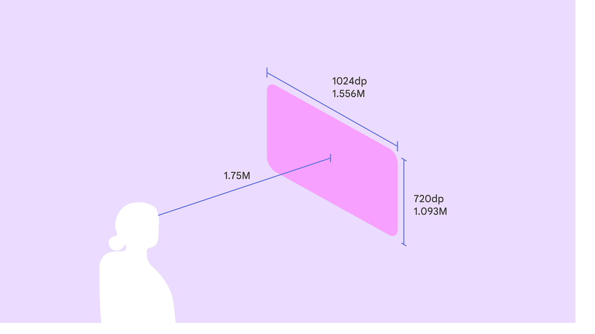
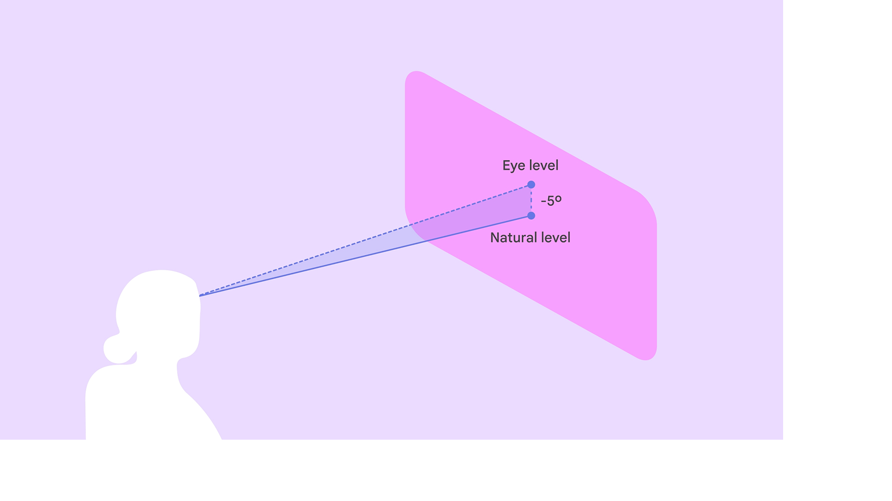
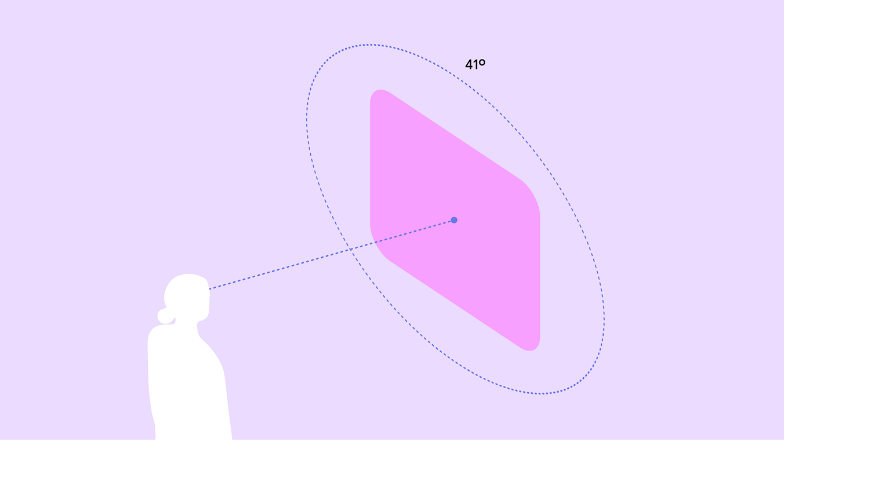
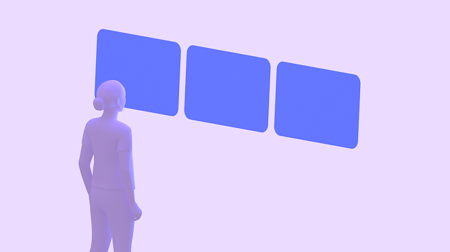
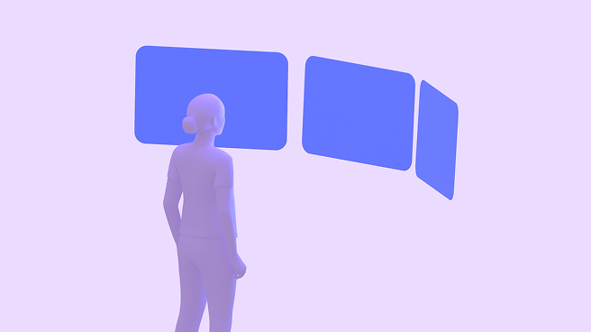
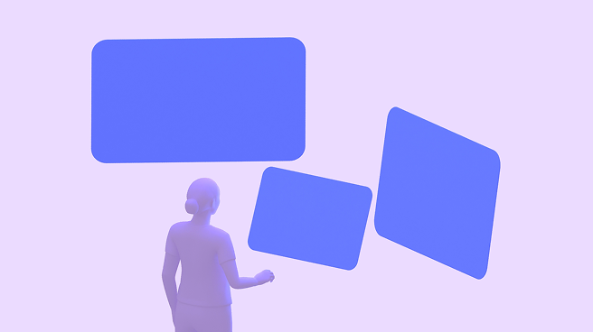

# Design for immersive XR

> Resources and guidance for immersive extended reality (XR) devices

In XR, a layout extends beyond the screen into the physical world. Spatial panels, 3D models, and an immersive environment can be arranged anywhere on an infinite canvas.

Unlike mobile layouts which are constrained by screen edges, XR layouts must account for:

-   Depth on the Z-axis

-   Viewing distance

-   A person's field of view

[More on Android XR layouts](https://developer.android.com/design/ui/xr/guides/spatial-ui)

An XR headset display can fully occlude the real world. This allows for complete immersion, with the physical environment replaced by a virtual one.

## XR layout basics

The fundamental building block of an Android XR app is the spatial panel. Panels serve as containers for UI elements and can be spatially elevated alongside orbiters Orbiters are floating elements that control the content within spatial panels. [More on orbiters](<https://developer.android.com/design/ui/xr/guides/spatial-ui#orbiters  >) , 3D models, and environments.

star

Note:

Spatial panels are available in full space Full space is Android XR’s immersive mode and supports spatial components. [More on full space](https://developer.android.com/design/ui/xr/guides/foundations#modes) only. They aren't currently available in home space Home space is compatible with mobile and large screen apps, but doesn’t support spatial components. [More on home space](https://developer.android.com/design/ui/xr/guides/foundations#modes) .

### Spatial panels

In full space, spatial panels In Android XR, a spatial panel is a container for UI elements, interactive components, and immersive content. [More on spatial panels](https://developer.android.com/design/ui/xr/guides/spatial-ui#spatial-panels) are flexible canvases that can contain UI elements, media, and spatial video.

They often serve as the anchor for 3D models and orbiters.

Navigation UI can float in orbiters outside of a spatial panel

#### Size & position

Full space supports panel placement in both passthrough and virtual environments.

By default, spatial panels launch:

-   Size: 1024x720dp

-   1.75 meters away from a person

-   With 32dp rounded corners

In full space, panels have no minimum size. The maximum panel size is 2560x1800dp.

When people switch from full space to home space, spatial panels usually stay in the same predictable position.

At a 1.75 meter launch distance, a spatial panel's size is 1024x720dp

Place the panel's vertical center 5° below eye level to maximize comfort

Place primary content in the center 41° of a person’s field of view

#### Adaptive design

Spatial panels dynamically scale based on their distance from a person.

Material 3 components use [adaptive design](/m3/pages/layout-overview/adaptive-design) to ensure content automatically scales and reflows to remain legible and comfortable at any distance or angle.

To avoid system UI conflicts, stay within default movement limits:

-   Minimum depth: 0.75 meter

-   Maximum depth: 5 meters

A person can scale a spatial panel up or down so it's large enough to see clearly, no matter the distance. When they move the panel, Android XR automatically scales its size.

#### Grouping panels

In full space Full space is Android XR’s immersive mode and supports spatial components. [More on full space](https://developer.android.com/design/ui/xr/guides/foundations#modes) , an app can be broken up into multiple spatial panels, arranged in a flat, curved, or arbitrary layout.

Flat layout: Panels are arranged in a straight line. Best for comparing information side by side.

Curved layout: Panels curve around the person. Best for immersive media or wide-format dashboards.

Arbitrary layout: Panels are placed freely in space. Best for multi-tasking.

### Orbiters

An orbiter Orbiters are floating elements that control the content within spatial panels. [More on orbiters](<https://developer.android.com/design/ui/xr/guides/spatial-ui#orbiters  >) is a floating element that accompanies a spatial panel.

Use orbiters for navigation UI that needs to stay accessible without obscuring the main content.

Material [XR components](/m3/pages/xr-components/overview) automatically adapt into orbiters.

A navigation rail transforms into an orbiter in XR to give the UI more space

### Spatial elevation & depth

Use the Z-axis to create volumetric UI. Unlike 2D elevation which uses shadows, volumetric UI uses actual depth.

-   [Spatial elevation](https://developer.android.com/design/ui/xr/guides/spatial-ui#spatial-elevation) can create hierarchy, bring active elements forward, and push background elements back

-   Layering can separate UI layers physically. For example, a scrim can float several centimeters behind a dialog box.

A dialog using spatial elevation in Android XR

## Behavior

### Anchoring

In [passthrough](https://developer.android.com/design/ui/xr/guides/foundations#give-users), layouts can interact with the physical world:


-   World-locked: Panels stay in a specific spot in the room, like a music player anchored to a table


-   Head-locked: Avoid locking UI directly to the person's head view, as it can feel jarring. Instead, use a lazy follow behavior where the UI gently drifts to catch up with the person's movement.

In passthrough, a spatial panel can be attached to a specific location in the real world, such as a table

### Color contrast & dimming

When using standard **surface** tokens Design tokens are the building blocks of all UI elements. The same tokens are used in designs, tools, and code. [More on tokens](/m3/pages/design-tokens/overview) , panels automatically handle contrast:


-   Passthrough: If the physical room is bright, the system dims the background to ensure the UI remains legible


-   Virtual environments: Panels adapt to the lighting of the virtual world

[More on XR colors](https://developer.android.com/design/ui/xr/guides/visual-design#colors)

Use bright, high-contrast colors to ensure the UI stands out against different backgrounds
