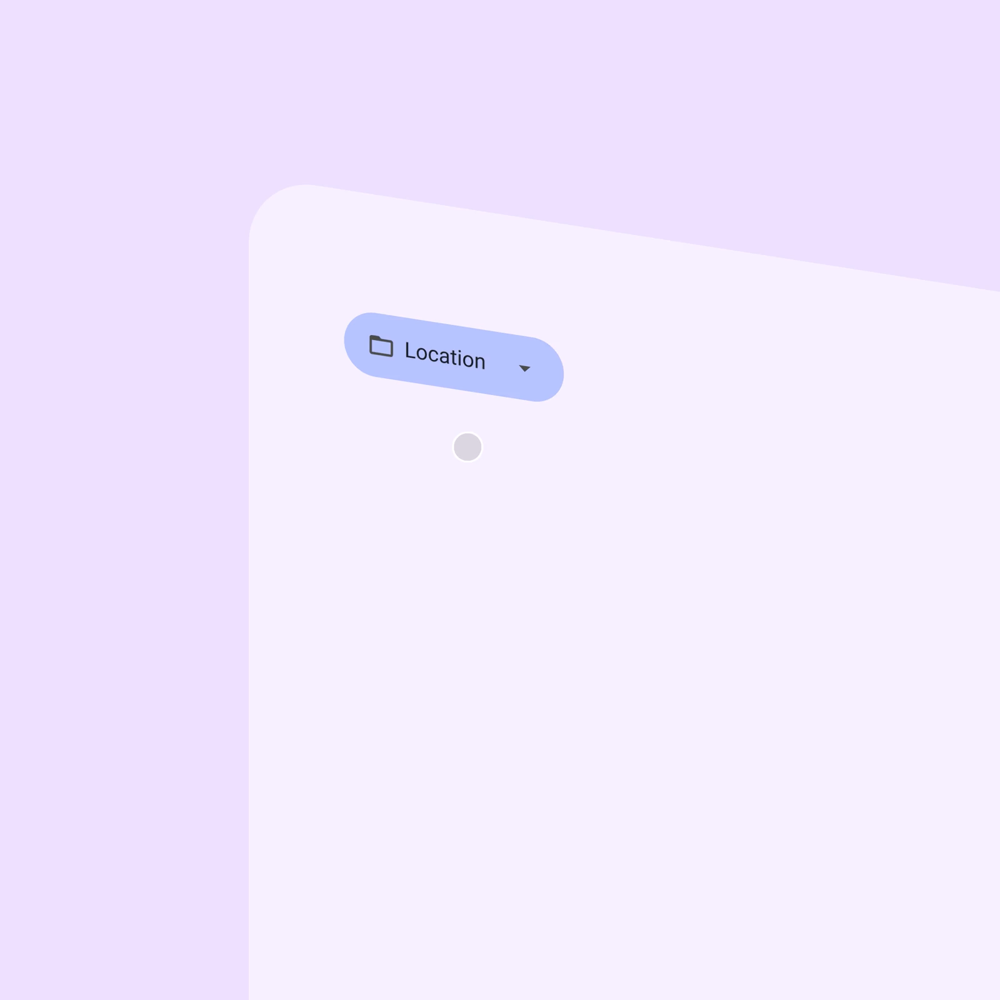
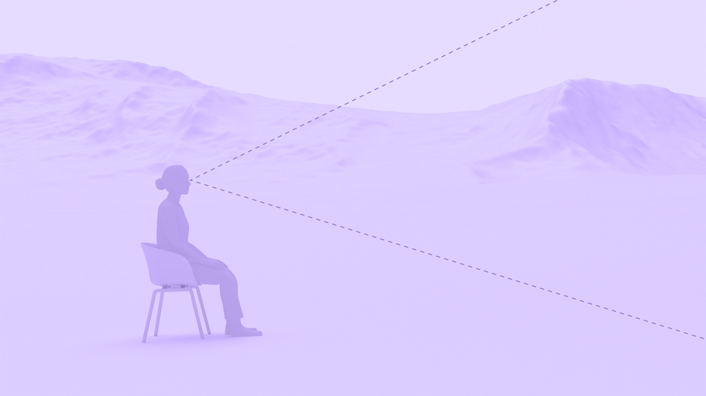

# Design for immersive XR

> Resources and guidance for immersive extended reality (XR) devices

-   Use depth and expanded space to create believable environments

-   Map interactions, like gaze and gestures, to real-world expectations

-   Group UI elements on floating spatial panels In Android XR, a spatial panel is a container for UI elements, interactive components, and immersive content. [More on spatial panels](https://developer.android.com/design/ui/xr/guides/spatial-ui#spatial-panels)

-   Design for comfort to minimize motion sickness and physical strain

-   Provide feedback through spatial audio, haptics, and visual cues

In home space, an XR app can run side by side with other apps, with the real world in the background. In full space, the XR app takes center stage with immersive, spatial capabilities.

## Resources & availability

| **Type** | **Resource** | **Status** |
| --- | --- | --- |
| Design | [M3 Design Kit](https://www.figma.com/community/file/1035203688168086460) (Figma) | Available |
|  | [Android XR immersive design guidelines](https://developer.android.com/design/ui/xr/guides/get-started) | Available |
|  | [Design for AI glasses](https://developer.android.com/design/ui/ai-glasses) | Available |
| Implementation | [Build for Android XR](https://developer.android.com/develop/xr/get-started) | Available |
|  | [Jetpack XR SDK](https://developer.android.com/develop/xr/jetpack-xr-sdk) | Available |
|  | [Material Design for XR API reference](https://developer.android.com/jetpack/androidx/releases/xr-compose-material3) | Available |

## Principles

### Use familiar patterns

Material components like buttons and menus help people navigate spatial apps with confidence.

In XR, a Material menu uses elevation to appear in 3D

### Prioritize comfort

Place content in the center of a person’s field of view, and design for different body positions, such as seated, standing, and reclined.

Positioning content in a person’s field of view keeps the UI visible and minimizes the need for excessive head or body movement

### Embrace depth

Use elevation and 3D models to add volume, create a sense of realism, and spatial understanding.

3D models can be viewed from all angles and moved with natural interactions

### Design for accessibility

Design apps to work with system-level assistive technologies like screen readers, voice commands, and text resizing. Provide large target sizes, support multimodal inputs, and ensure text is legible against any background.

In XR, icon buttons should have a 56dp target size and 4dp offset

## Material XR components

The following Material components are adapted for XR:

-   [App bars](/m3/pages/xr-components/app-bars/)

-   [Dialogs](/m3/pages/xr-components/dialogs)

-   [Navigation bar](/m3/pages/xr-components/nav-bar)

-   [Navigation rail](/m3/pages/xr-components/nav-rail)

-   [Toolbars](/m3/pages/xr-components/toolbars)

A toolbar’s behavior and placement changes from a 2D to a 3D experience

## XR terms

-   [3D models](https://developer.android.com/design/ui/xr/guides/3d-content): Digital objects rendered with depth and volume

-   [Field of view](https://developer.android.com/design/ui/xr/guides/spatial-ui#where-place): The area a person can see without turning their head

-   [Full space](https://developer.android.com/design/ui/xr/guides/foundations#modes): Android XR’s immersive mode that supports spatial components

-   [Home space](https://developer.android.com/design/ui/xr/guides/foundations#modes): Compatible with mobile and large screen apps, but doesn’t support spatial components

-   [Orbiters](https://developer.android.com/design/ui/xr/guides/spatial-ui#orbiters): Floating elements that control the content within spatial panels, full space only

-   [Passthrough](https://developer.android.com/design/ui/xr/guides/foundations#give-users): A blended reality where an XR device displays multiple large apps and the user’s physical environment

-   [Spatial elevation](<https://developer.android.com/design/ui/xr/guides/spatial-ui#spatial-elevation >): Displays a component above an app on the Z-axis

-   [Spatial environments](https://developer.android.com/design/ui/xr/guides/environments): The 360° 3D virtual worlds people see in an immersive app

-   [Spatial panels](https://developer.android.com/design/ui/xr/guides/spatial-ui#spatial-panels): A container for UI elements, interactive components, and immersive content, full space only
