# Color roles

> There are 26 standard color roles organized into six groups: primary, secondary, tertiary, error, surface, and outline

## What are color roles?

Color roles are like the "numbers" in a paint-by-number canvas. They're the connective tissue between elements of the UI and what color goes where.

-   **Color roles are mapped to Material Components**
    You'll use these color roles whether you're using the static baseline scheme Baseline is the default static color scheme for Material products. It includes colors for both light and dark themes. [More on baseline color](/m3/pages/static/baseline) or dynamic color Dynamic color takes a single color from a user's wallpaper or in-app content and creates an accessible color scheme assigned to elements in the UI. [More on dynamic color](/m3/pages/dynamic/choosing-a-source) . If your product contains custom components, they'll need to be properly mapped to this set of color roles.
-   **Color roles ensure accessibility**
    The color system is built on accessible color pairings For example, a dark surface color is algorithmically paired with a light text label color so the UI automatically meets contrast requirements. [More on color relationships](/m3/pages/color/how-the-system-works#e1e92a3b-8702-46b6-8132-58321aa600bd) . These color pairs provide an accessible minimum 3:1 contrast.
-   **Color roles are tokenized**
    Roles are implemented in design and code through tokens. A design token Design tokens are the building blocks of all UI elements. The same tokens are used in designs, tools, and code. [More on tokens](/m3/pages/design-tokens/overview) represents a small, reusable design decision that’s part of a design system's visual style.

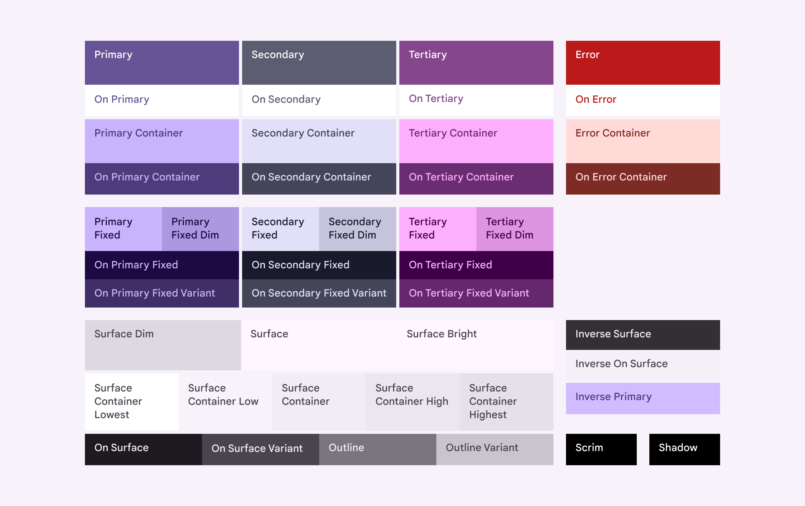

Diagram of all Material color roles, including optional add-on roles for surface colors and fixed accent colors

## General concepts

Here are helpful-to-know words you'll see in the names of color roles:

-   **Surface** – A role used for backgrounds and large, low-emphasis areas of the screen.
-   **Primary, Secondary, Tertiary** – Accent color roles used to emphasize or de-emphasize foreground elements.
-   **Container** – Roles used as a fill color for foreground elements like buttons. They should not be used for text or icons.
-   **On** – Roles starting with this term indicate a color for text or icons *on top* of its paired parent color. For example, **on primary** is used for text and icons against the **primary** fill color.
-   **Variant** – Roles ending with this term offer a lower emphasis alternative to its non-variant pair. For example, **outline variant** is a less emphasized version of the **outline** color.

### Pairing and layering colors

To ensure accessible visual contrast in your app, apply colors only in the intended pairs or layering orders described in the following sections.

Combining colors improperly may break contrast necessary for visual accessibility, particularly when colors are adjusted through dynamic color Dynamic color takes a single color from a user's wallpaper or in-app content and creates an accessible color scheme assigned to elements in the UI. [More on dynamic color](/m3/pages/dynamic/choosing-a-source) features such as user-controlled contrast User-controlled contrast is a dynamic color feature enabling users to choose from one of three levels of color contrast: standard, medium, and high. [More on user-controlled contrast](/m3/pages/color/how-the-system-works/#a360c176-b99e-4804-8034-9884833009c8) .

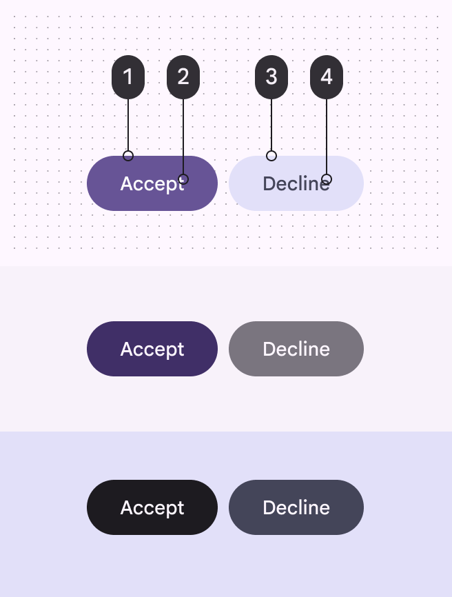

check Do

Pair and layer color roles as intended to ensure expected visual results and accessibility. In this example, the two buttons mapped with (1) **primary**, (2) **on primary**, (3) **secondary container**, and (4) **on secondary container** stay legible as the contrast level changes.

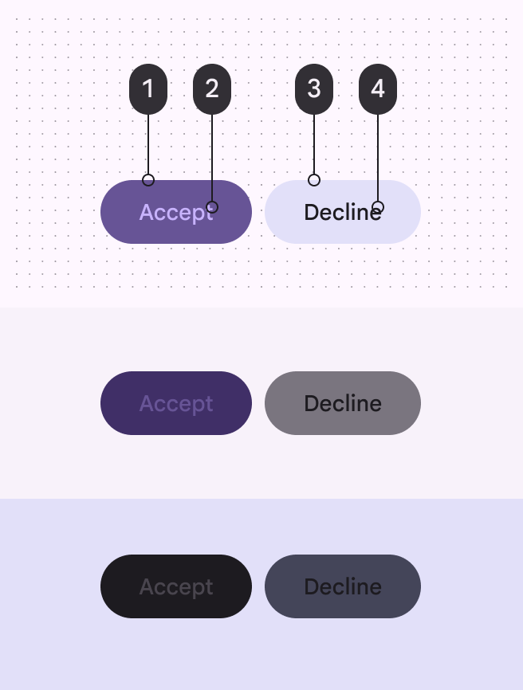

close Don’t

Improper color mappings can produce unintended visual results and break accessibility. In this example, the two buttons mapped with (1) **primary**, (2) **primary container**, (3) **secondary container**, and (4) **on surface** become illegible as the contrast level changes.

## Accent color roles

Accent color roles include primary, secondary, and tertiary. Assign them to elements in the UI based on importance and needed emphasis. Use caution when changing color roles for visual effect.

-   **Primary roles** are for important actions and elements needing the most emphasis, like a FAB to start a new message.

-   **Secondary roles** are for elements that don’t need immediate attention and don’t need emphasis, like the selected state of a navigation icon or a dismissive button.

-   **Tertiary roles** are for smaller elements that need special emphasis but don't require immediate attention, such as a badge or notification.

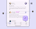

1.  Primary colors are used for the most important elements, like a starred message and FAB to start a new message

2.  Tertiary colors are used for smaller emphasized elements, like a badge suggesting a follow up

3.  Secondary colors are used for less urgent elements, like the background of an inactive star icon and the selection state of an inbox icon

## Primary

Use primary roles for the most prominent components across the UI, such as the FAB, high-emphasis buttons, and active states.

-   **Primary:** High-emphasis fills, texts, and icons against surface

-   **On primary:** Text and icons against primary

-   **Primary container:** Standout fill color against surface, for key components like FAB

-   **On primary container:** Text and icons against primary container

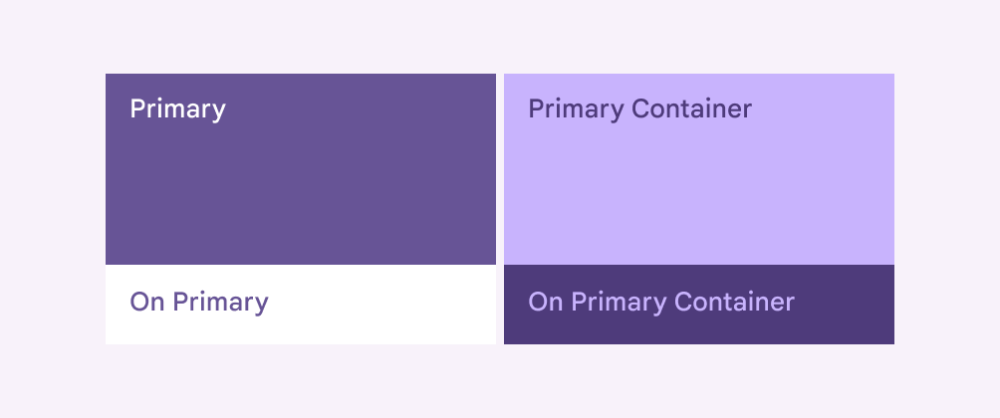

Primary color roles include **primary** and **primary container**, with their respective “On” colors

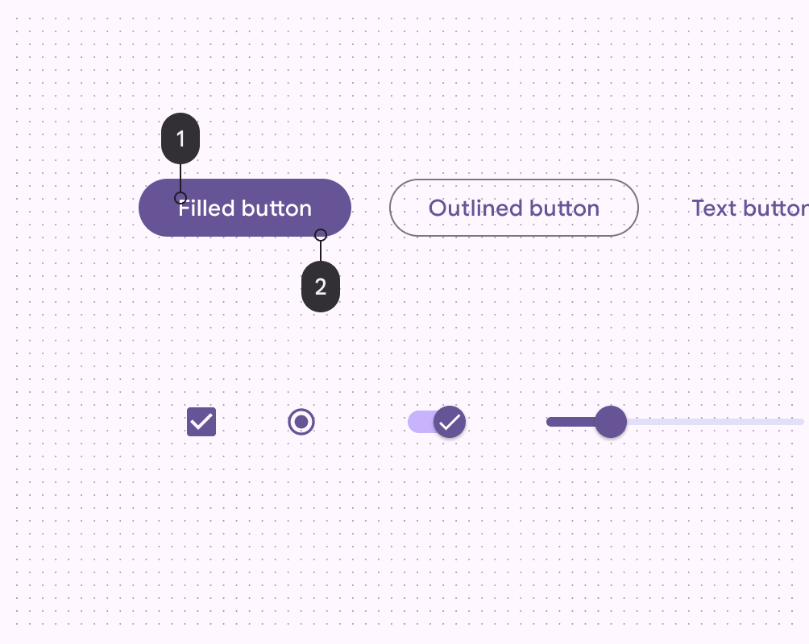

1.  On primary 
2.  Primary

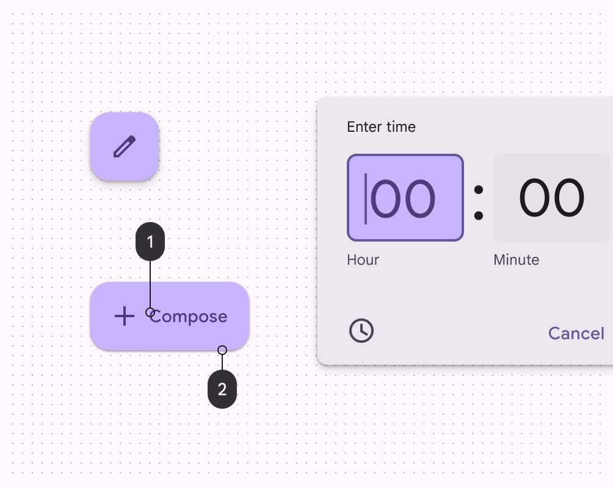

1.  On primary container 
2.  Primary container

## Secondary

Use secondary roles for less prominent components in the UI such as filter chips.

There are four secondary roles:

-   **Secondary:** Less prominent fills, text, and icons against surface

-   **On secondary:** Text and icons against secondary

-   **Secondary container:** Less prominent fill color against surface, for recessive components like tonal buttons

-   **On secondary container:** Text and icons against secondary container

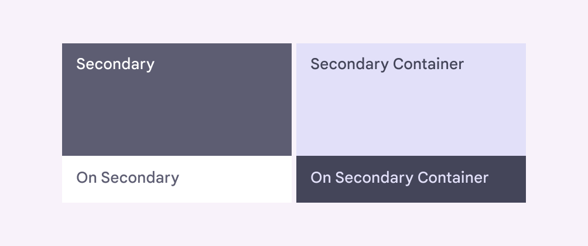

Secondary color roles include **secondary** and **secondary container**, with their respective "On" colors

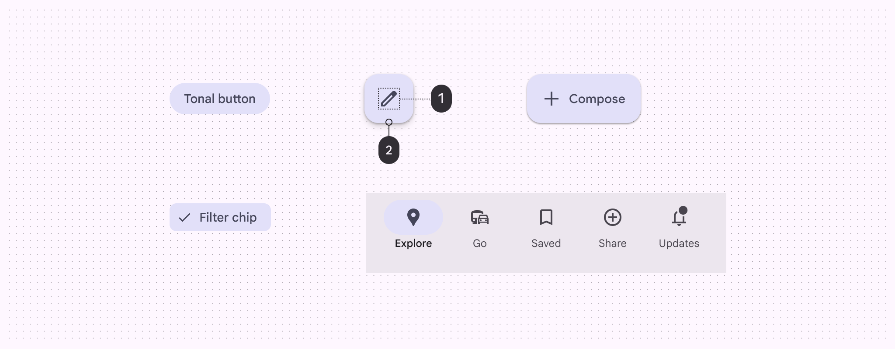

1.  Icon: On secondary container 
2.  Button: Secondary container

## Tertiary

Use tertiary roles for contrasting accents that balance primary and secondary colors or bring heightened attention to an element such as an input field. 

There are four tertiary roles:

-   **Tertiary:** Complementary fills, text, and icons against surface

-   **On tertiary:** Text and icons against tertiary

-   **Tertiary container:** Complementary container color against surface, for components like input fields

-   **On tertiary container:** Text and icons against tertiary container

Tertiary color roles include **tertiary** and **tertiary container**, with their respective "On" colors

The tertiary color roles can be applied at the designer's discretion. They're intended to support broader color expression.

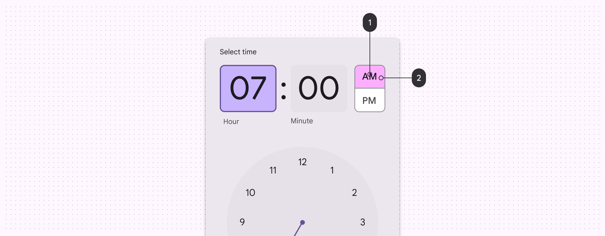

1.  On tertiary container
2.  Tertiary container

## Error

Use error roles to communicate error states, such as an incorrect password entered into a text field.

There are four error roles:

-   **Error:** Attention-grabbing color against surface for fills, icons, and text, indicating urgency

-   **On error:** Text and icons against error

-   **Error container:** Attention-grabbing fill color against surface

-   **On error container:** Text and icons against error container

Error is an example of a static color (it doesn't change even in dynamic color schemes). Error color roles are made static by default with any dynamic color scheme. They still adapt to light and dark theme.

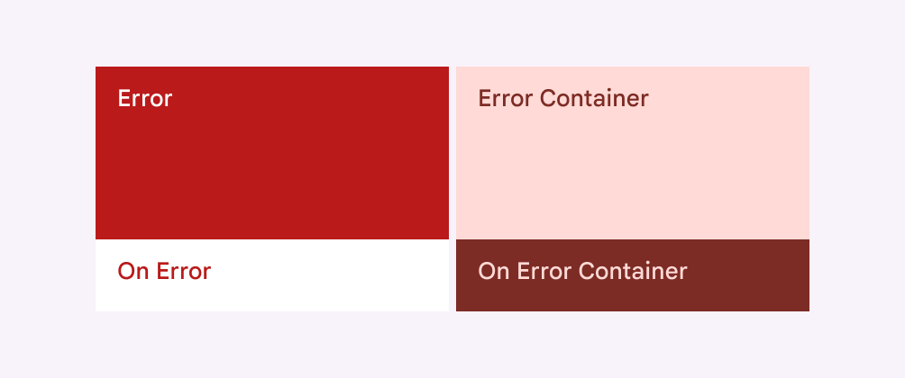

Error color roles include **error** and **error container** with their respective "On" colors.

## Surface

Use surface roles for more neutral backgrounds, and container colors for components like cards, sheets, and dialogs.

There are three surface roles:

-   **Surface:** Default color for backgrounds

-   **On surface:** Text and icons against any **surface** or **surface container** color

-   **On surface variant:** Lower-emphasis color for text and icons against any **surface** or **surface container** color

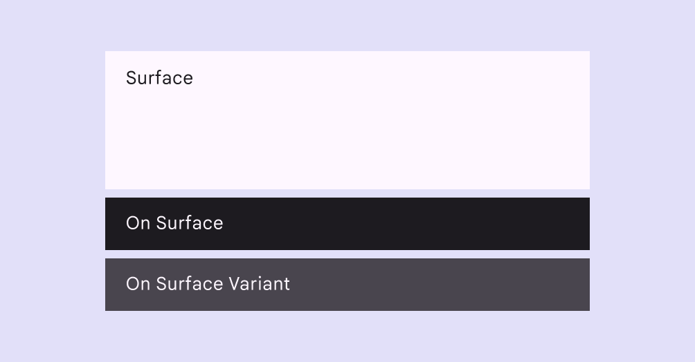

**Surface** and **on surface** roles in light theme

There are also five surface container roles named based on their level of emphasis:

-   **Surface container lowest:** Lowest-emphasis container color

-   **Surface container low:** Low-emphasis container color

-   **Surface container:** Default container color

-   **Surface container high:** High-emphasis container color

-   **Surface container highest:** Highest-emphasis container color

**Surface container** is the default role, but the others are especially helpful for creating hierarchy and nested containers in [layouts for expanded screens](/m3/pages/breakpoints/expanded).

The five **surface container** roles, shown in light and dark theme

The most common combination of surface roles uses **surface** for a background area and **surface container** for a navigation area.

Text and icons typically use **on surface** and **on surface variant** on all types of surfaces.

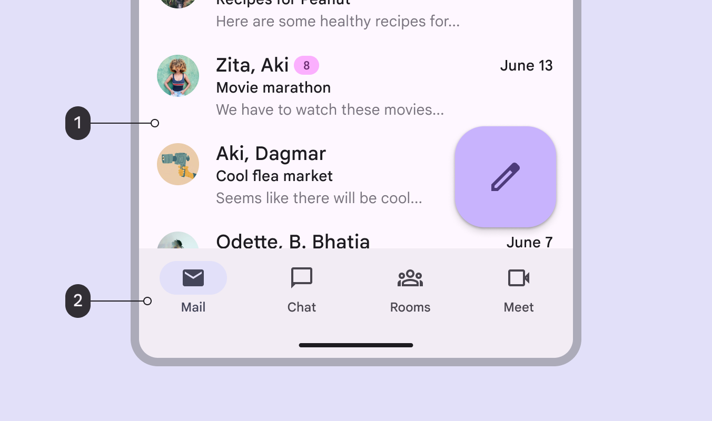

1.  Surface
2.  Surface container

All color mappings – but especially surface colors – should remain the same for layout regions across breakpoints Breakpoints are opinionated window sizes where a layout changes to match available space, device conventions, and ergonomics (previously window size classes). [More on breakpoints](/m3/pages/breakpoints) . For example, the body area will use the **surface** color and the navigation area will use the **surface container** color on both mobile and tablet.

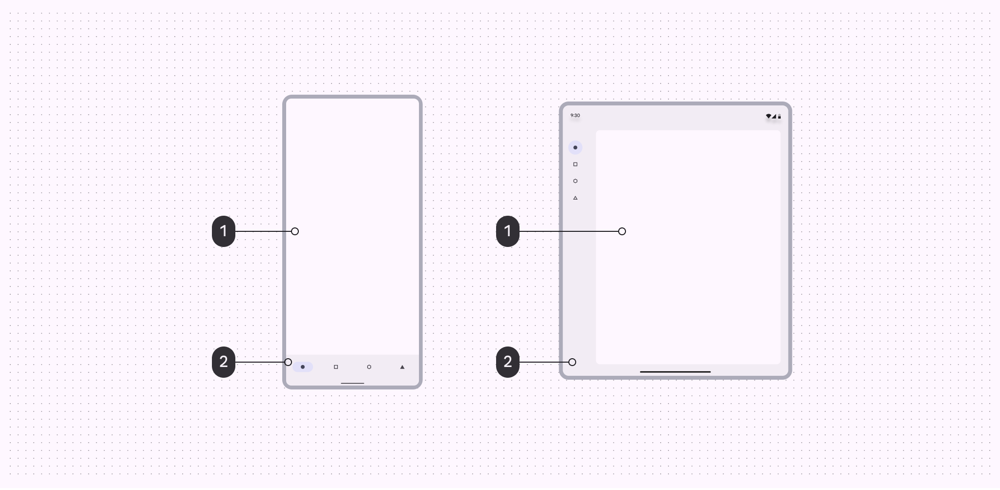

1.  Surface
2.  Surface container

Depending on necessary hierarchy, feature area, and design logic, you can use [add-on surface colors](/m3/pages/color-roles/tab-1#63d6db08-59e2-4341-ac33-9509eefd9b4f) in larger window class sizes as long as colors are consistently applied.

In this example, the body and navigation regions have the same color roles across breakpoints (**surface** and **surface container**, respectively) with the addition of other surface container colors at larger sizes.

By default, neutral-colored components such as navigation bars, menus, or dialogs are mapped to specific surface container roles, but these [roles can be remapped](/m3/pages/advanced/overview) by makers to suit user needs.

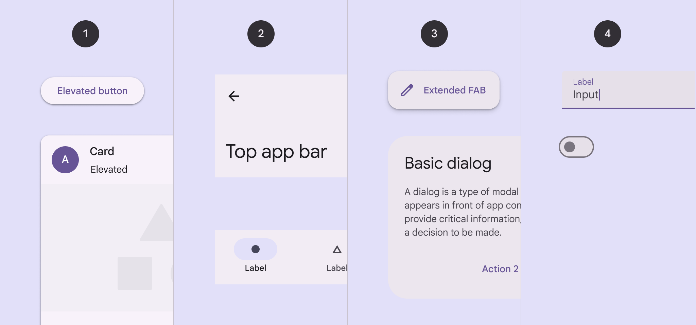

Default surface container roles applied to components:

1.  **Surface container low**
2.  **Surface container** 
3.  **Surface container high**
4.  **Surface container highest**

### Inverse colors

Inverse roles are applied selectively to components to achieve colors that are the reverse of those in the surrounding UI, creating a contrasting effect.

-   **Inverse surface:** Background fills for elements which contrast against surface

-   **Inverse on surface:** Text and icons against inverse surface

-   **I****nverse primary:** Actionable elements, such as text buttons, against inverse surface

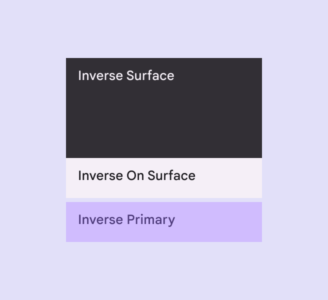

**Inverse surface**, **inverse on surface**, and **inverse primary** roles in the color scheme, shown in light theme

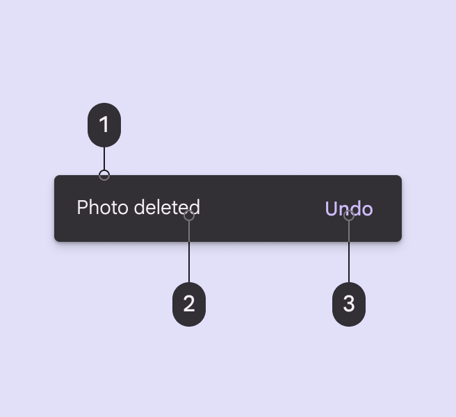

A snackbar which uses:

1.  **Inverse surface** for its background
2.  **Inverse on surface** for its text
3.  **Inverse primary** for its text button

## Outline

There are two outline colors to be used against a surface:

-   **Outline:** Important boundaries, such as a text field outline

-   **Outline variant:** Decorative elements, such as dividers, and when other elements provide 4.5:1 contrast

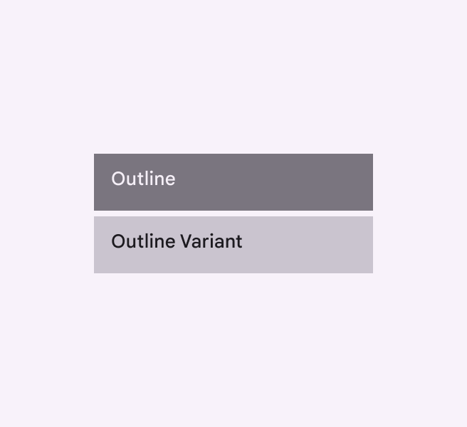

**Outlin****e** and **outline variant** roles in the color scheme, shown in light theme

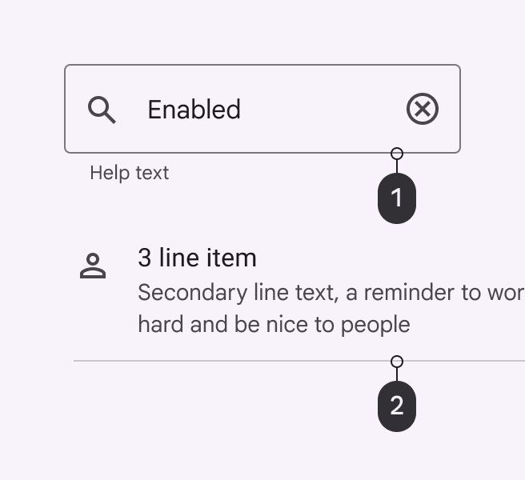

1.  A text field which uses **outline** for its container border
2.  A list item which uses **outline variant** for its divider line

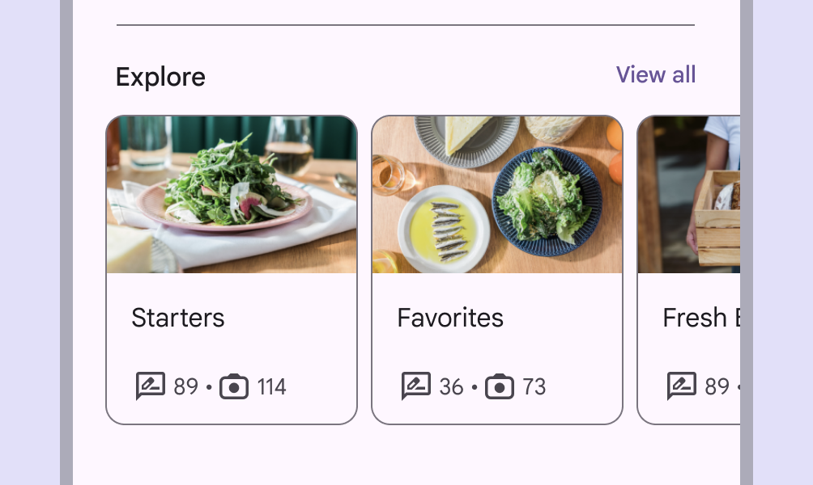

close Don’tDon’t use the **outli****ne** color for dividers since they have different contrast requirements. Instead, use **outline variant**. 

close Don’tDon’t use the **outline** color for components that contain multiple elements, such as cards. Instead, use **outline variant**. 

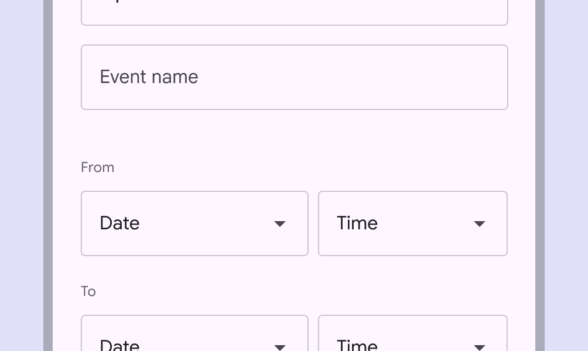

close Don’t

Don’t use the **outline variant** color to create visual hierarchy or define the visual boundary of targets. Instead, use the **outline** color or another color providing 3:1 contrast with the surface color.

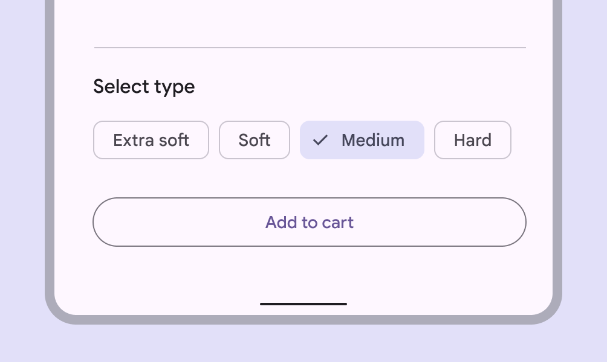

exclamation Caution

The **outline variant** color can be used for the border of targets like chips and buttons, provided that those targets contain elements inside them that provide visual contrast. In this example of chips and buttons, the icons and text inside the targets meet 4.5:1 contrast.

## Add-on color roles

Most products won't need to use these add-on color roles. However, some products require the greater flexibility and control that add-on roles provide. If you aren't sure whether your product should use the add-on roles, it probably shouldn't and you can ignore them.

### Fixed accent colors

**Primary fixed, secondary fixed,** and **t****ertiary fixed** are fill colors used against surface. These colors maintain the same tone in light and dark themes, as opposed to regular container colors, which change in tone between these themes. The fixed color role may be used instead of the equivalent container role in situations where such fixed behavior is desired.

The **primary fixed dim**, **secondary fixed dim**, and **tertiary fixed dim** roles provide a stronger, more emphasized tone relative to the equivalent fixed color. They may be used where a deeper color but the same fixed behavior is desired.

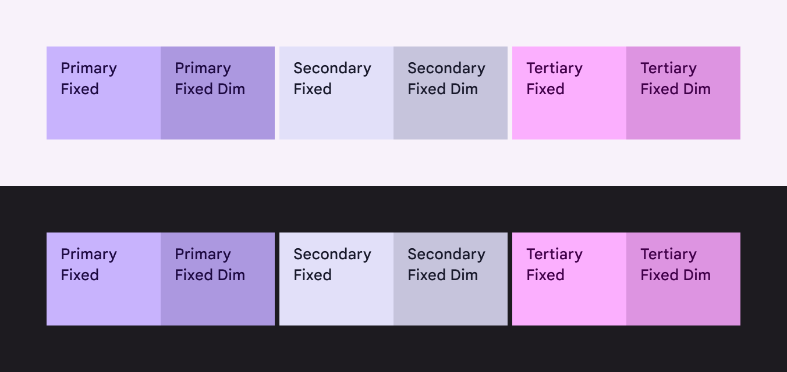

**Fixed** and **fixed dim** color roles for the **primary**, **secondary**, and **tertiary** color groups, shown in both light and dark themes. Note how the colors stay the same between themes.

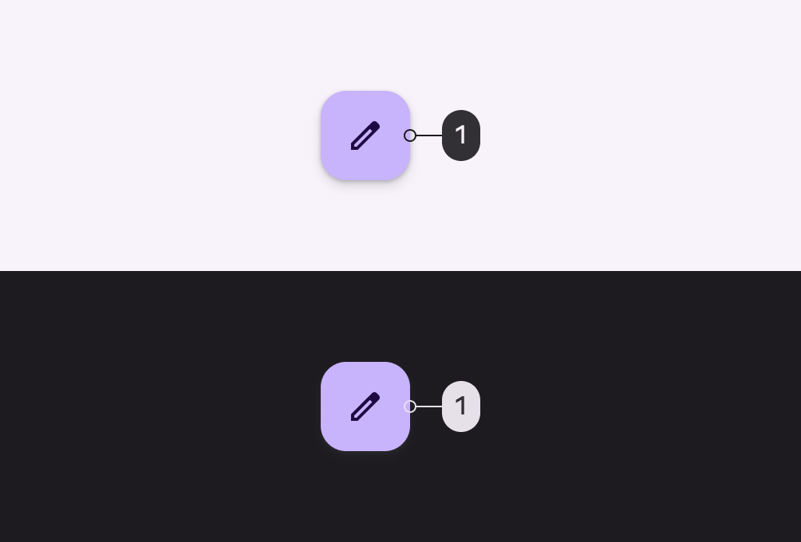

A FAB which uses **primary fixed** (1) for its container fill color, shown in light and dark themes. Note how the container color stays the same between themes.

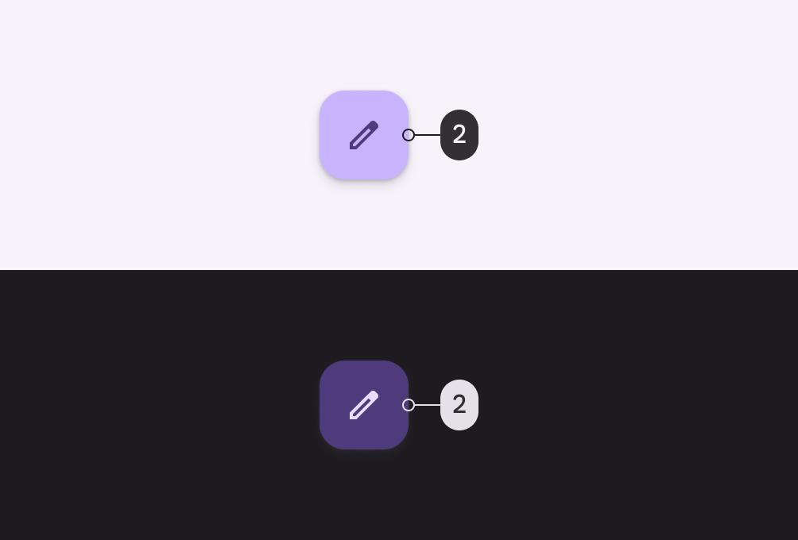

For comparison, a FAB which uses **primary container** (2) for its container fill color, shown in light and dark themes. Note how the container color changes tone between themes.

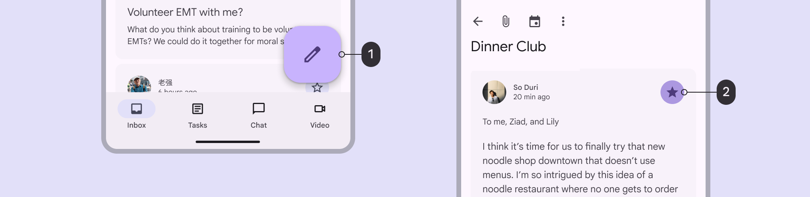

Examples of fixed and fixed dim colors in use:

1.  **Primary fixed** for a FAB container color
2.  **Primary fixed dim** for an icon button container

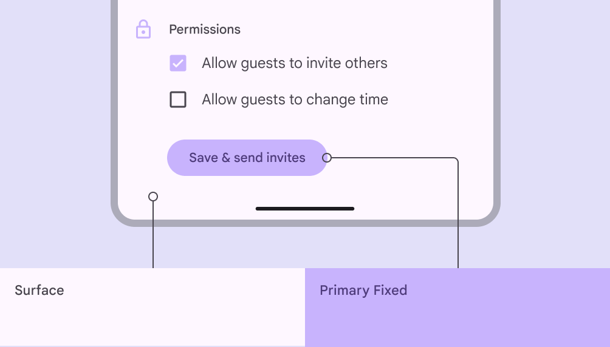

close Don’t

Fixed colors don't change based on light or dark theme, so they're likely to cause contrast issues. Avoid using them where contrast is necessary.

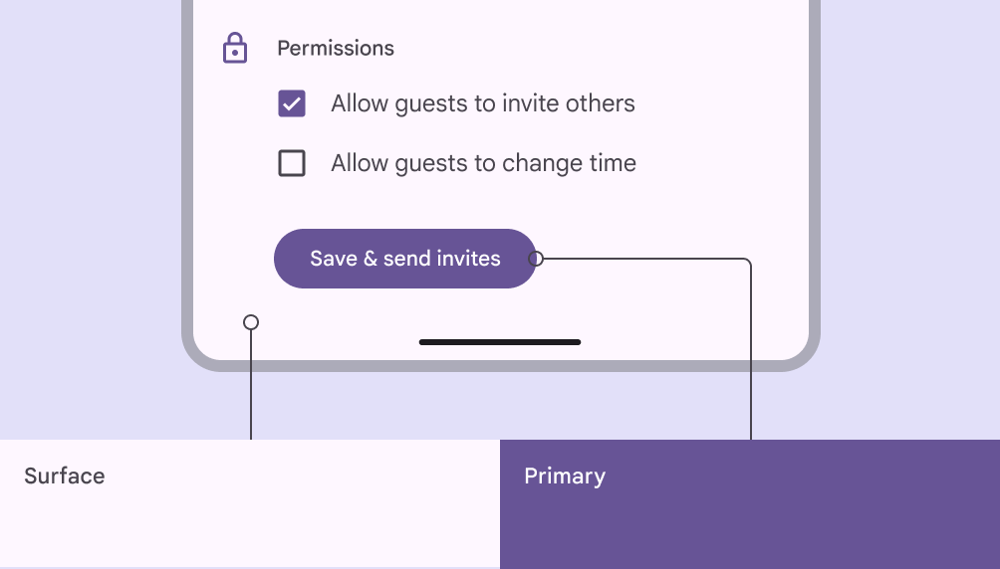

check Do

Use **primary**, **secondary**, and **tertiary** roles for accent colors where contrast is needed

### On fixed accent colors

**On fixed** colors are used for text and icons which sit on top of the corresponding Fixed color. For example, **on** **primary fixed** is used for text and icons against the **primary fixed** color. The same usage applies for the equivalent secondary and tertiary colors.

**On fixed variant** colors are used for text and icons needing lower emphasis against the corresponding fixed color. For example, **on primary fixed variant** is used for low emphasis text and icons against the **primary fixed** color. The same usage applies for the equivalent secondary and tertiary colors.

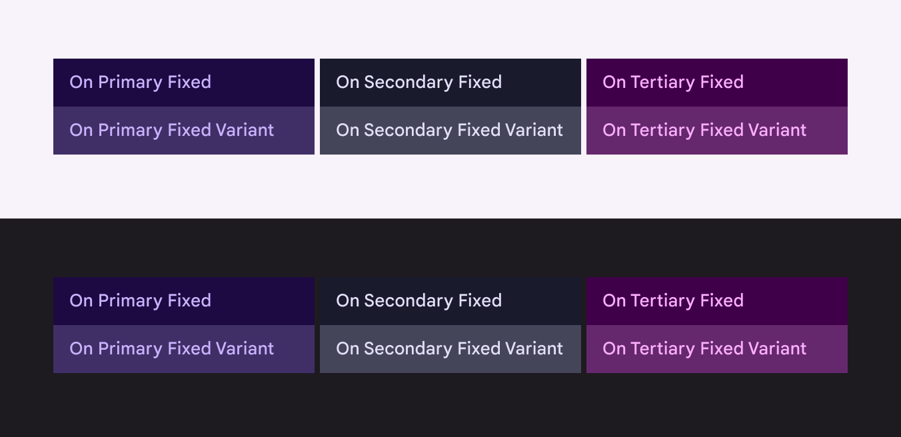

**On fixed** and **on fixed variant** color roles for the **primary**, **secondary**, and **tertiary** accent groups, shown in both light and dark themes

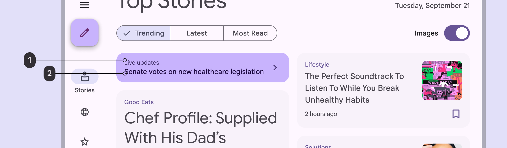

A customized banner which uses **on primary fixed variant** (1) for its deemphasized text and (2) **on primary fixed** for its emphasized text

### Bright and dim surface roles

There are two add-on surface roles:

-   **Surface dim:** Dimmest surface color in light and dark themes
-   **Surface bright:** Brightest surface color in light and dark themes

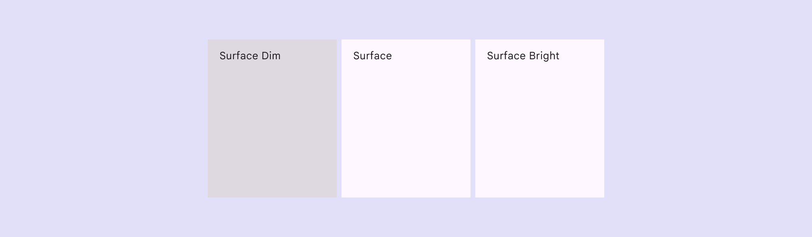

**Surface dim**, **surface**, and **surface bright** in light theme

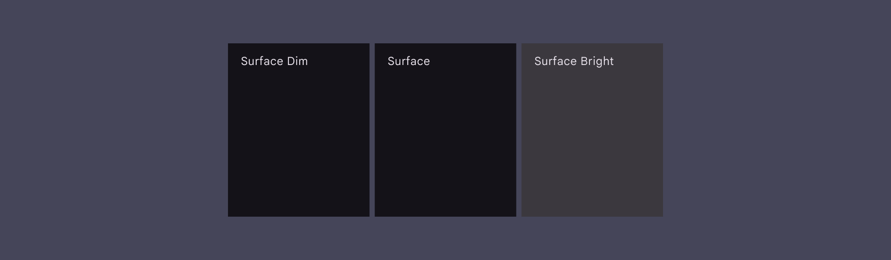

**Surface dim**, **surface**, and **surface bright** in dark theme

While the default **surface** color automatically inverts between light and dark themes (it’s a light color in light theme and it flips to a dark color in dark theme), the **surface bright** and **surface dim** colors invert in a slightly different way. More precisely, they keep their relative brightness across both light and dark theme.

For example, in an interface using the default **surface** role, the mapped area is the brightest in light theme and the dimmest in dark theme. In an interface using the **surface bright** role, the mapped area is the brightest in both light and dark theme.

Light theme

1.  **Surface**
2.  **Surface container**

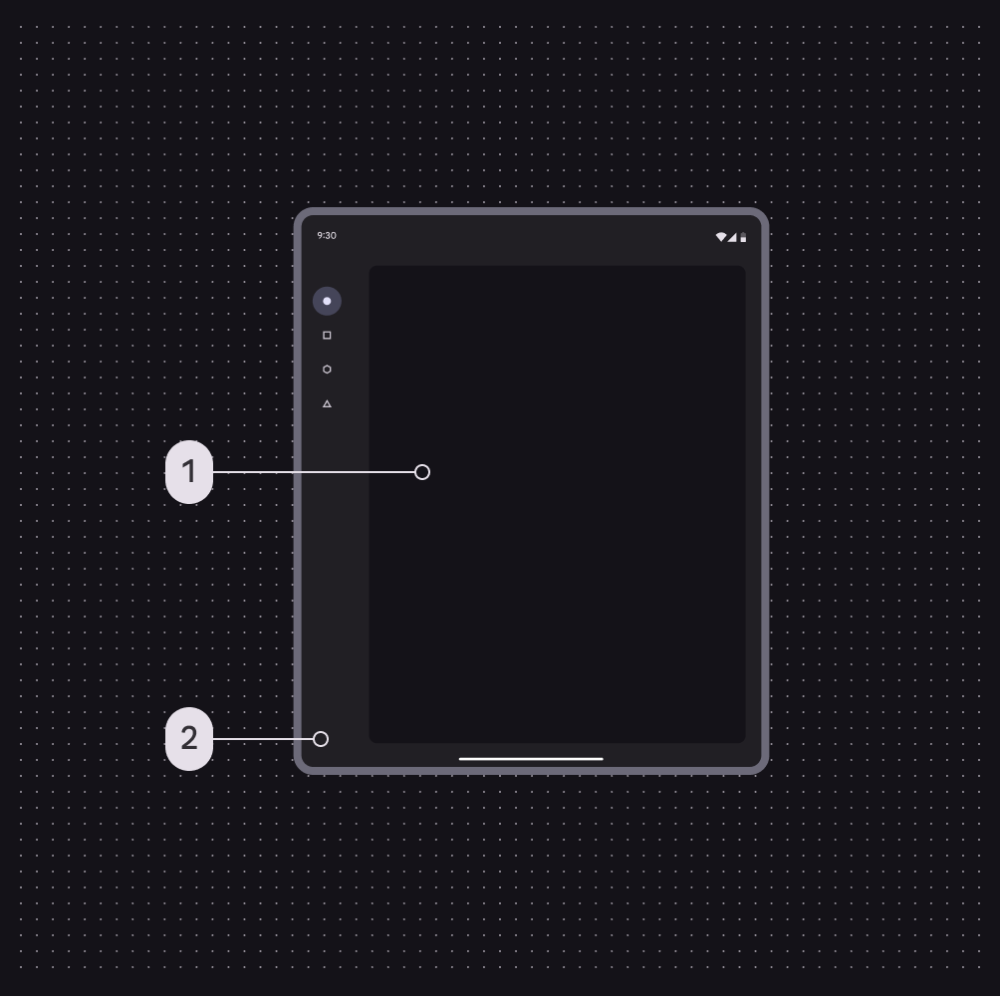

Dark theme

1.  **Surface**
2.  **Surface container**

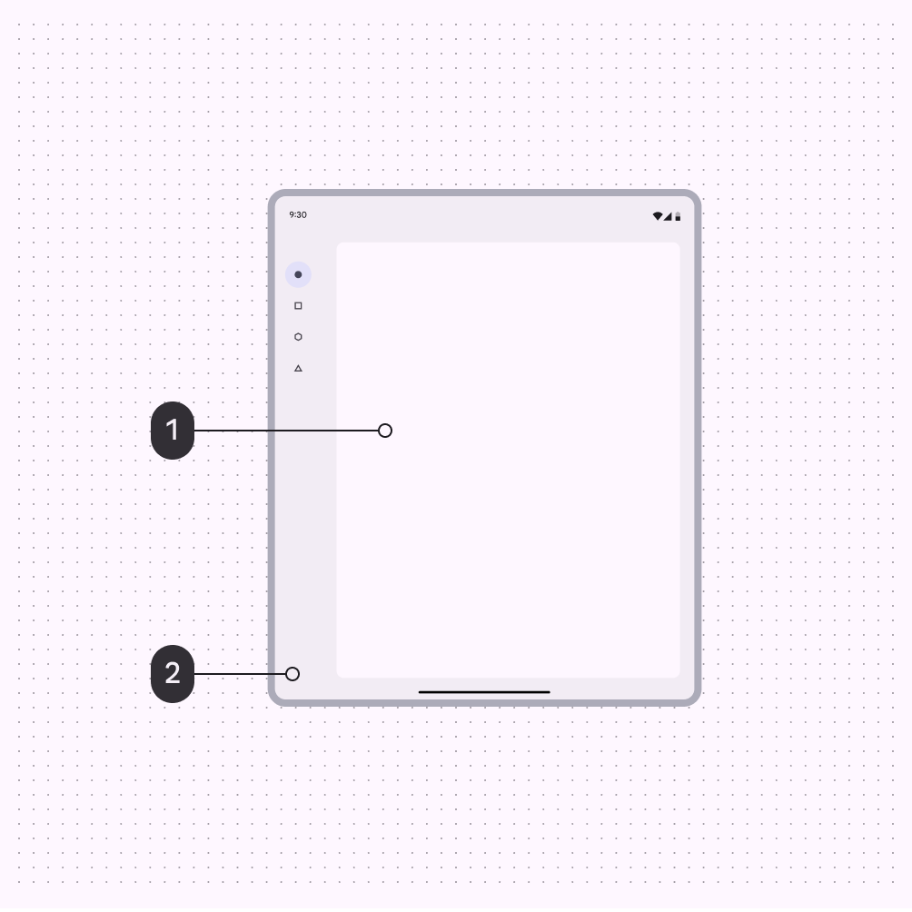

Light theme

1.  **Surface bright**
2.  **Surface container**

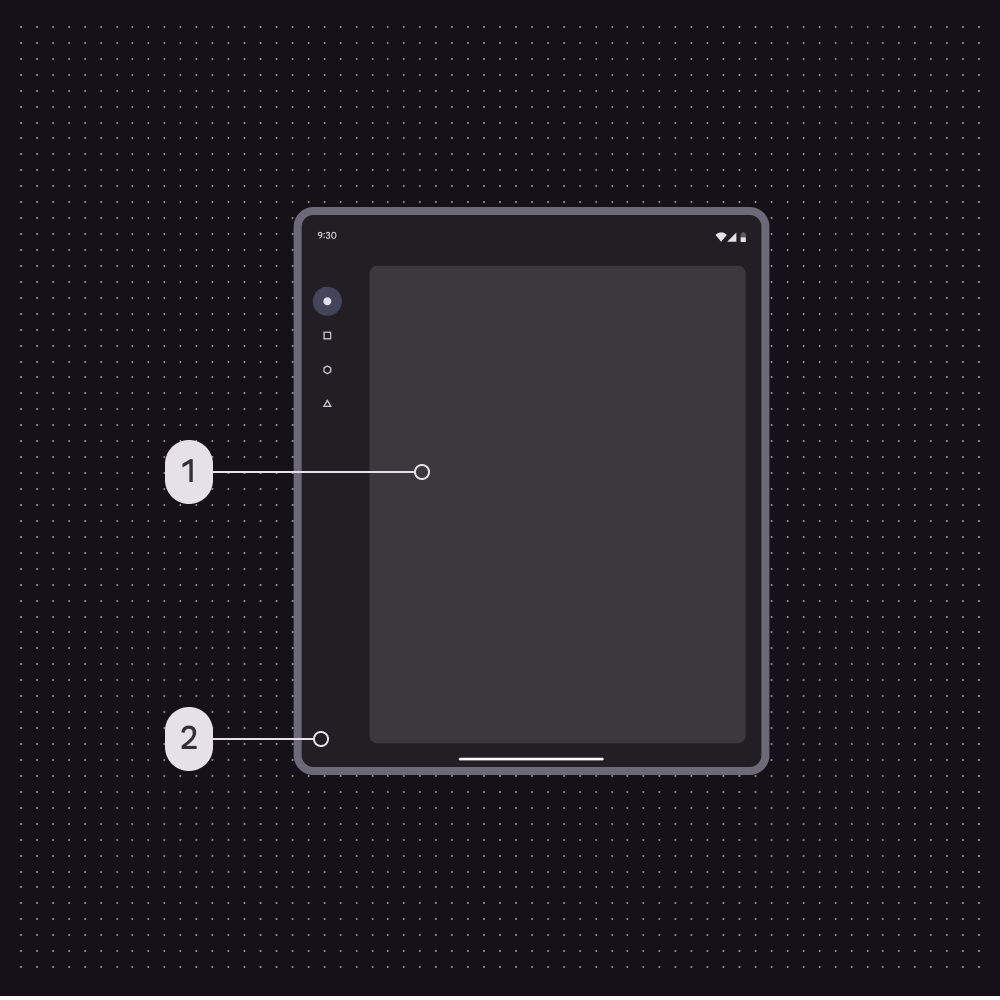

Dark theme

1.  **Surface bright**
2.  **Surface container**

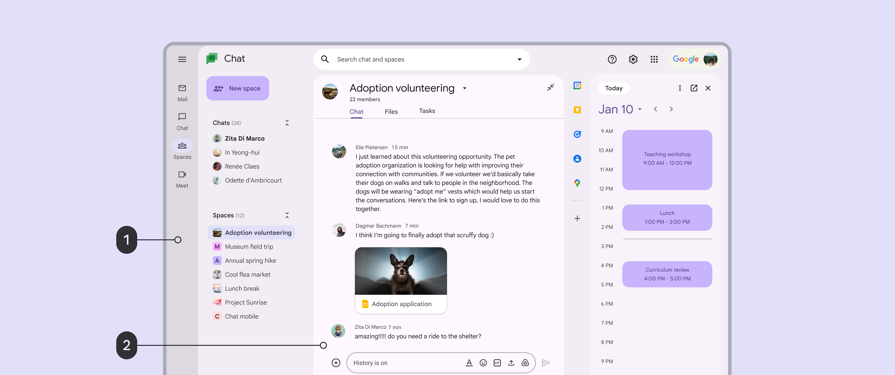

1.  Navigation rail with **surface dim** background
2.  Chat window with **surface bright** background
