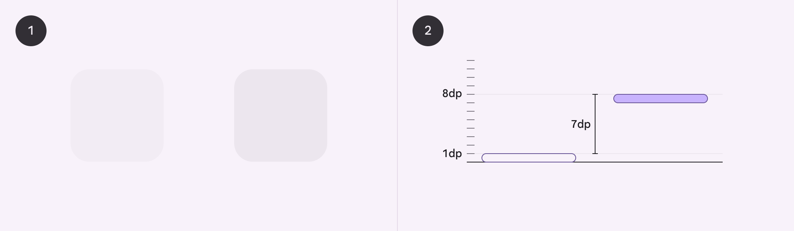
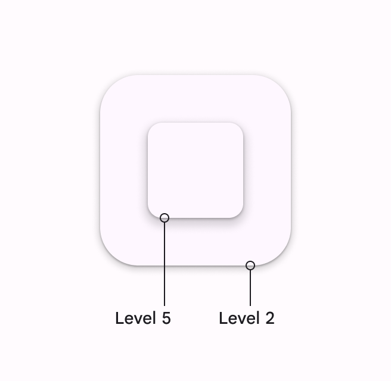
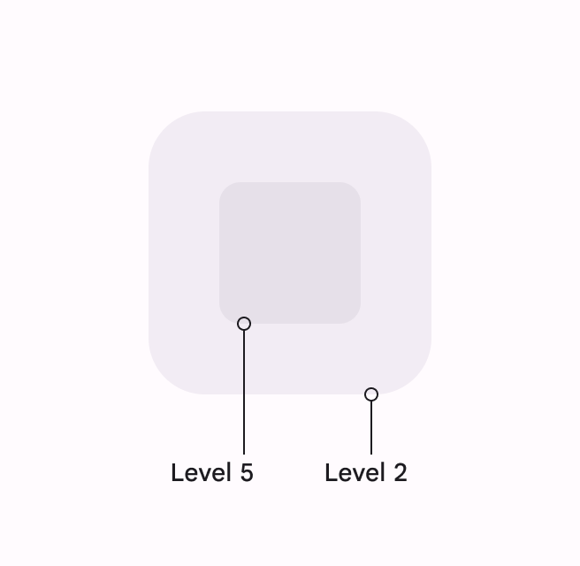
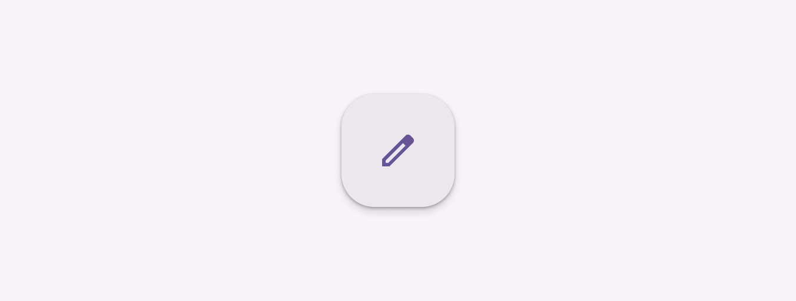

# Elevation

> Elevation is the distance between two surfaces on the z-axis

-   Elevation is applied to all surfaces and components
-   Tokens codify the distance on the z-axis to ensure components appear consistently relative to each other
-   Tokens have no shadows or color; each platform determines the specific shadows and values to use at each elevation level
-   Elevation can be shown as tonal surface colors or shadows
-   Avoid changing the default elevation of Material 3 components
-   Stick to using a small amount of elevation levels

Elevation is measured as the distance between components along the z-axis in density-independent pixels (dps).

Elevation represents the distance between elements. The product applies color to represent elevation.

1.  One surface at 1dp elevation and another surface at 8dp elevation, as viewed from the front

2.  The difference in elevation between the two surfaces is 7dp, as viewed from the side

## Availability & resources

|  | Resource | Status |
| --- | --- | --- |
| Design | [Design Kit (Figma)](https://www.figma.com/community/file/1035203688168086460) | Available |
| Implementation | [Flutter](https://api.flutter.dev/flutter/material/ElevationOverlay-class.html) | Available |
|  | [Jetpack Compose](https://developer.android.com/develop/ui/compose/designsystems/material3?_gl=1*zh4ff1*_up*MQ..*_ga*MTQ4NTEwOTIzLjE3NDA0MDY2Njk.*_ga_6HH9YJMN9M*MTc0MDQwNjY2OC4xLjAuMTc0MDQwNjY2OC4wLjAuNjU3NTAyNDY.#elevation) | Available |
|  | [MDC - Android](https://github.com/material-components/material-components-android/blob/d56070586102b66486f7f8697de077c3d7689922/docs/theming/Color.md#using-surface-colors) | Available |
|  | [MWC - Web](https://github.com/material-components/material-web/blob/919fe12badcfee4dcd72c390c0869dd8f996b51c/docs/components/elevation.md) | Available |

## Differences from M2

-   Shadows: Instead of applying shadows by default to all levels, use shadows only when required to create additional protection against a background or to encourage interaction
-   Color: New color mappings and compatibility with dynamic color
-   Levels: Elevation is now described in terms of levels

M2: Shadows applied at all levels

M3: Using color instead of shadows to communicate elevation

## All surfaces and components have elevation values

Surfaces at different elevations do the following:

1.  Allow surfaces to move in front of and behind other surfaces, such as content scrolling behind app bars

2.  Reflect spatial relationships, such as how a FAB's shadow indicates it's separate from a card collection

3.  Focus attention on the highest elevation, such as a dialog temporarily appearing in front of other surfaces

Elevation can be depicted using shadows or other visual cues, such as surface fills with a tone difference

### Resting elevation (default)

All components have a default resting elevation. Avoid changing the default elevation of Material components.

All components have a default elevation which should be used

### Changing elevation

Components should change elevation in response to system events or user interaction, like hovering. This elevation change should be consistent across all similar elements.

For example, hovering a FAB temporarily increases the elevation by 1 level, from level 3 to level 4. All Material buttons increase elevation by 1 level when hovered.

Hovering over a button increases its elevation to show user interaction
