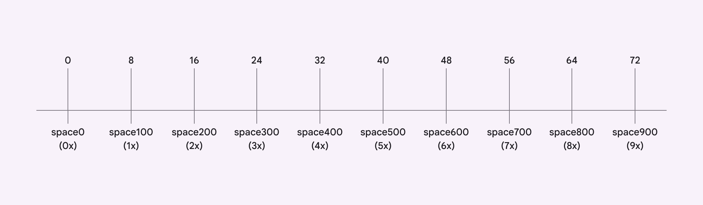
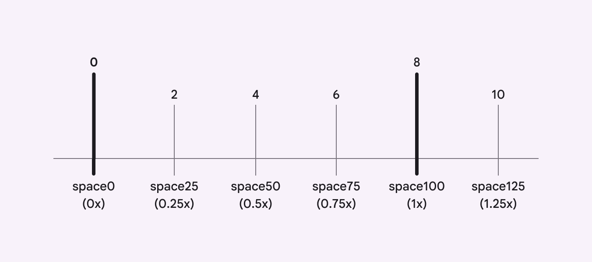

# Spacing

> Spacing is the distance around and between component and layout elements

star

Note:

The spacing system tokens are only used on Jetpack Compose.

## System spacing tokens

Close

System spacing tokens are a linear range of spacing values recommended by Material. They’re intended to cover the majority of spacing needs within the design system. The base unit of measurement **md.sys.measurement.space100** is **8dp**. [Learn more about design tokens](/m3/pages/design-tokens/overview/)

The main spacing units are multiples of 8dp

### Nested units

Values other than multiples of 8 are also used in layouts and Material components, like 2dp, 4dp, 6dp, and 10dp. Material only defines the most recommended nested units.

Material only defines nested units that are actively used in common layouts or Material components

## Component spacing

Most Material component spacing attributes will map to system spacing tokens. Spacing logic, like adaptive design or density, should be applied to the component attribute.

Component attributes follow a new naming strategy:

-   Going forward, all component spacing attributes will use **padding**, **margin**, and **gap**, and positional language: **horizontal**, **vertical**, **leading**, **trailing**, **top**, and **bottom**

    -   Example: “Medium button: leading padding”

-   Past component spacing tokens use “**space**” to describe all padding, gaps, and margins, like **leading-space**, **trailing-space**, **top-space**, **bottom-space**, and **between-space**.

    -   Example: “Medium button: leading space”
