# Typography

> Use typography to make content readable and beautiful

## Editorial treatments

Editorial treatments are standalone, showcase moments driven by type. They involve dynamic, attention-grabbing use of custom sizes, which can involve larger display type or a blockier look and feel. They should depart from purely functional layouts or basic stages in a user flow. 

In the expressive system, editorial treatments can be combined with elements such as motion, shape, or color, to create product-wide hero moments.

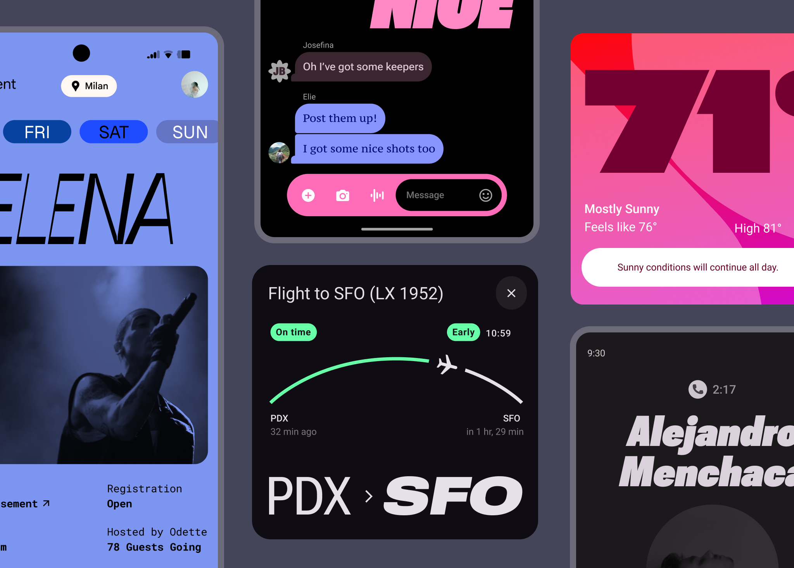

In editorial treatments, type can freely dominate the screen

## Examples of editorial treatments

Use editorial treatments in three key ways: to celebrate content, to highlight the voice of the user, or to draw attention to bespoke functionality within the product.

### Celebrating content

Editorial treatments can dramatically take over the screen to mark a particular user action, memory, or preference.

Try matching the text to the tone of the product or a strong emotion, like a narrow, thin style for serenity, or a bolder, italicized style for liveliness.

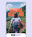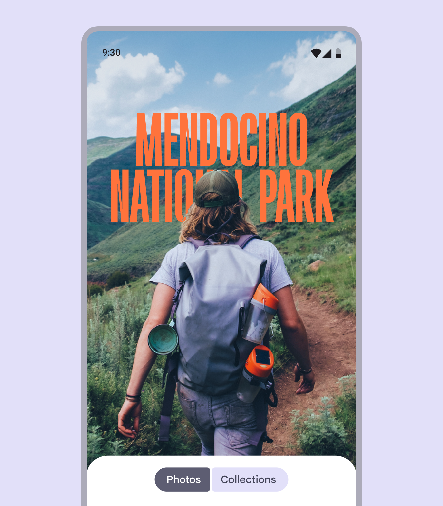

Use an exuberant cover image for a photo album, here shown with Roboto Flex

### Voice of the user

Express the voice of the user by letting them personalize the appearance of typography or by adjusting text based on their input.

Use customization selectively to frame a user’s mood and make it stand out.

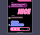

A response with the right type treatment can convey ecstatic emotion. Here, the text is shown in Roboto Flex and PT Serif Caption.

### Bespoke functionality

Editorial treatments can also be used to help express moments of unique functionality within the product experience.

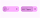

The increase in the bedroom light brightness prompts an algorithmic response in the width and weight axes

## Editorial treatment best practices

As there is intentionally much room for choice in developing editorial treatments, there are a few guard rails that will prevent inconsistency, illegibility, or distracting design.

These best practices include:

-   Ensuring consistency between similar-looking editorial moments, creating tokens for each where needed
-   Matching the emotional tone of text to the task at hand
-   Not mixing multiple or clashing styles in the same layout
-   Not mimicking personalization theming

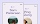

check Do

Create tokens for editorial treatments to apply them consistently in your product

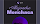

exclamation Caution

Use caution when mixing different editorial treatments in the same layout. Try to keep them consistent.

## Use variable axes to make editorial treatments

Adjust variable font axes like weight, grade, width, and optical size to match the font to the feeling. Baseline and emphasized type styles can still be used. Though, editorial treatments shouldn’t be used in labels or just to give information.

### Weight

Weight is the primary attribute that defines the overall thickness of a typeface’s strokes in any given font. The most common weights are regular and bold, but weights can cover extremes from the very light to the very heavy.

If the typeface is variable, it provides a full, continuous range of stroke thicknesses, making the number of weights effectively unlimited.

[Learn more about weight on Google Fonts](https://fonts.google.com/knowledge/choosing_type/exploring_typefaces_with_multiple_weights_or_grades)

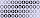

A variable font, Roboto Flex offers a fluid range of weights

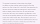

exclamation Caution

Be careful when using very light weight for body text. Lower-resolution displays can struggle to show thin typography, especially at small sizes. Instead, consider lighter weights at larger font sizes, such as display type.

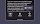

exclamation Caution

Excessive weight at smaller sizes can make text harder to read

### Grade

Grade is a secondary modifier of a typeface’s optical weight, independent of the weight axis. Both weight and grade axes affect a letter’s thickness, but adjustments with grade are much more granular and don’t change any letter widths or line breaks.

[Learn more about grade on Google Fonts](https://fonts.google.com/knowledge/choosing_type/exploring_typefaces_with_multiple_weights_or_grades)

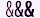

Roboto Flex offers a positive grade of 150 and a negative grade of 200

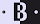

When switching between dark and light mode, the same text may appear heavier despite having the same settings. Consider using a negative grade to counteract this.

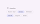

Grade can change the emphasis without reflowing text

### Width

Width is the result of how much horizontal space is taken up by a typeface’s characters.

A narrow width allows more characters to fit per line while a wider width may offer more personality.

[Learn more about width on Google Fonts](https://fonts.google.com/knowledge/glossary/width)

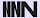

Roboto Flex offers a fluid range of widths, from 25 to 150

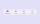

check Do

A thinner width can allow for more characters to fit at small sizes, such as in a label

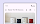

close Don’t

Since wider styles take up more space, avoid using them for areas with limited space, such as in a top app bar

### Optical size

Optical sizes are different versions of a typeface optimized for use at different sizes.

Small size designs focus on enhancing readability, while large size designs can show off the intricacies of the letter forms and offer many more weights and widths.

[Learn about choosing typefaces that have optical sizes.](https://fonts.google.com/knowledge/choosing_type/choosing_typefaces_that_have_optical_sizes)

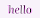

The typeface Literata has a continuous range of optical size, from 7pt to 72pt

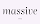

check Do

Use an optical size that matches your type size

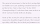

close Don’t

Don’t use large optical type sizes at small sizes. Instead use a smaller optical size, if available.
