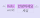
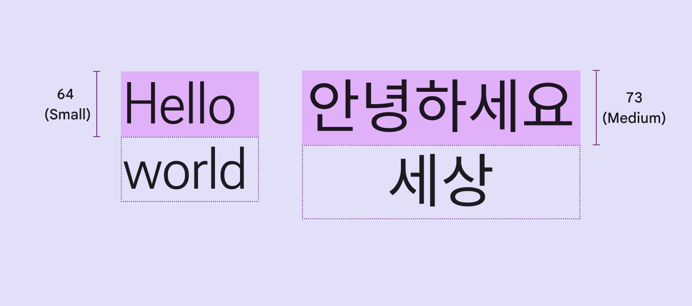
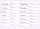
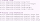
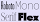
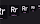

# Typography

> Use typography to make content readable and beautiful

-   M3 type scale has 30 type styles: 15 baseline and 15 emphasized
-   Use variable fonts for more control over expression in editorial treatments
-   Use Material tokens to easily define font, line height, size, tracking, weight, and more

## Availability & resources

This shows where the type scale is available and implemented into Material components.

| Type | Link | Status |
| --- | --- | --- |
| Design | [Design Kit](https://goo.gle/m3-design-kit) | Available |
| [Google Fonts](https://fonts.google.com/) | Available |
| Implementation | [Flutter](https://api.flutter.dev/flutter/material/Typography/Typography.material2021.html) | Available |
| [Jetpack Compose](https://developer.android.com/develop/ui/compose/designsystems/material3#typography) | Available |
| [Jetpack Compose: Expressive](https://developer.android.com/reference/kotlin/androidx/compose/material3/Typography) | Available |
| [Android Views (MDC-Android)](https://github.com/material-components/material-components-android/blob/master/docs/theming/Typography.md) | Available |
| [Android Views (MDC-Android): Expressive](https://github.com/material-components/material-components-android/blob/master/docs/theming/Typography.md) | Available |
| [Web](https://github.com/material-components/material-web/blob/main/docs/theming/typography.md) | Available |
| Web: Expressive | Unavailable |

## Updates

**Aug 2026**

### Language script height support

Material’s type scale can adapt line height automatically based on language script height category: small, medium, large, and extra large.

Components can then adapt their size based on these language heights.

[More on language height](/m3/pages/typography/type-scale-tokens#fcae9063-6c70-4512-87f9-3b6e0d8aea04)

Line heights for styles like display large can automatically adapt to language height

## M3 Expressive update

**May 2025**

### Updated M3 type scale with emphasized styles

Material’s type scale includes fifteen **baseline** type styles, the same as before, and fifteen new **emphasized** type styles. 

The emphasized type styles add more expression to highlighted moments.

Roboto Flex can be used on its own to show a range of emotional states, but is not yet part of the M3 typescale.

[More on how to use emphasized styles](/m3/pages/typography/type-scale-tokens#0020d4d9-4f5b-4666-b3ce-c26db849bd73)

[More on M3 Expressive](https://m3.material.io/blog/building-with-m3-expressive)

The expressive type scale includes fifteen baseline type styles and fifteen emphasized type styles

### Emphasized type style tokens

Design tokens offer an improved way to define typography in products by assigning an element's type style by a configurable value, rather than a set value.

Emphasized tokens allow for clearer hierarchies and prioritized components within a layout.

Type roles describe size—such as small, medium, and large—enabling them to adapt and respond to the device or context.

Typography tokens describe scalable size that adapts to devices or settings, including updating the style on boldness

### Google Design: Making Google Sans Flex

Learn how seven design problems shaped Google’s iconic typeface — from inception to going open-source.

[Read the article on design.google](https://design.google/library/google-sans-flex-font)

Google Sans Flex can morph into an impressive range of styles, powered by its six variable axes

## Previous updates

### Variable fonts

**Roboto Flex, Roboto Serif, & Roboto Mono**

Updated considerations for using variable fonts and different combinations of their customizable axes An axis refers to an attribute of a font, such as weight or width, that can be altered to create visual variations. [Learn more about variable fonts](https://fonts.google.com/knowledge/introducing_type/introducing_variable_fonts) , including grade, width, weight, slant, and optical size.

Roboto Flex, Roboto Serif, and Roboto Mono have a fluid range of axes, like weight, across all optical sizes

### Style roles

Type styles are defined by five roles: display, headline, title, body, and label.

These names are more descriptive, allowing for easier matching of type style to use case.

M3 has five distinct type styles: display, headline, title, body, and label
